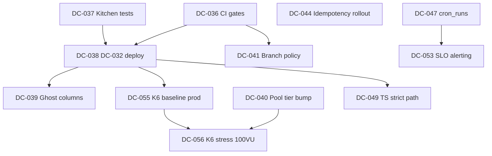

# Enterprise Audit — Executive Summary (Fase 4)

**Date:** 2026-05-24 (post-marathon dag 5 + enterprise audit)  
**Scope:** Lunchportalen RC — Next.js/Vercel/Supabase/Sanity + Umbraco marketing  
**Method:** READ-ONLY 4-fase audit (Inventory → Backend → Frontend → DevOps)  
**Artifacts:** [00-inventory.md](./00-inventory.md) · [01-backend.md](./01-backend.md) · [02-frontend.md](./02-frontend.md) · [03-devops.md](./03-devops.md)

---

## Verdict (1 setning)

Lunchportalen er **driftskapabel RC** med solid RLS og order-idempotency, men **ikke DD-ready**: P1-klynger rundt **prosess-brudd (CI/migrasjon/branch)**, **prod read-path fortsatt broken**, **K6 pool-margin**, og **compliance-headers/a11y** må lukkes før formell due diligence.

**Score:** **98 / 160** → klassifisering: **nær enterprise-ready, krever spesifikt arbeid** (100–129 band).

---

## 1. Konsolidert funn-telling

**Regler:** Hvert funn-ID telles **én gang**. Duplikater på tvers av faser (F0-01≡B1-01, F0-02≡F3-01, F0-03≡F3-03, F0-06≡F3-02, F0-07≡F2-03, F3-10≡B1-04) er slått sammen. **Cross** = primært [BACKEND+DEVOPS] eller delt eierskap.

| Severity | Backend | Frontend | DevOps | Cross | **Total** |
| --- | ---: | ---: | ---: | ---: | ---: |
| **P0** | 0 | 0 | 0 | 0 | **0** |
| **P1** | 3 | 5 | 1 | 6 | **15** |
| **P2** | 7 | 6 | 8 | 1 | **22** |
| **P3** | 0 | 1 | 0 | 0 | **1** |
| **Sum** | **10** | **12** | **9** | **7** | **38** |

### P1 — detalj (15 unike)

| ID | Rolle | Funn (kort) |
| --- | --- | --- |
| B1-01 | Cross | Migrasjon-ledger: 26/98 prod uten repo-fil |
| B1-02 | Cross | Prod/staging deler 1/98 migrasjon-versjon |
| B1-03 | Backend | Ghost-kolonner i prod-kode (`origin/main`) |
| B1-04 | Backend | Kitchen-test 403 + **blokkerer push/deploy** |
| B1-08 | Cross | Micro pool (~60 conn) marginal for K6 100 VU |
| B1-10 | Backend | Idempotency kun på `POST /api/orders` |
| F2-01 | Frontend | `strict: false` |
| F2-02 | Frontend | ~38 filer inline `style={{` |
| F2-03 | Frontend | 15+ mega-komponenter (>800L) |
| F2-04 | Frontend | 0 `useForm`/`zodResolver` |
| F2-12 | Frontend | WCAG P1: SC 2.4.6/1.3.1, SC 2.1.1, touch hardregel |
| F3-01 | Cross | 3 FIX-commits staging ≠ main (DC-032) |
| F3-02 | Cross | `ci-enterprise.yml` `continue-on-error: true` |
| F3-03 | Cross | 225 kode-env vs 38 Vercel |
| F3-04 | DevOps | `lunchportalen.no` uten HSTS/CSP |

### P2 — utvalg (22 unike)

Backend: B1-05, B1-06, B1-07, B1-09, B1-11 (service-role), B1-12/13 (audit gaps), B1-14 (UTC audit), agreements trigger, RLS solid (0 P1).  
Frontend: F2-05–F2-10.  
DevOps: F3-05–F3-12, F0-08 (.env.example).  
Cross: B1-07 (MCP migration timestamp).

### INVESTIGATE (ikke i total)

F0-04 (function delta → P2 extension), F0-05 (69 routes auth review), F2-09 (bundle budgets — ingen build-artefakt).

---

## 2. DC-ticket-roster (DC-036+)

Sortert: **severity ↑ → effort ↑ → avhengighet** (blockers først).

| DC-N | Tittel | Sev | Rolle | Effort (t) | Avh. av | Notat |
| --- | --- | --- | --- | ---: | --- | --- |
| **DC-036** | CI gate alignment — fjern `continue-on-error`, blocking audits | P1 | DEVOPS | 2 | — | **Blocker** for alle pushes; F3-02. Align `ci-enterprise.yml` ↔ `RELEASE_GATE.md`. |
| **DC-037** | Kitchen test harness — align seed med `profiles.id = auth.uid()` | P1 | BACKEND | 2 | — | **Blocker** push; B1-04. 9 vitest failures. |
| **DC-038** | DC-032 read-path deploy — merge staging FIX → main → prod | P1 | DEVOPS | 3 | DC-036, DC-037 | Ghost-kolonne fixes + employee scope. Local `2aeb7d9f` unpushed. |
| **DC-039** | Ghost-kolonne purge — `disabled_reason`, `user_id`, `is_disabled`, kitchen `name`/`department` | P1 | BACKEND | 4 | DC-038 | B1-03. Prod `/api/week` 500, `/api/me` 403 today. |
| **DC-040** | Supabase compute bump + pool capacity plan (K6 100 VU) | P1 | DEVOPS | 2 | — | B1-08. Micro `max_connections=60`; **gate for K6 LIVE stress**. |
| **DC-041** | Main/staging reconciliation policy — enforce single promotion path | P1 | DEVOPS | 4 | DC-036 | F3-01. Stopp staging-only FIX pattern. |
| **DC-042** | Umbraco security headers — HSTS + CSP + X-Frame on `lunchportalen.no` | P1 | DEVOPS | 3 | — | F3-04. IIS/Azure config. |
| **DC-043** | `/week` a11y P1 — single H1, keyboard on interactive, 48px touch | P1 | FRONTEND | 6 | — | F2-12. SC 2.4.6, 2.1.1, hardregel. |
| **DC-044** | Systemic idempotency — audit POST routes + pattern beyond orders | P1 | BACKEND | 16 | — | B1-10. Due-diligence core. |
| **DC-045** | Migration ledger reconcile — 26 prod-only applied map to git or document | P1 | BACKEND+DEVOPS | 12 | — | B1-01/B1-02. Process debt. |
| **DC-046** | Env-paritet matrix — 225 code env ↔ Vercel ↔ `.env.example` | P1 | DEVOPS | 8 | — | F3-03. Staging-only Supabase block. |
| **DC-047** | `cron_runs` table + migration — restore SLO cron SLI | P2 | BACKEND | 3 | DC-038 | B1-09. Observability only; outbox OK. |
| **DC-048** | Vercel app CSP + frame headers on HTML routes | P2 | DEVOPS | 4 | — | F3-05. HSTS already present. |
| **DC-049** | TypeScript strict enablement path (incremental) | P1 | FRONTEND | 24 | DC-038 | F2-01. Blocker for type-safety cleanup. |
| **DC-050** | Repo-wide orphan-column scan + cleanup recommendations | P2 | BACKEND | 4 | — | Deferred §1.3. Post-audit sprint. |
| **DC-051** | `agreements` audit_row trigger + audit coverage matrix | P2 | BACKEND | 4 | — | B1-12/13. |
| **DC-052** | Secret rotation policy + quarterly cadence doc | P2 | DEVOPS | 2 | — | F3-06. History scan clean; policy missing. |
| **DC-053** | SLO external alerting (Slack/email webhook) | P2 | DEVOPS | 6 | DC-047 | F3-07. Registry exists; no transport. |
| **DC-054** | Supabase PITR verify + documented restore drill | P2 | DEVOPS | 4 | — | F3-11. DR not proven. |
| **DC-055** | K6 LIVE resumption — baseline prod after DC-038/040 | P1 | DEVOPS | 8 | DC-038, DC-040 | **Park stress** until DC-040. Baseline OK after deploy. |
| **DC-056** | Inline style elimination (38 files) — employee paths first | P1 | FRONTEND | 12 | DC-043 | F2-02. Mobile law. |
| **DC-057** | Form stack — zod + react-hook-form on onboarding/login | P1 | FRONTEND | 10 | — | F2-04. Onboarding frozen UX — TEXT/UI only constraint. |
| **DC-058** | Performance budget baseline — `build:enterprise` route JS report | P2 | FRONTEND | 3 | DC-036 | F2-09. |
| **DC-059** | Branch protection verify — required reviews + status checks via GitHub | P2 | DEVOPS | 1 | DC-036 | F3-09. Manual/API verify. |

*Marathon carry-over mapped: DC-038/039 (deploy+ghost), DC-040 (pool), DC-050 (orphan §1.3), DC-041 (main/staging).*

---

## 3. Avhengighetskart (kritiske)

| Fix | Må komme før | Hvorfor |
| --- | --- | --- |
| **DC-036** (CI gates) | **DC-038** push/deploy | Uten blocking CI gjentas marathon process-brudd |
| **DC-037** (kitchen tests) | **DC-038** push | Pre-push hook: 9 failures today |
| **DC-038** (deploy read-path) | **DC-055** K6 baseline prod | Prod `/api/week` broken on `origin/main` |
| **DC-040** (pool tier) | **DC-056** K6 stress 100 VU | B1-08: 60–85% pool at stress; degradation risk |
| **DC-038** | **DC-049** strict TS | Type fixes på ghost-kolonner bør lande før strict rollout |
| **F2-01** strict | Full type-safety / ghost prevention | Strict catches schema drift i compile-time |
| **DC-047** cron_runs | **DC-053** SLO alerting | Cron SLI unknown without table |

**Anbefalt sekvens uke 1:** DC-036 → DC-037 → DC-038 → DC-039 → DC-055 (baseline only).

---

## 4. 30-60-90-dagers plan per rolle

### BACKEND

| Horisont | Ticket(s) | Leveranse | Effort |
| --- | --- | --- | ---: |
| **30d** | DC-037, DC-039, DC-044 (design), DC-047 | Test harness fix; ghost purge deployet; idempotency inventory; `cron_runs` migration | 25t |
| **60d** | DC-044 (impl), DC-045, DC-050, DC-051 | Idempotency på top-10 POST routes; migration ledger; orphan scan; agreements audit trigger | 36t |
| **90d** | DC-051 (rest), B1-14 UTC audit, service-role doc | Full audit matrix; UTC consistency; admin-client pattern doc | 12t |

### FRONTEND

| Horisont | Ticket(s) | Leveranse | Effort |
| --- | --- | --- | ---: |
| **30d** | DC-043, DC-056 (employee paths) | `/week` WCAG P1; inline styles on `/week`, login, onboarding | 18t |
| **60d** | DC-049 (phase 1), DC-057, DC-056 (rest) | `strict` on `lib/`+critical paths; form stack pilot; remaining inline styles | 32t |
| **90d** | DC-058, F2-05 mobile CSS, F2-06 loading states | Bundle budgets; max-width→min-width on DS; loading.tsx on `/week`/`/kitchen` | 16t |

### DEVOPS

| Horisont | Ticket(s) | Leveranse | Effort |
| --- | --- | --- | ---: |
| **30d** | DC-036, DC-038, DC-040, DC-042, DC-041 | CI truth; deploy; pool tier; Umbraco HSTS/CSP; branch policy | 16t |
| **60d** | DC-046, DC-048, DC-055, DC-059 | Env matrix; Vercel CSP; K6 baseline prod PASS; branch protection proof | 18t |
| **90d** | DC-053, DC-054, DC-052, F3-12 incident | External alerting; PITR drill; rotation policy; public status page v1 | 14t |

**Sum effort (all roles):** ~30d **59t** · 60d **86t** · 90d **42t** ≈ **187t** (~5 person-måneder serialisert).

---

## 5. 16-områders scorecard

| # | Område | Score | Begrunnelse |
| ---: | --- | ---: | --- |
| 1 | Schema-integritet | **8/10** | 1639 kolonner identisk prod/staging; ghost **app** refs er P1, ikke DB drift |
| 2 | RLS-dekning | **9/10** | 97 tabeller RLS on; 37 off kun audit partitions; ekspert SQL |
| 3 | Idempotency | **4/10** | Strong on orders; **~250 POST uten** DB idempotency (B1-10 P1) |
| 4 | Audit-trail | **7/10** | Partitioned audit_log; agreements gap; cron_runs missing |
| 5 | Query-performance | **8/10** | pg_stat RPC ~2ms; no sustained hot-path FAIL |
| 6 | Test-dekning | **6/10** | 2405 pass; 9 blockers; kitchen E2E gap |
| 7 | Design-system overholdelse | **5/10** | ds/lp tokens exist; 38 inline style files (F2-02 P1) |
| 8 | a11y (WCAG AA) | **4/10** | F2-12 P1 structural on `/week`; not certifiable |
| 9 | Performance budgets | **5/10** | F2-09 INVESTIGATE; no route JS baseline |
| 10 | Mobile-first | **6/10** | Employee week CSS; max-width heavy DS; touch 40px sm |
| 11 | CI-gates | **5/10** | `ci.yml` solid; `ci-enterprise` non-blocking build (F3-02 P1) |
| 12 | Observability | **7/10** | Sentry scrub OK; cron SLI blind (B1-09) |
| 13 | SLO/SLI | **6/10** | 6 SLOs defined; no external alerting; proxy SLIs |
| 14 | Security headers + secrets | **5/10** | App HSTS ✓; no CSP; Umbraco bare; secrets scan clean |
| 15 | Branch policy + env-paritet | **4/10** | Staging/main diverge; 225 vs 38 env (F3-03 P1) |
| 16 | Backup/DR + incident response | **5/10** | PITR unverified; no public status; `/status` is UX block |

**Total: 98 / 160** → **nær enterprise-ready (100–129)** — DD krever lukking av P1-klynger over.

---

## 6. Due-diligence-perspektiv

### De 3 funnene som vekter MEST i formell process

1. **Migrasjon + branch process integrity (B1-01/B1-02, F3-01/F3-02)** — kjøper/investor kan ikke reconstruct prod DB from git; staging-only fixes er repeat incident class.
2. **Prod read-path broken + deploy blocked (B1-03, B1-04, DC-038)** — system truth feiler før bruker når det; QA fant det, ikke monitoring.
3. **Idempotency + compliance surface (B1-10, F3-04, F2-12)** — financial/order duplicate risk og public-site security/a11y gaps er standard DD checklist items.

### De 3 CHEAPEST quick wins for DD-readiness

1. **DC-036 CI alignment (2t)** — dokumenterbar «we enforce what we claim»; unblocks all pushes.
2. **DC-042 Umbraco HSTS/CSP (3t)** — marketing domain headers; high DD visibility, low code churn.
3. **DC-047 cron_runs migration (3t)** — restores SLO truth for cron/outbox without changing business logic.

### Estimert timer: audit ferdig → DD-ready

| Tier | Scope | Timer |
| --- | --- | ---: |
| **Minimum viable DD** | DC-036, DC-037, DC-038, DC-039, DC-042, DC-047, DC-046 (matrix doc only) | **~28t** |
| **Solid DD** | + DC-040, DC-043, DC-041, DC-044 (top routes), DC-055 baseline K6 | **~65t** |
| **Strong DD** | + DC-045, DC-049 phase-1, DC-048, DC-054 drill | **~110t** |

**Realistisk kalender:** Minimum viable **1 uke** (1 FTE); Solid **3–4 uker**; Strong **8–10 uker** parallelt med feature freeze on P1.

---

## 7. Marathon-status + anbefalt neste 7 dager

### Levert dag 1–5 (kort)

| Dag | Leveranse |
| --- | --- |
| 1–3 | K6 foundation, staging parity DC-032, login-once-per-VU, ghost diagnosis |
| 4 | K6 staging PASS; prod prep DC-034/035; prod read-path diagnose (SP-4.5) |
| 5 | Enterprise audit Fase 0–4; pool analysis B1-08; B1-09 verify; F2-12 eskalert P1 |

### Pending blokkerer (nå)

| Blocker | Impact |
| --- | --- |
| **9 kitchen vitest failures** | Pre-push hook → ingen deploy |
| **Local main unpushed** (`2aeb7d9f`) | Prod read-path fixes not live |
| **B1-08 pool Micro** | K6 stress 100 VU = HØY risiko |
| **F3-02 CI continue-on-error** | Process brudd kan gjentas |

### K6 LIVE-spor: resume eller park?

| Fase | Anbefaling |
| --- | --- |
| **Stress 100 VU prod** | **PARK** til DC-040 (compute bump) + DC-038 (deploy) |
| **Baseline prod 20 VU** | **RESUME** etter DC-038+DC-037 (est. uke 1 slutt) |
| **Staging full suite** | **GRØNN** — fortsett som regression gate |

### Sprint dag 6–12 — høyest verdi mot enterprise-readiness

| Dag | Fokus | Ticket |
| ---: | --- | --- |
| 6 | CI gate fix + kitchen test fix | DC-036, DC-037 |
| 7 | Merge/push/deploy read-path | DC-038, DC-039 |
| 8 | Prod smoke + K6 baseline 20 VU | DC-055 |
| 9 | Pool tier decision + Supabase upgrade | DC-040 |
| 10 | Umbraco headers + env matrix start | DC-042, DC-046 |
| 11 | `/week` a11y P1 (H1 + keyboard) | DC-043 |
| 12 | `cron_runs` migration + SLO verify | DC-047 |

**Prioritering:** **Process → Prod truth → K6 baseline → Compliance headers → A11y.** Feature work pauses until DC-038 is live.

---

## Appendiks — audit-fase indeks

| Fase | Fil | STOP |
| --- | --- | --- |
| 0 | [00-inventory.md](./00-inventory.md) | Levert |
| 1 | [01-backend.md](./01-backend.md) | Levert |
| 2 | [02-frontend.md](./02-frontend.md) | Levert |
| 3 | [03-devops.md](./03-devops.md) | Levert |
| 4 | **00-executive-summary.md** (denne filen) | **Sluttleveranse** |

---

*Enterprise audit READ-ONLY fullført 2026-05-24. Prioritering og sprint-planlegging overtas av eier.*
