# Architecture — policy_merge

## Datamodell

- **Input**: flere JSON-dokumenter med **objekt på rot** (`dict` etter `json.loads`).
- **Output**: ett JSON-objekt — resultatet av sekvensiell anvendelse av merge-operatoren på hver fil i fastlagt rekkefølge.

## Merge-semantikk

- **Objekt + objekt**: rekursiv sammenslåing; nøkler fra senere fil vinner ved skalarkonflikter etter dyp merge.
- **Liste + liste**: elementer fra senere fil **tillegges** etter elementer fra tidligere.
- **Øvrige kombinasjoner**: verdi fra senere fil **erstatter** tidligere.

Denne semantikken er **deterministisk** gitt sortert filrekkefølge og er dekket av unittest.

## Pakkestruktur

Prosjektet bruker **vanlige Python-pakker** med `__init__.py` under `cua_chrome/` og `cua_chrome.core` (ikke PEP 420 namespace-only layout). `pyproject.toml` setter `package-dir` til den ytre mappen `cua_chrome/` og lister pakkene eksplisitt (`cua_chrome`, `cua_chrome.core`) under `[tool.setuptools]`.

## CLI-inndata

`main()` normaliserer eldre argv (`path=`, `--path`, `merge_keys=`, `--merge-keys`, …) via `apply_legacy_path_argv` **før** argparse. Deretter gjelder lås → discovery → parse/merge → atomisk skriv → arkiv.

## Filflyt

```mermaid
flowchart LR
  subgraph lock [Lock]
    L0[mkdir .policy_merge.lock] --> L1[write owner.json]
  end
  subgraph discovery [Discovery]
    A[Scandir toppnivå] --> B[Filtrer kun regulære .json]
  end
  subgraph load [Load]
    B --> C[Parse alle JSON til minne]
  end
  subgraph merge [Merge]
    C --> D[Sekvensiell deep_merge]
  end
  subgraph write [Write]
    D --> E[Tempfil i samme katalog]
    E --> F[os.replace atomisk]
  end
  subgraph archive [Archive]
    F --> G[Flytt fragmenter til policy_merge_archive/...]
  end
  L1 --> A
  G --> R[rmdir lock]
```

1. **Lock**: før discovery skapes en eksklusiv låsekatalog under inndata; `owner.json` inneholder `pid`, `hostname`, `created_at` (UTC). Ved normal exit fjernes katalogen i en `finally`-bane. Stale lås (død pid) fjernes automatisk; korrupt eller ufullstendig metadata gir feil (exit **6**) til operatør rydder eller bruker `--break-lock` — som **aldri** fjerner lås der eier-pid fortsatt kjører. Eldre låser kan kun ha en `pid`-tekstfil; den leses for bakoverkompatibilitet.
2. **Discovery**: kun ikke-rekursiv `iterdir`; ignorerer kataloger (unntatt den stille hopp over `.policy_merge.lock`), symlinks, skjulte filer, logger, typiske temp-mønstre og ikke-JSON. Outputfilen inkluderes **først** når den finnes (second pass).
3. **Load + merge**: all parsing skjer **før** mutasjon av katalogen; ved parse-feil kastes unntak og **ingen** utskrift/arkiv skjer.
4. **Output**: serialiseres til midlertidig navn `.<output>.<pid>.<uuid>.tmp`, `flush` + `fsync`, deretter `os.replace` til endelig fil (atomisk på samme filsystem).
5. **Arkiv**: unik undermappe opprettes kun når det finnes noe å arkivere (fragmenter og/eller tidligere output som må sikkerhetskopieres). Fragmenter flyttes med `shutil.move` etter vellykket utskrift.

## Hvorfor designet er trygt

- **Ingen tidlig mutasjon**: katalogen endres ikke før lås er tatt og hele merge er beregnet i minne.
- **Én skrivende aktør per katalog**: lokal lås reduserer risiko for to prosesser som leser/arkiverer samtidig.
- **Atomisk output**: lesere ser enten gammel eller ny komplett fil, ikke delvis skrevet innhold.
- **Kontrollert arkiv**: fragmenter flyttes først etter vellykket skriving; tidligere output sikkerhetskopieres før erstatning når den finnes.
- **Tydelig ignorering**: støyfiler forårsaker ikke parsingforsøk eller krasj.

## Ukjente filer — kanonisk policy

**Ignorer med WARNING** (fail-open på støy, fail-closed på datafeil). Dette gir forutsigbar drift i «skitne» kataloger uten å stoppe hele kjøringen.

## Second pass

Når outputfilen allerede finnes, leses den som **første** merge-lag, deretter øvrige `*.json` i leksikografisk rekkefølge. Nye kjøringer kan dermed inkrementelt legge til fragmenter uten å miste tidligere aggregert policy.
