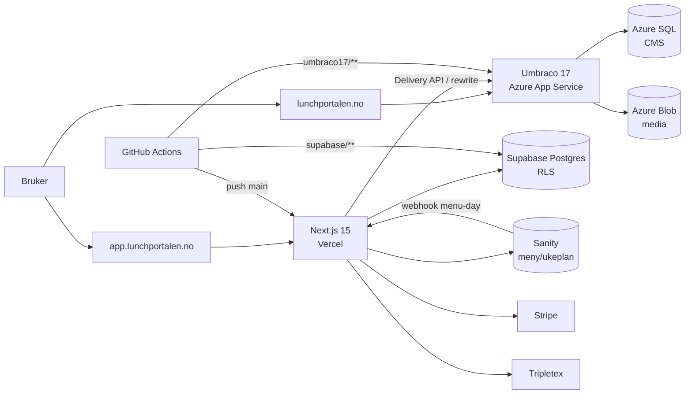
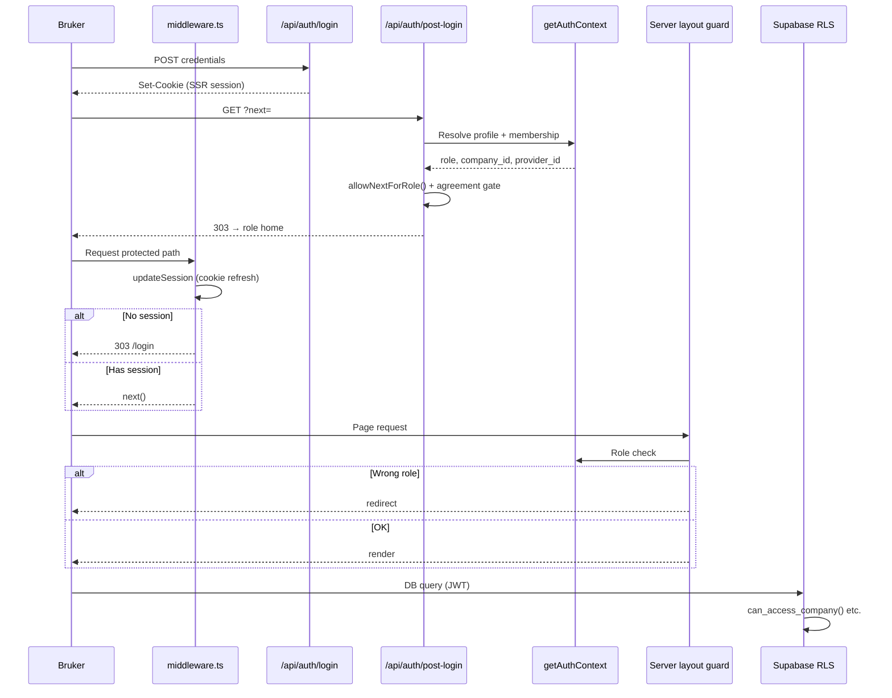
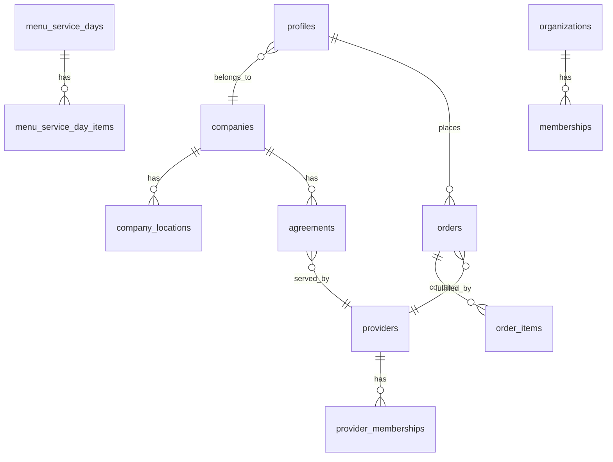

# Lunchportalen — Arkitekturrevisjon

**Status:** DOKUMENTFRYS · LOKAL FULLFØRT · EKSTERN DELVIS (2026-07-11)  
**Dato:** 2026-07-11  
**Dekning:** 7162 individuelt lest · 85 lest i deler · **M=0** — [OPEN-QUESTIONS.md §2](./OPEN-QUESTIONS.md#2-kanonisk-filregnskap-v6--m0)  
**Branch ved revisjon:** `fix/go-operator-open-pr` (ikke byttet)  
**Relaterte leveranser:** [RLS-AND-SECURITY-AUDIT.md](./RLS-AND-SECURITY-AUDIT.md) · [TECH-DEBT.md](./TECH-DEBT.md) · [OPEN-QUESTIONS.md](./OPEN-QUESTIONS.md)

---

## Innholdsfortegnelse

1. [Executive summary](#1-executive-summary)
2. [Repooversikt](#2-repooversikt)
3. [Systemkart](#3-systemkart)
4. [Overordnet arkitektur](#4-overordnet-arkitektur)
5. [Auth og rolleflyt](#5-auth-og-rolleflyt)
6. [Datamodell](#6-datamodell)
7. [Single source of truth](#7-single-source-of-truth)
8. [Integrasjonspunkter](#8-integrasjonspunkter)
9. [Deployarkitektur](#9-deployarkitektur)
10. [Testing og kvalitet](#10-testing-og-kvalitet)
11. [Observability](#11-observability)
12. [Dokumentasjonens pålitelighet](#12-dokumentasjonens-pålitelighet)
13. [Gruppe 3 — API, auth og Supabase-klienter](#13-gruppe-3--api-auth-og-supabase-klienter)
14. [Supabase-klientmatrise](#14-supabase-klientmatrise)
15. [Cron- og webhook-flyter](#15-cron--og-webhook-flyter)
16. [Gruppe 4 — Sanity, Umbraco, Azure, deploy](#16-gruppe-4--sanity-umbraco-17-azure-og-deploy)
17. [API-rutematrise (565 ruter)](#17-api-rutematrise-565-ruter)
18. [Gruppe 5 — Domener (billing, ordre, produksjon, …)](#18-gruppe-5--domener)
19. [Gruppe 6 — UI, designsystem, state, tester, scripts, docs](#19-gruppe-6--ui-designsystem-state-tester-scripts-docs)

---

## 1. Executive summary

**Lunchportalen** er en enterprise firmalunsj-plattform i **RC (Release Candidate)**-modus. Systemet leverer kontrollert bestilling, leverandørproduksjon, fakturering og admin for norske/nordiske bedriftskunder.

### Hovedarkitektur

| System | URL | Teknologi | Deploy |
|--------|-----|-----------|--------|
| Operativ app | `app.lunchportalen.no` | Next.js 15 App Router · Supabase · Sanity | Vercel (`dub1`) |
| Markedsnettsted | `lunchportalen.no` | Umbraco 17 (.NET 10) · Azure SQL · Azure Blob | Azure App Service |
| Menyredaksjon | Sanity Studio (embedded/proxied) | Sanity 5.x | Sanity hosted + `studio/` i repo |

**Datakilder:** Supabase Postgres (operasjonell sannhet), Sanity (meny/ukeplan), Umbraco/Azure SQL (markedsinnhold), Azure Blob (Umbraco-media).

**Integrasjoner:** Stripe (betaling), Tripletex (regnskap), Resend (e-post), Sentry (feilsporing), OpenAI (AI/backoffice), Redis (cache/kø — valgfritt).

### Helhetsvurdering

| Område | Vurdering | Status | Bevis |
|--------|-----------|--------|-------|
| Tenant-isolasjon | **Sannsynlig sterk** (lokalt) | Migrasjoner + tester; ikke prod-verifisert | 61 migrasjoner lest; `tests/tenant-isolation.test.ts` PASS; RLS helpers i baseline |
| Auth-modell | **Bekreftet** fail-closed middleware | | `middleware.ts:111-138` |
| Migrasjonshygiene | **Bekreftet** 61 aktive migrasjoner lest | | `supabase/migrations/202*.sql` |
| Arkitekturgrenser | **Motstridende** (tre CMS-lag) | | ARCH-002, SANITY-001 |
| CI/CD | Tester PASS; branch protection svak | **Bekreftet** | 5268 tester; 0 PR reviews |
| Remote verifisering | **Delvis** | | Supabase prod identifisert (`hkpokyapzarefrgqzkos`); staging branch `uigxsboqeruxflgzqztl`; prod migrasjonsdrift −12; Vercel prod-ref bekreftet; Azure bindings metadata |

---

## 2. Repooversikt

### 2.1 Monorepo-struktur

**Type:** Logisk monorepo (ett Git-repo, flere deploybare systemer). **Ikke** npm/pnpm workspace-monorepo.

| Path | System | Formål |
|------|--------|--------|
| `app/` | Next.js | App Router: sider, layouts, 565+ API-ruter |
| `lib/` | Next.js | Auth, Supabase/Sanity-klienter, domene, HTTP |
| `components/` | Next.js | Delt UI inkl. kanonisk header (`components/nav/HeaderShell.tsx`) |
| `studio/` | Sanity | Studio config, 11 schema-typer, desk structure |
| `supabase/` | Supabase | 61 aktive migrasjoner, `config.toml` |
| `umbraco17/lunchportalen/` | Umbraco | .NET 10 CMS-prosjekt |
| `tests/` | Next.js | 744 Vitest-filer |
| `e2e/` | Next.js | Playwright E2E + visuell regresjon |
| `scripts/` | Begge | CI-guards, audit, seed, GO Operator |
| `.github/workflows/` | Begge | 20 workflows |
| `docs/` | Begge | 50+ rot-MD + underhuber |
| `cua/` | Verktøy | Python Chrome policy-merge (CI) |

**Bevis:** `docs/architecture/monorepo.md:11-18`, `package.json:1-6`, `pnpm-workspace.yaml` (kun `allowBuilds`, ingen `packages:`)

### 2.2 Pakker og avhengigheter

| package.json | Navn | Rolle |
|--------------|------|-------|
| `package.json` (rot) | `lunchportalen` | Hovedapp — Next.js 15.5.18, React 19 |
| `studio/package.json` | `portalen` | Sanity Studio 5.4.0 |
| `eslint-plugin-design-tokens/package.json` | lokal plugin | Design token lint |
| `studio/lunchportalen-studio/package.json` | deprecated | `DEPRECATED.md` |

**.NET:** `umbraco17/lunchportalen/lunchportalen.csproj` — Umbraco.Cms 17

**Package manager:** npm (scripts), `package-lock.json` + `pnpm-lock.yaml` coexisting.

**Node:** `>=20.11.0` (`package.json:109-111`)

### 2.3 Filtelling (git-tracked)

| Metrikk | Verdi | Metode |
|---------|-------|--------|
| Totalt tracked | **7 744** | `git ls-files` |
| TypeScript `.ts` | 3 573 | Utvidelse-gruppering |
| Markdown `.md` | 1 694 | |
| React `.tsx` | 973 | |
| SQL `.sql` | 329 | Inkl. `_archive/` |
| Tester | 744 filer / 5 446 tester | `vitest run` |

**Genererte/binære (ikke manuelt lest):** `node_modules/`, `.next/`, bilder (~317 png/jpg), fonter, PDF — se [OPEN-QUESTIONS.md §22.7](./OPEN-QUESTIONS.md#227-dekningslogg).

### 2.4 Git-status ved revisjon

| Felt | Verdi |
|------|-------|
| Branch | `fix/go-operator-open-pr` |
| Remote | `origin` → `github.com/Lunchportalen/lunchportalen` |
| Default branch | `main` |
| Lokale endringer | Kun untracked `_tmp-*`, `pnpm-*`, `scripts/temp-*` (ikke committet) |
| Submodules / LFS | Ingen |

---

## 3. Systemkart

### 3.1 Supabase

| Aspekt | Detalj |
|--------|--------|
| **Ansvar** | All operasjonell data: brukere, selskaper, avtaler, ordrer, fakturering, provisjon, audit |
| **Kode** | `supabase/migrations/`, `lib/supabase/`, `lib/types/database.ts` |
| **Miljøer** | Production (`hkpokyapzarefrgqzkos`), staging (CI), local (`supabase/config.toml`) |
| **RLS** | Aktiv på alle 100 golden-tracked tabeller; 48 med eksplisitte policies |
| **Edge Functions** | **Ingen** (`supabase/functions/` finnes ikke) |
| **Auth hook** | `custom_access_token_hook` — lokal config enabled (`config.toml:263-265`) |
| **PostgREST** | Kun `public` + `graphql_public` schemas (`config.toml:13`) |

### 3.2 Sanity

| Aspekt | Detalj |
|--------|--------|
| **Ansvar** | Menyredaksjon: `menuDay`, `mealIdea`, `lunchCategory`, `weekTemplate`, m.m. |
| **Kode** | `studio/`, `lib/sanity/`, `lib/cms/`, `lib/menu-publish/` |
| **Dataset** | `production` (default); staging i CI (`NEXT_PUBLIC_SANITY_DATASET`) |
| **Klienter** | CDN read (`lib/sanity/client.ts`), server write (`lib/sanity/server.ts`) |
| **Webhook** | `POST /api/webhooks/sanity/menu-day` → Supabase MSD/MSDI |

### 3.3 Next.js (Vercel)

| Aspekt | Detalj |
|--------|--------|
| **Ansvar** | All applikasjonslogikk, API, cron, webhooks, backoffice |
| **Kode** | `app/`, `lib/`, `components/`, `middleware.ts` |
| **Ruter** | 213 sider, 565 API-ruter, 21 server actions |
| **Roller** | superadmin, company_admin, employee, kitchen, driver, provider_* |
| **i18n** | next-intl, 9+ locales (`messages/`, `i18n/`) |

### 3.4 Umbraco 17 (Azure)

| Aspekt | Detalj |
|--------|--------|
| **Ansvar** | Markedsinnhold på `lunchportalen.no` |
| **Kode** | `umbraco17/lunchportalen/` — Program.cs, ~80 Razor views, uSync |
| **Database** | Azure SQL (connection string i App Service config, ikke i repo) |
| **Media** | Azure Blob (`AddAzureBlobMediaFileSystem`) — `Program.cs:10-11` |
| **Forretningslogikk** | Ingen Supabase/ordre-integrasjon i C#-kode (bekreftet) |

### 3.5 Vercel

| Aspekt | Detalj |
|--------|--------|
| **Prosjekt** | `lunchportalen` → `https://app.lunchportalen.no` |
| **Region** | `dub1` (`vercel.json:2`) |
| **Crons** | 13 scheduled jobs (`vercel.json:3-16`) |
| **Node** | 24.x (remote metadata) |

### 3.6 Azure

| Aspekt | Detalj |
|--------|--------|
| **App Service** | `lunchportalen-umbraco` i `rg-lunchportalen-prod` |
| **Deploy** | `.github/workflows/main_lunchportalen-umbraco.yml` |
| **IaC i repo** | Ingen Bicep/Terraform |

### 3.7 GitHub Actions

20 workflows — se [§9 Deployarkitektur](#9-deployarkitektur).

---

## 4. Overordnet arkitektur



**Bevis:** `docs/architecture/monorepo.md:74-88`, `docs/architecture/PUBLIC_SITE_AND_APP_BOUNDARIES.md:1-8`

---

## 5. Auth og rolleflyt



### Rollemodell (kanonisk)

| Rolle | Lagring | Landing | `next=` allowlist |
|-------|---------|---------|-------------------|
| `superadmin` | `profiles.role` | `/superadmin` | `/superadmin*`, `/backoffice*`, `/umbraco*` |
| `company_admin` | `profiles.role` | `/admin` | `/admin*` |
| `employee` | `profiles.role` | `/week` | `/week*` only |
| `kitchen` | `profiles.role` | `/kitchen` | `/kitchen*` |
| `driver` | `profiles.role` | `/driver` | `/driver*` |
| `provider_admin/kitchen/viewer` | `provider_memberships` | `/leverandor` | (provider layout) |

**Bevis:** `lib/auth/role.ts:7-99`, `lib/auth/getAuthContext.ts:20-31`, `lib/auth/roleHome.ts:41-91`

### Sikkerhetslag (defense in depth)

1. **Middleware** — session presence only, fail-closed API (`middleware.ts:111-138`)
2. **Layout guards** — server-side rolle (`app/admin/layout.tsx`, `app/superadmin/layout.tsx`, etc.)
3. **API route guards** — `scopeOr401`, `requireRoleOr403` (`lib/http/routeGuard.ts`)
4. **RLS** — siste barriere i Postgres (`private.can_access_company()` m.m.)

---

## 6. Datamodell

### 6.1 Kjerneentiteter (Supabase)



**Tabeller (baseline):** 100 `CREATE TABLE public.*` i `20260528000000_baseline_prod_schema.sql`.  
**Post-baseline tillegg:** billing engine (`markets`, `commission_ledger`, `payment_methods`, `billing_payment_attempts`), provider config, menu translations, leads, identity spine (`organizations`, `memberships`, `platform_admins`).

### 6.2 Ordreflyt (Protected Golden Path)

1. Sanity `menuDay` publish → webhook → `menu_service_days` / `menu_service_day_items`
2. Employee `/week` → `lp_order_set` RPC (SECURITY DEFINER)
3. Provider `/leverandor/ordrer` → `lp_order_advance_status`
4. Cutoff 08:00 enforced for employees; provider advances via GUC

**Bevis:** `docs/PROTECTED_GOLDEN_PATH.md`, `supabase/migrations/20260611120000_lp_order_set_variant_itemkey.sql`

### 6.3 Fakturering og provisjon

Global billing engine (migrasjoner `20260729120000`–`20260809120000`):
- `markets`, `commission_ledger`, `organization_billing_profiles`
- Stripe setup/charge/webhook accounting
- `lp_billing_*` SECURITY DEFINER RPCs

---

## 7. Single source of truth

| Dataområde | Autoritativ kilde | Andre kopier | Skribent | Lesere | Synkronisering | Risiko |
|------------|-------------------|--------------|----------|--------|----------------|--------|
| Bruker/rolle | Supabase `profiles` | JWT claims (auth hook) | Onboarding, admin | Next.js, RLS | Auth hook shadow (`20260708120000`) | 🟡 Middels — hook ikke verifisert remote |
| Organisasjon | Supabase `companies` | — | Onboarding, superadmin | RLS, API | — | ⚪ Lav |
| Leverandør | Supabase `providers` | Sanity `provider` (mirror) | Admin, sync scripts | Menyfilter | Eksplisitt sync | 🟡 Middels — se SANITY-001 |
| Meny/ukeplan | Sanity `menuDay` | Supabase MSD/MSDI (materialisert) | Studio, generator | `/week`, provider | Webhook + cron reconcile | 🟡 Tilsiktet cache |
| Ordre | Supabase `orders` | — | `lp_order_set` RPC | Employee, provider, kitchen | — | ⚪ Lav |
| Pris (operasjonell) | Supabase `provider_price_rules`, agreements | — | Admin, billing engine | Fakturering | — | ⚪ Lav |
| Prisinfo (redaksjonell) | Sanity `pricingInfo` | — | Studio | Ukjent runtime | — | 🟠 Høy — burde være Umbraco |
| Markedsinnhold | Umbraco/Azure SQL | Supabase `content_pages` (backoffice CMS) | Backoffice, Umbraco | Public pages | Ingen auto-sync | 🟠 Høy — ARCH-002 |
| Audit | Supabase `audit_log` (partisjonert) | — | Triggers, RPCs | Superadmin | — | ⚪ Lav |
| Media (marketing) | Azure Blob | — | Umbraco | Public site | — | ⚪ Lav |
| E-postmaler | Kode (`lib/email/`) | — | Deploy | Cron, API | — | ⚪ Lav |

---

## 8. Integrasjonspunkter

| Integrasjon | Retning | Auth | Trigger | Idempotens | Kilde |
|-------------|---------|------|---------|------------|-------|
| Sanity → Supabase (meny) | Sanity → Next → DB | Webhook secret + signatur | `menuDay` publish | MSD upsert | `app/api/webhooks/sanity/menu-day/route.ts` |
| Stripe SaaS billing | Stripe → Next | Signatur; allowlisted `/api/saas/billing/webhook` | Payment events | Event ID dedup | `app/api/saas/billing/webhook/route.ts` |
| Stripe provider billing | Stripe → Next | Signatur; **ikke allowlisted** | Payment/setup events | Lib-level dedup | `app/api/webhooks/stripe-billing-payments/route.ts` — se SEC-001 |
| Tripletex | Tripletex ↔ Next | HMAC webhook | Invoice sync | Outbox pattern | `app/api/webhooks/tripletex/route.ts` |
| Umbraco Delivery API | Umbraco → Next | Public read | Page render (dev/fallback) | CDN cache | `next.config.ts` rewrites |
| Resend | Next → Resend | API key | Transactional email | — | `lib/email/` |
| Sentry | Next → Sentry | DSN | Error capture | — | `@sentry/nextjs` |
| OpenAI | Next → OpenAI | API key | AI suggest/apply | Audit log | `lib/ai/` |

---

## 9. Deployarkitektur

### Next.js (Vercel)

```
git push main → Vercel auto-deploy → app.lunchportalen.no
```

| Gate | Kommando | Workflow |
|------|----------|----------|
| PR CI | typecheck, lint, test, build:enterprise:ci | `ci.yml` (path-filtered) |
| Release | `ci:critical` | `ci-enterprise.yml` (nightly + dispatch) |
| E2E | Playwright | `ci-e2e.yml` |
| AGENTS | `agents:check` | `ci-agents.yml` |

### Supabase

```
PR/push supabase/** → supabase-migrate.yml → staging apply → verify
```

RLS drift: `rls-drift-check.yml` (daily 06:00 UTC) mot `tests/rls/golden-rls-snapshot.json`.

### Umbraco (Azure)

```
push umbraco17/** → main_lunchportalen-umbraco.yml → Azure OIDC → lunchportalen-umbraco
postdeploy.yml → smoke mot POSTDEPLOY_BASE_URL
```

### Sanity Studio

```
studio/** endringer → CI gates; studio deploy via npm run sanity:build / Sanity CLI (manuelt)
```

### Miljøer

| Miljø | Next.js | Supabase | Sanity dataset |
|-------|---------|----------|----------------|
| Production | Vercel prod (`app.lunchportalen.no`) | `hkpokyapzarefrgqzkos` (bekreftet HTML) | `production` (MCP telling) |
| Staging | Vercel custom env `staging` | `uigxsboqeruxflgzqztl` (persistent branch) | Egen env (verdi kryptert) |
| Preview | Vercel preview (`*-git-*-lunchportalen.vercel.app`) | Samme env-scope som prod† | Samme env-scope som prod‡ |
| Local | `npm run dev` | `supabase start` | `.env.local` |

† `NEXT_PUBLIC_SUPABASE_URL` scoped Production+Preview+Development. Production bruker `hkpokyapzarefrgqzkos`; preview antas delt.

‡ `NEXT_PUBLIC_SANITY_*` deler Dev/Preview/Production-scope; staging har egne entries.

**Remote verifisert (2026-07-11):** Vercel prosjekt + env-scopes + production deploy (`dpl_CRsrUri7…`). Supabase MCP: prod + staging branch + migrasjonshistorikk. Azure: App Service, SQL, Blob, domener. GitHub branch protection (0 required reviews).

---

## 10. Testing og kvalitet

| Framework | Plassering | Antall | CI |
|-----------|------------|--------|-----|
| Vitest | `tests/` | 744 filer, 5 446 tester | `ci.yml` |
| Playwright | `e2e/` | Auth, shells, mobile, visual | `ci-e2e.yml` |
| RLS golden | `tests/rls/` | Parity + tenant isolation | `rls-drift-check.yml` |
| pgTAP | `supabase/tests/` | Database integrity | `db:rebuild-verify` |

**Kvalitetskommandoer kjørt (revisjon):**

| Kommando | Resultat |
|----------|----------|
| `npm run typecheck` | ✅ PASS |
| `npm run lint` | ✅ PASS (design-token warnings) |
| `npm run test:run` | ✅ 712 filer / 5 268 tester PASS |

---

## 11. Observability

| System | Plassering | Formål |
|--------|------------|--------|
| Sentry | `@sentry/nextjs`, env `SENTRY_*` | Feilsporing prod/preview/staging |
| Health endpoints | `/api/health`, `/api/health/live`, `/api/health/ready` | Liveness/readiness |
| RID | `lib/http/respond.ts` `makeRid()` | Korrelasjon i alle API-responser |
| Audit log | Supabase `audit_log` (partisjonert, FORCE RLS) | Sporbarhet |
| Cron observability | `lib/http/weekCronObservability.ts` | Cron-kjøring |
| Billing readiness | `billing_readiness_events` tabell | Faktureringsstatus |
| Better Stack | `scripts/smoke/betterstack-status.mjs` | Uptime smoke |

---

## 12. Dokumentasjonens pålitelighet

| Dokument | Status | Avvik |
|----------|--------|-------|
| `docs/architecture/monorepo.md` | ✅ Korrekt | Workflow-telling sier 16, faktisk 20 |
| `AGENTS.md` | ✅ Autoritativ | Låst — styrer agent-atferd |
| `docs/PROTECTED_GOLDEN_PATH.md` | ✅ Korrekt | Matcher migrasjoner og tester |
| `docs/MASTER_FULL_REPOSITORY_AUDIT.md` | ⚠️ Foreldet | Dato 2026-03-14; mangler Umbraco, billing engine |
| `docs/architecture/PUBLIC_SITE_AND_APP_BOUNDARIES.md` | ✅ Korrekt | Matcher middleware + next.config |
| `README.md` | ✅ Korrekt | Peker til monorepo.md |

**Kanonical arkitektur før denne revisjonen:** `docs/architecture/monorepo.md` — denne filen (`docs/ARCHITECTURE.md`) er den nye revisjonsleveransen.

---

## 13. Gruppe 3 — API, auth og Supabase-klienter

**Status:** Denne analysegruppen er fullført. Hele revisjonen er fortsatt **REVISJON DELVIS FULLFØRT**.

### 13.1 Deduplisert filregnskap (gruppe 3)

Kategorier **overlapper** — samme fil kan telle i flere kategorier. Dekningsgrad bruker **unike filstier**.

| Metrikk | Eksakt antall | Merknad |
|---------|-------------:|---------|
| Brutto kategoritreff (innen G3-scope) | **672** | Sum av medlemskap i 6 kategorier nedenfor |
| Duplikate kategoritreff | **34** | 29 cron⊂API + 5 webhook⊂API |
| **Unike filer valgt (G3-scope)** | **652** | `app/api/**`, actions, auth, supabase, cronAuth, lib/admin-mønstre |
| **Unike ekstra arkivmigrasjoner** | **92** | Objekt-overlapp mot 61 aktive migrasjoner (ikke i G3-scope) |
| **Unike filer lest i gruppe 3** | **744** | 652 + 92 arkiv |
| Individuelt lest før gruppe 3 | **141** | G1 (61 migrasjoner + config) + G2 (workflows, webhooks, cron, actions, kjerne) |
| Individuelt lest etter gruppe 3 | **827** | 141 + 686 nye unike |
| Relevante filer som gjenstår | **6756** | 7744 − 827 − 161 maskinelt klassifisert |

**Overlapp-eksempler (34 duplikater):**

| Overlapp | Antall | Eksempel |
|----------|-------:|----------|
| cron-rute ∩ API-rute | 29 | `app/api/cron/invoices/generate/route.ts` |
| webhook ∩ API-rute | 5 | `app/api/webhooks/stripe-billing-payments/route.ts` |
| action ∩ lib/admin-søk | 3 | `app/superadmin/growth/social/actions.ts` |

**Kategorifordeling (brutto 672 — ikke unike):**

| Kategori | Brutto treff |
|----------|-------------:|
| `app/api/**/route.ts` | 565 |
| Cron-ruter (delmengde) | 29 |
| Webhook-ruter (delmengde) | 5 |
| Server actions | 21 |
| `lib/auth/**` + `middleware.ts` | 41 |
| `lib/supabase/**` | 13 |

### 13.2 Primær ruteklasse (565 ruter — gjensidig utelukkende)

| Primærklasse | Antall |
|--------------|-------:|
| Vanlig autentisert API-rute | 462 |
| Offentlig standardrute | 41 |
| Cron | 29 |
| Auth callback | 16 |
| Intern systemrute | 12 |
| Webhook | 5 |
| **Sum** | **565** |

### 13.3 Sikkerhetsegenskaper (kan overlappe — ikke utelukkende)

| Egenskap | Ruter med egenskap |
|----------|-------------------:|
| Middleware session (ikke allowlisted) | 462 |
| Handler `scopeOr401` | 369 |
| Handler rollekrav (`requireRoleOr403`) | 365 |
| Handler scope-mønster | 84 |
| Handler tenant-mønster | 105 |
| Signaturkontroll (Stripe/webhook) | 6 |
| Secretkontroll (`requireCronAuth` e.l.) | 34 |
| Service role i handler | 281 |
| Rate limiting | 23 |
| Idempotens-indikator i kode | 77 |
| Audit logging i handler | 25 |

**Merk:** En cron-rute kan ha secretkontroll + service role + idempotens samtidig.

### 13.4 Auth-lag per rutetype

| Lag | Mekanisme | Omfang | Fail-closed |
|-----|-----------|--------|-------------|
| **L1 Middleware** | `middleware.ts:115-136` — allowlist eller session-cookie | Alle `/api/*` | Ja — `401 JSON` uten session |
| **L2 Route guard** | `scopeOr401` + `requireRoleOr403` | 369 ruter med `scopeOr401`; 365 med rollekrav | Ja — `403` ved rollebrudd |
| **L3 Cron** | `requireCronAuth` (`lib/http/cronAuth.ts`) | 34 ruter (29 cron + 5 system/outbox) | Ja når secret satt; **unntak:** `x-vercel-cron: 1` (CRON-001) |
| **L4 Webhook** | Stripe/Tripletex/Sanity signatur i route | 5 webhook-ruter | Ja **inne i route** — men SEC-001 blokkerer 2 Stripe før route |
| **L5 RLS** | Postgres policies på JWT-klient | Alle `supabaseServer()`-skriv | Ja — default deny; superadmin/company policies OR-evaluert |
| **L6 Service role** | `supabaseAdmin()` bypasser RLS | 281 API-ruter; 510 prod importsteder | Avhenger av L2/L3/L4 før admin-klient |

**Viktig:** Middleware alene er **ikke** tilstrekkelig autorisasjon — route handlers må implementere rolle/tenant/cron/webhook-gates (bekreftet på stikkprøver og full maskinscan).

### 13.5 Server actions (21 filer)

| Fil | Eksporter | Auth | Rolle | Tenant | Klient | Service role | Risiko |
|-----|-----------|------|-------|--------|--------|--------------|--------|
| `app/superadmin/firms/[companyId]/actions.ts` | `setCompanyStatus` | ❌ ingen | ❌ | `companyId` input | `supabaseServer` | nei | **🟠 SEC-004** |
| `app/superadmin/providers/actions.ts` | `setProviderSubscription`, … | `getAuthContext` | `assertSuperadmin` | providerId input | `supabaseServer` + RPC | nei | lav |
| `app/superadmin/control-tower/actions.ts` | diverse | `getAuthContext` | superadmin | — | server | nei | lav |
| `app/superadmin/agreements/actions.ts` | diverse | gate | superadmin | — | server | nei | lav |
| `app/superadmin/growth/social/actions.ts` | diverse | gate | superadmin | — | server/admin | delvis | middels |
| `app/leverandor/ordrer/actions.ts` | `advanceKitchenOrder` | `getAuthContext` | `hasProviderRole` | order→provider | server | nei | lav |
| `app/leverandor/kunder/actions.ts` | diverse | provider gate | provider | provider scope | server | nei | lav |
| `app/leverandor/omrader/actions.ts` | diverse | provider gate | provider | provider | server | nei | lav |
| `app/leverandor/faktura/actions.ts` | diverse | provider gate | provider | provider | server | nei | lav |
| `app/leverandor/registreringer/actions.ts` | diverse | provider gate | provider | provider | server | nei | lav |
| `app/leverandor/innstillinger/tripletex/*/actions.ts` | diverse | provider gate | provider | provider | server | nei | lav |
| `app/admin/invite/actions.ts` | invite | session | company_admin | company scope | server | nei | lav |
| `app/onboarding/actions.ts` | `submitOnboarding` | ❌ (proxy fetch) | — | — | fetch→API | nei | lav |
| `app/registrer/actions.ts` | registrer | proxy/API | — | — | fetch | nei | lav |
| `lib/audit/actions.ts` | audit | superadmin | superadmin | — | server | nei | lav |
| `lib/ceo/actions.ts` | CEO | superadmin | superadmin | — | server/admin | delvis | middels |
| `lib/revenue/actions.ts` | revenue | gate | superadmin | — | server | nei | lav |
| `lib/strategy/actions.ts` | strategy | gate | superadmin | — | server | nei | lav |
| `lib/predictive/actions.ts` | predictive | gate | superadmin | — | server | nei | lav |

**Flagg (gruppe 3):** 1 action uten auth (`setCompanyStatus`); 0 actions med service role direkte; 2 actions proxyer til allowlisted API (`onboarding`, `registrer`).

---

## 14. Supabase-klientmatrise

| Klient-ID | Fil | Klienttype | Nøkkeltype | Server/klient | Bruksområder | RLS omgås | Eksponering |
|-----------|-----|------------|------------|---------------|--------------|----------:|-------------|
| **SB-001** | `lib/supabase/client.ts` | browser | `NEXT_PUBLIC_SUPABASE_ANON_KEY` | Klient (`"use client"`) | Auth UI, browser queries | Nei | Publisert anon key (forventet) |
| **SB-002** | `lib/supabase/browser.ts` | browser (shim) | anon | Klient | Legacy shim → SB-001 | Nei | Samme som SB-001 |
| **SB-003** | `lib/supabase/server.ts` | route handler m/brukersesjon | anon + SSR cookies | Server | Standard server read/write med RLS | Nei | Kun server; cookie-bound JWT |
| **SB-004** | `lib/supabase/route.ts` | route handler m/brukersesjon | anon + request cookies | Server | API routes som setter cookies på `NextResponse` | Nei | Server only |
| **SB-005** | `lib/supabase/proxy.ts` | middleware | anon | Edge/middleware | Session refresh (`getClaims`) | Nei | Ingen service role; ingen profil-oppslag |
| **SB-006** | `lib/supabase/anonServer.ts` | vanlig server (anon) | anon | Server | Offentlig RPC (`/registrer` intake) | Nei | Cookie-less anon |
| **SB-007** | `lib/supabase/admin.ts` | **service role** | `SUPABASE_SERVICE_ROLE_KEY` | Server only | Admin/cron/webhook/batch — **single entry** | **Ja** | Fail-closed uten env; aldri browser |
| **SB-008** | `lib/supabase/adminAny.ts` | service role (escape hatch) | via SB-007 | Server | Legacy `any` typing | Ja | Intern shim |
| **SB-009** | `lib/auth/getAuthContext.ts` | blandet | anon/bearer | Server | `createServerClient` + bearer `createClient` for API auth | Nei | Sentral auth resolver |
| **SB-010** | `tests/_helpers/rlsFixtures.ts` | testklient | test env | Test | RLS fixtures | Konfig-avhengig | Kun Vitest |

**Service role (SB-007) — aggregert:**

| Felt | Verdi |
|------|-------|
| Importsteder totalt | **573** git-tracked filer |
| Produksjonsrelevante | **510** (ekskl. 54 test, 7 script, 2 re-export) |
| API-ruter | **265** |
| Cron-ruter | **16** |
| Webhooks | **3** |
| Server actions | **3** |
| Server-only libraries | **223** |
| Eksplisitt rollevalidering | **222** filer |
| Eksplisitt tenant-mønster | **146** filer |
| API-ruter uten dokumentert handler-auth | **47** (middleware-session only) |
| Offentlige ruter med service role | **12** |
| Offentlige ruter med skriv | **10** |
| Nøkkel lest | Kun `lib/supabase/admin.ts:45-48` |
| Typisk auth før bruk | Cron secret / webhook signatur / `scopeOr401`+superadmin / intern scheduler |
| Skrivbare tabeller | Alle (RLS bypass) — faktisk scope styrt av kallende kode |
| Brukerinput styrer tenant? | Ja på noen ruter — **må** valideres i handler (SR-001) |
| Audit | Delvis — `lib/audit/write.ts`, `billing_audit_log`, `logOpsEventBestEffort` |
| Idempotens | Cron/webhook: delvis (`stripe_billing_webhook_events`, outbox `event_key`) |
| Offentlig rute? | Kun allowlisted cron/webhook/public — aldri direkte fra browser |

---

## 15. Cron- og webhook-flyter

### 15.1 Cron-autentisering (`lib/http/cronAuth.ts`)

```
Request → x-vercel-cron: 1?  → return { mode: "vercel-cron" }  (INGEN secret-sjekk)
        → Authorization: Bearer <CRON_SECRET|SYSTEM_MOTOR_SECRET>
        → x-cron-secret: <secret>
        → ellers forbidden / cron_secret_missing
```

| Spørsmål | Svar | Bevis |
|----------|------|-------|
| Kan ekstern klient sende `x-vercel-cron: 1`? | **Ja** (HTTP-header er spoofbar generelt). Vercel hevder injisert header på Vercel Cron | `cronAuth.ts:29-31`; Vercel cron docs referert i filkommentar |
| Verifiserer app at request kommer fra Vercel? | **Nei** — ingen signatur/HMAC på headeren | `cronAuth.ts` |
| Hva skjer når `CRON_SECRET` mangler? | `x-vercel-cron: 1` → **tillatt**; ellers `cron_secret_missing` | `tests/lib/http/cronAuth.test.ts:39-42` |
| Fail-closed? | **Delvis** — avhenger av secret satt + plattform | CRON-001 |
| Dual secret | `CRON_SECRET` (default) vs `SYSTEM_MOTOR_SECRET` (`/api/cron/system-motor`) | `system-motor/route.ts:16` |

**Cron-ruter (29) — oppsummert:**

| Auth-metode | Antall | Secret påkrevd | Service role | Skriver økonomi/ordre/tenant |
|-------------|-------:|----------------|--------------|------------------------------|
| `requireCronAuth` only | 27 | CRON_SECRET (unntak header) | 18+ | `invoices/generate`, `tripletex-*`, `outbox` |
| `SYSTEM_MOTOR_SECRET` | 1 | `system-motor` | via repairs | system jobs |
| Cron + superadmin fallback | 2 | `kitchen-print`, `daily-sanity` | ja | kitchen batches |

**Eksakt cron-tall (29 ruter):** service role **16**; skriver data **10**; økonomi-relaterte **8**; idempotens-indikator **Uavklart — ikke ferdig klassifisert per rute** (delvis på `invoices/generate`).

### 15.2 Webhook-flyter

| Rute | Allowlist | Signatur | Service role | Idempotens | Middleware→route test |
|------|-----------|----------|--------------|------------|----------------------|
| `/api/saas/billing/webhook` | ✅ | Stripe `constructEvent` | ja | `stripe_billing_webhook_events` | Delvis |
| `/api/webhooks/stripe-billing-payments` | ❌ SEC-001 | Stripe før parse | ja | `stripe_billing_webhook_events` | **Mangler** |
| `/api/webhooks/stripe-provider-setup` | ❌ SEC-001 | Stripe før parse | ja | `stripe_billing_webhook_events` | **Mangler** |
| `/api/webhooks/tripletex` | ✅ | HMAC i route | ja | outbox/webhook tables | Delvis |
| `/api/webhooks/sanity/menu-day` | ✅ | Sanity secret | nei (server) | reconcile idempotent | Delvis |

**Stripe provider payment events:** `payment_intent.*`, `charge.*` → `billing_payment_attempts`, `provider_commission_invoices`, RPC `lp_billing_apply_payment_recovery_policy`.

**Stripe provider setup events:** `checkout.session.completed`, `setup_intent.succeeded`, `payment_method.attached`, `customer.updated` → `organization_billing_profiles`, `payment_methods`.

---

---

## 16. Gruppe 4 — Sanity, Umbraco 17, Azure og deploy

**Status:** Denne analysegruppen er fullført. Hele revisjonen er fortsatt **REVISJON DELVIS FULLFØRT**.

### 16.1 Sanity (47 git-trackede filer)

**Schema-typer (11 — alle lest individuelt):**

| Type | Fil | Formål | Hardregel |
|------|-----|--------|-----------|
| `provider` | `provider.ts` | Read-only Supabase-mirror | OK (meny) |
| `menu` | `menu.ts` | mealType-katalog | OK |
| `menuDay` | `menuDay.ts` | Dagkort → WeekPlanner | OK |
| `mealIdea` | `mealIdea.ts` | Varmmatbank | OK |
| `weekTemplate` | `weekTemplate.ts` | Uke-mal preset | OK |
| `lunchCategory` | `lunchCategory.ts` | Statisk kategoriinnhold | OK |
| `productPlan` | `productPlan.ts` | Produktplan | OK |
| `closedDate` | `closedDate.ts` | Stengte dager | OK |
| `announcement` | `announcement.ts` | Systemkunngjøringer | OK |
| `page` | `page.ts` | Generisk side | **SANITY-001 brudd** |
| `pricingInfo` | `pricingInfo.ts` | Prisinfo | **SANITY-001 brudd** |

`page` og `pricingInfo`: **Ingen runtime-leser funnet i undersøkt repo.** Remote Sanity og eventuelle eksterne klienter er **ikke verifisert**.

| Aspekt | `page` | `pricingInfo` |
|--------|--------|---------------|
| Kan opprettes i Studio | Ja (`schemaTypes/index.ts`) | Ja |
| Desk structure (`deskStructure.ts`) | **Ikke eksponert** | **Ikke eksponert** |
| Alternativ struktur (`src/structure.ts`) | Via `documentTypeListItems()` | Via `documentTypeListItems()` |
| Preview-konfig | Ingen i schema | Ingen i schema |
| Webhook-reaksjon | Kun `menuDay` i `menu-day` webhook | Nei |
| GROQ i `lib/` | 0 | 0 |
| Klassifisering | **Registrert, uten lokal runtime-leser** | **Registrert, uten lokal runtime-leser** |
| SANITY-001 | Schema registrert lokalt; null publiserte page/pricingInfo i prod 2026-07-11 | Samme |

**GROQ i produksjonskode (`lib/`):** 19 filer med `_type ==`-spørringer; hovedtyper: `menuDay`, `mealIdea`, `menu`, `lunchCategory`, `productPlan`, `weekTemplate`, `announcement`, `provider`.

**Meny-flyt (13 steg — konfliktstrategi delvis bekreftet):**

| # | Led | Detalj |
|---|-----|--------|
| 1 | Sanity-dokument | `menuDay` |
| 2 | Webhook-payload | `extractMenuDayFromSanityWebhookBody` |
| 3 | Endepunkt | `POST /api/webhooks/sanity/menu-day` |
| 4 | Signatur | `SANITY_WEBHOOK_SECRET` + `verifySanityWebhookSignature` |
| 5 | Transformasjon | `syncMenuServiceDaysForPublishedMenuDay` |
| 6 | Supabase-tabeller | `menu_service_days`, `menu_service_day_items` |
| 7 | Konfliktstrategi | Upsert per `(provider_id, date, plan_tier)`; webhook er **sannhetskilde ved publish** |
| 8 | Versjon/timestamp | `updated_at` på rader; ingen separat versjonskolonne |
| 9 | Sletting/avpublisering | `deleteMenuServiceDaysForMenuDay` ved unpublish |
| 10 | Retry | Ingen app-level retry; Sanity webhook kan re-sende |
| 11 | Idempotens | Upsert + skip ved uendret payload |
| 12 | Leser Next.js | `/api/week`, `lib/orders/readers/*` |
| 13 | Fallback | **Ingen** live Sanity-fallback i `/week` — leser kun Supabase MSD/MSDI |

**`menu_service_days` rolle:** **Operasjonell projeksjon** (materialisert publisert ukeplan for employee/provider views). Sanity er redaksjonell kilde; Supabase vinner ved uenighet etter vellykket webhook.

### 16.2 CMS single source of truth

| Innhold | Umbraco | Sanity | Supabase | Aktiv kilde |
|---------|---------|--------|----------|-------------|
| Forside (public) | `HomePage.cshtml` | — | `content_pages` (backoffice) | **Umbraco** (`lunchportalen.no`) |
| Prisside | `pricing.cshtml` | `pricingInfo` (ingen lokal leser) | `content_pages` | **Umbraco** |
| Meny/ukeplan | — | `menuDay`, `mealIdea` | `menu_service_days` | **Sanity → Supabase** |
| Nav/footer public | `siteSettings` uSync | — | `/api/content/global/*` | **Umbraco** (public site) + Supabase (app chrome) |
| App backoffice CMS | — | — | `content_pages` | **Supabase** |
| SEO metadata | `_Layout.cshtml` | — | — | **Umbraco** |

### 16.3 Umbraco 17 (380 git-trackede filer)

| Klasse | Antall | Metode |
|--------|-------:|--------|
| Razor views + partials | 80 | Individuelt lest |
| C# kilde | 3 | `Program.cs`, `AppUrls.cs`, test-prosjekt |
| CSS (`wwwroot/css`) | 12 | Individuelt lest |
| appsettings | 3 | Individuelt lest |
| uSync config | 282 | Maskinelt klassifisert (innholdstyper, ikke forretningslogikk) |
| proof/png, favicon | 3 | Binær/klassifisert |

**Forretningslogikk:** **Ingen** Supabase/ordre/fakturering i `.cs` — kun `Program.cs` (Umbraco + Azure Blob + uSync). **Ren presentasjon bekreftet** for C#/views.

**SEO (`_Layout.cshtml:56-75`):** title, description, canonical, Open Graph, Twitter Cards, `robots index,follow`.

**Design (UMB-DESIGN-001):** Umbraco CSS bruker hardkodede farger (`priser-page-blocks.css:9-13`) og `lp-block-grid` — ikke Next.js `ds-*` tokens.

### 16.4 Azure-identitet og deploy (separate begreper)

| Element | Funnet | Bevis | Remote verifisert |
| ------------------------------------ | -----: | ----- | ----------------: |
| GitHub OIDC (`id-token: write`) | ja | `main_lunchportalen-umbraco.yml` | nei |
| Federated credential | uavklart | Ikke i repo; forventet i Azure AD | nei |
| Service principal / app registration | ja (secret-navn) | `AZURE_CLIENT_ID`, `AZURE_TENANT_ID`, `AZURE_SUBSCRIPTION_ID` i workflow | nei |
| System-assigned managed identity | uavklart | Ikke i `Program.cs` eller appsettings | nei |
| User-assigned managed identity | uavklart | Ikke funnet | nei |
| App Service managed identity | uavklart | Ikke i repo | nei |
| Publish profile | nei | Zip deploy via OIDC, ikke publish profile | nei |
| Client secret | uavklart | GitHub secrets kan være SP-secret; ikke bekreftet type | nei |
| Key Vault | nei | Ikke referert i repo | nei |

**Merk:** GitHub secret-navn beviser **ikke** at App Service har managed identity.

| Ressurs | Konfigurasjon | Remote verifisert |
|---------|---------------|-------------------|
| App Service | `lunchportalen-umbraco` · `rg-lunchportalen-prod` | **Nei** |
| Azure SQL | `umbracoDbDSN` (App Service settings — ikke i repo) | **Nei** |
| Blob Storage | Container `lunchportalen-media`; connection string tom i `appsettings.json` | **Nei** |
| Application Insights | **Uavklart — ikke funnet i appsettings** | **Nei** |

**Deploykjeder:**

| System | Workflow | Trigger | Mål |
|--------|----------|---------|-----|
| Next.js | Vercel (ikke i repo) | git push | `app.lunchportalen.no` |
| Umbraco | `main_lunchportalen-umbraco.yml` | push `umbraco17/**` | Azure zip deploy + V.25–V.28 |
| Postdeploy | `postdeploy.yml` | etter Umbraco workflow success på `main` | `POSTDEPLOY_BASE_URL` secret |
| Supabase | `supabase-migrate.yml` | push `supabase/**` | staging apply |

**Postdeploy:** Krever `POSTDEPLOY_BASE_URL` secret; kjører `npm run postdeploy`; blokkerer ikke Azure-deploy ved feil (egen workflow); kun `main` branch ved `workflow_run`.

---

## 17. API-rutematrise (565 ruter)

*Full matrise — hver `route.ts` individuelt lest 2026-07-11.*


| Metrikk | Antall |
|-------|--------|
| Totalt | 565 |
| scopeOr401 | 369 |
| requireRole | 365 |
| requireCronAuth | 34 |
| supabaseAdmin | 281 |
| Stripe-signatur | 3 |
| rateLimit | 23 |

### /api/_template/ (1 ruter)

| Fil | URL | Metoder | Auth | scopeOr401 | Rolle | Cron | Service role | Risiko |
|-----|-----|---------|------|------------|-------|------|--------------|--------|
| `app/api/_template/route.ts` | `/api/_template` | GET,POST | session+scopeOr401 | ja | ja | nei | nei | lav |

### /api/accept-invite/ (1 ruter)

| Fil | URL | Metoder | Auth | scopeOr401 | Rolle | Cron | Service role | Risiko |
|-----|-----|---------|------|------------|-------|------|--------------|--------|
| `app/api/accept-invite/complete/route.ts` | `/api/accept-invite/complete` | GET,POST | middleware-session | nei | nei | nei | ja | høy |

### /api/acquire/ (2 ruter)

| Fil | URL | Metoder | Auth | scopeOr401 | Rolle | Cron | Service role | Risiko |
|-----|-----|---------|------|------------|-------|------|--------------|--------|
| `app/api/acquire/route.ts` | `/api/acquire` | GET | session+scopeOr401 | ja | ja | nei | nei | lav |
| `app/api/acquire/strategy/route.ts` | `/api/acquire/strategy` | POST | session+scopeOr401 | ja | ja | nei | nei | lav |

### /api/address/ (2 ruter)

| Fil | URL | Metoder | Auth | scopeOr401 | Rolle | Cron | Service role | Risiko |
|-----|-----|---------|------|------------|-------|------|--------------|--------|
| `app/api/address/resolve/route.ts` | `/api/address/resolve` | GET | middleware-session | nei | nei | nei | nei | lav |
| `app/api/address/search/route.ts` | `/api/address/search` | GET | middleware-session | nei | nei | nei | nei | lav |

### /api/admin/ (54 ruter)

| Fil | URL | Metoder | Auth | scopeOr401 | Rolle | Cron | Service role | Risiko |
|-----|-----|---------|------|------------|-------|------|--------------|--------|
| `app/api/admin/accept-invite/complete/route.ts` | `/api/admin/accept-invite/complete` | GET,POST | middleware-session | nei | nei | nei | ja | høy |
| `app/api/admin/agreement/change-requests/[requestId]/cancel/route.ts` | `/api/admin/agreement/change-requests/[requestId]/cancel` | POST | session+scopeOr401 | ja | ja | nei | nei | lav |
| `app/api/admin/agreement/change-requests/route.ts` | `/api/admin/agreement/change-requests` | GET,POST | session+scopeOr401 | ja | ja | nei | nei | lav |
| `app/api/admin/agreement/route.ts` | `/api/admin/agreement` | GET | session+scopeOr401 | ja | ja | nei | ja | lav |
| `app/api/admin/agreements/current/route.ts` | `/api/admin/agreements/current` | GET | session+scopeOr401 | ja | ja | nei | nei | lav |
| `app/api/admin/agreements/route.ts` | `/api/admin/agreements` | GET | middleware-session | nei | nei | nei | nei | lav |
| `app/api/admin/auth/login/route.ts` | `/api/admin/auth/login` | GET,POST | custom-401 | nei | nei | nei | nei | lav |
| `app/api/admin/auth/route.ts` | `/api/admin/auth` | GET,POST | session+scopeOr401 | ja | ja | nei | nei | lav |
| `app/api/admin/company/[companyId]/summary/route.ts` | `/api/admin/company/[companyId]/summary` | GET | session+scopeOr401 | ja | ja | nei | nei | lav |
| `app/api/admin/company/status/set/route.ts` | `/api/admin/company/status/set` | GET,POST | session+scopeOr401 | ja | nei | nei | nei | lav |
| `app/api/admin/dashboard/route.ts` | `/api/admin/dashboard` | GET | session+scopeOr401 | ja | ja | nei | nei | lav |
| `app/api/admin/deliveries/route.ts` | `/api/admin/deliveries` | GET,POST | session+scopeOr401 | ja | ja | nei | nei | lav |
| `app/api/admin/deliveries/status/route.ts` | `/api/admin/deliveries/status` | GET,POST,PUT,PATCH,DELETE | session+scopeOr401 | ja | ja | nei | nei | lav |
| `app/api/admin/demand-insights/route.ts` | `/api/admin/demand-insights` | GET | session+scopeOr401 | ja | ja | nei | ja | lav |
| `app/api/admin/employees/[userId]/disable/route.ts` | `/api/admin/employees/[userId]/disable` | PATCH | session+scopeOr401 | ja | ja | nei | nei | lav |
| `app/api/admin/employees/activity/route.ts` | `/api/admin/employees/activity` | GET,POST | session+scopeOr401 | ja | ja | nei | nei | lav |
| `app/api/admin/employees/audit/route.ts` | `/api/admin/employees/audit` | GET | session+scopeOr401 | ja | ja | nei | nei | lav |
| `app/api/admin/employees/export/route.ts` | `/api/admin/employees/export` | GET | session+scopeOr401 | ja | ja | nei | ja | lav |
| `app/api/admin/employees/invite/route.ts` | `/api/admin/employees/invite` | GET,POST | session+scopeOr401 | ja | ja | nei | ja | lav |
| `app/api/admin/employees/invites/link/route.ts` | `/api/admin/employees/invites/link` | POST | session+scopeOr401 | ja | ja | nei | ja | lav |
| `app/api/admin/employees/invites/resend/route.ts` | `/api/admin/employees/invites/resend` | POST | session+scopeOr401 | ja | ja | nei | ja | lav |
| `app/api/admin/employees/invites/revoke/route.ts` | `/api/admin/employees/invites/revoke` | POST | session+scopeOr401 | ja | ja | nei | ja | lav |
| `app/api/admin/employees/invites/route.ts` | `/api/admin/employees/invites` | POST | session+scopeOr401 | ja | ja | nei | nei | lav |
| `app/api/admin/employees/invites/stats/route.ts` | `/api/admin/employees/invites/stats` | GET | session+scopeOr401 | ja | ja | nei | ja | lav |
| `app/api/admin/employees/list/route.ts` | `/api/admin/employees/list` | GET | session+scopeOr401 | ja | ja | nei | ja | lav |
| `app/api/admin/employees/resend-invite/route.ts` | `/api/admin/employees/resend-invite` | POST | session+scopeOr401 | ja | ja | nei | ja | lav |
| `app/api/admin/employees/route.ts` | `/api/admin/employees` | GET,POST | session+scopeOr401 | ja | ja | nei | ja | lav |
| `app/api/admin/employees/set-disabled/route.ts` | `/api/admin/employees/set-disabled` | POST | session+scopeOr401 | ja | ja | nei | ja | lav |
| `app/api/admin/insight/route.ts` | `/api/admin/insight` | GET | session+scopeOr401 | ja | ja | nei | ja | lav |
| `app/api/admin/insights/route.ts` | `/api/admin/insights` | GET | session+scopeOr401 | ja | ja | nei | ja | lav |
| `app/api/admin/invite/route.ts` | `/api/admin/invite` | GET,POST | session+scopeOr401 | ja | ja | nei | ja | lav |
| `app/api/admin/invites/[id]/route.ts` | `/api/admin/invites/[id]` | PATCH,DELETE | session+scopeOr401 | ja | ja | nei | ja | lav |
| `app/api/admin/invites/create/route.ts` | `/api/admin/invites/create` | POST | session+scopeOr401 | ja | ja | nei | ja | lav |
| `app/api/admin/invites/lookup/route.ts` | `/api/admin/invites/lookup` | GET | middleware-session | nei | nei | nei | ja | høy |
| `app/api/admin/invites/register/route.ts` | `/api/admin/invites/register` | POST | middleware-session | nei | nei | nei | ja | høy |
| `app/api/admin/invites/resend/route.ts` | `/api/admin/invites/resend` | POST | session+scopeOr401 | ja | ja | nei | ja | lav |
| `app/api/admin/invites/resolve/route.ts` | `/api/admin/invites/resolve` | GET | middleware-session | nei | nei | nei | nei | lav |
| `app/api/admin/invites/revoke/route.ts` | `/api/admin/invites/revoke` | GET,POST | session+scopeOr401 | ja | ja | nei | ja | lav |
| `app/api/admin/invites/route.ts` | `/api/admin/invites` | GET,POST | session+scopeOr401 | ja | ja | nei | ja | lav |
| `app/api/admin/invoices/csv/route.ts` | `/api/admin/invoices/csv` | GET | session+scopeOr401 | ja | ja | nei | ja | lav |
| `app/api/admin/locations/audit/route.ts` | `/api/admin/locations/audit` | GET | session+scopeOr401 | ja | ja | nei | nei | lav |
| `app/api/admin/locations/export/route.ts` | `/api/admin/locations/export` | GET | session+scopeOr401 | ja | ja | nei | ja | lav |
| `app/api/admin/locations/route.ts` | `/api/admin/locations` | GET | session+scopeOr401 | ja | ja | nei | ja | lav |
| `app/api/admin/locations/status/route.ts` | `/api/admin/locations/status` | POST | session+scopeOr401 | ja | ja | nei | ja | lav |
| `app/api/admin/me/route.ts` | `/api/admin/me` | GET | session+scopeOr401 | ja | ja | nei | ja | lav |
| `app/api/admin/metrics/daily/route.ts` | `/api/admin/metrics/daily` | GET | session+scopeOr401 | ja | ja | nei | nei | lav |
| `app/api/admin/metrics/route.ts` | `/api/admin/metrics` | GET | session+scopeOr401 | ja | ja | nei | nei | lav |
| `app/api/admin/metrics/summary/route.ts` | `/api/admin/metrics/summary` | GET | session+scopeOr401 | ja | ja | nei | nei | lav |
| `app/api/admin/metrics/weekly/route.ts` | `/api/admin/metrics/weekly` | GET | session+scopeOr401 | ja | ja | nei | nei | lav |
| `app/api/admin/operations-tower/route.ts` | `/api/admin/operations-tower` | GET,POST | session+scopeOr401 | ja | ja | nei | ja | lav |
| `app/api/admin/orders/route.ts` | `/api/admin/orders` | GET | session+scopeOr401 | ja | ja | nei | ja | lav |
| `app/api/admin/people/route.ts` | `/api/admin/people` | GET | session+scopeOr401 | ja | ja | nei | ja | lav |
| `app/api/admin/support/report/route.ts` | `/api/admin/support/report` | POST | session+scopeOr401 | ja | ja | nei | ja | lav |
| `app/api/admin/users/route.ts` | `/api/admin/users` | GET | session+scopeOr401 | ja | ja | nei | nei | lav |

### /api/agreements/ (2 ruter)

| Fil | URL | Metoder | Auth | scopeOr401 | Rolle | Cron | Service role | Risiko |
|-----|-----|---------|------|------------|-------|------|--------------|--------|
| `app/api/agreements/my-latest/route.ts` | `/api/agreements/my-latest` | GET | custom-401 | nei | nei | nei | ja | høy |
| `app/api/agreements/route.ts` | `/api/agreements` | GET | session+scopeOr401 | ja | ja | nei | ja | lav |

### /api/ai/ (24 ruter)

| Fil | URL | Metoder | Auth | scopeOr401 | Rolle | Cron | Service role | Risiko |
|-----|-----|---------|------|------------|-------|------|--------------|--------|
| `app/api/ai/block/route.ts` | `/api/ai/block` | POST | middleware-session | nei | nei | nei | nei | lav |
| `app/api/ai/block/score/route.ts` | `/api/ai/block/score` | POST | middleware-session | nei | nei | nei | nei | lav |
| `app/api/ai/business-engine/route.ts` | `/api/ai/business-engine` | PATCH | session+scopeOr401 | ja | ja | nei | nei | lav |
| `app/api/ai/continue/route.ts` | `/api/ai/continue` | POST | middleware-session | nei | nei | nei | nei | lav |
| `app/api/ai/copilot/route.ts` | `/api/ai/copilot` | POST | middleware-session | nei | nei | nei | nei | lav |
| `app/api/ai/dashboard/route.ts` | `/api/ai/dashboard` | GET | middleware-session | nei | nei | nei | nei | lav |
| `app/api/ai/design/analyze/route.ts` | `/api/ai/design/analyze` | POST | middleware-session | nei | nei | nei | nei | lav |
| `app/api/ai/design/generate/route.ts` | `/api/ai/design/generate` | POST | middleware-session | nei | nei | nei | nei | lav |
| `app/api/ai/generate/route.ts` | `/api/ai/generate` | POST | middleware-session | nei | nei | nei | nei | lav |
| `app/api/ai/growth/ads/route.ts` | `/api/ai/growth/ads` | POST | middleware-session | nei | nei | nei | nei | lav |
| `app/api/ai/growth/funnel/route.ts` | `/api/ai/growth/funnel` | POST | middleware-session | nei | nei | nei | nei | lav |
| `app/api/ai/growth/seo/route.ts` | `/api/ai/growth/seo` | POST | middleware-session | nei | nei | nei | nei | lav |
| `app/api/ai/image/route.ts` | `/api/ai/image` | POST | middleware-session | nei | nei | nei | nei | lav |
| `app/api/ai/inline/route.ts` | `/api/ai/inline` | POST | middleware-session | nei | nei | nei | nei | lav |
| `app/api/ai/layout/route.ts` | `/api/ai/layout` | POST | middleware-session | nei | nei | nei | nei | lav |
| `app/api/ai/page/audit/route.ts` | `/api/ai/page/audit` | POST | middleware-session | nei | nei | nei | nei | lav |
| `app/api/ai/page/build/route.ts` | `/api/ai/page/build` | POST | middleware-session | nei | nei | nei | nei | lav |
| `app/api/ai/page/route.ts` | `/api/ai/page` | POST | middleware-session | nei | nei | nei | nei | lav |
| `app/api/ai/recommendation/apply/route.ts` | `/api/ai/recommendation/apply` | POST | session+scopeOr401 | ja | ja | nei | nei | lav |
| `app/api/ai/recommendation/history/route.ts` | `/api/ai/recommendation/history` | GET | session+scopeOr401 | ja | ja | nei | ja | lav |
| `app/api/ai/rewrite/route.ts` | `/api/ai/rewrite` | POST | middleware-session | nei | nei | nei | nei | lav |
| `app/api/ai/route.ts` | `/api/ai` | — | middleware-session | nei | nei | nei | nei | lav |
| `app/api/ai/track/route.ts` | `/api/ai/track` | POST | middleware-session | nei | nei | nei | nei | lav |
| `app/api/ai/usage/route.ts` | `/api/ai/usage` | GET | session+scopeOr401 | ja | ja | nei | ja | lav |

### /api/alerts/ (1 ruter)

| Fil | URL | Metoder | Auth | scopeOr401 | Rolle | Cron | Service role | Risiko |
|-----|-----|---------|------|------------|-------|------|--------------|--------|
| `app/api/alerts/run/route.ts` | `/api/alerts/run` | POST | session+scopeOr401 | ja | ja | nei | nei | lav |

### /api/auth/ (14 ruter)

| Fil | URL | Metoder | Auth | scopeOr401 | Rolle | Cron | Service role | Risiko |
|-----|-----|---------|------|------------|-------|------|--------------|--------|
| `app/api/auth/accept-invite/route.ts` | `/api/auth/accept-invite` | POST | offentlig/allowlist | nei | nei | nei | ja | høy |
| `app/api/auth/debug-cookies/route.ts` | `/api/auth/debug-cookies` | GET | offentlig/allowlist | nei | nei | nei | nei | lav |
| `app/api/auth/dev-bypass/route.ts` | `/api/auth/dev-bypass` | POST | offentlig/allowlist | nei | nei | nei | nei | lav |
| `app/api/auth/forgot-password/route.ts` | `/api/auth/forgot-password` | POST | offentlig/allowlist | nei | nei | nei | ja | høy |
| `app/api/auth/login-debug/route.ts` | `/api/auth/login-debug` | GET,POST | offentlig/allowlist | nei | nei | nei | nei | lav |
| `app/api/auth/login/route.ts` | `/api/auth/login` | POST | offentlig/allowlist | nei | nei | nei | nei | lav |
| `app/api/auth/logout/route.ts` | `/api/auth/logout` | GET,POST | offentlig/allowlist | nei | nei | nei | nei | lav |
| `app/api/auth/me/route.ts` | `/api/auth/me` | GET | custom-401 | nei | nei | nei | nei | lav |
| `app/api/auth/post-login/route.ts` | `/api/auth/post-login` | GET,POST | offentlig/allowlist | nei | nei | nei | nei | lav |
| `app/api/auth/profile/route.ts` | `/api/auth/profile` | GET | offentlig/allowlist | nei | nei | nei | nei | lav |
| `app/api/auth/redirect/route.ts` | `/api/auth/redirect` | GET | offentlig/allowlist | nei | nei | nei | nei | lav |
| `app/api/auth/register-company-admin/route.ts` | `/api/auth/register-company-admin` | POST | offentlig/allowlist | nei | nei | nei | ja | høy |
| `app/api/auth/remote-backend-harness/route.ts` | `/api/auth/remote-backend-harness` | POST | offentlig/allowlist | nei | nei | nei | nei | lav |
| `app/api/auth/session/route.ts` | `/api/auth/session` | POST | custom-401 | nei | nei | nei | nei | lav |

### /api/automation/ (1 ruter)

| Fil | URL | Metoder | Auth | scopeOr401 | Rolle | Cron | Service role | Risiko |
|-----|-----|---------|------|------------|-------|------|--------------|--------|
| `app/api/automation/mode/route.ts` | `/api/automation/mode` | GET | session+scopeOr401 | ja | ja | nei | nei | lav |

### /api/autonomy/ (2 ruter)

| Fil | URL | Metoder | Auth | scopeOr401 | Rolle | Cron | Service role | Risiko |
|-----|-----|---------|------|------------|-------|------|--------------|--------|
| `app/api/autonomy/revenue/route.ts` | `/api/autonomy/revenue` | POST | session+scopeOr401 | ja | ja | nei | nei | lav |
| `app/api/autonomy/run/route.ts` | `/api/autonomy/run` | POST | session+scopeOr401 | ja | ja | nei | nei | lav |

### /api/backoffice/ (90 ruter)

| Fil | URL | Metoder | Auth | scopeOr401 | Rolle | Cron | Service role | Risiko |
|-----|-----|---------|------|------------|-------|------|--------------|--------|
| `app/api/backoffice/ai/apply/route.ts` | `/api/backoffice/ai/apply` | POST | session+scopeOr401 | ja | ja | nei | ja | lav |
| `app/api/backoffice/ai/auto-improve/route.ts` | `/api/backoffice/ai/auto-improve` | POST | session+scopeOr401 | ja | ja | nei | nei | lav |
| `app/api/backoffice/ai/block-builder/route.ts` | `/api/backoffice/ai/block-builder` | POST | session+scopeOr401 | ja | ja | nei | ja | lav |
| `app/api/backoffice/ai/build-home-from-intent/route.ts` | `/api/backoffice/ai/build-home-from-intent` | POST | session+scopeOr401 | ja | ja | nei | ja | lav |
| `app/api/backoffice/ai/capability/route.ts` | `/api/backoffice/ai/capability` | GET | api-key | ja | ja | nei | nei | lav |
| `app/api/backoffice/ai/cms-menu/route.ts` | `/api/backoffice/ai/cms-menu` | POST | session+scopeOr401 | ja | ja | nei | ja | lav |
| `app/api/backoffice/ai/cta-improve/route.ts` | `/api/backoffice/ai/cta-improve` | POST | session+scopeOr401 | ja | ja | nei | ja | lav |
| `app/api/backoffice/ai/design-optimizer/analyze/route.ts` | `/api/backoffice/ai/design-optimizer/analyze` | POST | session+scopeOr401 | ja | ja | nei | ja | lav |
| `app/api/backoffice/ai/design-optimizer/apply/route.ts` | `/api/backoffice/ai/design-optimizer/apply` | POST | session+scopeOr401 | ja | ja | nei | ja | lav |
| `app/api/backoffice/ai/design-optimizer/revert/route.ts` | `/api/backoffice/ai/design-optimizer/revert` | POST | session+scopeOr401 | ja | ja | nei | ja | lav |
| `app/api/backoffice/ai/design-suggestion/log-apply/route.ts` | `/api/backoffice/ai/design-suggestion/log-apply` | POST | session+scopeOr401 | ja | ja | nei | ja | lav |
| `app/api/backoffice/ai/health/latest/route.ts` | `/api/backoffice/ai/health/latest` | GET | session+scopeOr401 | ja | ja | nei | ja | lav |
| `app/api/backoffice/ai/health/scan/route.ts` | `/api/backoffice/ai/health/scan` | POST | session+scopeOr401 | ja | ja | nei | ja | lav |
| `app/api/backoffice/ai/image-generator/route.ts` | `/api/backoffice/ai/image-generator` | POST | session+scopeOr401 | ja | ja | nei | ja | lav |
| `app/api/backoffice/ai/image-metadata/route.ts` | `/api/backoffice/ai/image-metadata` | POST | session+scopeOr401 | ja | ja | nei | ja | lav |
| `app/api/backoffice/ai/intelligence/dashboard/route.ts` | `/api/backoffice/ai/intelligence/dashboard` | GET | session+scopeOr401 | ja | ja | nei | nei | lav |
| `app/api/backoffice/ai/intelligence/events/route.ts` | `/api/backoffice/ai/intelligence/events` | GET,POST | session+scopeOr401 | ja | ja | nei | nei | lav |
| `app/api/backoffice/ai/intelligence/query/route.ts` | `/api/backoffice/ai/intelligence/query` | POST | session+scopeOr401 | ja | ja | nei | nei | lav |
| `app/api/backoffice/ai/jobs/route.ts` | `/api/backoffice/ai/jobs` | GET | session+scopeOr401 | ja | ja | nei | ja | lav |
| `app/api/backoffice/ai/jobs/run/route.ts` | `/api/backoffice/ai/jobs/run` | POST | session+scopeOr401 | ja | ja | nei | nei | lav |
| `app/api/backoffice/ai/layout-suggestions/route.ts` | `/api/backoffice/ai/layout-suggestions` | POST | session+scopeOr401 | ja | ja | nei | ja | lav |
| `app/api/backoffice/ai/page-builder/route.ts` | `/api/backoffice/ai/page-builder` | POST | session+scopeOr401 | ja | ja | nei | ja | lav |
| `app/api/backoffice/ai/page-intelligence/route.ts` | `/api/backoffice/ai/page-intelligence` | POST | session+scopeOr401 | ja | ja | nei | ja | lav |
| `app/api/backoffice/ai/screenshot-builder/route.ts` | `/api/backoffice/ai/screenshot-builder` | POST | session+scopeOr401 | ja | ja | nei | nei | lav |
| `app/api/backoffice/ai/seo-intelligence/route.ts` | `/api/backoffice/ai/seo-intelligence` | POST | session+scopeOr401 | ja | ja | nei | ja | lav |
| `app/api/backoffice/ai/status/route.ts` | `/api/backoffice/ai/status` | GET | session+scopeOr401 | ja | ja | nei | nei | lav |
| `app/api/backoffice/ai/suggest/route.ts` | `/api/backoffice/ai/suggest` | POST | session+scopeOr401 | ja | ja | nei | ja | lav |
| `app/api/backoffice/ai/suggestions/[id]/route.ts` | `/api/backoffice/ai/suggestions/[id]` | GET | session+scopeOr401 | ja | ja | nei | ja | lav |
| `app/api/backoffice/ai/suggestions/[id]/status/route.ts` | `/api/backoffice/ai/suggestions/[id]/status` | PATCH | session+scopeOr401 | ja | ja | nei | ja | lav |
| `app/api/backoffice/ai/suggestions/route.ts` | `/api/backoffice/ai/suggestions` | GET | session+scopeOr401 | ja | ja | nei | ja | lav |
| `app/api/backoffice/ai/text-improve/route.ts` | `/api/backoffice/ai/text-improve` | POST | session+scopeOr401 | ja | ja | nei | ja | lav |
| `app/api/backoffice/autonomy/feedback/route.ts` | `/api/backoffice/autonomy/feedback` | POST | session+scopeOr401 | ja | ja | nei | nei | lav |
| `app/api/backoffice/autonomy/optimize/route.ts` | `/api/backoffice/autonomy/optimize` | GET | session+scopeOr401 | ja | ja | nei | nei | lav |
| `app/api/backoffice/autonomy/recommendations/route.ts` | `/api/backoffice/autonomy/recommendations` | GET | session+scopeOr401 | ja | ja | nei | nei | lav |
| `app/api/backoffice/autonomy/run/route.ts` | `/api/backoffice/autonomy/run` | POST | session+scopeOr401 | ja | ja | nei | nei | lav |
| `app/api/backoffice/ceo/feedback/route.ts` | `/api/backoffice/ceo/feedback` | POST | session+scopeOr401 | ja | ja | nei | nei | lav |
| `app/api/backoffice/ceo/recommendations/route.ts` | `/api/backoffice/ceo/recommendations` | GET | session+scopeOr401 | ja | ja | nei | nei | lav |
| `app/api/backoffice/ceo/run/route.ts` | `/api/backoffice/ceo/run` | POST | session+scopeOr401 | ja | ja | nei | nei | lav |
| `app/api/backoffice/cms/block-editor-data-types/route.ts` | `/api/backoffice/cms/block-editor-data-types` | GET,PUT | session+scopeOr401 | ja | ja | nei | nei | lav |
| `app/api/backoffice/cms/composition-definitions/route.ts` | `/api/backoffice/cms/composition-definitions` | GET,PUT | session+scopeOr401 | ja | ja | nei | nei | lav |
| `app/api/backoffice/cms/document-type-definitions/route.ts` | `/api/backoffice/cms/document-type-definitions` | GET,PUT | session+scopeOr401 | ja | ja | nei | nei | lav |
| `app/api/backoffice/cms/element-type-runtime/route.ts` | `/api/backoffice/cms/element-type-runtime` | GET,PUT | session+scopeOr401 | ja | ja | nei | nei | lav |
| `app/api/backoffice/cms/language-definitions/route.ts` | `/api/backoffice/cms/language-definitions` | GET,PUT | session+scopeOr401 | ja | ja | nei | nei | lav |
| `app/api/backoffice/cms/menu-draft/route.ts` | `/api/backoffice/cms/menu-draft` | POST | session+scopeOr401 | ja | ja | nei | nei | lav |
| `app/api/backoffice/company/control-tower/route.ts` | `/api/backoffice/company/control-tower` | GET,POST | session+scopeOr401 | ja | ja | nei | ja | lav |
| `app/api/backoffice/content/audit-log/route.ts` | `/api/backoffice/content/audit-log` | GET | session+scopeOr401 | ja | ja | nei | ja | lav |
| `app/api/backoffice/content/batch-normalize-legacy/route.ts` | `/api/backoffice/content/batch-normalize-legacy` | POST | session+scopeOr401 | ja | ja | nei | ja | lav |
| `app/api/backoffice/content/build-home/route.ts` | `/api/backoffice/content/build-home` | POST | session+scopeOr401 | ja | ja | nei | ja | lav |
| `app/api/backoffice/content/footer-config/route.ts` | `/api/backoffice/content/footer-config` | GET,PATCH | session+scopeOr401 | ja | ja | nei | ja | lav |
| `app/api/backoffice/content/governance-registry/route.ts` | `/api/backoffice/content/governance-registry` | GET | session+scopeOr401 | ja | ja | nei | nei | lav |
| `app/api/backoffice/content/governance-usage/route.ts` | `/api/backoffice/content/governance-usage` | GET | session+scopeOr401 | ja | ja | nei | ja | lav |
| `app/api/backoffice/content/header-config/[variant]/route.ts` | `/api/backoffice/content/header-config/[variant]` | GET,PATCH | session+scopeOr401 | ja | ja | nei | ja | lav |
| `app/api/backoffice/content/home/route.ts` | `/api/backoffice/content/home` | GET | session+scopeOr401 | ja | ja | nei | ja | lav |
| `app/api/backoffice/content/pages/[id]/check-release/route.ts` | `/api/backoffice/content/pages/[id]/check-release` | GET | session+scopeOr401 | ja | ja | nei | ja | lav |
| `app/api/backoffice/content/pages/[id]/insights/route.ts` | `/api/backoffice/content/pages/[id]/insights` | GET | session+scopeOr401 | ja | ja | nei | ja | lav |
| `app/api/backoffice/content/pages/[id]/published-body/route.ts` | `/api/backoffice/content/pages/[id]/published-body` | GET | session+scopeOr401 | ja | ja | nei | ja | lav |
| `app/api/backoffice/content/pages/[id]/route.ts` | `/api/backoffice/content/pages/[id]` | GET,PATCH | session+scopeOr401 | ja | ja | nei | ja | lav |
| `app/api/backoffice/content/pages/[id]/variant/publish/route.ts` | `/api/backoffice/content/pages/[id]/variant/publish` | POST | session+scopeOr401 | ja | ja | nei | ja | lav |
| `app/api/backoffice/content/pages/[id]/workflow/route.ts` | `/api/backoffice/content/pages/[id]/workflow` | GET,POST | session+scopeOr401 | ja | ja | nei | ja | lav |
| `app/api/backoffice/content/pages/by-slug/route.ts` | `/api/backoffice/content/pages/by-slug` | GET | session+scopeOr401 | ja | ja | nei | ja | lav |
| `app/api/backoffice/content/pages/route.ts` | `/api/backoffice/content/pages` | GET,POST | session+scopeOr401 | ja | ja | nei | ja | lav |
| `app/api/backoffice/content/publish-home/route.ts` | `/api/backoffice/content/publish-home` | POST | session+scopeOr401 | ja | ja | nei | ja | lav |
| `app/api/backoffice/content/tree/move/route.ts` | `/api/backoffice/content/tree/move` | POST | session+scopeOr401 | ja | ja | nei | ja | lav |
| `app/api/backoffice/content/tree/route.ts` | `/api/backoffice/content/tree` | GET | session+scopeOr401 | ja | ja | nei | ja | lav |
| `app/api/backoffice/control-plane/discovery-entity-bundle/route.ts` | `/api/backoffice/control-plane/discovery-entity-bundle` | GET | session+scopeOr401 | ja | ja | nei | ja | lav |
| `app/api/backoffice/control-tower/route.ts` | `/api/backoffice/control-tower` | GET | session+scopeOr401 | ja | ja | nei | nei | lav |
| `app/api/backoffice/enterprise/page-insights/route.ts` | `/api/backoffice/enterprise/page-insights` | GET | session+scopeOr401 | ja | ja | nei | nei | lav |
| `app/api/backoffice/experiments/[id]/route.ts` | `/api/backoffice/experiments/[id]` | GET,PATCH | session+scopeOr401 | ja | ja | nei | ja | lav |
| `app/api/backoffice/experiments/create/route.ts` | `/api/backoffice/experiments/create` | POST | session+scopeOr401 | ja | ja | nei | nei | lav |
| `app/api/backoffice/experiments/event/route.ts` | `/api/backoffice/experiments/event` | POST | custom-401 | nei | nei | nei | ja | høy |
| `app/api/backoffice/experiments/resolve/route.ts` | `/api/backoffice/experiments/resolve` | POST | session+scopeOr401 | ja | ja | nei | nei | lav |
| `app/api/backoffice/experiments/route.ts` | `/api/backoffice/experiments` | GET,POST | session+scopeOr401 | ja | ja | nei | ja | lav |
| `app/api/backoffice/experiments/stats/route.ts` | `/api/backoffice/experiments/stats` | GET | session+scopeOr401 | ja | ja | nei | ja | lav |
| `app/api/backoffice/forms/[id]/route.ts` | `/api/backoffice/forms/[id]` | GET,PATCH | session+scopeOr401 | ja | ja | nei | ja | lav |
| `app/api/backoffice/forms/[id]/submissions/route.ts` | `/api/backoffice/forms/[id]/submissions` | GET | session+scopeOr401 | ja | ja | nei | ja | lav |
| `app/api/backoffice/forms/route.ts` | `/api/backoffice/forms` | GET,POST | session+scopeOr401 | ja | ja | nei | ja | lav |
| `app/api/backoffice/growth/summary/route.ts` | `/api/backoffice/growth/summary` | GET | session+scopeOr401 | ja | ja | nei | ja | lav |
| `app/api/backoffice/media/items/[id]/route.ts` | `/api/backoffice/media/items/[id]` | GET,PATCH,DELETE | session+scopeOr401 | ja | ja | nei | ja | lav |
| `app/api/backoffice/media/items/route.ts` | `/api/backoffice/media/items` | GET,POST | session+scopeOr401 | ja | ja | nei | ja | lav |
| `app/api/backoffice/media/upload/route.ts` | `/api/backoffice/media/upload` | POST | session+scopeOr401 | ja | ja | nei | ja | lav |
| `app/api/backoffice/releases/[id]/execute/route.ts` | `/api/backoffice/releases/[id]/execute` | POST | session+scopeOr401 | ja | ja | nei | ja | lav |
| `app/api/backoffice/releases/[id]/items/[variantId]/route.ts` | `/api/backoffice/releases/[id]/items/[variantId]` | DELETE | session+scopeOr401 | ja | ja | nei | ja | lav |
| `app/api/backoffice/releases/[id]/items/route.ts` | `/api/backoffice/releases/[id]/items` | POST | session+scopeOr401 | ja | ja | nei | ja | lav |
| `app/api/backoffice/releases/[id]/route.ts` | `/api/backoffice/releases/[id]` | GET | session+scopeOr401 | ja | ja | nei | ja | lav |
| `app/api/backoffice/releases/[id]/schedule/route.ts` | `/api/backoffice/releases/[id]/schedule` | POST | session+scopeOr401 | ja | ja | nei | ja | lav |
| `app/api/backoffice/releases/route.ts` | `/api/backoffice/releases` | GET,POST | session+scopeOr401 | ja | ja | nei | ja | lav |
| `app/api/backoffice/revenue/insights/route.ts` | `/api/backoffice/revenue/insights` | POST | session+scopeOr401 | ja | ja | nei | ja | lav |
| `app/api/backoffice/settings/route.ts` | `/api/backoffice/settings` | GET | session+scopeOr401 | ja | ja | nei | nei | lav |
| `app/api/backoffice/translation/summary/route.ts` | `/api/backoffice/translation/summary` | GET | session+scopeOr401 | ja | ja | nei | ja | lav |
| `app/api/backoffice/users/route.ts` | `/api/backoffice/users` | GET | session+scopeOr401 | ja | ja | nei | ja | lav |

### /api/board/ (1 ruter)

| Fil | URL | Metoder | Auth | scopeOr401 | Rolle | Cron | Service role | Risiko |
|-----|-----|---------|------|------------|-------|------|--------------|--------|
| `app/api/board/route.ts` | `/api/board` | GET | session+scopeOr401 | ja | ja | nei | nei | lav |

### /api/business/ (1 ruter)

| Fil | URL | Metoder | Auth | scopeOr401 | Rolle | Cron | Service role | Risiko |
|-----|-----|---------|------|------------|-------|------|--------------|--------|
| `app/api/business/run/route.ts` | `/api/business/run` | POST | session+scopeOr401 | ja | ja | nei | nei | lav |

### /api/ceo/ (3 ruter)

| Fil | URL | Metoder | Auth | scopeOr401 | Rolle | Cron | Service role | Risiko |
|-----|-----|---------|------|------------|-------|------|--------------|--------|
| `app/api/ceo/brain/route.ts` | `/api/ceo/brain` | GET | session+scopeOr401 | ja | ja | nei | nei | lav |
| `app/api/ceo/run/route.ts` | `/api/ceo/run` | POST | session+scopeOr401 | ja | ja | nei | ja | lav |
| `app/api/ceo/snapshot/route.ts` | `/api/ceo/snapshot` | GET | session+scopeOr401 | ja | ja | nei | nei | lav |

### /api/chaos/ (1 ruter)

| Fil | URL | Metoder | Auth | scopeOr401 | Rolle | Cron | Service role | Risiko |
|-----|-----|---------|------|------------|-------|------|--------------|--------|
| `app/api/chaos/load/route.ts` | `/api/chaos/load` | GET | session+scopeOr401 | ja | ja | nei | nei | lav |

### /api/company/ (1 ruter)

| Fil | URL | Metoder | Auth | scopeOr401 | Rolle | Cron | Service role | Risiko |
|-----|-----|---------|------|------------|-------|------|--------------|--------|
| `app/api/company/create/route.ts` | `/api/company/create` | POST | middleware-session | nei | nei | nei | nei | lav |

### /api/contact/ (1 ruter)

| Fil | URL | Metoder | Auth | scopeOr401 | Rolle | Cron | Service role | Risiko |
|-----|-----|---------|------|------------|-------|------|--------------|--------|
| `app/api/contact/route.ts` | `/api/contact` | POST | middleware-session | nei | nei | nei | nei | lav |

### /api/content/ (3 ruter)

| Fil | URL | Metoder | Auth | scopeOr401 | Rolle | Cron | Service role | Risiko |
|-----|-----|---------|------|------------|-------|------|--------------|--------|
| `app/api/content/global/footer/route.ts` | `/api/content/global/footer` | GET,POST | session+scopeOr401 | ja | ja | nei | nei | lav |
| `app/api/content/global/header/route.ts` | `/api/content/global/header` | GET,POST | session+scopeOr401 | ja | ja | nei | nei | lav |
| `app/api/content/global/settings/route.ts` | `/api/content/global/settings` | GET,POST | session+scopeOr401 | ja | ja | nei | nei | lav |

### /api/control-tower/ (2 ruter)

| Fil | URL | Metoder | Auth | scopeOr401 | Rolle | Cron | Service role | Risiko |
|-----|-----|---------|------|------------|-------|------|--------------|--------|
| `app/api/control-tower/route.ts` | `/api/control-tower` | POST | session+scopeOr401 | ja | ja | nei | nei | lav |
| `app/api/control-tower/snapshot/route.ts` | `/api/control-tower/snapshot` | GET | session+scopeOr401 | ja | ja | nei | nei | lav |

### /api/crm/ (1 ruter)

| Fil | URL | Metoder | Auth | scopeOr401 | Rolle | Cron | Service role | Risiko |
|-----|-----|---------|------|------------|-------|------|--------------|--------|
| `app/api/crm/lead/route.ts` | `/api/crm/lead` | POST | session+scopeOr401 | ja | ja | nei | nei | lav |

### /api/cron/ (29 ruter)

| Fil | URL | Metoder | Auth | scopeOr401 | Rolle | Cron | Service role | Risiko |
|-----|-----|---------|------|------------|-------|------|--------------|--------|
| `app/api/cron/ai-experiment-generator/route.ts` | `/api/cron/ai-experiment-generator` | POST | cron-secret | nei | nei | ja | nei | lav |
| `app/api/cron/autopilot/route.ts` | `/api/cron/autopilot` | GET | cron-secret | nei | nei | ja | nei | lav |
| `app/api/cron/business/route.ts` | `/api/cron/business` | GET,POST | cron-secret | nei | nei | ja | ja | middels |
| `app/api/cron/check-deviations/route.ts` | `/api/cron/check-deviations` | — | cron-secret | nei | nei | ja | ja | middels |
| `app/api/cron/cleanup-invites/route.ts` | `/api/cron/cleanup-invites` | POST | cron-secret | nei | nei | ja | ja | middels |
| `app/api/cron/daily-order-summary/route.ts` | `/api/cron/daily-order-summary` | — | cron-secret | nei | nei | ja | ja | middels |
| `app/api/cron/daily-sanity/route.ts` | `/api/cron/daily-sanity` | GET | cron-secret | nei | nei | ja | ja | middels |
| `app/api/cron/experiments/route.ts` | `/api/cron/experiments` | POST | cron-secret | nei | nei | ja | ja | middels |
| `app/api/cron/forecast/route.ts` | `/api/cron/forecast` | GET | cron-secret | nei | nei | ja | nei | lav |
| `app/api/cron/global-learning/route.ts` | `/api/cron/global-learning` | POST | cron-secret | nei | nei | ja | ja | middels |
| `app/api/cron/invoices/generate/route.ts` | `/api/cron/invoices/generate` | GET | cron-secret | nei | nei | ja | ja | middels |
| `app/api/cron/kitchen-print/route.ts` | `/api/cron/kitchen-print` | GET | cron-secret | ja | ja | ja | ja | middels |
| `app/api/cron/meal-learning/route.ts` | `/api/cron/meal-learning` | GET | cron-secret | nei | nei | ja | nei | lav |
| `app/api/cron/menu-service-day-reconcile/route.ts` | `/api/cron/menu-service-day-reconcile` | GET | cron-secret | nei | nei | ja | ja | middels |
| `app/api/cron/menu-week-opening-notify/route.ts` | `/api/cron/menu-week-opening-notify` | GET | cron-secret | nei | nei | ja | nei | lav |
| `app/api/cron/menu-week-rollout/route.ts` | `/api/cron/menu-week-rollout` | GET | cron-secret | nei | nei | ja | ja | middels |
| `app/api/cron/monitoring/route.ts` | `/api/cron/monitoring` | GET | cron-secret | nei | nei | ja | nei | lav |
| `app/api/cron/outbox/route.ts` | `/api/cron/outbox` | GET,POST | cron-secret | nei | nei | ja | ja | middels |
| `app/api/cron/pipeline/route.ts` | `/api/cron/pipeline` | GET | cron-secret | nei | nei | ja | nei | lav |
| `app/api/cron/preprod/route.ts` | `/api/cron/preprod` | GET | cron-secret | nei | nei | ja | nei | lav |
| `app/api/cron/revenue/route.ts` | `/api/cron/revenue` | GET,POST | cron-secret | nei | nei | ja | nei | lav |
| `app/api/cron/social/route.ts` | `/api/cron/social` | GET | cron-secret | nei | nei | ja | nei | lav |
| `app/api/cron/system-motor/route.ts` | `/api/cron/system-motor` | POST | cron-secret | nei | nei | ja | nei | lav |
| `app/api/cron/tripletex-agreements-daily/route.ts` | `/api/cron/tripletex-agreements-daily` | GET,POST | cron-secret | nei | nei | ja | ja | middels |
| `app/api/cron/tripletex-connection-health-daily/route.ts` | `/api/cron/tripletex-connection-health-daily` | GET,POST | cron-secret | nei | nei | ja | ja | middels |
| `app/api/cron/tripletex-outbox/route.ts` | `/api/cron/tripletex-outbox` | POST | cron-secret | nei | nei | ja | nei | lav |
| `app/api/cron/tripletex-saas-monthly/route.ts` | `/api/cron/tripletex-saas-monthly` | POST | cron-secret | nei | nei | ja | ja | middels |
| `app/api/cron/week-scheduler/route.ts` | `/api/cron/week-scheduler` | GET | cron-secret | nei | nei | ja | nei | lav |
| `app/api/cron/week-visibility/route.ts` | `/api/cron/week-visibility` | GET,POST | cron-secret | nei | nei | ja | ja | middels |

### /api/cto/ (1 ruter)

| Fil | URL | Metoder | Auth | scopeOr401 | Rolle | Cron | Service role | Risiko |
|-----|-----|---------|------|------------|-------|------|--------------|--------|
| `app/api/cto/run/route.ts` | `/api/cto/run` | POST | session+scopeOr401 | ja | ja | nei | ja | lav |

### /api/customers/ (1 ruter)

| Fil | URL | Metoder | Auth | scopeOr401 | Rolle | Cron | Service role | Risiko |
|-----|-----|---------|------|------------|-------|------|--------------|--------|
| `app/api/customers/register/route.ts` | `/api/customers/register` | POST | session+scopeOr401 | ja | ja | nei | nei | lav |

### /api/driver/ (5 ruter)

| Fil | URL | Metoder | Auth | scopeOr401 | Rolle | Cron | Service role | Risiko |
|-----|-----|---------|------|------------|-------|------|--------------|--------|
| `app/api/driver/bulk-set/route.ts` | `/api/driver/bulk-set` | POST | session+scopeOr401 | ja | ja | nei | ja | lav |
| `app/api/driver/confirm/route.ts` | `/api/driver/confirm` | POST | middleware-session | nei | nei | nei | nei | lav |
| `app/api/driver/orders/route.ts` | `/api/driver/orders` | GET | session+scopeOr401 | ja | ja | nei | ja | lav |
| `app/api/driver/stops/route.ts` | `/api/driver/stops` | GET | session+scopeOr401 | ja | ja | nei | ja | lav |
| `app/api/driver/today/route.ts` | `/api/driver/today` | GET | session+scopeOr401 | ja | ja | nei | ja | lav |

### /api/edge/ (2 ruter)

| Fil | URL | Metoder | Auth | scopeOr401 | Rolle | Cron | Service role | Risiko |
|-----|-----|---------|------|------------|-------|------|--------------|--------|
| `app/api/edge/ai/route.ts` | `/api/edge/ai` | GET | middleware-session | nei | nei | nei | nei | lav |
| `app/api/edge/metrics/route.ts` | `/api/edge/metrics` | GET | middleware-session | nei | nei | nei | nei | lav |

### /api/editor-ai/ (1 ruter)

| Fil | URL | Metoder | Auth | scopeOr401 | Rolle | Cron | Service role | Risiko |
|-----|-----|---------|------|------------|-------|------|--------------|--------|
| `app/api/editor-ai/metrics/route.ts` | `/api/editor-ai/metrics` | POST | session+scopeOr401 | ja | ja | nei | ja | lav |

### /api/employee/ (1 ruter)

| Fil | URL | Metoder | Auth | scopeOr401 | Rolle | Cron | Service role | Risiko |
|-----|-----|---------|------|------------|-------|------|--------------|--------|
| `app/api/employee/notification-preferences/route.ts` | `/api/employee/notification-preferences` | GET,PATCH | session+scopeOr401 | ja | ja | nei | nei | lav |

### /api/events/ (1 ruter)

| Fil | URL | Metoder | Auth | scopeOr401 | Rolle | Cron | Service role | Risiko |
|-----|-----|---------|------|------------|-------|------|--------------|--------|
| `app/api/events/publish/route.ts` | `/api/events/publish` | POST | session+scopeOr401 | ja | ja | nei | nei | lav |

### /api/example/ (1 ruter)

| Fil | URL | Metoder | Auth | scopeOr401 | Rolle | Cron | Service role | Risiko |
|-----|-----|---------|------|------------|-------|------|--------------|--------|
| `app/api/example/route.ts` | `/api/example` | GET,POST | session+scopeOr401 | ja | ja | nei | nei | lav |

### /api/execution/ (4 ruter)

| Fil | URL | Metoder | Auth | scopeOr401 | Rolle | Cron | Service role | Risiko |
|-----|-----|---------|------|------------|-------|------|--------------|--------|
| `app/api/execution/approve/route.ts` | `/api/execution/approve` | POST | session+scopeOr401 | ja | ja | nei | nei | lav |
| `app/api/execution/create/route.ts` | `/api/execution/create` | POST | session+scopeOr401 | ja | ja | nei | nei | lav |
| `app/api/execution/queue/route.ts` | `/api/execution/queue` | GET | session+scopeOr401 | ja | ja | nei | nei | lav |
| `app/api/execution/run/route.ts` | `/api/execution/run` | POST | session+scopeOr401 | ja | ja | nei | nei | lav |

### /api/exit/ (4 ruter)

| Fil | URL | Metoder | Auth | scopeOr401 | Rolle | Cron | Service role | Risiko |
|-----|-----|---------|------|------------|-------|------|--------------|--------|
| `app/api/exit/execute/route.ts` | `/api/exit/execute` | GET | session+scopeOr401 | ja | ja | nei | nei | lav |
| `app/api/exit/now/route.ts` | `/api/exit/now` | GET | session+scopeOr401 | ja | ja | nei | nei | lav |
| `app/api/exit/route.ts` | `/api/exit` | GET | session+scopeOr401 | ja | ja | nei | nei | lav |
| `app/api/exit/sell/route.ts` | `/api/exit/sell` | GET | session+scopeOr401 | ja | ja | nei | nei | lav |

### /api/experiments/ (5 ruter)

| Fil | URL | Metoder | Auth | scopeOr401 | Rolle | Cron | Service role | Risiko |
|-----|-----|---------|------|------------|-------|------|--------------|--------|
| `app/api/experiments/assign/route.ts` | `/api/experiments/assign` | GET | middleware-session | nei | nei | nei | ja | høy |
| `app/api/experiments/results/route.ts` | `/api/experiments/results` | GET | middleware-session | nei | nei | nei | nei | lav |
| `app/api/experiments/rollout/route.ts` | `/api/experiments/rollout` | POST | session+scopeOr401 | ja | ja | nei | nei | lav |
| `app/api/experiments/track/route.ts` | `/api/experiments/track` | POST | middleware-session | nei | nei | nei | ja | høy |
| `app/api/experiments/winner/route.ts` | `/api/experiments/winner` | GET | session+scopeOr401 | ja | ja | nei | nei | lav |

### /api/global/ (3 ruter)

| Fil | URL | Metoder | Auth | scopeOr401 | Rolle | Cron | Service role | Risiko |
|-----|-----|---------|------|------------|-------|------|--------------|--------|
| `app/api/global/expand/route.ts` | `/api/global/expand` | POST | session+scopeOr401 | ja | ja | nei | nei | lav |
| `app/api/global/markets/route.ts` | `/api/global/markets` | GET | session+scopeOr401 | ja | ja | nei | nei | lav |
| `app/api/global/run/route.ts` | `/api/global/run` | POST | session+scopeOr401 | ja | ja | nei | nei | lav |

### /api/growth/ (2 ruter)

| Fil | URL | Metoder | Auth | scopeOr401 | Rolle | Cron | Service role | Risiko |
|-----|-----|---------|------|------------|-------|------|--------------|--------|
| `app/api/growth/multichannel/route.ts` | `/api/growth/multichannel` | POST | session+scopeOr401 | ja | ja | nei | nei | lav |
| `app/api/growth/optimize/route.ts` | `/api/growth/optimize` | POST | session+scopeOr401 | ja | ja | nei | nei | lav |

### /api/health/ (3 ruter)

| Fil | URL | Metoder | Auth | scopeOr401 | Rolle | Cron | Service role | Risiko |
|-----|-----|---------|------|------------|-------|------|--------------|--------|
| `app/api/health/live/route.ts` | `/api/health/live` | GET | offentlig/allowlist | nei | nei | nei | nei | lav |
| `app/api/health/ready/route.ts` | `/api/health/ready` | GET | offentlig/allowlist | nei | nei | nei | nei | lav |
| `app/api/health/route.ts` | `/api/health` | GET | offentlig/allowlist | nei | nei | nei | ja | høy |

### /api/integrations/ (1 ruter)

| Fil | URL | Metoder | Auth | scopeOr401 | Rolle | Cron | Service role | Risiko |
|-----|-----|---------|------|------------|-------|------|--------------|--------|
| `app/api/integrations/execute/route.ts` | `/api/integrations/execute` | POST | cron-secret | nei | nei | ja | nei | lav |

### /api/internal/ (2 ruter)

| Fil | URL | Metoder | Auth | scopeOr401 | Rolle | Cron | Service role | Risiko |
|-----|-----|---------|------|------------|-------|------|--------------|--------|
| `app/api/internal/production-operative-snapshot/materialize/route.ts` | `/api/internal/production-operative-snapshot/materialize` | POST | cron-secret | nei | nei | ja | ja | middels |
| `app/api/internal/scheduler/run/route.ts` | `/api/internal/scheduler/run` | POST | cron-secret | nei | nei | ja | ja | middels |

### /api/investor/ (1 ruter)

| Fil | URL | Metoder | Auth | scopeOr401 | Rolle | Cron | Service role | Risiko |
|-----|-----|---------|------|------------|-------|------|--------------|--------|
| `app/api/investor/valuation/route.ts` | `/api/investor/valuation` | POST | session+scopeOr401 | ja | ja | nei | nei | lav |

### /api/ipo/ (1 ruter)

| Fil | URL | Metoder | Auth | scopeOr401 | Rolle | Cron | Service role | Risiko |
|-----|-----|---------|------|------------|-------|------|--------------|--------|
| `app/api/ipo/route.ts` | `/api/ipo` | GET | session+scopeOr401 | ja | ja | nei | nei | lav |

### /api/kitchen/ (19 ruter)

| Fil | URL | Metoder | Auth | scopeOr401 | Rolle | Cron | Service role | Risiko |
|-----|-----|---------|------|------------|-------|------|--------------|--------|
| `app/api/kitchen/batch/get/route.ts` | `/api/kitchen/batch/get` | GET | session+scopeOr401 | ja | ja | nei | ja | lav |
| `app/api/kitchen/batch/list/route.ts` | `/api/kitchen/batch/list` | GET | session+scopeOr401 | ja | ja | nei | ja | lav |
| `app/api/kitchen/batch/reset/route.ts` | `/api/kitchen/batch/reset` | POST | session+scopeOr401 | ja | ja | nei | ja | lav |
| `app/api/kitchen/batch/route.ts` | `/api/kitchen/batch` | PATCH | session+scopeOr401 | ja | ja | nei | ja | lav |
| `app/api/kitchen/batch/set/route.ts` | `/api/kitchen/batch/set` | POST | session+scopeOr401 | ja | ja | nei | ja | lav |
| `app/api/kitchen/batch/start/route.ts` | `/api/kitchen/batch/start` | POST | session+scopeOr401 | ja | ja | nei | ja | lav |
| `app/api/kitchen/batch/summary/route.ts` | `/api/kitchen/batch/summary` | GET | session+scopeOr401 | ja | ja | nei | ja | lav |
| `app/api/kitchen/batch/upsert/route.ts` | `/api/kitchen/batch/upsert` | POST | middleware-session | nei | nei | nei | nei | lav |
| `app/api/kitchen/companies/route.ts` | `/api/kitchen/companies` | GET | session+scopeOr401 | ja | ja | nei | ja | lav |
| `app/api/kitchen/company/route.ts` | `/api/kitchen/company` | GET | session+scopeOr401 | ja | ja | nei | ja | lav |
| `app/api/kitchen/day/route.ts` | `/api/kitchen/day` | GET | custom-401 | nei | nei | nei | ja | høy |
| `app/api/kitchen/demand-forecast/route.ts` | `/api/kitchen/demand-forecast` | GET | session+scopeOr401 | ja | ja | nei | ja | lav |
| `app/api/kitchen/orders.csv/route.ts` | `/api/kitchen/orders.csv` | GET | session+scopeOr401 | ja | ja | nei | nei | lav |
| `app/api/kitchen/orders/batch-status/route.ts` | `/api/kitchen/orders/batch-status` | GET,POST | session+scopeOr401 | ja | ja | nei | ja | lav |
| `app/api/kitchen/orders/route.ts` | `/api/kitchen/orders` | GET | session+scopeOr401 | ja | ja | nei | nei | lav |
| `app/api/kitchen/report.csv/route.ts` | `/api/kitchen/report.csv` | GET | session+scopeOr401 | ja | ja | nei | nei | lav |
| `app/api/kitchen/report/route.ts` | `/api/kitchen/report` | GET | session+scopeOr401 | ja | ja | nei | nei | lav |
| `app/api/kitchen/route.ts` | `/api/kitchen` | GET | session+scopeOr401 | ja | ja | nei | ja | lav |
| `app/api/kitchen/today/route.ts` | `/api/kitchen/today` | GET | middleware-session | nei | nei | nei | nei | lav |

### /api/market/ (2 ruter)

| Fil | URL | Metoder | Auth | scopeOr401 | Rolle | Cron | Service role | Risiko |
|-----|-----|---------|------|------------|-------|------|--------------|--------|
| `app/api/market/domination/route.ts` | `/api/market/domination` | GET,POST | session+scopeOr401 | ja | ja | nei | nei | lav |
| `app/api/market/route.ts` | `/api/market` | GET | session+scopeOr401 | ja | ja | nei | nei | lav |

### /api/me/ (3 ruter)

| Fil | URL | Metoder | Auth | scopeOr401 | Rolle | Cron | Service role | Risiko |
|-----|-----|---------|------|------------|-------|------|--------------|--------|
| `app/api/me/agreement/route.ts` | `/api/me/agreement` | GET | custom-401 | nei | nei | nei | ja | høy |
| `app/api/me/route.ts` | `/api/me` | GET | custom-401 | nei | nei | nei | nei | lav |
| `app/api/me/user-allergens/route.ts` | `/api/me/user-allergens` | GET,PUT | custom-401 | nei | nei | nei | nei | lav |

### /api/observability/ (2 ruter)

| Fil | URL | Metoder | Auth | scopeOr401 | Rolle | Cron | Service role | Risiko |
|-----|-----|---------|------|------------|-------|------|--------------|--------|
| `app/api/observability/edge/route.ts` | `/api/observability/edge` | GET | middleware-session | nei | nei | nei | nei | lav |
| `app/api/observability/route.ts` | `/api/observability` | GET | session+scopeOr401 | ja | ja | nei | ja | lav |

### /api/onboarding/ (2 ruter)

| Fil | URL | Metoder | Auth | scopeOr401 | Rolle | Cron | Service role | Risiko |
|-----|-----|---------|------|------------|-------|------|--------------|--------|
| `app/api/onboarding/complete/route.ts` | `/api/onboarding/complete` | POST | middleware-session | nei | nei | nei | ja | høy |
| `app/api/onboarding/terms-pdf/route.ts` | `/api/onboarding/terms-pdf` | POST | middleware-session | nei | nei | nei | nei | lav |

### /api/ops/ (2 ruter)

| Fil | URL | Metoder | Auth | scopeOr401 | Rolle | Cron | Service role | Risiko |
|-----|-----|---------|------|------------|-------|------|--------------|--------|
| `app/api/ops/global/route.ts` | `/api/ops/global` | GET | session+scopeOr401 | ja | ja | nei | nei | lav |
| `app/api/ops/route.ts` | `/api/ops` | GET | session+scopeOr401 | ja | ja | nei | nei | lav |

### /api/order/ (7 ruter)

| Fil | URL | Metoder | Auth | scopeOr401 | Rolle | Cron | Service role | Risiko |
|-----|-----|---------|------|------------|-------|------|--------------|--------|
| `app/api/order/bulk-set/route.ts` | `/api/order/bulk-set` | POST | custom-401 | nei | nei | nei | ja | høy |
| `app/api/order/cancel/route.ts` | `/api/order/cancel` | POST | middleware-session | nei | nei | nei | ja | høy |
| `app/api/order/route.ts` | `/api/order` | GET,POST,DELETE | session+scopeOr401 | ja | ja | nei | nei | lav |
| `app/api/order/set-choice/route.ts` | `/api/order/set-choice` | POST | middleware-session | nei | nei | nei | nei | lav |
| `app/api/order/set-day/route.ts` | `/api/order/set-day` | POST | middleware-session | nei | nei | nei | nei | lav |
| `app/api/order/week-demand-hints/route.ts` | `/api/order/week-demand-hints` | GET | session+scopeOr401 | ja | ja | nei | ja | lav |
| `app/api/order/window/route.ts` | `/api/order/window` | GET | session+scopeOr401 | ja | nei | nei | ja | lav |

### /api/orders/ (12 ruter)

| Fil | URL | Metoder | Auth | scopeOr401 | Rolle | Cron | Service role | Risiko |
|-----|-----|---------|------|------------|-------|------|--------------|--------|
| `app/api/orders/[orderId]/cancel/route.ts` | `/api/orders/[orderId]/cancel` | PATCH | custom-401 | nei | nei | nei | ja | høy |
| `app/api/orders/[orderId]/route.ts` | `/api/orders/[orderId]` | GET | session+scopeOr401 | ja | ja | nei | nei | lav |
| `app/api/orders/[orderId]/toggle/route.ts` | `/api/orders/[orderId]/toggle` | POST | custom-401 | nei | nei | nei | ja | høy |
| `app/api/orders/cancel/route.ts` | `/api/orders/cancel` | POST | session+scopeOr401 | ja | ja | nei | ja | lav |
| `app/api/orders/choice/route.ts` | `/api/orders/choice` | POST | session+scopeOr401 | ja | ja | nei | ja | lav |
| `app/api/orders/export/route.ts` | `/api/orders/export` | GET | session+scopeOr401 | ja | ja | nei | ja | lav |
| `app/api/orders/my/route.ts` | `/api/orders/my` | GET,POST,DELETE | session+scopeOr401 | ja | ja | nei | ja | lav |
| `app/api/orders/route.ts` | `/api/orders` | GET,POST,DELETE | session+scopeOr401 | ja | ja | nei | ja | lav |
| `app/api/orders/set/route.ts` | `/api/orders/set` | POST | session+scopeOr401 | ja | ja | nei | ja | lav |
| `app/api/orders/today/route.ts` | `/api/orders/today` | GET,POST | session+scopeOr401 | ja | ja | nei | ja | lav |
| `app/api/orders/toggle/route.ts` | `/api/orders/toggle` | POST | session+scopeOr401 | ja | ja | nei | ja | lav |
| `app/api/orders/week/route.ts` | `/api/orders/week` | GET | session+scopeOr401 | ja | ja | nei | ja | lav |

### /api/outbound/ (1 ruter)

| Fil | URL | Metoder | Auth | scopeOr401 | Rolle | Cron | Service role | Risiko |
|-----|-----|---------|------|------------|-------|------|--------------|--------|
| `app/api/outbound/generate/route.ts` | `/api/outbound/generate` | POST | session+scopeOr401 | ja | ja | nei | nei | lav |

### /api/outbox/ (2 ruter)

| Fil | URL | Metoder | Auth | scopeOr401 | Rolle | Cron | Service role | Risiko |
|-----|-----|---------|------|------------|-------|------|--------------|--------|
| `app/api/outbox/process/route.ts` | `/api/outbox/process` | POST | custom-401 | nei | nei | nei | nei | lav |
| `app/api/outbox/retry/route.ts` | `/api/outbox/retry` | POST | middleware-session | nei | nei | nei | nei | lav |

### /api/page/ (3 ruter)

| Fil | URL | Metoder | Auth | scopeOr401 | Rolle | Cron | Service role | Risiko |
|-----|-----|---------|------|------------|-------|------|--------------|--------|
| `app/api/page/rollback/route.ts` | `/api/page/rollback` | POST | session+scopeOr401 | ja | ja | nei | ja | lav |
| `app/api/page/version/[id]/route.ts` | `/api/page/version/[id]` | GET | session+scopeOr401 | ja | ja | nei | ja | lav |
| `app/api/page/versions/route.ts` | `/api/page/versions` | GET | session+scopeOr401 | ja | ja | nei | ja | lav |

### /api/pipeline/ (3 ruter)

| Fil | URL | Metoder | Auth | scopeOr401 | Rolle | Cron | Service role | Risiko |
|-----|-----|---------|------|------------|-------|------|--------------|--------|
| `app/api/pipeline/actions/route.ts` | `/api/pipeline/actions` | GET,POST | session+scopeOr401 | ja | ja | nei | nei | lav |
| `app/api/pipeline/deals/route.ts` | `/api/pipeline/deals` | GET | session+scopeOr401 | ja | ja | nei | ja | lav |
| `app/api/pipeline/update-stage/route.ts` | `/api/pipeline/update-stage` | PATCH | session+scopeOr401 | ja | ja | nei | ja | lav |

### /api/pitch/ (1 ruter)

| Fil | URL | Metoder | Auth | scopeOr401 | Rolle | Cron | Service role | Risiko |
|-----|-----|---------|------|------------|-------|------|--------------|--------|
| `app/api/pitch/route.ts` | `/api/pitch` | GET | middleware-session | nei | nei | nei | nei | lav |

### /api/profile/ (2 ruter)

| Fil | URL | Metoder | Auth | scopeOr401 | Rolle | Cron | Service role | Risiko |
|-----|-----|---------|------|------------|-------|------|--------------|--------|
| `app/api/profile/route.ts` | `/api/profile` | GET | custom-401 | nei | nei | nei | ja | høy |
| `app/api/profile/set-scope/route.ts` | `/api/profile/set-scope` | POST | custom-401 | nei | nei | nei | ja | høy |

### /api/provider/ (20 ruter)

| Fil | URL | Metoder | Auth | scopeOr401 | Rolle | Cron | Service role | Risiko |
|-----|-----|---------|------|------------|-------|------|--------------|--------|
| `app/api/provider/billing/payment-method/setup/route.ts` | `/api/provider/billing/payment-method/setup` | POST | custom-401 | nei | nei | nei | nei | lav |
| `app/api/provider/customers/[companyId]/agreement/route.ts` | `/api/provider/customers/[companyId]/agreement` | GET,PATCH | middleware-session | nei | nei | nei | nei | lav |
| `app/api/provider/customers/[companyId]/remove/route.ts` | `/api/provider/customers/[companyId]/remove` | GET,POST | middleware-session | nei | nei | nei | nei | lav |
| `app/api/provider/customers/[companyId]/restore/route.ts` | `/api/provider/customers/[companyId]/restore` | POST | middleware-session | nei | nei | nei | nei | lav |
| `app/api/provider/menu-catalog/route.ts` | `/api/provider/menu-catalog` | GET,POST | custom-401 | nei | nei | nei | nei | lav |
| `app/api/provider/menu-days/route.ts` | `/api/provider/menu-days` | GET,POST | custom-401 | nei | nei | nei | ja | høy |
| `app/api/provider/menu-days/varmrett/generate/route.ts` | `/api/provider/menu-days/varmrett/generate` | POST | custom-401 | nei | nei | nei | nei | lav |
| `app/api/provider/menu-days/varmrett/reset/route.ts` | `/api/provider/menu-days/varmrett/reset` | POST | custom-401 | nei | nei | nei | ja | høy |
| `app/api/provider/menu-days/varmrett/route.ts` | `/api/provider/menu-days/varmrett` | POST | custom-401 | nei | nei | nei | ja | høy |
| `app/api/provider/menu-days/varmrett/suggestions/route.ts` | `/api/provider/menu-days/varmrett/suggestions` | GET | custom-401 | nei | nei | nei | nei | lav |
| `app/api/provider/menu-generator/apply-week/route.ts` | `/api/provider/menu-generator/apply-week` | POST | custom-401 | nei | nei | nei | nei | lav |
| `app/api/provider/menu-generator/week-preview/route.ts` | `/api/provider/menu-generator/week-preview` | GET | custom-401 | nei | nei | nei | nei | lav |
| `app/api/provider/menu-profile/compatibility-cutover/route.ts` | `/api/provider/menu-profile/compatibility-cutover` | GET | custom-401 | nei | nei | nei | nei | lav |
| `app/api/provider/menu-profile/mapping-draft/archive/route.ts` | `/api/provider/menu-profile/mapping-draft/archive` | POST | custom-401 | nei | nei | nei | nei | lav |
| `app/api/provider/menu-profile/mapping-draft/route.ts` | `/api/provider/menu-profile/mapping-draft` | GET,POST | custom-401 | nei | nei | nei | nei | lav |
| `app/api/provider/menu-profile/publish-shadow/route.ts` | `/api/provider/menu-profile/publish-shadow` | GET | custom-401 | nei | nei | nei | nei | lav |
| `app/api/provider/menu-profile/week-shadow/route.ts` | `/api/provider/menu-profile/week-shadow` | GET | custom-401 | nei | nei | nei | nei | lav |
| `app/api/provider/menu-translations/[id]/route.ts` | `/api/provider/menu-translations/[id]` | PATCH,DELETE | custom-401 | nei | nei | nei | nei | lav |
| `app/api/provider/menu-translations/route.ts` | `/api/provider/menu-translations` | GET,POST | custom-401 | nei | nei | nei | nei | lav |
| `app/api/provider/menu-translations/sources/route.ts` | `/api/provider/menu-translations/sources` | GET,POST | custom-401 | nei | nei | nei | nei | lav |

### /api/public/ (13 ruter)

| Fil | URL | Metoder | Auth | scopeOr401 | Rolle | Cron | Service role | Risiko |
|-----|-----|---------|------|------------|-------|------|--------------|--------|
| `app/api/public/ai-demo-cta/assign/route.ts` | `/api/public/ai-demo-cta/assign` | POST | offentlig/allowlist | nei | nei | nei | ja | høy |
| `app/api/public/analytics/route.ts` | `/api/public/analytics` | POST | offentlig/allowlist | nei | nei | nei | ja | høy |
| `app/api/public/coverage/check/route.ts` | `/api/public/coverage/check` | POST | offentlig/allowlist | nei | nei | nei | ja | høy |
| `app/api/public/demo-interest/route.ts` | `/api/public/demo-interest` | POST | offentlig/allowlist | nei | nei | nei | nei | lav |
| `app/api/public/forms/[id]/route.ts` | `/api/public/forms/[id]` | POST | offentlig/allowlist | nei | nei | nei | ja | høy |
| `app/api/public/forms/[id]/schema/route.ts` | `/api/public/forms/[id]/schema` | GET | offentlig/allowlist | nei | nei | nei | ja | høy |
| `app/api/public/leads/capture/route.ts` | `/api/public/leads/capture` | POST | offentlig/allowlist | nei | nei | nei | ja | høy |
| `app/api/public/onboarding/create-admin/route.ts` | `/api/public/onboarding/create-admin` | GET,POST | session+scopeOr401 | ja | ja | nei | nei | lav |
| `app/api/public/onboarding/register/route.ts` | `/api/public/onboarding/register` | POST | offentlig/allowlist | nei | nei | nei | ja | høy |
| `app/api/public/register-company/route.ts` | `/api/public/register-company` | POST | offentlig/allowlist | nei | nei | nei | ja | høy |
| `app/api/public/register/route.ts` | `/api/public/register` | POST | offentlig/allowlist | nei | nei | nei | nei | lav |
| `app/api/public/search/route.ts` | `/api/public/search` | GET | offentlig/allowlist | nei | nei | nei | ja | høy |
| `app/api/public/track-event/route.ts` | `/api/public/track-event` | POST | offentlig/allowlist | nei | nei | nei | ja | høy |

### /api/queue/ (1 ruter)

| Fil | URL | Metoder | Auth | scopeOr401 | Rolle | Cron | Service role | Risiko |
|-----|-----|---------|------|------------|-------|------|--------------|--------|
| `app/api/queue/add/route.ts` | `/api/queue/add` | POST | session+scopeOr401 | ja | ja | nei | nei | lav |

### /api/register/ (1 ruter)

| Fil | URL | Metoder | Auth | scopeOr401 | Rolle | Cron | Service role | Risiko |
|-----|-----|---------|------|------------|-------|------|--------------|--------|
| `app/api/register/route.ts` | `/api/register` | POST | middleware-session | nei | nei | nei | nei | lav |

### /api/revenue/ (6 ruter)

| Fil | URL | Metoder | Auth | scopeOr401 | Rolle | Cron | Service role | Risiko |
|-----|-----|---------|------|------------|-------|------|--------------|--------|
| `app/api/revenue/autopilot/route.ts` | `/api/revenue/autopilot` | GET | session+scopeOr401 | ja | ja | nei | nei | lav |
| `app/api/revenue/brain/route.ts` | `/api/revenue/brain` | GET | session+scopeOr401 | ja | ja | nei | ja | lav |
| `app/api/revenue/lead/route.ts` | `/api/revenue/lead` | POST | middleware-session | nei | nei | nei | nei | lav |
| `app/api/revenue/live/route.ts` | `/api/revenue/live` | GET | session+scopeOr401 | ja | ja | nei | nei | lav |
| `app/api/revenue/pipeline/route.ts` | `/api/revenue/pipeline` | GET | session+scopeOr401 | ja | ja | nei | nei | lav |
| `app/api/revenue/route.ts` | `/api/revenue` | GET | session+scopeOr401 | ja | ja | nei | nei | lav |

### /api/sales/ (14 ruter)

| Fil | URL | Metoder | Auth | scopeOr401 | Rolle | Cron | Service role | Risiko |
|-----|-----|---------|------|------------|-------|------|--------------|--------|
| `app/api/sales/agent/run/route.ts` | `/api/sales/agent/run` | POST | session+scopeOr401 | ja | ja | nei | ja | lav |
| `app/api/sales/ai/route.ts` | `/api/sales/ai` | POST | session+scopeOr401 | ja | ja | nei | nei | lav |
| `app/api/sales/closing/execute/route.ts` | `/api/sales/closing/execute` | POST | session+scopeOr401 | ja | ja | nei | nei | lav |
| `app/api/sales/closing/ready/route.ts` | `/api/sales/closing/ready` | GET | session+scopeOr401 | ja | ja | nei | nei | lav |
| `app/api/sales/cockpit/log/route.ts` | `/api/sales/cockpit/log` | POST | session+scopeOr401 | ja | ja | nei | ja | lav |
| `app/api/sales/lead/route.ts` | `/api/sales/lead` | POST | middleware-session | nei | nei | nei | nei | lav |
| `app/api/sales/loop/run/route.ts` | `/api/sales/loop/run` | POST | session+scopeOr401 | ja | ja | nei | nei | lav |
| `app/api/sales/objection/reply/route.ts` | `/api/sales/objection/reply` | POST | session+scopeOr401 | ja | ja | nei | ja | lav |
| `app/api/sales/objection/send/route.ts` | `/api/sales/objection/send` | POST | session+scopeOr401 | ja | ja | nei | nei | lav |
| `app/api/sales/run/route.ts` | `/api/sales/run` | POST | session+scopeOr401 | ja | ja | nei | nei | lav |
| `app/api/sales/scale/route.ts` | `/api/sales/scale` | GET | session+scopeOr401 | ja | ja | nei | nei | lav |
| `app/api/sales/send/route.ts` | `/api/sales/send` | POST | session+scopeOr401 | ja | ja | nei | nei | lav |
| `app/api/sales/sequence/inbound/route.ts` | `/api/sales/sequence/inbound` | POST | session+scopeOr401 | ja | ja | nei | ja | lav |
| `app/api/sales/sequence/timeline/route.ts` | `/api/sales/sequence/timeline` | GET | session+scopeOr401 | ja | ja | nei | ja | lav |

### /api/scope/ (1 ruter)

| Fil | URL | Metoder | Auth | scopeOr401 | Rolle | Cron | Service role | Risiko |
|-----|-----|---------|------|------------|-------|------|--------------|--------|
| `app/api/scope/options/route.ts` | `/api/scope/options` | GET | custom-401 | nei | nei | nei | ja | høy |

### /api/sdr/ (2 ruter)

| Fil | URL | Metoder | Auth | scopeOr401 | Rolle | Cron | Service role | Risiko |
|-----|-----|---------|------|------------|-------|------|--------------|--------|
| `app/api/sdr/queue/route.ts` | `/api/sdr/queue` | GET,POST | session+scopeOr401 | ja | ja | nei | nei | lav |
| `app/api/sdr/run/route.ts` | `/api/sdr/run` | POST | session+scopeOr401 | ja | ja | nei | nei | lav |

### /api/security/ (2 ruter)

| Fil | URL | Metoder | Auth | scopeOr401 | Rolle | Cron | Service role | Risiko |
|-----|-----|---------|------|------------|-------|------|--------------|--------|
| `app/api/security/alerts/route.ts` | `/api/security/alerts` | POST | session+scopeOr401 | ja | ja | nei | nei | lav |
| `app/api/security/audit/route.ts` | `/api/security/audit` | GET | session+scopeOr401 | ja | nei | nei | nei | lav |

### /api/social/ (15 ruter)

| Fil | URL | Metoder | Auth | scopeOr401 | Rolle | Cron | Service role | Risiko |
|-----|-----|---------|------|------------|-------|------|--------------|--------|
| `app/api/social/ab/analytics/route.ts` | `/api/social/ab/analytics` | GET | session+scopeOr401 | ja | ja | nei | ja | lav |
| `app/api/social/ab/decisions/route.ts` | `/api/social/ab/decisions` | GET | session+scopeOr401 | ja | ja | nei | nei | lav |
| `app/api/social/ai/generate/route.ts` | `/api/social/ai/generate` | POST | session+scopeOr401 | ja | ja | nei | nei | lav |
| `app/api/social/ai/route.ts` | `/api/social/ai` | GET | session+scopeOr401 | ja | ja | nei | ja | lav |
| `app/api/social/analytics/route.ts` | `/api/social/analytics` | GET | session+scopeOr401 | ja | ja | nei | ja | lav |
| `app/api/social/autonomous/run/route.ts` | `/api/social/autonomous/run` | POST | session+scopeOr401 | ja | ja | nei | nei | lav |
| `app/api/social/posts/[id]/route.ts` | `/api/social/posts/[id]` | PATCH | session+scopeOr401 | ja | ja | nei | ja | lav |
| `app/api/social/posts/publish/route.ts` | `/api/social/posts/publish` | POST | session+scopeOr401 | ja | ja | nei | ja | lav |
| `app/api/social/posts/route.ts` | `/api/social/posts` | GET | session+scopeOr401 | ja | ja | nei | ja | lav |
| `app/api/social/posts/save/route.ts` | `/api/social/posts/save` | POST | session+scopeOr401 | ja | ja | nei | ja | lav |
| `app/api/social/recommendations/route.ts` | `/api/social/recommendations` | GET | session+scopeOr401 | ja | ja | nei | ja | lav |
| `app/api/social/redirect/route.ts` | `/api/social/redirect` | GET | middleware-session | nei | nei | nei | ja | høy |
| `app/api/social/run/route.ts` | `/api/social/run` | POST | session+scopeOr401 | ja | ja | nei | nei | lav |
| `app/api/social/track/route.ts` | `/api/social/track` | POST | middleware-session | nei | nei | nei | ja | høy |
| `app/api/social/unified/generate/route.ts` | `/api/social/unified/generate` | POST | session+scopeOr401 | ja | ja | nei | nei | lav |

### /api/something/ (1 ruter)

| Fil | URL | Metoder | Auth | scopeOr401 | Rolle | Cron | Service role | Risiko |
|-----|-----|---------|------|------------|-------|------|--------------|--------|
| `app/api/something/route.ts` | `/api/something` | POST | cron-secret | ja | ja | ja | nei | lav |

### /api/sre/ (2 ruter)

| Fil | URL | Metoder | Auth | scopeOr401 | Rolle | Cron | Service role | Risiko |
|-----|-----|---------|------|------------|-------|------|--------------|--------|
| `app/api/sre/metrics/route.ts` | `/api/sre/metrics` | GET | session+scopeOr401 | ja | ja | nei | nei | lav |
| `app/api/sre/uptime/route.ts` | `/api/sre/uptime` | GET | middleware-session | nei | nei | nei | nei | lav |

### /api/strategy/ (1 ruter)

| Fil | URL | Metoder | Auth | scopeOr401 | Rolle | Cron | Service role | Risiko |
|-----|-----|---------|------|------------|-------|------|--------------|--------|
| `app/api/strategy/run/route.ts` | `/api/strategy/run` | POST | session+scopeOr401 | ja | ja | nei | nei | lav |

### /api/stream/ (1 ruter)

| Fil | URL | Metoder | Auth | scopeOr401 | Rolle | Cron | Service role | Risiko |
|-----|-----|---------|------|------------|-------|------|--------------|--------|
| `app/api/stream/route.ts` | `/api/stream` | GET | session+scopeOr401 | ja | ja | nei | nei | lav |

### /api/superadmin/ (120 ruter)

| Fil | URL | Metoder | Auth | scopeOr401 | Rolle | Cron | Service role | Risiko |
|-----|-----|---------|------|------------|-------|------|--------------|--------|
| `app/api/superadmin/_gate/route.ts` | `/api/superadmin/_gate` | GET | session+scopeOr401 | ja | ja | nei | nei | lav |
| `app/api/superadmin/agreement-change-requests/[requestId]/approve/route.ts` | `/api/superadmin/agreement-change-requests/[requestId]/approve` | POST | session+scopeOr401 | ja | ja | nei | nei | lav |
| `app/api/superadmin/agreements/[agreementId]/activate/route.ts` | `/api/superadmin/agreements/[agreementId]/activate` | GET,POST,PUT,DELETE | session+scopeOr401 | ja | ja | nei | ja | lav |
| `app/api/superadmin/agreements/[agreementId]/approve/route.ts` | `/api/superadmin/agreements/[agreementId]/approve` | POST | session+scopeOr401 | ja | ja | nei | ja | lav |
| `app/api/superadmin/agreements/[agreementId]/close/route.ts` | `/api/superadmin/agreements/[agreementId]/close` | GET,POST,PUT,DELETE | middleware-session | nei | nei | nei | ja | høy |
| `app/api/superadmin/agreements/[agreementId]/pause-ledger/route.ts` | `/api/superadmin/agreements/[agreementId]/pause-ledger` | POST | session+scopeOr401 | ja | ja | nei | nei | lav |
| `app/api/superadmin/agreements/[agreementId]/pause/route.ts` | `/api/superadmin/agreements/[agreementId]/pause` | GET,POST,PUT,DELETE | session+scopeOr401 | ja | ja | nei | ja | lav |
| `app/api/superadmin/agreements/[agreementId]/reject/route.ts` | `/api/superadmin/agreements/[agreementId]/reject` | POST | session+scopeOr401 | ja | ja | nei | ja | lav |
| `app/api/superadmin/agreements/[agreementId]/resume/route.ts` | `/api/superadmin/agreements/[agreementId]/resume` | GET,POST,PUT,DELETE | middleware-session | nei | nei | nei | ja | høy |
| `app/api/superadmin/agreements/list/route.ts` | `/api/superadmin/agreements/list` | GET,POST | session+scopeOr401 | ja | ja | nei | ja | lav |
| `app/api/superadmin/agreements/route.ts` | `/api/superadmin/agreements` | GET,POST | session+scopeOr401 | ja | ja | nei | nei | lav |
| `app/api/superadmin/ai-config/route.ts` | `/api/superadmin/ai-config` | GET,PATCH | middleware-session | nei | nei | nei | nei | lav |
| `app/api/superadmin/ai-prompts/route.ts` | `/api/superadmin/ai-prompts` | PATCH | middleware-session | nei | nei | nei | nei | lav |
| `app/api/superadmin/audit-meta/recent/route.ts` | `/api/superadmin/audit-meta/recent` | GET | session+scopeOr401 | ja | ja | nei | nei | lav |
| `app/api/superadmin/audit-write/route.ts` | `/api/superadmin/audit-write` | POST | custom-401 | nei | nei | nei | ja | høy |
| `app/api/superadmin/audit/[id]/route.ts` | `/api/superadmin/audit/[id]` | GET | custom-401 | nei | nei | nei | ja | høy |
| `app/api/superadmin/audit/route.ts` | `/api/superadmin/audit` | GET | custom-401 | nei | nei | nei | ja | høy |
| `app/api/superadmin/autonomy/route.ts` | `/api/superadmin/autonomy` | GET,POST | session+scopeOr401 | ja | ja | nei | ja | lav |
| `app/api/superadmin/autonomy/run/route.ts` | `/api/superadmin/autonomy/run` | POST | session+scopeOr401 | ja | ja | nei | nei | lav |
| `app/api/superadmin/billing-accounts/route.ts` | `/api/superadmin/billing-accounts` | POST | middleware-session | nei | ja | nei | ja | høy |
| `app/api/superadmin/billing/export/route.ts` | `/api/superadmin/billing/export` | GET | custom-401 | nei | nei | nei | ja | høy |
| `app/api/superadmin/billing/stripe-charge/route.ts` | `/api/superadmin/billing/stripe-charge` | POST | session+scopeOr401 | ja | ja | nei | nei | lav |
| `app/api/superadmin/break-glass/route.ts` | `/api/superadmin/break-glass` | GET,POST,DELETE | session+scopeOr401 | ja | ja | nei | nei | lav |
| `app/api/superadmin/cfo/summary/route.ts` | `/api/superadmin/cfo/summary` | GET | session+scopeOr401 | ja | ja | nei | ja | lav |
| `app/api/superadmin/companies/[companyId]/activate/route.ts` | `/api/superadmin/companies/[companyId]/activate` | POST | middleware-session | nei | nei | nei | nei | lav |
| `app/api/superadmin/companies/[companyId]/agreement/status/route.ts` | `/api/superadmin/companies/[companyId]/agreement/status` | GET,POST,PUT,DELETE | session+scopeOr401 | ja | ja | nei | ja | lav |
| `app/api/superadmin/companies/[companyId]/archive/orders/route.ts` | `/api/superadmin/companies/[companyId]/archive/orders` | GET | session+scopeOr401 | ja | ja | nei | ja | lav |
| `app/api/superadmin/companies/[companyId]/archive/route.ts` | `/api/superadmin/companies/[companyId]/archive` | POST | session+scopeOr401 | ja | ja | nei | ja | lav |
| `app/api/superadmin/companies/[companyId]/archive/summary/route.ts` | `/api/superadmin/companies/[companyId]/archive/summary` | GET | session+scopeOr401 | ja | ja | nei | ja | lav |
| `app/api/superadmin/companies/[companyId]/invoice-basis/route.ts` | `/api/superadmin/companies/[companyId]/invoice-basis` | GET | session+scopeOr401 | ja | ja | nei | ja | lav |
| `app/api/superadmin/companies/[companyId]/orders/route.ts` | `/api/superadmin/companies/[companyId]/orders` | GET | session+scopeOr401 | ja | ja | nei | ja | lav |
| `app/api/superadmin/companies/[companyId]/reject/route.ts` | `/api/superadmin/companies/[companyId]/reject` | POST | middleware-session | nei | nei | nei | nei | lav |
| `app/api/superadmin/companies/[companyId]/remove/route.ts` | `/api/superadmin/companies/[companyId]/remove` | GET,POST | session+scopeOr401 | ja | ja | nei | ja | lav |
| `app/api/superadmin/companies/[companyId]/route.ts` | `/api/superadmin/companies/[companyId]` | GET | session+scopeOr401 | ja | ja | nei | ja | lav |
| `app/api/superadmin/companies/agreement/route.ts` | `/api/superadmin/companies/agreement` | GET,POST | session+scopeOr401 | ja | ja | nei | ja | lav |
| `app/api/superadmin/companies/invoices/route.ts` | `/api/superadmin/companies/invoices` | GET | session+scopeOr401 | ja | ja | nei | ja | lav |
| `app/api/superadmin/companies/route.ts` | `/api/superadmin/companies` | GET,POST | session+scopeOr401 | ja | ja | nei | ja | lav |
| `app/api/superadmin/companies/set-status/route.ts` | `/api/superadmin/companies/set-status` | POST | session+scopeOr401 | ja | ja | nei | nei | lav |
| `app/api/superadmin/companies/stats/route.ts` | `/api/superadmin/companies/stats` | GET | session+scopeOr401 | ja | ja | nei | ja | lav |
| `app/api/superadmin/company-registrations/[companyId]/create-agreement-draft/route.ts` | `/api/superadmin/company-registrations/[companyId]/create-agreement-draft` | POST | session+scopeOr401 | ja | ja | nei | nei | lav |
| `app/api/superadmin/company-registrations/[companyId]/route.ts` | `/api/superadmin/company-registrations/[companyId]` | GET | session+scopeOr401 | ja | ja | nei | nei | lav |
| `app/api/superadmin/company-registrations/route.ts` | `/api/superadmin/company-registrations` | GET | session+scopeOr401 | ja | ja | nei | nei | lav |
| `app/api/superadmin/company/[companyId]/activate/route.ts` | `/api/superadmin/company/[companyId]/activate` | POST | custom-401 | nei | nei | nei | nei | lav |
| `app/api/superadmin/control-tower/autopilot/route.ts` | `/api/superadmin/control-tower/autopilot` | GET,POST | session+scopeOr401 | ja | ja | nei | ja | lav |
| `app/api/superadmin/control-tower/data/route.ts` | `/api/superadmin/control-tower/data` | GET | session+scopeOr401 | ja | ja | nei | nei | lav |
| `app/api/superadmin/control-tower/domination/route.ts` | `/api/superadmin/control-tower/domination` | GET | middleware-session | nei | nei | nei | nei | lav |
| `app/api/superadmin/control-tower/golive/route.ts` | `/api/superadmin/control-tower/golive` | GET | middleware-session | nei | nei | nei | nei | lav |
| `app/api/superadmin/control-tower/monopoly/route.ts` | `/api/superadmin/control-tower/monopoly` | GET | middleware-session | nei | nei | nei | nei | lav |
| `app/api/superadmin/control-tower/route.ts` | `/api/superadmin/control-tower` | GET | session+scopeOr401 | ja | ja | nei | nei | lav |
| `app/api/superadmin/control-tower/scale/route.ts` | `/api/superadmin/control-tower/scale` | GET,POST | session+scopeOr401 | ja | ja | nei | nei | lav |
| `app/api/superadmin/control-tower/snapshot/route.ts` | `/api/superadmin/control-tower/snapshot` | GET | session+scopeOr401 | ja | ja | nei | nei | lav |
| `app/api/superadmin/dashboard/route.ts` | `/api/superadmin/dashboard` | GET | session+scopeOr401 | ja | ja | nei | ja | lav |
| `app/api/superadmin/deviations/route.ts` | `/api/superadmin/deviations` | GET | session+scopeOr401 | ja | ja | nei | ja | lav |
| `app/api/superadmin/diagnostics/repair/route.ts` | `/api/superadmin/diagnostics/repair` | POST | session+scopeOr401 | ja | ja | nei | ja | lav |
| `app/api/superadmin/diagnostics/route.ts` | `/api/superadmin/diagnostics` | GET | session+scopeOr401 | ja | ja | nei | ja | lav |
| `app/api/superadmin/employees/[userId]/route.ts` | `/api/superadmin/employees/[userId]` | PATCH,DELETE | session+scopeOr401 | ja | ja | nei | ja | lav |
| `app/api/superadmin/enterprise/[groupId]/route.ts` | `/api/superadmin/enterprise/[groupId]` | GET | session+scopeOr401 | ja | ja | nei | ja | lav |
| `app/api/superadmin/enterprise/route.ts` | `/api/superadmin/enterprise` | GET | session+scopeOr401 | ja | ja | nei | ja | lav |
| `app/api/superadmin/experiments/route.ts` | `/api/superadmin/experiments` | GET | session+scopeOr401 | ja | ja | nei | ja | lav |
| `app/api/superadmin/firms/[companyId]/employees/delete/route.ts` | `/api/superadmin/firms/[companyId]/employees/delete` | POST | session+scopeOr401 | ja | ja | nei | ja | lav |
| `app/api/superadmin/firms/[companyId]/employees/route.ts` | `/api/superadmin/firms/[companyId]/employees` | GET | session+scopeOr401 | ja | ja | nei | ja | lav |
| `app/api/superadmin/global-intelligence/summary/route.ts` | `/api/superadmin/global-intelligence/summary` | GET | session+scopeOr401 | ja | ja | nei | ja | lav |
| `app/api/superadmin/growth-optimization/route.ts` | `/api/superadmin/growth-optimization` | GET | session+scopeOr401 | ja | ja | nei | nei | lav |
| `app/api/superadmin/growth/capital-allocate/route.ts` | `/api/superadmin/growth/capital-allocate` | POST | session+scopeOr401 | ja | ja | nei | nei | lav |
| `app/api/superadmin/investor/metrics/route.ts` | `/api/superadmin/investor/metrics` | GET | session+scopeOr401 | ja | ja | nei | nei | lav |
| `app/api/superadmin/investor/route.ts` | `/api/superadmin/investor` | GET | session+scopeOr401 | ja | ja | nei | nei | lav |
| `app/api/superadmin/invoices/csv/route.ts` | `/api/superadmin/invoices/csv` | GET | custom-401 | nei | nei | nei | ja | høy |
| `app/api/superadmin/invoices/export/route.ts` | `/api/superadmin/invoices/export` | GET | custom-401 | nei | nei | nei | nei | lav |
| `app/api/superadmin/invoices/exports/retry/route.ts` | `/api/superadmin/invoices/exports/retry` | POST | session+scopeOr401 | ja | ja | nei | ja | lav |
| `app/api/superadmin/invoices/exports/route.ts` | `/api/superadmin/invoices/exports` | GET | session+scopeOr401 | ja | ja | nei | ja | lav |
| `app/api/superadmin/invoices/generate/route.ts` | `/api/superadmin/invoices/generate` | POST | session+scopeOr401 | ja | ja | nei | ja | lav |
| `app/api/superadmin/invoices/mapping/bulk/route.ts` | `/api/superadmin/invoices/mapping/bulk` | POST | middleware-session | nei | nei | nei | ja | høy |
| `app/api/superadmin/invoices/mapping/route.ts` | `/api/superadmin/invoices/mapping` | GET,POST | middleware-session | nei | nei | nei | nei | lav |
| `app/api/superadmin/invoices/reconcile/route.ts` | `/api/superadmin/invoices/reconcile` | GET | session+scopeOr401 | ja | ja | nei | ja | lav |
| `app/api/superadmin/invoices/reverse/route.ts` | `/api/superadmin/invoices/reverse` | POST | session+scopeOr401 | ja | ja | nei | ja | lav |
| `app/api/superadmin/invoices/runs/[runId]/exports/route.ts` | `/api/superadmin/invoices/runs/[runId]/exports` | GET | middleware-session | nei | nei | nei | ja | høy |
| `app/api/superadmin/invoices/runs/[runId]/route.ts` | `/api/superadmin/invoices/runs/[runId]` | GET | middleware-session | nei | nei | nei | ja | høy |
| `app/api/superadmin/invoices/runs/route.ts` | `/api/superadmin/invoices/runs` | GET | custom-401 | nei | nei | nei | nei | lav |
| `app/api/superadmin/menu-profiles/[providerId]/route.ts` | `/api/superadmin/menu-profiles/[providerId]` | GET | session+scopeOr401 | ja | ja | nei | nei | lav |
| `app/api/superadmin/menu-profiles/route.ts` | `/api/superadmin/menu-profiles` | GET | session+scopeOr401 | ja | ja | nei | nei | lav |
| `app/api/superadmin/menu-publish/route.ts` | `/api/superadmin/menu-publish` | POST | middleware-session | nei | ja | nei | nei | lav |
| `app/api/superadmin/menus-week/route.ts` | `/api/superadmin/menus-week` | GET | custom-401 | nei | nei | nei | ja | høy |
| `app/api/superadmin/outbox/list/route.ts` | `/api/superadmin/outbox/list` | GET | session+scopeOr401 | ja | ja | nei | nei | lav |
| `app/api/superadmin/outbox/resend/route.ts` | `/api/superadmin/outbox/resend` | POST | session+scopeOr401 | ja | ja | nei | ja | lav |
| `app/api/superadmin/outbox/run/route.ts` | `/api/superadmin/outbox/run` | POST | session+scopeOr401 | ja | ja | nei | nei | lav |
| `app/api/superadmin/overview/route.ts` | `/api/superadmin/overview` | GET | custom-401 | nei | nei | nei | ja | høy |
| `app/api/superadmin/production-operative-snapshot/materialize/route.ts` | `/api/superadmin/production-operative-snapshot/materialize` | POST | session+scopeOr401 | ja | ja | nei | ja | lav |
| `app/api/superadmin/production-readiness/route.ts` | `/api/superadmin/production-readiness` | GET | session+scopeOr401 | ja | ja | nei | nei | lav |
| `app/api/superadmin/profiles/assign/route.ts` | `/api/superadmin/profiles/assign` | POST | session+scopeOr401 | ja | ja | nei | ja | lav |
| `app/api/superadmin/profiles/link-company/route.ts` | `/api/superadmin/profiles/link-company` | POST | custom-401 | nei | nei | nei | ja | høy |
| `app/api/superadmin/profiles/remove/route.ts` | `/api/superadmin/profiles/remove` | POST | session+scopeOr401 | ja | ja | nei | ja | lav |
| `app/api/superadmin/profiles/update/route.ts` | `/api/superadmin/profiles/update` | POST | session+scopeOr401 | ja | ja | nei | ja | lav |
| `app/api/superadmin/quality/route.ts` | `/api/superadmin/quality` | GET | middleware-session | nei | ja | nei | nei | lav |
| `app/api/superadmin/quality/update/route.ts` | `/api/superadmin/quality/update` | PATCH | middleware-session | nei | ja | nei | nei | lav |
| `app/api/superadmin/self-heal/route.ts` | `/api/superadmin/self-heal` | GET | session+scopeOr401 | ja | ja | nei | ja | lav |
| `app/api/superadmin/system-alerts/route.ts` | `/api/superadmin/system-alerts` | GET | session+scopeOr401 | ja | ja | nei | ja | lav |
| `app/api/superadmin/system-graph/data/route.ts` | `/api/superadmin/system-graph/data` | GET | session+scopeOr401 | ja | ja | nei | nei | lav |
| `app/api/superadmin/system/cleanup-check/route.ts` | `/api/superadmin/system/cleanup-check` | GET | session+scopeOr401 | ja | ja | nei | ja | lav |
| `app/api/superadmin/system/codex-prompt/route.ts` | `/api/superadmin/system/codex-prompt` | GET | session+scopeOr401 | ja | ja | nei | nei | lav |
| `app/api/superadmin/system/flow/diagnostics/route.ts` | `/api/superadmin/system/flow/diagnostics` | GET | session+scopeOr401 | ja | ja | nei | ja | lav |
| `app/api/superadmin/system/health/route.ts` | `/api/superadmin/system/health` | GET | session+scopeOr401 | ja | ja | nei | ja | lav |
| `app/api/superadmin/system/incidents/route.ts` | `/api/superadmin/system/incidents` | GET | session+scopeOr401 | ja | ja | nei | ja | lav |
| `app/api/superadmin/system/orders/integrity/summary/route.ts` | `/api/superadmin/system/orders/integrity/summary` | GET | session+scopeOr401 | ja | ja | nei | ja | lav |
| `app/api/superadmin/system/repairs/jobs/route.ts` | `/api/superadmin/system/repairs/jobs` | GET | session+scopeOr401 | ja | ja | nei | ja | lav |
| `app/api/superadmin/system/repairs/ops/route.ts` | `/api/superadmin/system/repairs/ops` | GET | session+scopeOr401 | ja | ja | nei | ja | lav |
| `app/api/superadmin/system/repairs/run/route.ts` | `/api/superadmin/system/repairs/run` | POST | session+scopeOr401 | ja | ja | nei | ja | lav |
| `app/api/superadmin/system/repairs/summary/route.ts` | `/api/superadmin/system/repairs/summary` | GET | session+scopeOr401 | ja | ja | nei | ja | lav |
| `app/api/superadmin/system/route.ts` | `/api/superadmin/system` | GET,PUT | session+scopeOr401 | ja | ja | nei | nei | lav |
| `app/api/superadmin/system/status/route.ts` | `/api/superadmin/system/status` | GET | session+scopeOr401 | ja | ja | nei | ja | lav |
| `app/api/superadmin/tripletex/outbox/retry/route.ts` | `/api/superadmin/tripletex/outbox/retry` | POST | session+scopeOr401 | ja | ja | nei | nei | lav |
| `app/api/superadmin/tripletex/webhooks/retry/route.ts` | `/api/superadmin/tripletex/webhooks/retry` | POST | session+scopeOr401 | ja | ja | nei | nei | lav |
| `app/api/superadmin/user-disable/route.ts` | `/api/superadmin/user-disable` | POST | custom-401 | nei | nei | nei | ja | høy |
| `app/api/superadmin/user-role/route.ts` | `/api/superadmin/user-role` | POST | custom-401 | nei | nei | nei | ja | høy |
| `app/api/superadmin/users/cleanup/route.ts` | `/api/superadmin/users/cleanup` | POST | custom-401 | nei | nei | nei | ja | høy |
| `app/api/superadmin/users/delete/route.ts` | `/api/superadmin/users/delete` | POST | custom-401 | nei | nei | nei | ja | høy |
| `app/api/superadmin/users/disable/route.ts` | `/api/superadmin/users/disable` | POST | custom-401 | nei | nei | nei | ja | høy |
| `app/api/superadmin/users/enable/route.ts` | `/api/superadmin/users/enable` | POST | custom-401 | nei | nei | nei | ja | høy |
| `app/api/superadmin/users/route.ts` | `/api/superadmin/users` | GET | custom-401 | nei | nei | nei | ja | høy |
| `app/api/superadmin/users/set-company-admin/route.ts` | `/api/superadmin/users/set-company-admin` | POST | middleware-session | nei | nei | nei | ja | høy |
| `app/api/superadmin/users/set-scope/route.ts` | `/api/superadmin/users/set-scope` | POST | custom-401 | nei | nei | nei | ja | høy |

### /api/support/ (1 ruter)

| Fil | URL | Metoder | Auth | scopeOr401 | Rolle | Cron | Service role | Risiko |
|-----|-----|---------|------|------------|-------|------|--------------|--------|
| `app/api/support/report/route.ts` | `/api/support/report` | POST | custom-401 | nei | nei | nei | nei | lav |

### /api/system/ (10 ruter)

| Fil | URL | Metoder | Auth | scopeOr401 | Rolle | Cron | Service role | Risiko |
|-----|-----|---------|------|------------|-------|------|--------------|--------|
| `app/api/system/ai/diagnostics/route.ts` | `/api/system/ai/diagnostics` | GET | session+scopeOr401 | ja | ja | nei | nei | lav |
| `app/api/system/ai/health/route.ts` | `/api/system/ai/health` | GET | session+scopeOr401 | ja | ja | nei | nei | lav |
| `app/api/system/control-plane/route.ts` | `/api/system/control-plane` | GET | session+scopeOr401 | ja | ja | nei | nei | lav |
| `app/api/system/freeze/route.ts` | `/api/system/freeze` | GET | middleware-session | nei | nei | nei | nei | lav |
| `app/api/system/health/route.ts` | `/api/system/health` | GET | session+scopeOr401 | ja | ja | nei | nei | lav |
| `app/api/system/outbox/process/route.ts` | `/api/system/outbox/process` | POST | cron-secret | nei | nei | ja | ja | middels |
| `app/api/system/receipts/route.ts` | `/api/system/receipts` | GET | session+scopeOr401 | ja | ja | nei | ja | lav |
| `app/api/system/run/route.ts` | `/api/system/run` | GET | session+scopeOr401 | ja | ja | nei | nei | lav |
| `app/api/system/snapshot/route.ts` | `/api/system/snapshot` | GET | session+scopeOr401 | ja | ja | nei | nei | lav |
| `app/api/system/time/route.ts` | `/api/system/time` | GET | middleware-session | nei | nei | nei | nei | lav |

### /api/saas/ (4 ruter)

| Fil | URL | Metoder | Auth | scopeOr401 | Rolle | Cron | Service role | Risiko |
|-----|-----|---------|------|------------|-------|------|--------------|--------|
| `app/api/saas/billing/route.ts` | `/api/saas/billing` | GET,POST | session+scopeOr401 | ja | ja | nei | nei | lav |
| `app/api/saas/billing/webhook/route.ts` | `/api/saas/billing/webhook` | POST | webhook-signatur | nei | nei | nei | nei | lav |
| `app/api/saas/onboarding/route.ts` | `/api/saas/onboarding` | POST | session+scopeOr401 | ja | nei | nei | nei | lav |
| `app/api/saas/tenant/route.ts` | `/api/saas/tenant` | POST | session+scopeOr401 | ja | nei | nei | nei | lav |

### /api/track/ (1 ruter)

| Fil | URL | Metoder | Auth | scopeOr401 | Rolle | Cron | Service role | Risiko |
|-----|-----|---------|------|------------|-------|------|--------------|--------|
| `app/api/track/click/route.ts` | `/api/track/click` | GET | middleware-session | nei | nei | nei | nei | lav |

### /api/tripletex/ (1 ruter)

| Fil | URL | Metoder | Auth | scopeOr401 | Rolle | Cron | Service role | Risiko |
|-----|-----|---------|------|------------|-------|------|--------------|--------|
| `app/api/tripletex/prod-verify/route.ts` | `/api/tripletex/prod-verify` | GET | session+scopeOr401 | ja | ja | nei | nei | lav |

### /api/user/ (3 ruter)

| Fil | URL | Metoder | Auth | scopeOr401 | Rolle | Cron | Service role | Risiko |
|-----|-----|---------|------|------------|-------|------|--------------|--------|
| `app/api/user/gdpr/delete/route.ts` | `/api/user/gdpr/delete` | POST | session+scopeOr401 | ja | nei | nei | nei | lav |
| `app/api/user/gdpr/export/route.ts` | `/api/user/gdpr/export` | GET | session+scopeOr401 | ja | nei | nei | nei | lav |
| `app/api/user/locale/route.ts` | `/api/user/locale` | POST | session+scopeOr401 | ja | nei | nei | nei | lav |

### /api/v1/ (1 ruter)

| Fil | URL | Metoder | Auth | scopeOr401 | Rolle | Cron | Service role | Risiko |
|-----|-----|---------|------|------------|-------|------|--------------|--------|
| `app/api/v1/public/orders/route.ts` | `/api/v1/public/orders` | GET | api-key | nei | nei | nei | nei | lav |

### /api/webhooks/ (5 ruter)

| Fil | URL | Metoder | Auth | scopeOr401 | Rolle | Cron | Service role | Risiko |
|-----|-----|---------|------|------------|-------|------|--------------|--------|
| `app/api/webhooks/sanity/menu-day/route.ts` | `/api/webhooks/sanity/menu-day` | POST | custom-401 | nei | nei | nei | ja | høy |
| `app/api/webhooks/stripe-billing-payments/route.ts` | `/api/webhooks/stripe-billing-payments` | POST | webhook-signatur | nei | nei | nei | nei | lav |
| `app/api/webhooks/stripe-provider-setup/route.ts` | `/api/webhooks/stripe-provider-setup` | POST | webhook-signatur | nei | nei | nei | nei | lav |
| `app/api/webhooks/tripletex-provider/[providerId]/route.ts` | `/api/webhooks/tripletex-provider/[providerId]` | POST | custom-401 | nei | nei | nei | ja | høy |
| `app/api/webhooks/tripletex/route.ts` | `/api/webhooks/tripletex` | POST | custom-401 | nei | nei | nei | ja | høy |

### /api/week/ (1 ruter)

| Fil | URL | Metoder | Auth | scopeOr401 | Rolle | Cron | Service role | Risiko |
|-----|-----|---------|------|------------|-------|------|--------------|--------|
| `app/api/week/route.ts` | `/api/week` | GET | middleware-session | nei | nei | nei | ja | høy |

### /api/worker/ (1 ruter)

| Fil | URL | Metoder | Auth | scopeOr401 | Rolle | Cron | Service role | Risiko |
|-----|-----|---------|------|------------|-------|------|--------------|--------|
| `app/api/worker/run/route.ts` | `/api/worker/run` | GET | session+scopeOr401 | ja | ja | nei | nei | lav |

---

## 18. Gruppe 5 — Domener

**Status:** G5 fullført (1048 domene-filer). G6 fullført med beviskvalitet korrigert: **1812** individuelt lest, **5435** strukturert (regex). **LOKAL MANUELL REPOREVISJON FULLFØRT** — remote delvis; se OPEN-QUESTIONS §6.

### 18.1 Domeneoversikt

| Domene | Filer | Ansvar | Inngangspunkter | Databaser | Service role |
|--------|------:|--------|-----------------|-----------|:------------:|
| Billing | 133 | Faktura, Stripe, Tripletex, SaaS | `lib/billing/*`, `/api/cron/invoices/generate`, `/api/saas/billing/webhook` | `invoice_periods`, `organization_billing_profiles`, `billing_*` | ja |
| Commission | 4+6 SQL | Provisjon 500 bps | `lib/billing/globalCommission.ts`, `commission_ledger` RPCs | `commission_rules`, `commission_ledger` | ja |
| Orders | 59 | Employee bestilling, cutoff | `lib/orders/rpcWrite.ts`, `lp_order_set`, `/api/order/*` | `orders`, `order_items` | delvis |
| Production | 63 | Kitchen batch, status | `lib/kitchen/*`, `lp_order_advance_status`, `/api/kitchen/*` | `kitchen_batches`, `production_operative_snapshots` | ja |
| Deliveries | 18 | Driver stops | `lib/driver/*`, `/api/driver/*` | `deliveries` (via orders) | nei |
| Customers | 80 | Company lifecycle | `app/superadmin/companies/*`, SEC-004 action | `companies`, `company_memberships` | delvis |
| Providers | 253 | Meny, kunder, Tripletex | `lib/providers/*`, `app/leverandor/*` | `providers`, `provider_*` | ja |
| Onboarding | 58 | Registrering, avtale | `app/onboarding/*`, `lib/onboarding/*` | `company_registrations`, `agreements` | ja |
| Invitations | 35 | Employee/company invites | `lib/invites/*`, `/api/admin/invites/*` | `employee_invites`, `company_invites` | ja |
| Notifications | 46 | E-post, outbox | `lib/email/*`, `lib/outbox/*`, `/api/cron/outbox` | `outbox`, `cron_runs` | ja |
| I18n | 44 | 9 locales | `lib/i18n/*`, `messages/*.json` | `profiles.preferred_locale`, `menu_content_translations` | nei |
| Observability | 103 | Sentry, opsLog, metrics | `lib/observability/*`, `sentry.*.config.ts` | `ops_events`, `system_incidents` | delvis |

### 18.2 Billing og provisjon — beregning

**Provisjon (kanonisk TS):** `lib/billing/globalCommission.ts`

```text
input: commissionBasisAmountMinor (bigint), commissionRateBps (default 500)
formel: numerator = basis × rateBps; roundedMinor = half-away-from-zero(numerator / 10000)
lagring: commission_ledger (SQL migrasjoner 20260729–20260805)
senere justering: ORDER_CORRECTED, CREDIT_NOTE via 20260801120000
```

**Provisjon:** SQL ledger er autoritativ; TS (`globalCommission.ts`) er preview/unit-test med samme formel (500 bps / 10000). Se BILL-001 (avkreftet som fakturafeil).

### 18.3 Golden path ordre → fakturering

```text
Employee /week → POST /api/order/set-choice → lp_order_set (RPC)
  → orders + order_items (tenant-scoped RLS)
  → Provider /leverandor/ordrer → lp_order_advance_status
  → Cron invoices/generate → invoice_periods + outbox
  → Tripletex cron/outbox → ekstern faktura
```

**Klient-stoler-på-server:** `lp_order_set` tar ikke pris/provisjon fra klient — snapshots materialiseres i DB (`order_line_commercial_snapshots`).

### 18.4 G6 — fullført med beviskvalitet korrigert

| Undergruppe | Åpnet | Individuelt lest | Strukturert (regex) |
|-------------|------:|-----------------:|--------------------:|
| G6A App UI | 267 | 2 | 265 |
| G6B Components+CSS | 530 | 0 | 530 |
| G6C Hooks/stores | 57 | 3 | 54 |
| G6D Lib/utilities | 1565 | 2 | 1563 |
| G6E Tests+E2E | 562 | 0 | 562 |
| G6F Scripts+config | 456 | 0 | 456 |
| G6G Docs | 1723 | 0 | 1723 |
| G6H Rest | 17 | 0 | 17 |

**5 170 filer omklassifisert** fra feilaktig «individuelt lest» til «strukturert analysert» (regex-batch).

### 18.5 Fase 7 — tverrsystemisk sluttverifisering

#### Rollemodell

| Rolle | DB (`user_role`) | TS (`lib/auth/role.ts`) | JWT hook (`app_role`) | Landing |
|-------|------------------|-------------------------|----------------------|---------|
| superadmin | `superadmin` | `superadmin` | via `platform_user_roles` | `/superadmin` |
| company_admin | `company_admin` | `company_admin` (+ aliaser) | `company_admin` | `/admin` |
| employee | `employee` | `employee` | `orderer` | `/week` |
| kitchen | `kitchen` | `kitchen` | `kitchen` | `/kitchen` |
| driver | `driver` | `driver` | `driver` | `/driver` |
| company_finance | — | `company_finance` | `orderer` | `/admin/insights` |
| location_admin | — | `location_admin` | `company_admin` | `/admin/locations` |
| provider_admin | `provider_admin` | — (provider scope) | `provider_admin` | `/leverandor` |

**Avvik:** `app_role.orderer` (DB) ↔ `employee` (TS/profiles) — mappet i `20260703120000_fundament_identity_spine_phase1.sql`. Provider-roller i profiles vs `provider_memberships` — dual path.

#### Tenantmodell (utdrag)

| Entitet | Tenantnøkkel | Klientinput | Server | RLS |
|---------|--------------|-------------|--------|:---:|
| orders | `company_id`, `location_id`, `provider_id` | **ikke** fra klient | `scopeOr401` + RPC | ja |
| companies | `id` | **ikke** fra klient | profile lookup | ja |
| menu_service_days | `provider_id` | — | webhook + service role | ja |
| commission_ledger | org/provider scope | — | SQL RPC | ja |
| global_content | ingen tenant (site-wide) | key only | anon RLS published | ja |

#### CMS (endelig matrise)

| Innholdstype | Autoritativ kilde | Aktiv leser | Status |
|--------------|-------------------|-------------|--------|
| Uke-meny operativ | Supabase `menu_service_days` | `/api/week` | **Bekreftet** |
| Menyredaksjon | Sanity `menuDay` (331 prod) | Studio + webhook | **Bekreftet** |
| Sanity `page`/`pricingInfo` | Schema registrert | Ingen prod-dokumenter (0) | **Orphan schema** |
| Markedsinnhold | Umbraco 17 | `lunchportalen.no` | **Bekreftet** |
| Backoffice CMS | Supabase `content_pages` | `/backoffice` | **Bekreftet** |

**Sanity prod (MCP 2026-07-11):** `menuDay`=331, `page`=0, `pricingInfo`=0, `dish`=0.

#### Billing og statusmaskiner

- **Billing:** SQL ledger autoritativ; TS preview samme formel — **konsistent** (BILL-001 avkreftet).
- **Order kitchen status:** `lp_order_advance_status` DB-håndhevet — **konsistent** (ORD-001 avkreftet).
- **Company status:** SEC-004 action uten audit (OBS-002 bekreftet).

#### Miljøer (utdrag)

| System | Production | Staging/Preview | Separasjon |
|--------|------------|-----------------|------------|
| Next.js | Vercel `app.lunchportalen.no` | Preview + staging envs | Staging custom env separat |
| Supabase | `hkpokyapzarefrgqzkos` (49 migr. historikk) | Branch `uigxsboqeruxflgzqztl` (61 migr.) | **OPS-001 uavklart** — billing-objekter kun staging; prod-kode deployet men webhooks blokkert |
| Sanity | `production` dataset (331 menuDay) | Staging env egne `SANITY_*` | Preview deler sannsynlig prod-dataset |
| Umbraco | Azure App Service B1 | Ingen slots | Azure SQL + Blob (metadata) |

```text
LOKAL MANUELL REPOREVISJON FULLFØRT
EKSTERN PRODUKSJONSVERIFISERING DELVIS

VERIFISERT REMOTE (2026-07-11):
- Supabase prod/staging identifisert; migrasjonsdrift; RLS-prøver; Storage bucket; auth-hook-funksjon
- Vercel deploy-metadata; production Supabase-ref; env-scope-matrise
- Azure App Service, plan, SQL, Blob, domener; GitHub OIDC-workflow for Umbraco

IKKE FULLSTENDIG VERIFISERT:
- Auth hook enabled i Supabase Auth Dashboard
- Full schema-driftmatrise; Storage policies; preview-deployert refs
- Azure MI, App Insights, Key Vault, deployhistorikk

SAMLET STATUS:
REVISJON DELVIS FULLFØRT
```

---

## 19. Gruppe 6 — oppsummering (etter beviskvalitet)

**Dekning:** 5177 G6-filer behandlet; **7** manuelt verifisert, **5170** regex-strukturert. Kanonisk register: [OPEN-QUESTIONS.md §9](./OPEN-QUESTIONS.md#9-kanonisk-filregister-med-bevismetode).

### 19.1 Verifiserte G6-funn (Fase 7 QC)

| ID | Status | Alvorlighet | Konklusjon |
|----|--------|-------------|------------|
| UI-001 | **Falsk positiv** | — | `RegisterEmployeeClient.tsx:162` — post-auth `router.replace("/week")` etter API+signIn; `reset-password` recovery-flow. Ikke sikkerhetsbrudd. |
| DESIGN-003 | Sannsynlig (subset) | 🟡 | `components/app/AppShell.tsx:47-103` — inline styles; legacy shell. |
| DESIGN-004 | **Bekreftet** (subset) | 🟡 | `RegisterEmployeeClient.tsx:275` — hardkodet `#f5c842`/`#1a1714` på CTA (bør bruke `lp-*`). |
| STATE-001 | **Avkreftet** | ⚪ | `useSettings.ts` — `sessionStorage` for globale settings (ikke tenant); `useContentWorkspaceShellModel.ts:271` — editor locale only. |
| CACHE-001 | **Avkreftet** | — | `readGlobal.ts` — site-wide public CMS; `loadAdminContextCached.ts` — React `cache()` request-scoped. |
| SCRIPT-001 | Sannsynlig (subset) | 🟡 | 27 scripts med SR-referanse; de fleste smoke/e2e med env-guard. |
| SCRIPT-002 | **Bekreftet** (1) | 🟠 | `scripts/k6/provision-k6-prod-pool.mjs` — eksplisitt prod-pool mutasjon. |

**Automatiserte kandidater (154 treff):** Ikke telt som bekreftede funn — se TECH-DEBT kandidatliste.

G6A–G6H undergrupper er **strukturert analysert** (regex-batch). Detaljkart for UI, designsystem, hooks, lib, tester, scripts og docs krever målrettet manuell lesing utover denne revisjonen.

---

## 20. Endelig lukkekontroll (2026-07-11)

Se [OPEN-QUESTIONS.md §2.1–§2.2](./OPEN-QUESTIONS.md#21-avstemming-165-manglende-filer) for full avstemming. **165-avviket** er tellefeil (blokker 24–27 gruppert som 635, faktisk 800), ikke manglende filer. Kumulativ I=7162, P=85, M=0, Q=0.

