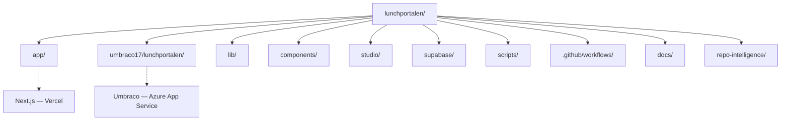
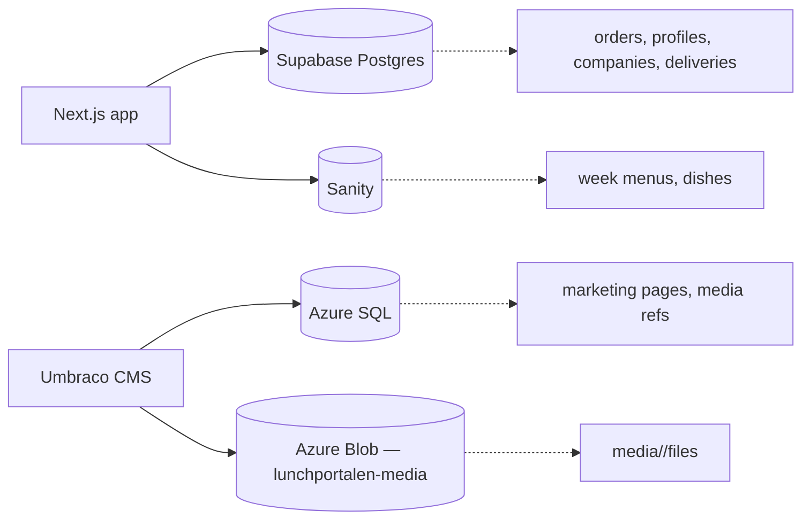
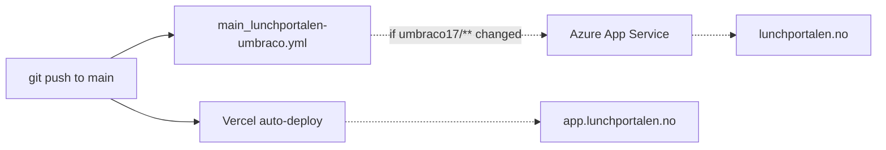

# Monorepo Architecture

**Status:** Canonical architecture reference (Sprint AB Fase F.2)  
**Audience:** Due diligence reviewers, new developers, future maintainers  
**Scope:** Repository layout, deploy targets, data stores, CI/CD — not product marketing

---

## Overview

Two systems coexist in this Git repository (`Lunchportalen/lunchportalen`). They deploy to separate targets and serve distinct surfaces:

| System | URL | Stack | Deploy target |
|--------|-----|-------|---------------|
| Marketing site | `lunchportalen.no` | Umbraco 17 (.NET 10) | Azure App Service + Azure SQL |
| Application | `app.lunchportalen.no` | Next.js App Router + Supabase + Sanity | Vercel |

This is a **logical monorepo** (one Git repository, multiple deployable systems). It is **not** an npm/pnpm workspace monorepo: there is a single root `package.json` for the Next.js application; the Umbraco project lives under `umbraco17/lunchportalen/` with its own `.csproj`.

Public marketing HTML in production is intended to be served from **Umbraco on Azure**. The Next.js app owns the operational product (login, week view, orders, admin roles, API routes, cron). See [PUBLIC_SITE_AND_APP_BOUNDARIES.md](./PUBLIC_SITE_AND_APP_BOUNDARIES.md) for public-vs-app routing detail.

---

## Repository layout



### Top-level directories

| Path | System | Purpose |
|------|--------|---------|
| `app/` | Next.js | App Router pages, layouts, `app/api/` routes |
| `umbraco17/lunchportalen/` | Umbraco | .NET 10 Umbraco 17 CMS project (`lunchportalen.csproj`) |
| `lib/` | Next.js | Domain logic, auth guards, Supabase clients, HTTP helpers |
| `components/` | Next.js | Shared React UI (includes canonical header primitives) |
| `studio/` | Next.js (Sanity) | Sanity Studio config and schema (`sanity.config.ts`) |
| `supabase/` | Next.js | Postgres migrations (`supabase/migrations/`), local config |
| `scripts/` | Both | CI, audit, scan, and maintenance scripts |
| `tests/`, `e2e/` | Next.js | Vitest and Playwright test suites |
| `.github/workflows/` | Both | 16 GitHub Actions workflows (see CI/CD below) |
| `docs/` | Both | Documentation hub |
| `repo-intelligence/` | Next.js | Generated JSON artifacts from `npm run repo:scan` |
| `cua/` | Neither (tooling) | Chrome policy merge utility (Python); CI via `policy-merge.yml` |

For historical detail on monorepo evolution and per-folder audit notes, see:

- [docs/audit/enterprise-v2-2026-05-25/02-monorepo-anatomi.md](../audit/enterprise-v2-2026-05-25/02-monorepo-anatomi.md)
- [docs/audit/05-top-level-directories.md](../audit/05-top-level-directories.md)

These audit records are **immutable** historical context; this document is the maintained canonical reference.

---

## Data architecture

Hard rule: **one source of truth per data domain**. Operational data, menu editorial data, and marketing content live in separate stores.



| Data domain | Store | Location in repo | Notes |
|-------------|-------|------------------|-------|
| Operational (orders, users, roles, agreements) | Supabase Postgres | `supabase/migrations/` (265+ SQL files), `lib/supabase/` | RLS-enforced; RPC-only writes for orders |
| Menu / week plans | Sanity | `studio/sanity.config.ts`, `studio/schemaTypes/` | Editorial workflow for lunch menus |
| Marketing content | Umbraco / Azure SQL | `umbraco17/lunchportalen/` (code only) | DB connection string **not in repo** — Azure App Service config `umbracoDbDSN` |

Data does not duplicate across these stores. Next.js may read Umbraco Delivery API for development or mapping; production public HTML is documented as Umbraco-hosted (see boundaries doc above).

### Umbraco media strategy (F.X.3 — canonical)

One source of truth per layer:

| Layer | Store | Notes |
|-------|-------|-------|
| **Media files** | Azure Blob (`lunchportalenmedia`, container `lunchportalen-media`) | Path: `media/<umbraco-hash>/<filename>`. Provider: `Umbraco.StorageProviders.AzureBlob` 17.0.0 |
| **Media references** | Azure SQL (Umbraco) | Content + media picker values; not duplicated in Git |
| **Application code** | Git (`umbraco17/lunchportalen/`) | Views, Program.cs, appsettings skeleton |
| **Secrets** | Azure App Service config | `UMBRACO__STORAGE__AZUREBLOB__MEDIA__CONNECTIONSTRING` (interim; Key Vault in F.X.4) |

Deploy artifact **must not** contain `wwwroot/media/` (V.25 gate). `clean:true` OneDeploy is safe because files live in Blob, not on App Service disk.

See [deploy-hardening.md](../operations/deploy-hardening.md) for incident history, OneDeploy verification, and rollback procedure.

---

## Deploy pipelines



### Next.js (Vercel)

| Item | Value |
|------|-------|
| Trigger | Git integration on push to `main` (no dedicated deploy workflow in `.github/workflows/`) |
| Config | `vercel.json` (cron schedules for `/api/cron/*`) |
| Production URL | `app.lunchportalen.no` |
| Preview | Vercel preview deployments for pull requests (project setting) |
| Path filter | None at GitHub level — Vercel receives repository pushes |

### Umbraco (Azure App Service)

| Item | Value |
|------|-------|
| Trigger | Push to `main` when paths under `umbraco17/lunchportalen/**` change; `workflow_dispatch` |
| Workflow | [.github/workflows/main_lunchportalen-umbraco.yml](../../.github/workflows/main_lunchportalen-umbraco.yml) |
| Target | Azure Web App `lunchportalen-umbraco` |
| Production URL | `https://lunchportalen.no` (`appsettings.Production.json`) |
| Database | Azure SQL — credentials in Azure App Service configuration, not committed |
| Media files | Azure Blob Storage (`lunchportalenmedia` / `lunchportalen-media`) — see [deploy-hardening.md](../operations/deploy-hardening.md) |
| Schema versioning | uSync activation planned (Sprint AB Fase F.4) |

---

## CI/CD

The repository contains **16** GitHub Actions workflows under `.github/workflows/`.

| Category | Workflows | Path-selective on PR/push? |
|----------|-----------|----------------------------|
| Next.js CI gates | `ci.yml`, `ci-agents.yml`, `ci-e2e.yml`, `ci-enterprise.yml` | **Yes** — explicit `paths:` include for Next.js / Supabase stack (Sprint AB F.3) |
| Database | `supabase-migrate.yml` | **Yes** — `supabase/**` + migration gate scripts |
| Umbraco deploy | `main_lunchportalen-umbraco.yml` | **Yes** — `umbraco17/lunchportalen/**` |
| Tooling | `policy-merge.yml` | **Yes** — `cua/**` only |
| Scheduled / dispatch | `security-audit`, `rls-drift-check`, `deps-weekly`, `codex-*`, `weekly-repo-intelligence-refresh`, `auto-engineer` | No — trigger on schedule or `workflow_dispatch` only |
| Chain / label | `postdeploy.yml`, `automerge-lowrisk.yml` | No — `postdeploy` follows `workflow_run` on `ci-agents`; `automerge` on PR label |

**DD note (F.3):** **7 of 16** workflows are path-selective on `pull_request` / `push` (`ci`, `ci-agents`, `ci-e2e`, `ci-enterprise` PR+push only, `supabase-migrate`, `main_lunchportalen-umbraco`, `policy-merge`). The remaining **9** are schedule/dispatch, label-gated, or `workflow_run`-chained — they do not run heavy Next.js CI on every unrelated PR.

**Docs-only PR trade-off:** Changes under `docs/**` alone do **not** match the Next.js CI path filters and therefore skip the five PR CI workflows. This reduces noise and CI minutes for documentation edits. Link integrity (`check:links`) is not enforced on docs-only PRs unless run manually or via scheduled refresh — acceptable trade-off documented in F.3 (mitigated by `weekly-repo-intelligence-refresh` and release gates on code paths).

**Sanity / studio:** Path filters include `studio/**` so Sanity schema and Studio config changes trigger Next.js CI (including `ci-agents` Sanity env guard).

**`ci-enterprise.yml` schedule:** Nightly cron (`0 3 * * *`) and `workflow_dispatch` remain **without** path filters — full release gate still runs on schedule.

Full workflow inventory: [.github/workflows/](../../.github/workflows/).

| Workflow file | Primary purpose |
|---------------|-----------------|
| `ci.yml` | Main CI gate (typecheck, lint, test, build) |
| `ci-agents.yml` | AGENTS.md policy gate |
| `ci-e2e.yml` | Playwright E2E |
| `ci-enterprise.yml` | Release gate (`ci:critical` sequence) |
| `supabase-migrate.yml` | DB migrations staging/prod |
| `main_lunchportalen-umbraco.yml` | Umbraco build + Azure deploy |
| `postdeploy.yml` | Post-merge production smoke |
| `security-audit.yml` | Scheduled npm audit |
| `rls-drift-check.yml` | RLS golden snapshot drift |
| `deps-weekly.yml` | Weekly dependency PR bot |
| `codex-design-system.yml` | Codex design patch bot |
| `codex-audit-autofix.yml` | Codex autofix bot |
| `auto-engineer.yml` | Autonomous audit pipeline |
| `weekly-repo-intelligence-refresh.yml` | Repo scan + auto-PR |
| `policy-merge.yml` | CUA Chrome policy merge (`cua/**`) |
| `automerge-lowrisk.yml` | Auto-merge labeled low-risk PRs |

---

## Cross-system concerns

| Concern | Behavior |
|---------|----------|
| **Authentication** | Next.js: Supabase Auth (session cookies). Umbraco: Umbraco Identity. No shared session. |
| **Public vs app traffic** | When `UMBRACO_PUBLIC_SITE_URL` is set, Next middleware redirects marketing paths to Umbraco public origin. See [PUBLIC_SITE_AND_APP_BOUNDARIES.md](./PUBLIC_SITE_AND_APP_BOUNDARIES.md). |
| **`/umbraco` in Next** | Rewritten to Umbraco CMS origin (`UMBRACO_CMS_ORIGIN` / Delivery API base); not the Next `/backoffice` shell. |
| **Shared repo tooling** | `scripts/audit/`, `npm run repo:scan`, and `weekly-repo-intelligence-refresh.yml` scan both Next.js and Umbraco paths for inventory artifacts. |
| **Third-party data flow** | No direct database replication between Supabase and Azure SQL. Integration is at HTTP/API and editorial process level, not shared DB. |

---

## Development workflow

### Next.js (application)

```bash
npm install
npm run dev          # http://localhost:3000
npm run test:run
npm run build:enterprise
```

Required env vars are documented in `.env.example` and `AGENTS.md`. Secrets are never committed.

### Umbraco (marketing CMS)

```bash
cd umbraco17/lunchportalen
dotnet restore
dotnet run           # local HTTPS (see launchSettings.json)
dotnet build
```

Local Umbraco requires Azure SQL or local SQL connection configured outside the repo (App Service `umbracoDbDSN` in production).

### Sanity Studio (menu editorial)

```bash
# From repo root — see package.json scripts and studio/README if present
npm run dev          # Next dev may proxy studio routes depending on config
```

Studio source: `studio/sanity.config.ts`.

---

## Related documentation

| Document | Purpose |
|----------|---------|
| [PUBLIC_SITE_AND_APP_BOUNDARIES.md](./PUBLIC_SITE_AND_APP_BOUNDARIES.md) | Public Umbraco vs Next app routing |
| [CONVENTIONS.md](../CONVENTIONS.md) | Documentation naming and hub structure |
| [governance/backoffice-policy.md](../governance/backoffice-policy.md) | Admin surface access (Next + Umbraco + cloud consoles) |
| [security/security-architecture.md](../security/security-architecture.md) | Security controls and tenant isolation |
| [enterprise/README.md](../enterprise/README.md) | Enterprise DD document pack entry point |
| [compliance/iso27001-alignment-matrix.md](../compliance/iso27001-alignment-matrix.md) | ISO 27001 alignment |
