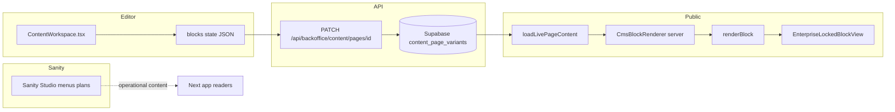

# CMS Audit Report

**Dato:** 2026-03-26  
**Scope:** Full teknisk gjennomgang av CMS-lag (Supabase-baserte sider + blokker + backoffice + rendering + Sanity-adjacent).  
**Analyserte filer:** **228** (se `CMS_FILE_INVENTORY.md`).

---

## 1. Executive summary

Løsningen er **ikke et sammenhengende CMS-produkt** i Umbraco-forstand. Den er en **tilstandstung Next.js-applikasjon** der markedsføringsinnhold lagres som **JSON-blokker i Postgres** (`content_page_variants.body`), mens **operasjonelt innhold** (meny, produktplan, ukeplan) lever i **Sanity** — med en **tredje, halvveis** spor i form av et enkelt Sanity `page`-dokument som **ikke** driver hovededitoren.

Blokkarkitekturen er **splittet i tre lag**: (1) «legacy» redaktørtyper (`hero`, `richText`, … i `editorBlockTypes.ts`), (2) et **enterprise AI-registry** med **snake_case**-nøkler og hundrevis av flate felt (`componentRegistry.ts`), **(3)** en **runtime** som mapper legacy → registry via `blockTypeMap.ts` (hundrevis av linjer med spesialtilpasning). **Én sann kilde finnes ikke**; kommentarer som «Align with registry» i `editorBlockTypes.ts` motstrider praksis: **feltnavn og typer divergerer** og må oversettes ved render.

**Rendering** går gjennom `renderBlock` → `resolveBlockForEnterpriseRender` → `EnterpriseLockedBlockBridge` → `EnterpriseLockedBlockView`, der **all semantikk** for 40+ typer er en **eksplisitt `switch`** i én fil. Det er **ikke** et modulært blokksystem med isolerte plugins; det er **en sentral if/switch-motor**.

**Preview** (`PreviewCanvas.tsx`) bruker samme `normalizeBlockForRender` + `renderBlock` som offentlig side, men **design settings** hentes med **client `fetch`** i `useEffect`, mens produksjonssiden bruker **server** `getDesignSettings` i `CmsBlockRenderer`. **Media** på offentlig side løses **async** (`resolveMediaInNormalizedBlocks`), mens klient-preview bruker **synkron** `syncResolvePublishedImagesInData` i `normalizeBlockForRender`. **Paritet er ikke identisk** — kodebasen har tester som *intenderer* paritet (`tests/cms/publicPreviewParity.test.ts`), men implementasjonen er **forkjellig per lag**.

**Redaktør-UI** er konsentrert i `ContentWorkspace.tsx` (**~9900 linjer**). Det er **ikke** en arkitektur; det er **akkumulert funksjonalitet** (AI, GTM, vekst, autonomi, utgivelser, outbox) i **én komponent**.

**Tilgang:** API for `content_pages` er **`superadmin`-låst** (`app/api/backoffice/content/pages/*/route.ts`). Dette er **ikke** et fler-tenant CMS for firmaredaktører; det er **plattforminternt** innholdsverktøy.

**Vurdering:** En **1/10** «CMS-modenhet» i redaksjonell forstand er **ikke urimelig** for *editoropplevelse og modellkonsekvens*, selv om enkeltkomponenter (versjonstabell, strikte headers på PATCH) viser **forsøk** på enterprise-disiplin. **Samlet** mangler det **domene** som Umbraco gir med dokumenttyper, konsistent editor, forutsigbar preview og tydelig utvidelse.

---

## 2. Scope og metode

**Analysert:**  
- `lib/cms/**` (full gjennomgang av kjerne- og blokkfiler)  
- `app/(backoffice)/backoffice/content/**` (struktur + alle filer; `ContentWorkspace.tsx` delvis gjennomlest pga størrelse; kritiske hooks og helpers fullt)  
- `components/cms/**`, `components/blocks/**` (kjerne + registry-mapper)  
- `lib/public/blocks/renderBlock.tsx`  
- `app/(public)/[slug]/page.tsx`  
- `app/api/backoffice/content/**`  
- `studio/schemaTypes/**`, `studio/sanity.config.ts`, `deskStructure.ts`  
- `tests/cms/**` (representative + paritetstester)  
- `lib/ai/pageBuilder.ts`, `normalizeCmsBlocks` (kobling til AI)  

**Ekskludert:** `node_modules`, `.next`, `dist`, genererte artefakter, `studio/**/node_modules/**`.

**Usikkerhet:** Full statisk analyse av alle `app/api/backoffice/ai/**` ruter (50+ filer) er **ikke** linje-for-linje; de er behandlet som **integrasjonslag** til editoren.

---

## 3. Arkitekturkart

**Dataflyt (høy nivå):**

1. **Redaktør** redigerer blokker i `ContentWorkspace` → serialiserer `body` med `blocks` array (flat eller `data`-innpakket avhengig av `normalizeBlock` / `deriveBodyForSave` i `contentWorkspace.blocks.ts`).
2. **PATCH** ` /api/backoffice/content/pages/[id]` skriver til `content_page_variants` (locale + environment: `staging`/`preview`/`prod` — se `CMS_DRAFT_ENVIRONMENT`).
3. **Publisering** promoterer preview → prod (egne ruter som `publish-home`, variant publish — ikke alle detaljer i denne rapporten).
4. **Offentlig** `loadLivePageContent` → `parseBody` → `CmsBlockRenderer` → `normalizeBlockForRender` → `resolveMediaInNormalizedBlocks` → `renderBlock`.
5. **Preview** i backoffice: `PreviewCanvas` → `normalizeBlockForRender` → `renderBlock` (uten async media-kjede identisk med server).

**Sanity** er **parallell** til markedsføringssider — ikke en del av samme `page`-pipeline.

---

## 4. End-to-end content lifecycle

| Steg | Hva skjer | Bevis |
|------|-----------|--------|
| Opprette side | POST `content_pages` via `app/api/backoffice/content/pages/route.ts` | `superadmin` |
| Redigere blokk | `createBlock` / `setBlockById` i `useContentWorkspaceBlocks.ts` | `blk_*` id via `makeBlockId` |
| Reordne | `dnd-kit` i `ContentWorkspace` + `onMoveBlock` / array reorder | `ContentWorkspace.tsx` imports |
| Lagre utkast | PATCH med `LP_CMS_CLIENT_HEADER` = `LP_CMS_CLIENT_CONTENT_WORKSPACE` | `route.ts` + `cmsClientHeaders.ts` |
| Preview | `PreviewCanvas` + `LivePreviewPanel` → `PublicPageRenderer` | `LivePreviewPanel.tsx` |
| Publisere | `status: published` + `published_at` + variant-promotion (se egne ruter) | `PATCH` i `pages/[id]/route.ts` |
| Frontend | `app/(public)/[slug]/page.tsx` + `CmsBlockRenderer` | |
| Media | `resolveMedia` / `resolveMediaInNormalizedBlocks` | `resolveBlockMediaDeep.ts` |
| Interne lenker | `InternalLinkPickerModal.tsx` (UI) | filnavn |

---

## 5. Block builder autopsy

### 5.1 Definisjon av blokker

**Tre kilder:**

1. **`CORE_CMS_BLOCK_DEFINITIONS`** i `lib/cms/blocks/registry.ts` — camelCase (`hero`, `richText`, …), brukt av `plugins/coreBlocks.ts`.
2. **`COMPONENT_REGISTRY`** i `lib/cms/blocks/componentRegistry.ts` — ~40 snake_case typer, **flettet feltliste** (flat `p1Name`, `step1Body`, …).
3. **Redaktør** — `editorBlockTypes.ts` union types som matcher (1), ikke (2).

**Konklusjon:** **Ingen enkelt kilde.** `assertRegistryKeysMatchCore()` synker `COMPONENT_REGISTRY` ↔ `CORE_COMPONENT_KEYS`, men **synker ikke** med `CORE_CMS_BLOCK_DEFINITIONS` eller `editorBlockTypes`.

### 5.2 Editor

- **Blokktyper i overlay:** `isAddModalBlockTypeFromOverlay` i `contentWorkspace.blocks.ts` — **begrenset sett** (hero, richText, …) — **ikke** alle 40 registry-typer.
- **Inspector:** `blockFieldSchemas.ts` + `SchemaDrivenBlockForm.tsx` / `BlockInspectorFields.tsx` — **parallell** feltdefinisjon til `COMPONENT_REGISTRY`.

### 5.3 Serialisering / persistens

- Body: `{ version: 1, blocks: [...] }` i `content_page_variants.body` (se `buildPayload` i `pages/[id]/route.ts`).
- **Ingen** migrasjonsversjon per blokk — kun `version: 1` på **body**-nivå.
- **Legacy mapping** (`blockTypeMap.ts`) **muterer** datakontrakt ved render (f.eks. `zigzag` → `zigzag_block` med `zigzagSteps` som **JSON-string**).

### 5.4 Rendering

- `renderBlock.tsx`: `resolveBlockForEnterpriseRender` → `isEnterpriseRegistryBlockType` → **null** hvis ukjent type etter mapping.
- `EnterpriseLockedBlockView` (**switch** på `type`) — **~900+ linjer** (filen er stor).

### 5.5 Preview

- **Samme** `renderBlock`, **ulik** media- og design-innlasting (se seksjon 6).

### 5.6 Utvidbarhet

- **Ny blokk** krever typisk: `registry.ts` (core), `componentRegistry.ts` (hvis AI), `EnterpriseLockedBlockView` + ev. ny komponent, `blockTypeMap` (hvis legacy), `blockFieldSchemas.ts`, ev. `EnterpriseLockedBlockBridge` — **ikke** ett registreringspunkt.

### 5.7 Validering

- `enforceBlockSafety` / `enforceBlockComponentSafety` — **mekanisk** (variant default, hero_bleed spesialtilfeller).
- **Ingen** omfattende schema-validering (f.eks. Zod) på hele `body` ved PATCH — **JSON** godtas som struktur så lenge `blocks` er array når `blocks` sendes top-level.

### 5.8 Testbarhet

- **Tester finnes** (`tests/cms/*`) — de **fanger** enkelte feil (paritet, reorder, fail-safe render), men **dekker ikke** alle 40 typer eller full editor-tilstand.

### 5.9 UX

- **Mange paneler** i én arbeidsflate (AI, GTM, vekst, …) → **kognitiv støy**, ikke «editor focus».
- **Preview-bredde** (`max-w-md` / `max-w-2xl` i `LivePreviewPanel.tsx`) vs **offentlig** `max-w-4xl` i `PreviewCanvas` / `[slug]/page.tsx`.

### 5.10 Root causes

1. **Historisk lag på lag:** legacy camelCase + enterprise registry + AI flat schema.
2. **Manglende domene-modell:** blokk er **ikke** et førsteklasses dokument med eget liv — **bare JSON**.
3. **Render sentralisert i switch** — skalerer **O(n)** i kompleksitet for hver ny type.

**Anti-pattern bekreftet i kode:**

- **Magic strings:** `type`-felt overalt.
- **Switch-spaghetti:** `EnterpriseLockedBlockView`.
- **Separate definisjoner:** `COMPONENT_REGISTRY` vs `CORE_CMS_BLOCK_DEFINITIONS` vs `editorBlockTypes`.
- **Mapping i `blockTypeMap.ts`:** 300+ linjer med spesialtilfeller.
- **Presenter/innhold:** `variant` i både layout og innhold; `enforceBlockComponentSafety` prøver å låse hero_bleed.

---

## 6. Editor UX og preview

**Content tree:** `ContentTree.tsx` / `EditorStructureTree.tsx` — **eksisterer**, men helhetsopplevelsen brytes av **sidepanel-overload** (mange `Editor*Panel.tsx`).

**Preview (`PreviewCanvas.tsx`):**

- `LayoutProvider` med `treatAsPublicSitePreview` — **riktig intensjon**.
- **Kritisk:** `useEffect` henter `/api/content/global/settings` og `/api/auth/me` — **forsinket** design + rolle; **FOUC/flash** i preview mulig.
- **Bredde:** `LivePreviewPanel` wrapper `max-w-md` / `max-w-2xl` — **smalere** enn publisert side (`max-w-4xl` i artikkel).
- **Iframe:** **ikke** brukt — preview er **samme app**, **samme CSS** — men **annen** data-fetch-kjede enn server-render.

**Konklusjon:** Preview er **best-effort**, **ikke** «WYSIWYG pålitelig» som Umbraco preview med deterministisk rendering.

---

## 7. Innholdsmodell og CMS-konsept

| Begrep | Hva det er i koden |
|--------|---------------------|
| **Side** | Rad i `content_pages` + variant-rad(er) i `content_page_variants`. |
| **Blokk** | JSON-objekt med `id`, `type`, (+ flate felter eller `data`). |
| **Dokumenttype** | `documentTypes.ts` / `documentTypeAlias` — **delvis** konvolutt (se `serializeBodyEnvelope` i `_stubs`). |
| **Sanity page** | `studio/schemaTypes/page.ts` — **Portable Text** — **ikke** primær builder. |

**Variants / locales:** `locale` + `environment` på variant — **ikke** full Umbraco language-variant med fallbacks.

**SEO:** `buildCmsPageMetadata` — **finnes** (`lib/cms/public/cmsPageMetadata.ts`).

**Versjonering:** `page_versions` + `pageVersionsRepo.ts` — **snapshot** (v1 schema).

**Rettigheter:** **Superadmin** for page API — **ingen** granularitet som «kun innhold på denne noden».

---

## 8. Sammenligning mot Umbraco (prinsipielt)

| Område | Umbraco | Lunchportalen (denne kodebasen) |
|--------|---------|----------------------------------|
| Dokumenttyper | Eksplisitte, én modell | **Splittet** (Sanity vs Supabase vs JSON) |
| Block list | Element types, gjenbruk, konsistent | **Flatte felt** + `switch` render |
| Editor | Én konsistent property editor | **Mange** overlappende definisjoner |
| Preview | Forutsigbar mot template | **Forskjellig** server/klient media/design |
| Validering | På modell + publish rules | **Delvis** (felt + enforce*) |
| Media | Førsteklasses | **cms:* / UUID / URL** — funksjonelt men **redaktørmessig teknisk** |

**Kan samme kvalitet oppnås uten å bytte plattform?** **Delvis** — men **ikke** uten å **erstatte** blokksystemets fundament (én modell, én renderer, én validering).

---

## 9. Toppfunn – rangerte problemer

| # | Tittel | Severity | Konsekvens | Root cause | Berørte filer |
|---|--------|----------|------------|------------|---------------|
| 1 | Trippel blokksannhet | Critical | Drift, bugs, feil felt | Legacy + registry + editor | `registry.ts`, `componentRegistry.ts`, `editorBlockTypes.ts`, `blockTypeMap.ts` |
| 2 | `ContentWorkspace.tsx` monolitt | Critical | Umulig å endre trygt | Akkumulering | `ContentWorkspace.tsx` |
| 3 | Preview ≠ prod datakjede | High | Feil ved publisering | Server async media vs client sync | `CmsBlockRenderer.tsx`, `normalizeBlockForRender.ts`, `PreviewCanvas.tsx` |
| 4 | `EnterpriseLockedBlockView` switch | High | Utvidelse koster | Ingen plugin-grenser | `EnterpriseLockedBlockView.tsx` |
| 5 | Superadmin-only CMS | High | Ikke «bedrifts-CMS» | Produktvalg | `app/api/backoffice/content/pages/*.ts` |
| 6 | Sanity `page` vs Supabase sider | Medium | Forvirring | To systemer | `studio/schemaTypes/page.ts` vs `content_pages` |
| 7 | Orphan `studio/schemas` | Medium | Vedlikeholdsrot | Ubrukt | `studio/schemas/` |
| 8 | Nested `studio/lunchportalen-studio` | Medium | Versjonsdrift | Duplikat | `studio/lunchportalen-studio/` |
| 9 | `zigzagSteps` som JSON-string | Medium | Skjør data | Mapping-adapter | `blockTypeMap.ts` |
| 10 | Manglende runtime schema på PATCH | Medium | Korrupt JSON mulig | Tillit til klient | `pages/[id]/route.ts` |
| 11 | Preview max-width mismatch | Medium | Feil tilit | UI-valg | `LivePreviewPanel.tsx`, `[slug]/page.tsx` |
| 12 | AI/vekst-paneler i editoren | Medium | Redaktør-overload | Scope creep | `Editor*Panel.tsx`, `ContentWorkspace.tsx` |
| 13 | `Editor2Shell` død | Low | Støy | Ubrukt kode | `_stubs.ts` |
| 14 | Plugin-system minimalt | Medium | «Phase 18» ikke realisert | Kun 2 plugins | `plugins/loadPlugins.ts` |
| 15 | `blockTypeMap` spesialtilfeller | High | Regresjoner | Manglende migrasjon | `blockTypeMap.ts` |

---

## 10. Scoring (0–10)

| Kriterium | Score | Begrunnelse |
|-----------|------:|-------------|
| Content modeling | 3 | JSON + flere konkurrerende modeller |
| Block architecture | 2 | Switch + triple registry |
| Editorial UX | 2 | Monolitt + panel-overload |
| Preview reliability | 4 | Samme renderBlock, ulik media/design |
| Save/publish lifecycle | 6 | Versjonering + audit forsøk |
| Validation/safety | 4 | Delvis enforce*, ingen full schema |
| Developer ergonomics | 3 | Mange filer for én endring |
| Maintainability | 2 | `ContentWorkspace` + `blockTypeMap` |
| Extensibility | 2 | Krever endring på mange steder |
| Testability | 5 | Bra testmappe, ikke full dekning |
| Rendering coherence | 4 | Mapping-lag skjuler inkonsistens |
| **Overall CMS maturity** | **3** | |

**Total:** **3/10** (vektet mot redaksjonell kvalitet og arkitektur).

---

## 11. Hva som gjør løsningen «1/10» (redaksjonell opplevelse)

1. **«Hvor er siden min?»** — Sanity-sider vs Supabase-sider vs global settings — **ikke** ett tre.
2. **«Hva er en blokk?»** — samme konsept har **tre navn** (legacy type, registry type, render type).
3. **Preview** ser **annerledes ut** (bredde, timing på design) enn produksjon.
4. **Redaktør** møter **AI/vekst/GTM** i samme skjerm som innhold — **ikke** fokus.
5. **Superadmin** — ikke en **organisasjons-CMS**-opplevelse.

---

## 12. Repair vs rebuild vs migrate

### A. Reparere dagens løsning

- **Fordeler:** Lav risiko på kort sikt.
- **Ulemper:** **Løser ikke** trippel-modell eller monolitt.
- **Risiko:** Høy for **regresjon** i `blockTypeMap.ts`.
- **Tidskost:** Lav per bugfix, **uendelig** kumulativ.
- **Må være sant:** Team aksepterer **permanent kompleksitet**.

### B. Re-arkitektere blokksystemet (behold Next + Supabase)

- **Fordeler:** **Én** blokkmodell, **én** validator, **én** renderer-plugin-kontrakt.
- **Ulemper:** **Stor** migrasjon av lagret JSON.
- **Risiko:** Medium — med **feature flags** og migreringsskript kontrollerbar.
- **Tidskost:** **Måneder** for seriøs kvalitet.
- **Må være sant:** Produktet **stopper** å legge nye features i `ContentWorkspace` under ombygging.

### C. Migrere til moden CMS (Sanity fokus, eller Umbraco/Contentful)

- **Fordeler:** **Editor** og **modell** ut av boksen.
- **Ulemper:** **Omskriving** av frontend-rendering, kostnad, opplæring.
- **Risiko:** Integrasjon mot **forretningslogikk** (priser, produktplan) må designes.
- **Tidskost:** Høy.
- **Må være sant:** **Én** klar plattform som **eier** markedsføringssider.

---

## 13. Endelig anbefaling

**Primær retning:** **B) Re-arkitektere blokksystemet** innenfor Next + Supabase **hvis** dere beholder egen stack — **kombinert** med **aggressiv oppdeling** av `ContentWorkspace` i moduler og **frys** av nye AI-flater til kjernen er stabil.

**Hvis** målet er **redaksjonell kvalitet på Umbraco-nivå** uten å betale teknisk gjeld i årevis: **vurder C** for **innholdssiden** (enten **utvide Sanity** til å eie sider + Portable Text/block content med preview, eller dedikert CMS).

**Ærlig konklusjon:** Dagens arkitektur **kan** levere sider, men **ikke** en **sammenhengende CMS-opplevelse** uten **fundamental** forenkling av blokksannhet og editor-scope.

---

## 14. Appendix

### 14.1 Ekstra tekniske observasjoner

- **`cms:check`** i `package.json` — indikerer at teamet **vet** om CMS-integritetsrisiko.
- **`LP_CMS_CLIENT_HEADER`** — **god** disiplin for å skille ContentWorkspace-klient fra annen PATCH-trafikk.

### 14.2 Usikkerheter

- Eksakt **publish-promotion** flyt mellom `preview`/`staging`/`prod` varianter — **ikke** sporet linje-for-linje i alle ruter.
- Full **AI-rute**-matrise mot lagring — **antatt** sideeffekter via `applyAIPatch` og API.

### 14.3 Svar på eksplisitte spørsmål (se leveransekrav §10)

1. **Kjernefeil:** **Manglende enhetlig innholdsmodell** — tre parallelle sannheter (legacy editor, enterprise registry, render switch).
2. **Fundamentalt feil modellert?** **Ja** — modellen er **adapter-basert**, ikke **domene-basert**.
3. **UI-hacks rundt innhold?** **Delvis** — mye **ekte** logikk, men **organisert** som **én fil** + **mapping**.
4. **Hvorfor ukoherent opplevelse?** **Monolitt + paneler + preview-bredde + trippel type-navngiving**.
5. **Svakere enn Umbraco?** **Ingen** dokumenttype-disiplin, **ingen** pålitelig preview-paritet, **ingen** redaktør-rolle per node.
6. **5 viktigste grep:** (1) Én blokkskjema-kilde, (2) Splitt `ContentWorkspace`, (3) Felles server pipeline for preview, (4) Erstatt switch med registry av komponenter, (5) JSON Schema/Zod på `body` ved lagring.
7. **Reddes uten nytt blokksystem?** **Nei** — ikke til **Umbraco-lignende** kvalitet; kun **inkrementell** forbedring.
8. **Kaste først:** `blockTypeMap` **logikk** (erstattes av migrerte data), **død** `studio/schemas` eller **wire** den inn, duplikat `lunchportalen-studio`.
9. **Knekker om 3–6 mnd:** Endringer i **`EnterpriseLockedBlockView`** + **`blockTypeMap`** uten migrering.
10. **Aldri videreføre:** **Én 9900-linjes** editor-komponent + **manuell** legacy-mapping som **permanent** løsning.

---

*Slutt på CMS Audit Report.*
