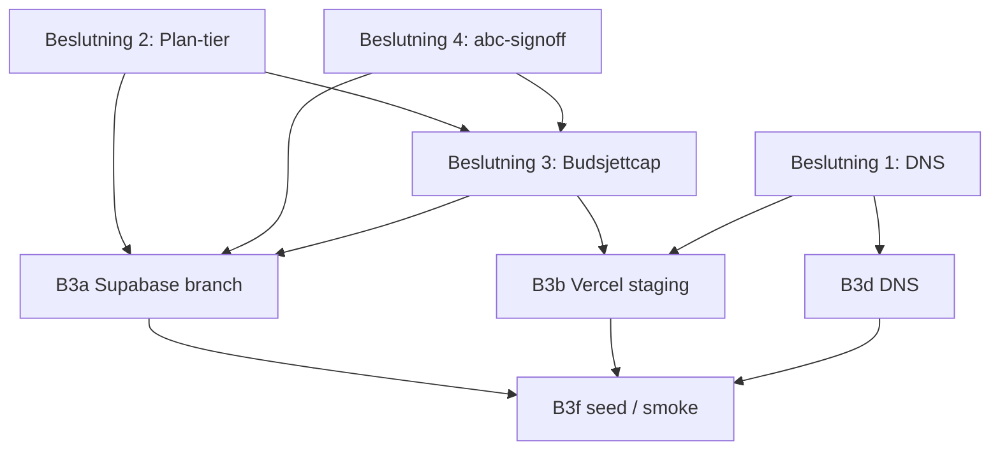

# B3 — Decision Framework for Staging Provisioning

**Opprettet:** 2026-05-19 · **Status:** Beslutninger **ÅPNE** — implementering **BLOKKERT**

**Relatert:** [docs/staging-strategy.md](../staging-strategy.md) (Rev A, retning avgjort) · [docs/performance-p-backlog.md](../performance-p-backlog.md) · [docs/environments.json](../environments.json) · [docs/environments-runtime.json](../environments-runtime.json)

**Valutakurs (felles referanse):** 1 USD = **9,3266 NOK** (Frankfurter/ECB, observasjon 2026-05-15 — jf. `meta.valutaReferanse` i environment-filene og staging-strategy).

---

## Bakgrunn

[staging-strategy.md](../staging-strategy.md) har allerede låst **arkitekturretning**: GDPR **variant C** (syntetisk staging-data), **én persistert** Supabase staging-branch, Vercel **strategi A** (production + `staging` + PR-preview), Sanity **`staging`**-datasett på prosjekt **`f3vuhd2f`**, mål-vert **`staging.app.lunchportalen.no`**, og indikativ kost **ca. kr 470–620/mnd** før hard cap. Det som **gjenstår** er fire **forretnings-/driftsvalg** som strategy.md eksplisitt ikke kan ta på brukerens vegne: hvem som eier DNS, faktisk Supabase-plan, godkjent budsjettcap med varslingsregler, og skjebne for den eksisterende inaktive preview-branchen `staging-abc-signoff`.

Uten disse fire svarene kan ikke B3a–B3f (og dermed B4a–B4d volum-seed) gjennomføres trygt: feil plan-tier blokkerer branching, feil branch-disposisjon gir GDPR- eller kostrisiko, manglende cap gir ingen økonomisk failsafe, og manglende DNS-eier stopper stabil URL for staging.

**Allerede besluttet i strategy.md (ikke gjenåpne her):** datavariant C, hostname `staging.app.lunchportalen.no`, Sanity dataset-navn/plan, Vercel deploy-modell, og kurs for NOK-estimater. **Ikke** dupliser disse som nye beslutninger — kun de fire åpne punktene under.

---

## STEG 1 — Kontekst fra eksisterende dokumenter

### Beslutning 1 — Subdomain og DNS

| Kilde | Hva som allerede er sagt |
|-------|---------------------------|
| [staging-strategy.md](../staging-strategy.md) | Hostname **`staging.app.lunchportalen.no`**; **CNAME → Vercel** (mål fra Vercel UI ved oppsett); Umbraco/`lunchportalen.no` **utenfor** scope (Azure egen prosess). |
| [architecture/PUBLIC_SITE_AND_APP_BOUNDARIES.md](../architecture/PUBLIC_SITE_AND_APP_BOUNDARIES.md) | Next-app på **`app.lunchportalen.no`** (Vercel); markedsføring på **`www.lunchportalen.no`** (Azure/Umbraco). |
| [environments-runtime.json](../environments-runtime.json) | `UrlOffentlig`-gruppe inkluderer `NEXT_PUBLIC_APP_URL` / `PUBLIC_APP_URL` — staging må peke konsistent etter DNS. |

**Blokkerer (repo/backlog):** **B3d** (DNS CNAME) · **B3b** (Vercel `staging` med korrekt `PUBLIC_APP_URL`) · **B3f** (smoke mot stabil URL).

**Åpent:** Hvem eier `lunchportalen.no` / `app.lunchportalen.no` nameservers og hvilken DNS-leverandør brukes.

---

### Beslutning 2 — Supabase plan-tier

| Kilde | Hva som allerede er sagt |
|-------|---------------------------|
| [staging-strategy.md](../staging-strategy.md) | **Plan-tier må bekreftes i dashboard**; anbefaling **Pro** ($25/mnd org-base) fremfor Team ($599/mnd) for staging-only; branching **$0,01344/time** per branch-compute; compute credits **gjelder ikke** branching compute. |
| MCP discovery (strategy) | Prod `hkpokyapzarefrgqzkos`, Postgres 17, branching tilgjengelig organisasjonelt — **ikke** maskinverifisert om org allerede er Pro. |

**Blokkerer:** **B3a** (provisjon/aktivering av persistert `staging`-branch) · **B3e** (staging `SUPABASE_*` URL/nøkler) · **B3f** · hele **B4**-kjeden.

**Åpent:** Faktisk plan i [Supabase billing](https://supabase.com/dashboard/project/hkpokyapzarefrgqzkos/settings/billing) — Free/Hobby vs Pro vs Team.

---

### Beslutning 3 — Budsjettcap

| Kilde | Hva som allerede er sagt |
|-------|---------------------------|
| [staging-strategy.md](../staging-strategy.md) | Indikativ **kr 470–620/mnd**; **forslag hard cap kr 800/mnd** — **krever endelig eier-OK**; Organization alerts for branching compute; TTL **72 t** for ad-hoc preview-branches; ukentlig branch-review. |
| [environments.json](../environments.json) / runtime | Ingen pengebeløp — kun valutareferanse for dokumentasjon. |

**Blokkerer:** **B3a** (compute-tier valg + alerts) · **B3b** (Vercel plan/spend notifications) · **B3e** (go-live for secrets uten økonomisk guard).

**Åpent:** Godkjenne cap, overskridelsesatferd, alert-mottakere.

---

### Beslutning 4 — `staging-abc-signoff`

| Kilde | Hva som allerede er sagt |
|-------|---------------------------|
| [staging-strategy.md](../staging-strategy.md) | Branch **`staging-abc-signoff`**, UUID `b426d8b0-6286-4a2b-850a-deb7c2ef6676`, `project_ref` **`iyrytpjacujscveivtfb`**, opprettet **2026-02-18**, `with_data: false`, status **INACTIVE**; migrasjonsdiff ikke verifisert (timeout); alternativer A/B/C — **ingen MCP-handling uten skriftlig eier-OK**. |
| Backlog P3.V | Én persistert `staging`-branch er mål — ikke automatisk lik gjenbruk av abc-signoff. |

**Blokkerer:** **B3a** (gjenbruk vs ny branch) · **Beslutning 3** (ekstra arkiv-branch kan øke compute/lagring).

**Åpent:** Dashboard-sjekk om noen Vercel preview/env fortsatt peker på `iyrytpjacujscveivtfb`; om data er synthetic vs ekte PII.

---

## Beslutning 1 — Subdomain og DNS

### Spesifikasjon

| Element | Verdi |
|---------|--------|
| Vert | `staging.app.lunchportalen.no` |
| Record | **CNAME** → Vercel-levert target (fra Vercel → Project → Domains; typisk `cname.vercel-dns.com` eller prosjektspesifikt) |
| TTL-anbefaling | **300 s (5 min)** under innføring/rollback; **3600 s (1 t)** når stabil |
| TLS | Håndteres av Vercel etter CNAME er validert |

### Forutsetninger (krever brukerens svar)

1. Hvem eier **`lunchportalen.no`** / **`app.lunchportalen.no`** nameservers (registrar vs IT-leverandør)?
2. Hvor administreres DNS i dag (**Cloudflare**, **Azure DNS**, **Domeneshop**, annet)?
3. Finnes det eksisterende **wildcard** eller **app.***-poster som begrenser subdomene-opprettelse?

### Alternativer

| ID | Alternativ | Pro | Con | Kost (NOK/mnd, indikativ) |
|----|------------|-----|-----|---------------------------|
| **A1** | Behold eksisterende DNS-provider; legg til subdomain | Lav friksjon; ingen migrasjon | Uten API: manuell oppdatering; langsommere iterasjon | **kr 0–50** (avhengig av eksisterende avtale) |
| **A2** | Migrer DNS til **Cloudflare** (gratis DNS-tier) | API, DDoS, analytics; rask iterasjon på records | Engangsmigrasjon; **24–48 t** propagering ved bytte av nameservers | **kr 0** (DNS gratis tier) |
| **A3** | **Azure DNS** (konsolidert med Umbraco/`www`) | Én sky-leverandør for offentlige domener | Per-zone kost; skill tydelig **marketing** vs **app**-subdomener | **ca. kr 5–50/zone** + operasjonell kompleksitet |

### Reversibilitet

| Handling | Reversibilitet |
|----------|----------------|
| Fjerne/endre CNAME for `staging.app` | **Trivielt** (minutter–timer avhengig av TTL) |
| Bytte DNS-provider (nameserver) | **24–48 t** propagering; planlegg vedlikeholdsvindu |

### Anbefaling-skjema (ikke automatisk valg)

- Hvis **ukjent DNS-eier**: **STOPP** — identifiser eier og tilgangsvei **før** A1/A2/A3.
- Hvis provider har **API + team-tilgang**: **A1** er ofte raskest.
- Hvis provider er registrar-låst uten API og hyppige endringer forventes: vurder **A2** (egen vurdering).

---

## Beslutning 2 — Supabase plan-tier

### Spesifikasjon

| Element | Krav |
|---------|------|
| Database branching (persistert preview) | **Pro** eller **Team** — ikke tilgjengelig på Free/Hobby for produksjonslignende branching-flyt |
| Staging-branch compute | Valg av tier (f.eks. **Micro** ~$0,01344/time) påvirker månedlig compute-linje |
| Prod-prosjekt | `hkpokyapzarefrgqzkos` (uendret — staging er **branch**, ikke nytt prod-prosjekt) |

### Forutsetninger

1. Åpne [Supabase billing for prod-prosjektet](https://supabase.com/dashboard/project/hkpokyapzarefrgqzkos/settings/billing).
2. Noter: **nåværende plan**, om **branching** er aktivert på org, og om det finnes **usage alerts**.

### Alternativer (etter dashboard-utfall)

| Utfall | Handling | Pro | Con | Kost (NOK/mnd @ 9,3266) |
|--------|----------|-----|-----|-------------------------|
| **Allerede Pro eller Team** | Ingen plan-endring; gå til branch-provisjon (Beslutning 4 først) | Umiddelbar vei | Team kan være overkill økonomisk | **Pro base: kr 233** · **Team base: kr 5 586** |
| **Free / Hobby** | **Må** oppgradere til **Pro** for målarkitektur | Branching + kostbarhet dokumentert | Betalingskort + org-governance | **+kr 233** (Pro) |
| **Vurdere Team** | Kun hvis dokumentert behov for compliance/support eller **mange** parallelle langvarige branches | SOC2/ISO-spor | **~24×** dyrere enn Pro for staging-only | **kr 5 586+** |

**Compute-linje (én persistert micro-branch, ca. 730 t/mnd):**

- USD: $0,01344 × 730 ≈ **$9,81/mnd**
- NOK: ≈ **kr 91–93/mnd** (ekskl. disk/egress)

### Kost-implikasjon (Pro + 1 staging-branch, indikativ)

| Post | USD | NOK |
|------|-----|-----|
| Pro org-base | $25 | **kr 233** |
| 1× persistert branch (micro, full måned) | ~$10 | **kr 92** |
| **Sum Supabase (min.)** | ~$35 | **~kr 325** |

### Reversibilitet

| Handling | Reversibilitet | Datatap |
|----------|----------------|---------|
| Plan **nedgradering** | Krever sletting/deaktivering av **ekstra branches** først | Lav for staging (variant C synthetic) |
| Slette staging-branch | Reversibelt ved ny provisjon; migrasjonshistorikk gjenopprettes fra `main` | Ingen prod-påvirkning |

---

## Beslutning 3 — Budsjettcap

### Spesifikasjon

| Element | Forslag i strategy.md |
|---------|----------------------|
| Hard cap | **kr 800/mnd** aggregert (Supabase + Vercel + Sanity + DNS/add-ons) |
| Indikativ faktisk (Rev A-tabell) | **kr 470–620/mnd** uten burst |
| Buffer til cap | **kr 224–330/mnd** (avhengig av faktisk Vercel-plan) |

### Månedlig kostsammensetning (NOK @ 9,3266)

| Komponent | Lav | Høy | Merknad |
|-----------|-----|-----|---------|
| Supabase Pro base | 233 | 233 | Fast org-linje |
| Supabase staging-branch compute | 92 | 120 | Avhenger av tier/timer |
| Vercel (`staging` + ev. Pro seat) | 0 | 187 | **0** på Hobby/inkludert; **~kr 187** med Pro $20 |
| Sanity `staging` dataset | 0 | 138 | **0** innen Free; Growth ~$15/sete |
| DNS | 0 | 50 | A1/A3 avhengig |
| **TOTAL** | **~326** | **~576** | Under foreslått **kr 800** cap |

### Beslutninger som inngår (bruker må svare)

1. Aksepterer du **kr 800/mnd** som hard cap?
2. Ved overskridelse: **auto-shutdown** (pause branch), **alert only**, eller **ignore**?
3. Hvem mottar **billing-alerts** (e-post/Slack) for Supabase org og Vercel team?

### Alternativer

| ID | Cap | Pro | Con | Typisk total (NOK/mnd) |
|----|-----|-----|-----|------------------------|
| **C1** | **kr 800** (forslag) | Buffer for Vercel Pro + liten burst | Krever faktisk overvåking | **326–576** normalt |
| **C2** | **kr 500** (streng) | Tvinger minimal compute + Vercel uten Pro seat | Mindre headroom; risiko for å stoppe B5-test | **~326–450** |
| **C3** | **kr 1 500** (løs) | Rom for flere previews / høyere compute | Svakere kostdisiplin | **opptil ~900+** ved misbruk |

### Reversibilitet

| Handling | Reversibilitet |
|----------|----------------|
| Endre cap-grense | Når som helst (dokumentasjon + alerts) |
| Plan-nedgradering etter overskridelse | Leverandørvarsel typisk **1–30 dager** |

**Avhengighet:** Realistisk cap krever **Beslutning 2** (faktisk plan) og **Beslutning 4** (antall branches).

---

## Beslutning 4 — Eksisterende `staging-abc-signoff`

### Spesifikasjon

| Felt | Verdi (fra strategy.md / MCP) |
|------|-------------------------------|
| Navn | `staging-abc-signoff` |
| Branch UUID | `b426d8b0-6286-4a2b-850a-deb7c2ef6676` |
| `project_ref` | `iyrytpjacujscveivtfb` |
| Opprettet | **2026-02-18** |
| `with_data` | **false** (siste kjente) |
| Status | **INACTIVE** |
| Kost | Avhenger av plan; inaktive branches kan fortsatt ha **lagring/compute**-linjer — verifiser i dashboard |

### Forutsetninger (bruker / dashboard)

1. Er `iyrytpjacujscveivtfb` referert i **noen** Vercel preview/staging env-variabler?
2. Inneholder branchen **ekte PII** eller kun tom/synthetic skjema? (Uten aktiv instans: **ikke maskinverifisert** i Rev A.)
3. Kreves **backup** før sletting (compliance/arkiv)?

### Alternativer

| ID | Alternativ | Pro | Con | Kost-implikasjon |
|----|------------|-----|-----|------------------|
| **D1** | **Gjenbruk** som offisiell `staging` | Beholder ev. migrasjons-historikk på branch | Navn forvirrende; hvis forurenset data → GDPR | **Én** branch-linje (~kr 92/mnd) |
| **D2** | **Dokumenter som arkiv**; opprett **ny** `staging` branch | Ren start; tydelig navn | To branches inntil arkiv slettes | **~kr 92–184/mnd** mens begge eksisterer |
| **D3** | **Slett** etter dokumentert sjekk | Lavest katalog-støy og kost | Ingen rollback til branch-innhold | **kr 0** for den branchen etter sletting |

### Anbefaling-skjema (ikke automatisk valg)

| Betingelse | Foreslått spor å vurdere |
|------------|--------------------------|
| Bekreftet **ekte PII** i branch | **D3** (+ GDPR-sletting dokumentert) |
| **Synthetic/tom** + **ubrukt** + ingen Vercel-peker | **D2** eller **D3** (eier velger risiko vs renhet) |
| **Aktivt i bruk** av preview/CI | **D1** med revisjon av navn og env |

**Hard policy (uendret):** Ingen MCP sletting/rename uten **skriftlig OK** etter valg.

### Reversibilitet

| ID | Reversibilitet |
|----|----------------|
| D1 | Re-aktivering mulig hvis branch ikke slettet |
| D2 | Arkiv kan slettes senere; ny branch kan resettes |
| D3 | **Irreversibelt** for branch-innhold — kun ny provisjon fra `main` |

---

## Beslutningenes avhengigheter

**Anbefalt rekkefølge for brukeren:**

1. **Beslutning 2** — verifiser dashboard (ingen forhåndsbeslutning nødvendig).
2. **Beslutning 4** — inspiser gammel branch og Vercel-pekere.
3. **Beslutning 3** — fastsett cap og alerts (med faktisk antall branches).
4. **Beslutning 1** — kan tas **parallelt** når som helst; blokkerer ikke Supabase-provisjon, men blokkerer stabil URL.

---

## Blokkerte faser etter beslutninger

> **Bokstavmerknad:** [staging-strategy.md](../staging-strategy.md) og [performance-p-backlog.md](../performance-p-backlog.md) bruker **B3a = Supabase**, **B3b = Vercel**, **B3c = Sanity**, **B3d = DNS**, **B3e = env-dokumentasjon**, **B3f = seed**. Tabellen under viser **hvilke åpne beslutninger** som gjenstår per fase.

| B3-fase (repo) | Innhold | Krever beslutning |
|----------------|---------|-------------------|
| **B3a** | Supabase staging-branch provisjon, migrasjonssync, budget alerts | **2**, **3**, **4** |
| **B3b** | Vercel `staging` git-branch + env mapping | **1**, **3** (+ B3a ferdig) |
| **B3c** | Sanity `staging` datasett (`f3vuhd2f`) | **(ingen)** — kan startes når tokens planlegges; skriv-isolasjon krever disiplin |
| **B3d** | DNS CNAME `staging.app.lunchportalen.no` | **1** |
| **B3e** | Env deploy-matrise (262 runtime-nøkler) | **1**, **2**, **3**, **4** (alle pekere må være riktige) |
| **B3f** | `scripts/seed-staging.ts` + initial smoke | **1**, **2**, **3**, **4** (alle) |

| Nedstrøms | Avhengig av B3 |
|-----------|----------------|
| **B4a–B4d** | Volum-seed, CLI, verifikasjon — **blokkert** til B3f + stabil staging |
| **B5** | k6/HTTP-last — **blokkert** til B4 + staging URL |
| **Rev B** | `EXPLAIN ANALYZE` på staging — **blokkert** til B4 |

**Estimat implementering etter alle fire beslutninger:** ca. **4–8 timer** fordelt på flere fag (infra, backend, CMS).

---

## Status

| Felt | Verdi |
|------|--------|
| Framework opprettet | **2026-05-19** |
| Beslutninger | **ÅPNE (4)** |
| Implementering B3a–B3f | **BLOKKERT** |
| Forretningsvalg i dette dokumentet | **Ingen tatt** — kun alternativer og forutsetninger |

**Neste steg for eier:** Fyll ut svar for beslutning 2 og 4 via dashboard; deretter 3 og 1; gi skriftlig OK før MCP/infra-handling.

---

## Referanser

- [docs/staging-strategy.md](../staging-strategy.md) — Rev A strategi (allerede besluttet retning)
- [docs/volume-seed-strategy.md](../volume-seed-strategy.md) — B4 avhengigheter
- [docs/environments.json](../environments.json) — 335 nøkler (full audit)
- [docs/environments-runtime.json](../environments-runtime.json) — 262 nøkler (deploy-subset)
- [Supabase pricing](https://supabase.com/docs/pricing)
