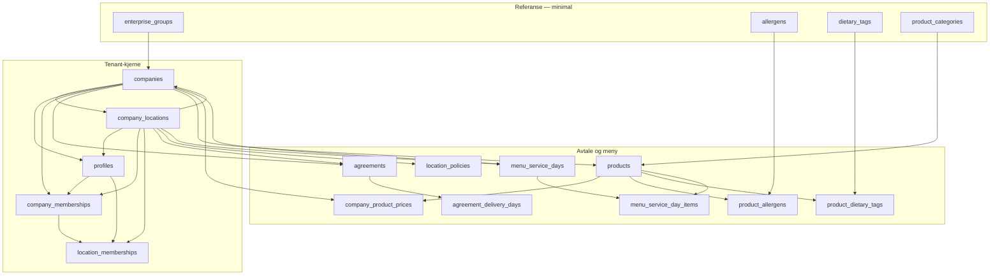

# B4 Volume-seed plan V1

| Felt | Verdi |
|------|-------|
| **Dato** | 2026-05-20 |
| **Status** | V1 (planning) — implementering i fremtidige sesjoner |
| **Audit-trail** | B4-PLAN-V1 · FASE B4-PLAN · agent-sesjon 2026-05-20 |
| **Blokkerer** | B5 last-test |
| **Target branch** | `uigxsboqeruxflgzqztl` (staging, `persistent: true`) |
| **Variant** | C strict — kun syntetisk data, ingen prod-lekkasje |

**Relaterte dokumenter:** [volume-seed-strategy.md](../volume-seed-strategy.md) (Rev A, generell strategi) · [b5-last-test-plan-v1.md](b5-last-test-plan-v1.md) · [staging-env-mapping-2026-05-20.md](staging-env-mapping-2026-05-20.md) · [hot-paths.md](../hot-paths.md)

> **Sannhetskilde:** Dette dokumentet er autoritativt for B4-implementering. Ved konflikt med eldre utkast (f.eks. B5-plan § auth som antok 2,5 M `auth.users`) vinner B4 V1 her.

---

## 1. Sammendrag

B4 fyller staging-branch `uigxsboqeruxflgzqztl` med syntetisk volum slik at B5 kan kjøre last-test mot realistisk skala uten GDPR-risiko.

| Dimensjon | Mål |
|-----------|-----|
| **Skala (full)** | 2,5 M brukere · 5 000 firma |
| **Strategi** | Trinnvis scale-up med HARDGATE mellom hver ramp |
| **Data** | Variant C strict — `@staging.lunchportalen.test` (RFC 2606 `.test` TLD) |
| **Realisme** | Norsk Faker.js (`nb_NO`), deterministisk seed |
| **Auth** | Hybrid: 10K–50K reelle `auth.users` + 2,4M+ offline JWT-cache |
| **Ordrer** | **SKIP** i B4 — B5 genererer ordrer under last |
| **Estimat** | 3–5 implementerings-sesjoner · ~6–10 timer aktiv kjøretid |

**Staging-tilstand etter B3a-REROLL (verifisert 2026-05-20):** `profiles` = 0 · `companies` = 0 · `auth.users` = 0. Schema fra prod-dump; data tom.

---

## 2. Kontekst

### 2.1 Hvorfor B4

B5 last-test-planen ([b5-last-test-plan-v1.md](b5-last-test-plan-v1.md)) designer for 10 % skala (2,5 M N, 5 K firma). Staging er tom etter B3a-REROLL (credential rotation + fresh schema dump). Uten B4 har B5 ingen meningsfull amplitude.

### 2.2 Hvorfor trinnvis (HARDGATE)

Billig validering først (10 K), deretter kontrollerte ramper (100 K → 1 M → 2,5 M). Hver ramp har:

- Eget kost-estimat og tidsestimat
- Egen HARDGATE-sjekkliste før neste ramp
- Mulighet for rollback via wipe-and-reseed uten å miste script-arkitektur

### 2.3 Hvorfor hybrid auth (JWT-cache)

2,5 M reelle `auth.users` via Supabase Admin API:

- Estimat 14–23 timer ved konservativ batching
- Rate-limit-risiko (30/s Free, ~100/s Pro)
- Auth connection pool (`auth_db_connections_absolute`) begrenser parallellitet

Løsning: 10K–50K reelle brukere for interaktiv QA + dashboard; resten får `profiles`-rad med deterministisk UUID og offline-signerte JWT for k6 `Authorization: Bearer`.

### 2.4 Hvorfor SKIP ordre-historikk

Ordrer under B5 simulerer faktisk last (INSERT/UPDATE på hot-path). Historisk seed i B4:

- Triggerer massivt `tg_audit_row()`-volum uten B5-verdi
- Kompliserer teardown og Variant C-audit
- Dupliserer det B5 skal måle

Minimal meny-/avtale-/produkt-seed beholdes slik at B5 kan legge ordrer mot gyldige FK.

---

## 3. Seed-arkitektur

### 3.1 Schema-analyse (staging `uigxsboqeruxflgzqztl`, read-only 2026-05-20)

#### Tabell-inventar (`public`, BASE TABLE)

| Kategori | Antall (ca.) | Merknad |
|----------|--------------|---------|
| **Totalt i `information_schema`** | 119 | Inkl. audit-partisjoner og migrasjons-stubs |
| **Audit-partisjoner** | 44 | `audit_log_y2026m05` … `audit_log_y2029m04` + `audit_log_y_default` |
| **Migrasjons-stubs** | 4 | `_migration_legacy_stub_*`, `_migration_orders_location_id_backup` |
| **Kjerne operative heap-tabeller** | ~71 | Ekskl. partisjoner/stubs |

**Verifiserte `relkind` på staging:**

| Objekt | `relkind` | Implikasjon |
|--------|-----------|-------------|
| `employee_order_items` | `v` (VIEW) | Seed skriver **ikke** hit — kun `order_items` (B5) |
| `audit_log` | `p` (partitioned) | Ikke manuell seed; triggers / B5-drift |
| `profiles`, `companies` | `r` (heap) | Primære B4-mål |

#### FK-avhengigheter (utdrag — seed-relevante)

`information_schema` returnerer duplikater ved composite FK; canonical rekkefølge below er validert mot [volume-seed-strategy.md](../volume-seed-strategy.md) og staging FK-liste.

**Sirkulær avhengighet (låst mønster):**

1. `INSERT companies` med `default_location_id = NULL`
2. `INSERT company_locations`
3. `UPDATE companies SET default_location_id = …`

#### Avhengighetsgraf (B4-kjerne, uten ordre-spor)



#### Topologisk seed-rekkefølge (B4 V1)

| Fase | Tabeller | B4.1 | B4.2 full | Notat |
|------|----------|------|-----------|-------|
| 0 | `auth.users` (Admin API, subset) | ✓ 10K real | ✓ 50K real max | JWT-only brukere **uten** auth-rad |
| 1 | `enterprise_groups` | valgfri | valgfri | Nullable på `companies` |
| 2 | `allergens`, `dietary_tags`, `product_categories` | minimal | minimal | Art. 9-null i snapshots |
| 3 | `companies` → `company_locations` → `UPDATE companies` | ✓ | ✓ | To-fase pga. sirkulær FK |
| 4 | `profiles` | ✓ | ✓ | Alle N brukere; `id` = auth UUID eller deterministisk UUID |
| 5 | `agreements`, `agreement_delivery_days` | ✓ | ✓ | Én aktiv avtale per firma (typisk) |
| 6 | `products`, `company_product_prices`, koblinger | ✓ | ✓ | Liten katalog per firma |
| 7 | `location_policies`, `menu_service_days`, `menu_service_day_items` | ✓ | ✓ | Align med Sanity staging der mulig |
| 8 | `company_memberships`, `location_memberships` | ✓ | ✓ | Skalerer med N |
| 9 | `platform_user_roles` | 1–3 test | 1–3 test | Superadmin QA only |

**SKIP i B4 (B5 eller senere):**

`orders`, `order_items`, `order_status_history`, `day_choices`, `standing_orders`, `invoice_*`, `billing_adjustments`, `delivery_*`, `driver_runs`, `kitchen_batches`, `deliveries`

**EXCLUDE (aldri manuell seed):**

`audit_log` (+ partisjoner), `audit_log_legacy`, `_migration_*`, `profile_scope_legacy_write_audit`, de fleste `ai_*`, CMS-lignende (`content_pages`, `marketing_pages`, …)

### 3.2 Norsk Faker.js-strategi

| Aspekt | Valg |
|--------|------|
| **Bibliotek** | `@faker-js/faker` med `nb_NO` locale |
| **Determinisme** | `faker.seed(fastNøkkel)` per ramp (B4.1=42, B4.2.1=43, …) |
| **Navn** | `faker.person.firstName()` / `lastName()` (norsk locale) |
| **E-post** | `{fornavn}.{etternavn}{N}@staging.lunchportalen.test` — suffix `N` = global bruker-indeks for unikhet |
| **Telefon** | Norsk format `+47 20 00 XX XX` (testprefiks, ikke gyldig MSISDN) — jf. [volume-seed-strategy.md](../volume-seed-strategy.md) |
| **Adresse** | Norske postnummer + syntetiske gatenavn; cluster Oslo / Trondheim / Bergen |
| **Art. 9** | `allergens_snapshot`, `dietary_tags_snapshot` = NULL i all seed (ingen helsedata) |

**Kollisjonshåndtering:** Deterministisk Faker + monoton `N` i e-post eliminerer duplikater. Verifiser med `SELECT email, count(*) … HAVING count(*) > 1` i B4.3.

### 3.3 Firma-størrelse-distribusjon

**Prod-referanse (pilot, ikke mål-skala):** snitt ~2 brukere/firma, p95 ~2,65.

**Staging justering:** p95 ~500 ansatte/firma for å matche MEDIUM-profil (5 K × 500 = 2,5 M).

| Ramp | Firma | Brukere/firma (snitt) | Totalt N | Formål |
|------|-------|----------------------|----------|--------|
| **B4.1 DRY-RUN** | 100 | ~100 | 10 000 | Realisme, RLS, sample-queries |
| **B4.2.1** | 1 000 | ~100 | 100 000 | Batch-performance |
| **B4.2.2** | 2 500 | ~400 | 1 000 000 | Skala-mønster |
| **B4.2.3** | 5 000 | ~500 | 2 500 000 | Full B5-target |

**Fordeling innen ramp:** Pareto/long-tail (få store firma, mange små) — deterministisk fra seed. Ikke uniform random.

---

## 4. Auth-arkitektur (Hybrid)

### 4.1 Reelle `auth.users` (10K–50K)

| Parameter | Verdi |
|-----------|-------|
| **API** | Supabase Admin API (`auth.admin.createUser`) |
| **Batch** | 100 brukere per request |
| **Rate limit** | Max 30/s (Free) eller ~100/s (Pro); exponential backoff + jitter på 429 |
| **Passord** | Deterministisk: `Staging${hash(email)}!2026` (kun staging, aldri prod-mønster) |
| **Estimat** | 10K ≈ 2–6 min · 50K ≈ 10–30 min |
| **Bruk** | Interaktiv testing, dashboard QA, manuell RLS-verifikasjon |

### 4.2 JWT-cache (2,4M+)

| Parameter | Verdi |
|-----------|-------|
| **Generering** | Offline med staging JWT-secret |
| **Secret-kilde** | Supabase MCP / project settings ved implementering — **aldri logget**, kun length/format-metadata i rapporter |
| **Bibliotek** | `jose` eller `jsonwebtoken` |
| **Payload** | Standard Supabase: `aud`, `role`, `sub`, `email`, `app_metadata`, `user_metadata` |
| **`sub`** | Matcher `profiles.id` (deterministisk UUID v5 fra e-post + seed) |
| **Lagring** | `scripts/seed/jwt-cache.jsonl` (én JSON per linje, **gitignored strict**) |
| **Exp** | Anbefalt 1 år for test (`exp` lang levetid) — ikke prod-praksis |
| **Estimat** | 2,5 M tokens ≈ 5 min offline CPU |
| **k6** | Les jsonl, tilfeldig token per VU, `Authorization: Bearer <token>` |

### 4.3 Mapping i `public.profiles`

| Brukertype | `profiles.id` | `auth.users` rad | RLS via `auth.uid()` |
|------------|---------------|------------------|----------------------|
| Real auth | = `auth.users.id` | Ja | Naturlig |
| JWT-only | Deterministisk UUID | Nei | JWT `sub` = `profiles.id` |

**RLS:** Policies som bruker `auth.uid()` fungerer for begge når JWT er signert med korrekt staging-secret og `sub` matcher profil.

**JWT-only brukere:** Ingen passord-login; kun API-last via Bearer. Real-auth subset kan logges inn i UI.

---

## 5. Batch-skjema

### 5.1 Database-batching

| Parameter | Startverdi | Eskalering |
|-----------|------------|------------|
| **INSERT batch** | 1 000 rader | 5 000 etter måling |
| **Transaksjon** | Én batch = én TX | Rollback ved FK-feil |
| **Metode** | Multi-row `INSERT` eller `COPY FROM STDIN` | COPY foretrukket for memberships |
| **Estimat 2,5 M profiler** | 2 500 batches × ~1 s ≈ 40 min (serial) | 5 workers ≈ 8 min |

### 5.2 Rate-limit håndtering

| Kanal | Limit | Strategi |
|-------|-------|----------|
| Postgres direct | Connection pool | Max 10–20 connections under seed |
| Auth Admin API | 30–100 req/s | Batch 100, backoff på 429 |
| PostgREST | Ikke brukt for bulk | — |

### 5.3 Connection management

```text
pg.Pool({
  max: 10–20,
  idleTimeoutMillis: 30_000,
  connectionTimeoutMillis: 10_000,
})
```

Connection string fra gitignored staging env (`POSTGRES_URL_NON_POOLING` for bulk, pooler for korte queries). Dokumenter valg i `scripts/seed/README.md` (F1).

---

## 6. Wipe-and-reseed script

Bygges fra dag 1 (F1) — ikke etterthought.

### 6.1 Reset-strategi

```sql
-- Pseudokode — faktisk whitelist i implementering
DELETE FROM auth.users WHERE email LIKE '%@staging.lunchportalen.test';

-- Deretter public whitelist TRUNCATE … CASCADE
-- (companies, profiles, memberships, agreements, products, menu_*, …)
-- ALDRI prod project_ref uten CONFIRM=staging+uigxsboqeruxflgzqztl

VACUUM ANALYZE;  -- valgfritt etter stor delete
```

| Parameter | Verdi |
|-----------|-------|
| **Estimat** | 2–5 min for full wipe |
| **Gate** | `--confirm=staging+uigxsboqeruxflgzqztl` + dry-run default |

### 6.2 Re-seed

Identisk Faker-seed ⇒ identisk dataset. Inkrement seed per ramp for variasjon mellom HARDGATE-kjøringer.

---

## 7. Sanity content-data

### 7.1 Hva staging trenger fra Sanity

| Innhold | Nødvendig for B5 |
|---------|------------------|
| Meny (uker/dager/retter) | Ja — `/week`, ordre-flow |
| Restaurant/leverandør | Ja — visning |
| Marketing | Nei for last-test kjerne |

### 7.2 Strategi

**Anbefaling:** Minimal Sanity-innhold i dataset `staging` (prosjekt `4udoq5d8`).

- Manuell seed via Sanity Studio (B3c ferdig)
- **Ikke** blokkerende for B4 Postgres-volum
- `menu_service_days` i DB bør være konsistent med CMS før B5 Test 1 (koordiner i B4.3)

Programmatisk Sanity-seed er mulig men utenfor B4 F1–F3 scope.

---

## 8. Implementeringsfaser

### F1: Script-arkitektur (1 sesjon)

```
scripts/seed/
  core/           # DB pool, batch runner, project_ref guard
  faker-norwegian/
  auth/           # Admin API batch create
  jwt-cache/      # offline signer + jsonl writer
  runner/         # CLI entrypoints
  wipe/           # teardown whitelist
```

- TypeScript strict mode
- Env: staging DB + service role (gitignored)
- Dependencies: `@faker-js/faker`, `pg`, `jose`
- «Hello seed»: 10 brukere + 1 firma mot staging

### F2: B4.1 DRY-RUN (1 sesjon)

- 100 firma + 10K brukere (subset real auth, rest JWT-cache pilot)
- Verifiser: realistisk data, RLS, sample-queries fra [hot-paths.md](../hot-paths.md)
- **HARDGATE** før B4.2 (sjekkliste §11)

### F3: B4.2 SCALE-UP (1–2 sesjoner)

| Del | Mål | HARDGATE |
|-----|-----|----------|
| B4.2.1 | 100K | Batch-tid, FK, ingen orphan |
| B4.2.2 | 1M | Pool, disk, membership-perf |
| B4.2.3 | 2,5M | Full count, JWT-cache komplett |

### F4: B4.3 VERIFY (1 sesjon)

- Sample-queries (hot-paths)
- Index-utnyttelse (`EXPLAIN` read-only)
- RLS under representative load (liten k6-røyk)
- DB-størrelse vs estimat
- Variant C audit: 0 rader uten `@staging.lunchportalen.test`
- **B5-readiness sign-off**

**Total estimat:** 3–5 sesjoner

---

## 9. Risiko og motvirkninger

| Risiko | Mitigation |
|--------|------------|
| 2,5M `auth.users` overskrider quota | JWT-cache for 2,4M+; max 50–100K reelle |
| Seed tar dager | Parallell batch + pool tuning; COPY der mulig |
| Variant C-violation | Strict `@staging.lunchportalen.test`; audit query i B4.3 |
| JWT-secret eksponering | HV-hardregler; secret aldri i repo/logg/chat |
| Schema-drift prod ↔ staging | Re-apply schema-dump ved avvik; verifiser `relkind` |
| Faker e-post-kollisjon | Monoton suffix `N` + deterministisk seed |
| RLS feiler på syntetisk data | B4.1 med 10 brukere først; real-auth subset for manuell QA |
| `tg_audit_row` under membership seed | Akseptabelt lavt uten ordre-seed; post-seed audit truncate valgfritt (jf. volume-seed-strategy) |
| B5-plan auth-drift | Oppdater B5 § auth ved F4 til hybrid-modell |

---

## 10. Estimat (tid + kost)

### 10.1 Tid (aktiv kjøretid, hypotese til B4b måler)

| Fase | Estimat |
|------|---------|
| B4.1 DRY-RUN | 1–2 timer |
| B4.2.1 100K | 10–20 min |
| B4.2.2 1M | 30–60 min |
| B4.2.3 2,5M | 1–3 timer |
| B4.3 VERIFY | 1–2 timer |
| **Sum aktiv** | **~6–10 timer** + 3–5 sesjoner planlegging/review |

### 10.2 Kost (hypotese, USD → NOK ref. 9,3266)

| Post | Estimat |
|------|---------|
| Staging branch compute | ~$0,01344/time ≈ $0,32/dag ≈ **$10/mnd** |
| DB storage etter 2,5M | 5–15 GB |
| Supabase Pro over 8 GB | ~$0,125/GB/mnd → **$1–5/mnd** ekstra |
| JWT-cache (lokal) | $0 |
| Faker CPU (lokal) | $0 |
| **Total staging (seed-fase)** | **~$10–15/mnd** |

---

## 11. Akseptanse-kriterier

### B4.1 SUCCESS

- [ ] 10 000 `profiles` queryable
- [ ] RLS OK for real-auth sample (company_admin + employee)
- [ ] Sample hot-path query < 500 ms (p95, staging compute)
- [ ] 0 e-poster uten `@staging.lunchportalen.test`

### B4.2.X SUCCESS

- [ ] Target count nådd (profiles, companies, memberships)
- [ ] Ingen FK-feil, ingen orphan rader
- [ ] Wipe-and-reseed verifisert én gang

### B4.3 SUCCESS / B5-readiness

- [ ] Full 2,5 M staging klar
- [ ] JWT-cache jsonl for ≥ 2,4 M brukere (lokal, gitignored)
- [ ] Minimal meny + avtale seed for ordre-flow
- [ ] Variant C: audit query grønn
- [ ] Sign-off dokumentert i denne filen (status → IMPLEMENTED)

---

## 12. Åpne spørsmål for implementering

| # | Spørsmål | Anbefaling (V1) |
|---|----------|-----------------|
| 1 | Fast vs. random Faker-seed per kjøring? | **Fast per ramp** (reproducible); `--seed` CLI-flagg |
| 2 | JWT-cache lagring? | **Lokal `scripts/seed/jwt-cache.jsonl`**; S3 kun hvis CI krever |
| 3 | Sanity seed sammen med B4? | **Separat** — manuell Studio; koordiner før B5 |
| 4 | Hvor kjøre seed? | **Lokal dev-maskin** med staging env; GitHub Action senere |
| 5 | Snapshot strategy? | **Wipe-and-reseed** default; branch snapshot kun ved behov |

---

## 13. Neste steg (F1 — ny sesjon)

1. Etabler `scripts/seed/`-mappe
2. Installer `@faker-js/faker`, `pg`, `jose`
3. Skriv «hello seed»: 10 brukere + 1 firma mot `uigxsboqeruxflgzqztl`
4. Valider connection pool + Admin API auth
5. Implementer wipe-skeleton med project_ref gate

---

## Appendix A — Staging FK-liste (seed-relevant, deduplisert)

| Child table | Column | Parent table | Parent column |
|-------------|--------|--------------|---------------|
| `agreement_delivery_days` | `agreement_id` | `agreements` | `id` |
| `agreement_requests` | `company_id` | `companies` | `id` |
| `agreements` | `company_id` | `companies` | `id` |
| `agreements` | `location_id` | `company_locations` | `id` |
| `billing_adjustments` | `company_id` | `companies` | `id` |
| `billing_adjustments` | `location_id` | `company_locations` | `id` |
| `billing_adjustments` | `invoice_run_id` | `invoice_runs` | `id` |
| `companies` | `default_location_id` | `company_locations` | `id` |
| `companies` | `enterprise_group_id` | `enterprise_groups` | `id` |
| `company_contracts` | `company_id` | `companies` | `id` |
| `company_invites` | `company_id` | `companies` | `id` |
| `company_locations` | `company_id` | `companies` | `id` |
| `company_memberships` | `company_id` | `companies` | `id` |
| `company_memberships` | `location_id` | `company_locations` | `id` |
| `company_memberships` | `user_id` | `profiles` | `id` |
| `company_product_prices` | `company_id` | `companies` | `id` |
| `company_product_prices` | `product_id` | `products` | `id` |
| `company_registrations` | `agreement_id` | `agreements` | `id` |
| `company_registrations` | `company_id` | `companies` | `id` |
| `day_choices` | `company_id` | `companies` | `id` |
| `day_choices` | `location_id` | `company_locations` | `id` |
| `location_memberships` | `company_id` | `company_locations` | `company_id` |
| `location_memberships` | `location_id` | `company_locations` | `id` |
| `location_memberships` | `user_id` | `profiles` | `id` |
| `location_policies` | `location_id` | `company_locations` | `id` |
| `menu_service_day_items` | `menu_service_day_id` | `menu_service_days` | `id` |
| `menu_service_day_items` | `product_id` | `products` | `id` |
| `menu_service_days` | `company_id` | `companies` | `id` |
| `menu_service_days` | `location_id` | `company_locations` | `id` |
| `order_items` | `order_id` | `orders` | `id` |
| `order_items` | `product_id` | `products` | `id` |
| `order_items` | `menu_service_day_item_id` | `menu_service_day_items` | `id` |
| `orders` | `company_id` | `companies` | `id` |
| `orders` | `location_id` | `company_locations` | `id` |
| `orders` | `agreement_id` | `agreements` | `id` |
| `orders` | `menu_service_day_id` | `menu_service_days` | `id` |
| `product_allergens` | `allergen_id` | `allergens` | `id` |
| `product_allergens` | `product_id` | `products` | `id` |
| `product_dietary_tags` | `dietary_tag_id` | `dietary_tags` | `id` |
| `product_dietary_tags` | `product_id` | `products` | `id` |
| `products` | `category_id` | `product_categories` | `id` |
| `products` | `company_id` | `companies` | `id` |
| `profiles` | `company_id` | `companies` | `id` |
| `profiles` | `location_id` | `company_locations` | `id` |
| `standing_orders` | `company_id` | `companies` | `id` |
| `standing_orders` | `location_id` | `company_locations` | `id` |
| `standing_orders` | `product_id` | `products` | `id` |

*(Full `information_schema`-dump: 130+ rader inkl. composite-duplikater — tilgjengelig via MCP replay ved behov.)*

---

## Appendix B — Row counts ved planlegging (2026-05-20)

| Tabell | Antall rader |
|--------|--------------|
| `public.profiles` | 0 |
| `public.companies` | 0 |
| `auth.users` | 0 |

**Konklusjon:** Staging er tom og klar for B4 seed etter HARDGATE godkjenning av denne planen.

---

*End of B4 Volume-seed plan V1.*
