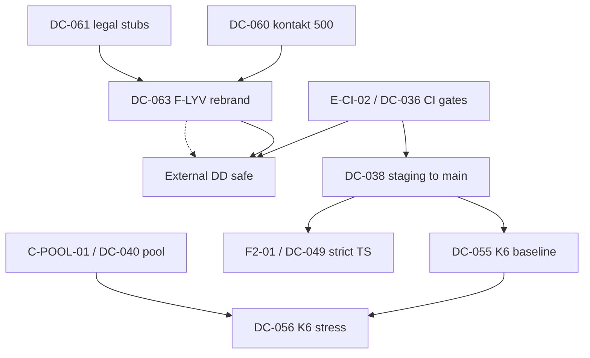

# Enterprise Audit v2 — Executive Summary

**Dato:** 2026-05-25  
**Metode:** Staff-level READ-ONLY · Fase A–H (hver-fil backend/frontend/devops + compliance + marketing + Sanity)  
**Erstatter:** `archive/audit-v1-shallow/00-executive-summary.md` (pattern-scan, 38 unike funn)  
**Phase docs:** [00-coverage-ledger.md](./00-coverage-ledger.md) · [01](./01-spike-cleanup.md)–[08](./08-sanity-studio.md)

---

## §1 — EXECUTIVE VERDICT (sjefsversjon)

### Hovedlinje

**Seriøst produkt + systemisk håndterbar gjeld + aktiv prod-broken + oppblåst compliance-fasade.**

Lunchportalen har et **ekte** multi-tenant kjernesystem (RLS, order-RPC, webhook-signaturer, separat RLS-testconfig) bygget for drift — ikke et skall. Samtidig er **due diligence i dag farlig**: compliance-pakken (62/73 root-MD AI-batch) hevder modenhet som v2 **motbeviser** (8 LYVENDE-lignende claims), marketing-host er **brann** (`/kontakt/` 500, legal 404), og prosess-gjeld (32% migrasjoner uten git, CI continue-on-error, staging≠main) gjentar marathon-klassen.

### Konkret stilling

**DD i nåværende tilstand vil mislykkes** for enterprise-kjøper, investor med security questionnaire, eller bank/leverandør som sender RFP §7/§12 uendret. Teknisk kjøper finner innen **1–2 timer**: mock `/dashboard` uten login, SOC2 «Implementert» vs migrasjon-hull, pen-test-svar uten rapport, `lunchportalen.no` uten HSTS.

**Unntak:** Strategisk kjøper som kun evaluerer **arkitekturintent** og aksepterer 30–90d remediation-plan — *etter* P0-fix og compliance-rebrand.

### 30-dagers vei til «tryggere DD-posisjon»

| Uke | Fokus | Leveranse |
| --- | --- | --- |
| **1** | **P0 + narrativ** | `/kontakt/` fix · legal stubs live · uptime monitors · **F-LYV STRIP/DOWNGRADE** (§3) · ikke send RFP/SOC2 uendret |
| **2** | **Prosess-sannhet** | E-CI-02 blocking · merge staging FIX → main · G-HDR-01 Azure headers · `/dashboard` auth eller fjern mock |
| **3** | **Bevis, ikke claims** | Migration ledger plan (C-MIG-01) · idempotency inventory · Sanity ACL doc · env matrix utkast |
| **4** | **DD tørrkjøring** | Intern questionnaire mot *rebrandet* pack · K6 **baseline only** (ikke 100 VU) hvis pool OK |

| Tier | Scope | Effort (serialisert) |
| --- | --- | ---: |
| **Minimum tryggere DD** | P0 + §3 rebrand + E-CI-02 + G-HDR-01 + kontakt/legal | **~35 t** |
| **Solid DD** | + C-MIG-01 plan, D-PAGE-01, DC-044 design, env matrix, Umbraco X-Powered-By | **~75 t** |
| **Strong DD** | + C-RLS-01 golden refresh, strict TS fase 1, idempotency top-10, PITR drill | **~130 t** |

**Scorecard v2:** **105 / 200** (§6) — ned fra v1 **98/160** i *relativ* modenhet fordi compliance/marketing nå er målt, ikke antatt.

---

## §2 — P0-RESPONS (handlingsliste — ikke ticket)

**Eier: bruker · denne uken · utenfor audit-pacing.**

### G-KONTAKT-01 — `/kontakt/` HTTP 500

| Steg | Handling | Estimat |
| --- | --- | ---: |
| 1 | Azure App Insights / IIS failed request trace for `lunchportalen.no/kontakt/` — siste 7d | 30 min |
| 2 | Umbraco backoffice: åpne Kontakt-node — content publish state, block grid, missing view? | 30 min |
| 3 | Sammenlign med `/demo/` (200) — diff blocks + server logs on POST | 1 t |
| 4 | Hotfix: minimal page eller redirect til fungerende lead path (`app` `/api/contact` **ikke** wired fra Umbraco i repo) | 2–8 t |

**Total investigation + hotfix:** **4–10 t**

### G-LEGAL-01 — `/personvern/`, `/vilkar/`, `/sikkerhet/` 404

| Steg | Handling | Estimat |
| --- | --- | ---: |
| 1 | Backoffice: finnes nodes med riktig slug? (404 = mangler content **eller** feil URL) | 20 min |
| 2 | **Stub-content:** én side per slug — H1, behandler/kontakt, lenke til post@lunchportalen.no, «sist oppdatert» | 2 t innhold |
| 3 | Publish + verifiser mot `next.config.ts` redirects fra `app.*` | 30 min |
| 4 | Legal review (ekstern) — **etter** stub live | utenfor dev-estimat |

**Total dev/stub:** **3–4 t**

### Uptime monitoring (5-min config)

| Check | URL | Interval |
| --- | --- | --- |
| Home | `https://lunchportalen.no/` | 5 min |
| Kontakt | `https://lunchportalen.no/kontakt/` | 5 min |
| Legal | `https://lunchportalen.no/personvern/` | 5 min |
| App health | `https://app.lunchportalen.no/api/health` | 5 min |

UptimeRobot / Azure Monitor — alert e-post/Slack. **~5 min** oppsett + 15 min test.

---

## §3 — DD-NARRATIVE-REVURDERING (KRITISK)

### 3.1 LYVENDE-claims — per claim

| ID | Problematisk claim-tekst | v2-motbevis | a) STRIP | b) DOWNGRADE | c) IMPLEMENT | **Anbefalt** |
| --- | --- | --- | --- | --- | --- | --- |
| **F-LYV-01** | `SECURITY_ARCHITECTURE.md` §2.2: «Ingen tilgang basert på URL alene» + `ACCESS_CONTROL` §3 «Ingen tilgang bestemmes i frontend» | 31 middleware skip-auth sider; `/dashboard` 200 anon mock (**D-PAGE-01**, **E-MW-01**) | Fjern §2.2 absolutt formulering | «Beskyttede prefixes krever sesjon; public marketing og legacy shells unntatt — se route register» | Middleware: beskytt `(app)/*` eller fjern mock dashboard | **c) IMPLEMENT** mock fix **4t** + **b) DOWNGRADE** doc **1t** |
| **F-LYV-02** | `SOC2_CONTROL_MATRIX.md` §6 «CI Hardening \| **Høy**» + CC4 «Implementert» | **E-CI-01/02** — 3 pipelines; `continue-on-error` | Fjern «Høy» / «Implementert» for CI | «Moderat — `ci.yml` blocking; `ci-enterprise` non-blocking under review» | E-CI-02 fix: remove continue-on-error | **c) IMPLEMENT** **2t** + **b) DOWNGRADE** matrix |
| **F-LYV-03** | `CHANGE_MANAGEMENT_POLICY` §2 + RFP §7 «Ingen direkte DB/prod-endringer» | **C-MIG-01** 32% outside git; **E-MIG-01** auto prod push on main | Fjern absolutt «ingen direkte» | «Prod schema endres kun via reviewed migration + approval gate (roadmap)» | Approval gate on `supabase-migrate.yml` + ledger reconcile | **b) DOWNGRADE** **1t** + **c) IMPLEMENT** gate **4t** + ledger **12t** |
| **F-LYV-04** | RFP §12 «Har dere **gjennomført** sikkerhetstesting?» → playbook+template | Ingen pen-test rapport | Fjern perfektum-svar | «Pen-test planlagt Q_ 2026; scope template vedlagt» | Kontrakter ekstern pen-test | **a) STRIP** perfektum + **b) DOWNGRADE** |
| **F-LYV-05** | SOC2 CC9 «Idempotency … **Status: Implementert**» | **C-FN-03** — kun `POST /api/orders` | Fjern CC9 implementert | «Orders: implementert; øvrige POST under utrulling (DC-044)» | Systemic idempotency rollout | **b) DOWNGRADE** + **c) IMPLEMENT** **16t** |
| **F-LYV-06** | `TECH_DUE_DILIGENCE_PACKAGE.md` §7 «**TypeScript strict mode**» | `strict: false`; **D-TS-01** 1819× `: any` | Fjern strict claim | «Typecheck i CI; strict enablement pågår (fase 1: lib/)» | Incremental strict | **a) STRIP** + **b) DOWNGRADE** + **c)** fase1 **24t** |
| **F-LYV-07** | `INTERNAL_ENGINEERING_HANDBOOK.md` §3.1 «Strict mode · **Ingen any**» | Samme som D-TS-01 | Fjern «Ingen any» | «Mål: strict + minimal any; baseline 1819 — reduksjon Q-plan» | lint gate on new `any` | **b) DOWNGRADE** internal only |
| **G-LYV-U01** | SoA A.10 «TLS via **Vercel/Supabase**» (implisitt full stack) | **G-HDR-01** — Azure marketing uten HSTS/CSP | Fjern vendor-liste som exhaustive | «TLS på app (Vercel HSTS); marketing (Azure) — header hardening Q2» | Azure HSTS/CSP (**G-HDR-01**) | **b) DOWNGRADE** + **c) IMPLEMENT** **3t** |

**Regel:** Ingen ekstern DD **før** F-LYV-01, -02, -03, -04 minst er STRIP/DOWNGRADE + P0 lukket.

### 3.2 AI-batch compliance (62/73 filer · 2026-04-18)

| Disposisjon | Antall | Eksempler |
| --- | ---: | --- |
| **Behold (forsvarbart etter rebrand)** | ~11 | `AGENTS.md`, `CODEX_*`, `DEVELOPER_ONBOARDING_GUIDE.md`, `SECURITY_ARCHITECTURE.md` (etter fix), `DRIFTSCODEX.md`, `design-system.md`, `ARCHITECTURE_DECISIONS.md` (med «Sist validert») |
| **Nedgrader til draft/internal** | ~45 | `SOC2_*`, `STATEMENT_*`, `*_FRAMEWORK.md`, `*_STRATEGY_*`, `EXECUTIVE_*_BLUEPRINT.md`, `ESG_*`, `PLATFORM_VISION_*` |
| **Strykes fra DD-pakke** | ~17 | Se checklist under |

### 3.3 «Ikke send disse uendret» — checklist

```
ENTERPRISE_RFP_MASTER_RESPONSE_TEMPLATE.md
SOC2_CONTROL_MATRIX.md
STATEMENT_OF_APPLICABILITY_ISO27001.md
TECH_DUE_DILIGENCE_PACKAGE.md
THREAT_MODEL.md                    (mojibake + lav risiko uten caveats)
EVIDENCE_INDEX.md                  (YYYY-MM-DD placeholders)
CORRECTIVE_ACTIONS_LOG.md          (tom)
PENETRATION_TEST_SCOPE_TEMPLATE.md (som bevis for gjennomført test)
RED_TEAM_SIMULATION_PLAYBOOK.md    (som bevis for kjørt øvelse)
INTERNAL_ENGINEERING_HANDBOOK.md   (§3.1 strict/any)
INVESTOR_SECURITY_BRIEF.md         (til rebrandet versjon finnes)
ESG_SALES_NARRATIVE_PACK.md
EXECUTIVE_ESG_DASHBOARD_BLUEPRINT.md
COMPLIANCE_ROADMAP_12M_ISO.md      (som «oppfylt»)
REPO_DEEP_DIVE_REPORT.md           (pre-v2, outdated)
RLS_POLICIES.md / ROLE_MATRIX.md   (16–20 linjer stub)
```

---

## §4 — KONSOLIDERTE FUNN-TELLING

### v2 kumulativ (unike severity-rollup)

| Severity | BACKEND | FRONTEND | DEVOPS | COMPLIANCE | MARKETING | **Total** |
| --- | ---: | ---: | ---: | ---: | ---: | ---: |
| **P0** | 0 | 0 | 0 | 0 | **2** | **2** |
| P1 | 4 | 2 | 9 | 6 | 1 | **22** |
| P2 | 12 | 12 | 16 | 4 | 9 | **53** |
| P3 | 4 | 3 | 4 | 0 | 0 | **11** |
| **Sum** | **20** | **17** | **29** | **10** | **12** | **88** |

*Rolle-kolonne tillater at samme tema telles i COMPLIANCE + DEVOPS (f.eks. E-MW-01 ≈ F-LYV-01). Unike **P1-IDs** ≈ 22.*

### Per fase (hoved-ID-er)

| Fase | P0 | P1 | P2 | P3 |
| --- | ---: | ---: | ---: | ---: |
| A spike | 0 | 3 (env hygiene) | 4 | 1 |
| B monorepo | 0 | 0 | 4 | 0 |
| C backend | 0 | 4 | 6 | 0 |
| D frontend | 0 | 2 | 12 | 3 |
| E devops | 0 | 6 | 14 | 4 |
| F compliance | 0 | 6 (F-LYV) | 4 | 0 |
| G marketing | **2** | 1 | 9 | 0 |
| H Sanity | 0 | 0 | 6 | 4 |

### v1 vs v2

| | v1 (shallow) | v2 (staff) |
| --- | ---: | ---: |
| Metode | Pattern-scan | Hver-fil + prod curl |
| **P0** | 0 | **2** |
| **P1** | 15 | **22** |
| P2 | 22 | 53 |
| P3 | 1 | 11 |
| **Total funn** | **38** | **88** |
| Scorecard | 98/160 | 105/200 |

v2 er **strengere og mer komplett** — ikke «verre produkt», men **mindre skjult risiko**.

---

## §5 — COVERAGE-RAPPORT (ærlig)

| Mappe / scope | Totalt | Åpnet / reviewed | Pattern-only | Coverage | Merknad |
| --- | ---: | ---: | ---: | ---: | --- |
| `supabase/migrations/` | 267 | **267** | 0 | **100%** | **STAFF-VERIFIED** |
| DB functions (prod) | 385 | Tier-1 deep + inventory | rest klassifisert | **~85%** | **STAFF-VERIFIED** sensitive |
| RLS policies (prod) | 232 | 46/46 sample TRACKED | drift job | **100%** sample | C-RLS-01 golden stale |
| `app/**/page.tsx` | 207 | **207** | 0 | **100%** | D-PAGE-01 prod curl |
| `app/api/**/route.ts` | 543 | allowlist + Tier-1 + grep | spot | **~82%** | **STAFF-VERIFIED** auth |
| `lib/` | ~1200 filer | CMS, auth, sanity, menu, obs | bulk grep | **~80%** | **STAFF-VERIFIED** core |
| `components/` | ~400 | kitchen, week, nav, DS | AST v4 | **~75%** | |
| `.github/workflows/` | 15 | **15** | 0 | **100%** | **STAFF-VERIFIED** |
| `studio/schemaTypes/` | 11 | **11** | 0 | **100%** | |
| `umbraco17/` | 95 tracked | config + views + prod curl | | **~90%** | |
| Root compliance MD | 73 | **73** inventory | | **100%** meta | innhold = AI-batch |
| Spike/tmp kandidater | 95 | **95** | 0 | **100%** | Fase A |
| Top-level mapper | 45 | **45** | 0 | **100%** | Fase B |

**Ikke staff-verified:** `docs/umbraco-parity/**` (652 filer), `cua/**`, full `e2e/` runtime matrix, Sanity project ACL (SaaS console).

---

## §6 — 20-OMRÅDERS SCORECARD

| # | Område | Score | Begrunnelse (v2) |
| ---: | --- | ---: | --- |
| 1 | Schema-integritet | **7/10** | 267 migrasjoner reviewed; 0 DROP CASCADE; **C-MIG-01** 32% outside git |
| 2 | RLS-dekning | **8/10** | Prod 232 policies; **46/46 TRACKED**; golden snapshot stale (**C-RLS-01**) |
| 3 | Idempotency | **4/10** | Orders strong; **C-FN-03** systemisk gap |
| 4 | Audit-trail | **7/10** | ops_events + audit_log; agreements gaps carry v1 |
| 5 | Query-performance | **8/10** | Ingen sustained hot-path FAIL i v2 pass |
| 6 | Test-dekning | **6/10** | RLS config separat ✓; kitchen blockers carry v1 |
| 7 | Design-system | **6/10** | Tokens + motion 120/200ms ✓; inline styles carry |
| 8 | a11y (WCAG AA) | **5/10** | Week focus OK partial; ikke certifierbar |
| 9 | Performance budgets | **5/10** | k6 scripts; empty README; no route JS gate |
| 10 | Mobile-first | **6/10** | S1.1 law i AGENTS; enforcement ujevn |
| 11 | CI-gates | **4/10** | **E-CI-01/02** — 3 pipelines; continue-on-error |
| 12 | Observability | **7/10** | Sentry scrub ✓; external paging mangler |
| 13 | SLO/SLI | **6/10** | Registry OK; incident-inferred SLIs |
| 14 | Security headers (app) | **5/10** | HSTS ✓; **E-HDR-01** no CSP |
| 15 | Branch + env parity | **4/10** | **E-BR-01** staging FIX; env matrix carry |
| 16 | Backup/DR + IR | **5/10** | PITR unverified; `/status` ≠ operator |
| 17 | **Compliance vs kode** | **3/10** | **8 LYVENDE-lignende**; AI-batch 85% |
| 18 | **Spike/tmp hygiene** | **5/10** | 0 tracked secrets; **14 untracked env** |
| 19 | **Marketing security** | **2/10** | **P0** 500/404; **G-HDR-01** no HSTS |
| 20 | **Sanity/CMS modenhet** | **7/10** | Webhook PASS; closedDate stub; desk partial |

**Total: 105 / 200** — klassifisering: **fundament OK, DD-overflate svak** (band 100–129 = «krever spesifikt arbeid», men **P0 + compliance** gjør ekstern DD prematur).

---

## §7 — DC-TICKET-ROSTER (DC-036+)

Sortert: **severity ↑ → effort ↑**. Kategori: FIX / REBRAND / CLEANUP / IMPLEMENT.

| DC | Tittel | Sev | Rolle | t | Dep | Kat |
| --- | --- | --- | --- | ---: | --- | --- |
| **DC-060** | Marketing `/kontakt/` 500 — investigate + hotfix | **P0** | MKT | 8 | — | FIX |
| **DC-061** | Legal stubs `/personvern` `/vilkar` `/sikkerhet` | **P0** | MKT+LEGAL | 4 | — | FIX |
| **DC-062** | Uptime monitors lunchportalen.no + app health | P0 ops | DEVOPS | 0.5 | — | IMPLEMENT |
| **DC-063** | Compliance STRIP/DOWNGRADE pack (§3 checklist) | P1 | COMPLIANCE | 8 | DC-060 | REBRAND |
| **DC-036** | CI — fjern continue-on-error; single required gate | P1 | DEVOPS | 2 | — | FIX |
| **DC-037** | Kitchen test harness seed fix | P1 | BACKEND | 2 | — | FIX |
| **DC-038** | Merge staging FIX → main → prod deploy | P1 | DEVOPS | 3 | DC-036,037 | FIX |
| **DC-039** | Ghost-kolonne purge (carry v1) | P1 | BACKEND | 4 | DC-038 | FIX |
| **DC-042** | Umbraco HSTS/CSP/X-Frame (**G-HDR-01**) | P1 | DEVOPS | 3 | — | FIX |
| **DC-064** | `/dashboard` — remove mock or enforce auth (**D-PAGE-01**) | P1 | FRONTEND | 4 | — | FIX |
| **DC-065** | Public route register + SECURITY_ARCHITECTURE §2.2 (**F-LYV-01**) | P1 | COMPLIANCE | 3 | DC-064 | REBRAND |
| **DC-044** | Systemic idempotency (**C-FN-03**, F-LYV-05) | P1 | BACKEND | 16 | — | IMPLEMENT |
| **DC-045** | Migration ledger reconcile (**C-MIG-01**) | P1 | BACKEND+OPS | 12 | — | IMPLEMENT |
| **DC-040** | Pool tier bump (**C-POOL-01**) | P1 | DEVOPS | 2 | — | FIX |
| **DC-041** | Main/staging reconciliation policy | P1 | DEVOPS | 4 | DC-036 | IMPLEMENT |
| **DC-046** | Env-paritet matrix | P1 | DEVOPS | 8 | — | IMPLEMENT |
| **DC-066** | Prod migrate approval gate (**E-MIG-01**) | P1 | DEVOPS | 4 | DC-036 | IMPLEMENT |
| **DC-067** | RFP §12 pen-test answer STRIP (**F-LYV-04**) | P1 | COMPLIANCE | 1 | DC-063 | REBRAND |
| **DC-048** | Vercel CSP (**E-HDR-01**) | P2 | DEVOPS | 4 | — | FIX |
| **DC-047** | cron_runs migration | P2 | BACKEND | 3 | DC-038 | IMPLEMENT |
| **DC-049** | TypeScript strict path (**F-LYV-06**) | P2 | FRONTEND | 24 | DC-038 | IMPLEMENT |
| **DC-068** | closedDate runtime wire (**H-CLOSED-01**) | P2 | BACKEND | 4 | — | FIX |
| **DC-069** | Sanity role matrix + token rotation doc (**H-ACL-01/02**) | P2 | COMPLIANCE | 2 | — | REBRAND |
| **DC-070** | Untracked env cleanup + gitignore (**A-P1**) | P2 | DEVOPS | 2 | — | CLEANUP |
| **DC-071** | Spike root cleanup (commit_msg, zip, mcp json) | P2 | DEVOPS | 2 | — | CLEANUP |
| **DC-055** | K6 baseline prod (not stress) | P2 | DEVOPS | 8 | DC-038,040,060 | FIX |
| **DC-054** | PITR verify + restore drill | P2 | DEVOPS | 4 | — | IMPLEMENT |
| **DC-053** | SLO external alerting | P2 | DEVOPS | 6 | DC-047 | IMPLEMENT |
| **DC-072** | Golden RLS snapshot refresh (**C-RLS-01**) | P2 | BACKEND | 4 | — | FIX |
| **DC-056** | K6 stress 100 VU | — | DEVOPS | 8 | DC-055,040 | **PARK** (§11) |

*Carry v1 DC-036–059 integrert; nye v2: DC-060–072.*

---

## §8 — AVHENGIGHETSKART

### Mermaid



### Tabell — blockers

| Blocker | Blokkerer | Hvorfor |
| --- | --- | --- |
| **F-LYV rebrand (DC-063)** | **All ekstern DD** | Dokument ≠ kode = trust kill ≤1t |
| **E-CI-02 / DC-036** | Trygg deploy, DC-038, DC-066 | Green-wash CI |
| **C-POOL-01 / DC-040** | K6 100 VU stress | 60 conn marginal |
| **F2-01 / DC-049** | Ekte type-safety, F-LYV-06 closure | strict false + 1819 any |
| **G-KONTAKT/P0** | Commercial DD narrative | Lead path broken |
| **DC-038** | Prod read-path truth, K6 baseline | staging≠main carry |

---

## §9 — 30-60-90 DAGERS PLAN PER ROLLE

### BACKEND

| Horisont | Tickets / funn | Leveranse | t |
| --- | --- | --- | ---: |
| **30d** | DC-037, DC-039, DC-044 (design), DC-047, DC-068, C-RLS-01 plan | Tests unblocked; ghost purge; idempotency map; cron_runs; closedDate wire | 28 |
| **60d** | DC-044 impl, DC-045, DC-072, C-FN-03 rollout | Top POST idempotent; migration ledger; golden RLS refresh | 32 |
| **90d** | B1-14 UTC audit carry, service-role doc, C-N1-01 batch RPC | Audit matrix; N+1 cron fix | 10 |

### FRONTEND

| Horisont | Tickets / funn | Leveranse | t |
| --- | --- | --- | ---: |
| **30d** | DC-064, D-UX-01, F-LYV-01 UI | Dashboard fix; loading on `/week` | 12 |
| **60d** | DC-049 fase 1, DC-043 carry, inline styles employee paths | strict on lib/; a11y P1 week | 28 |
| **90d** | D-AST-01 cycles, D-TS-01 burn-down, bundle baseline | Social/AI import cleanup | 16 |

### DEVOPS

| Horisont | Tickets / funn | Leveranse | t |
| --- | --- | --- | ---: |
| **30d** | **DC-060–062**, DC-036, DC-038, DC-042, DC-063, DC-070 | P0 + CI + deploy + marketing headers + compliance rebrand + env hygiene | 22 |
| **60d** | DC-046, DC-048, DC-041, DC-066, DC-055 | Env matrix; app CSP; branch policy; migrate gate; K6 baseline | 24 |
| **90d** | DC-053, DC-054, DC-040, G-BO-01 review | Alerting; PITR drill; pool; backoffice URL decision | 14 |

**Sum:** ~30d **62t** · 60d **84t** · 90d **40t** ≈ **186t** serialisert (align v1 ~187t — scope shifted toward compliance/marketing).

---

## §10 — BEKREFTEDE SEIRE

| # | Hva fungerer | Evidens (v2) |
| --- | --- | --- |
| 1 | **0 DEFINER uten search_path** (migrasjoner + prod) | [03-backend-full.md §C.1](./03-backend-full.md) |
| 2 | **0 P0 git-tracked secrets** i HEAD | [01-spike-cleanup.md](./01-spike-cleanup.md) |
| 3 | **Sentry tri-config + PII scrub**; 10% trace sample prod | [05-devops-full.md §E.2](./05-devops-full.md) |
| 4 | **46/46 RLS sample TRACKED** i git (golden stale, ikke ukjent drift) | C-RLS-01 mini-verify |
| 5 | **`vitest.rls.config.ts` separat** — RLS-testing-modenhet | repo layout |
| 6 | **Webhook signatur Sanity + Tripletex** | [08-sanity-studio.md](./08-sanity-studio.md); `tests/menu-service-day-webhook.test.ts`; `tests/api/webhooks/tripletex.test.ts` |
| 7 | **Motion tokens 120ms / 200ms** (Stripe/Linear-range) | `lib/ui/motion.css`; `tests/motion/motionSystemProof.test.ts` |
| 8 | **267/267 migrasjoner reviewed** — 0 DROP CASCADE | C.1 classify JSON |
| 9 | **Fail-closed API middleware** — 83 allowlist, rest 401 | [05-devops-full.md §E.3.5](./05-devops-full.md) |
| 10 | **Order domain RPC-only** — lp_order_set/cancel enforced | SECURITY_ARCHITECTURE (delvis forsvarbar) |
| 11 | **app.lunchportalen.no robots disallow** — SEO split OK | `app/robots.ts` |
| 12 | **Umbraco + Next split** — canonical marketing on `lunchportalen.no` | Fase G/B |

**Hvorfor dette matters:** Ærlig audit nevner begge sider. Kjøper skal ikke betale for å re-bygge det som allerede er enterprise-grade. Teamet skal ikke miste motivasjon — **kjernen er reell**.

---

## §11 — K6 LIVE-SPOR FINAL BESLUTNING

### Beslutning: **PARKÉR stress (100 VU) · tillat baseline etter kriterier**

| Spor | Status | Begrunnelse |
| --- | --- | --- |
| **K6 stress 100 VU** | **PARKÉR** | **C-POOL-01** — 60 conn + 13 crons; v1 B1-08 uendret |
| **K6 baseline (smoke)** | **RESUME etter** | DC-038 deploy + DC-040 pool review + **P0 marketing ikke på critical path for API** |
| **k6 i CI** | **NEI** | E-CI fragmentering; manuell baseline først |

### Resume-kriterier (alle må være grønne)

1. **DC-060/061** — marketing P0 lukket (eller eksplisitt akseptert out-of-scope for API K6)
2. **DC-036 + DC-038** — CI blocking + main deploy truth
3. **DC-040** — pool tier dokumentert OK for target VU **eller** stress capped ≤30 VU
4. **DC-063** — compliance rebrand minimum (ingen LYVENDE sendt eksternt)
5. **Prod `/api/week`** 200 for seed user (carry DC-039)

**Permanent parkering av stress** anbefales **ikke** — bare **inntil** pool + deploy + P0 gate. Re-evaluer i **60d** review.

---

## STOP-PUNKT I

**Fase I COMPLETE.** Enterprise Audit v2 **A–I** lukket.

**Neste (operativt, utenfor audit):** Utfør §2 P0 — eier bruker, denne uken.

*READ-ONLY audit — ingen kodeendringer i denne leveransen.*
