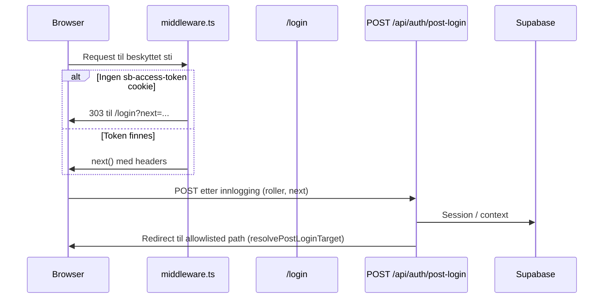
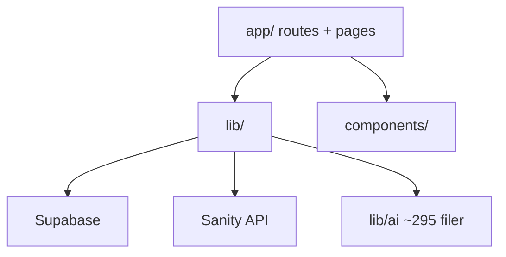

# SYSTEM_ARCHITECTURE_MAP

## 1. Hva systemet faktisk er

- **Runtime:** Next.js 15 App Router (`next@15.5.10`), React 19.
- **Primær data:** **Supabase (PostgreSQL)** med RLS og migreringer under `supabase/migrations/`.
- **Sekundær CMS-leverandør:** **Sanity** (`@sanity/client` i `lib/sanity/client.ts`) — brukes for lesing/skriving der konfigurasjon finnes; **separat** `studio/` for schema/seed.
- **Innhold i DB:** Sidetyper / varianter / globale innholdsrekker (f.eks. `global_content` med `jsonb`, se migrering `20260421000000_global_content.sql`).
- **Backoffice-editor:** React-komponenter under `app/(backoffice)/backoffice/content/` — **ikke** et frittstående headless CMS-studio som primær redaksjonell UI; det er **innebygd i Next-appen**.

## 2. Source of truth — faktisk

| Domene | Lagret | Merknad |
|--------|--------|---------|
| Bruker, roller, `company_id` | `profiles` + Supabase Auth | AGENTS.md: server-sannhet |
| Bestillinger, ukeplaner | Postgres-tabeller via API | |
| Marketing-/forsideinnhold (blokker) | `content_pages` / `content_page_variants` + relaterte tabeller (via `lib/cms/`) | JSON/blokker i DB |
| Globale header/footer/settings | `global_content` | `draft` vs `published`, `jsonb` |
| Eksperiment-/growth-tilstand | Flere tabeller + cookies (`lp_exp` i post-login) | **Delt sannhet** med klient |
| AI/autonomi/salg | **Massivt** `lib/ai/**`, egne logger (`ai_activity_log`, m.fl.) | Parallell "produktflate" |

**Kjerneproblem:** Det finnes **én** tydelig forretningskjerne (lunsj/ordre/tenant), men **flere parallelle plattformlag** (AI, growth, sales autonomy, revenue brain) som **konkurrerer om oppmerksomhet, kodeflate og drift** — dette er **arkitektonisk fragmentering**, ikke ren "feature richness".

## 3. Auth-flyt (forenklet)



**Bevis:** `middleware.ts` linjer 65–102 (cookie-sjekk, redirect til `/login`); `app/api/auth/post-login/route.ts` — `safeNextPath`, `allowNextForRole`, `landingForRole`.

**Merk:** Middleware gjør **ikke** rollelanding — kun cookie-presens for beskyttede ruter (matcher AGENTS.md E5 om post-login resolver).

## 4. Dataflyt — publisert innhold

```mermaid
flowchart LR
  subgraph Editor
    CW[ContentWorkspace.tsx]
    API[app/api/backoffice/content/**]
  end
  subgraph DB
    CP[content_pages]
    CV[content_page_variants]
    GC[global_content]
  end
  subgraph Public
    GCS[getContentBySlug / render]
    PAGE[/(public) pages]
  end
  CW --> API
  API --> CP
  API --> CV
  API --> GC
  CP --> GCS
  CV --> GCS
  GCS --> PAGE
```

**Parity-test:** `tests/cms/publicPreviewParity.test.ts` dokumenterer intensjon: samme pipeline; variant er miljø — **men** testfil bruker `// @ts-nocheck` (teknisk gjeld).

## 5. APIflate

- **314** `route.ts` under `app/api/**`.
- Kontraktsmessig mønster sentralisert i `lib/http/respond.ts` (`makeRid`, JSON-feilhåndtering).
- **Risiko:** Antall endepunkter **skalerer angrepsflate og review-kost** mer enn det skalerer forretningsverdi.

## 6. Avhengighetsdiagram (logisk)



## 7. Hvor source of truth *burde* ligge (måltilstand)

| Område | I dag | Bør |
|--------|-------|-----|
| Innholdsmodell | Spredt JSON + blokkkontrakter + editorlogikk | Én **eksplisitt** domene-API (types + validering + migrasjon) |
| Redaksjonell workflow | Blandet i stor React-komponent | **Workflow-tjeneste** (draft/publish/review) med tynne UI-controllere |
| AI-beslutninger | Mange moduler + logger | **Én** policy-lag med eksplisitte grenser og kill-switch |
| API | 300+ ruter | **Konsolidering**, versjonert eksternt API vs interne kommandoer |

## 8. Anomalier i filstruktur

| Funn | Beskrivelse |
|------|-------------|
| **Duplikat route-fil** | `superadmin/system/repairs/run/route.ts` (repo root) **og** `app/api/superadmin/system/repairs/run/route.ts`. Next.js App Router bruker `app/` — filen utenfor `app/` er **minst mistenkelig** (død kopi eller feilplassering). Begge eksporterer route handlers. **Kilde:** direkte fillesing. |

Dette bryter **single source of truth** for vedlikehold og kodegjennomgang.
