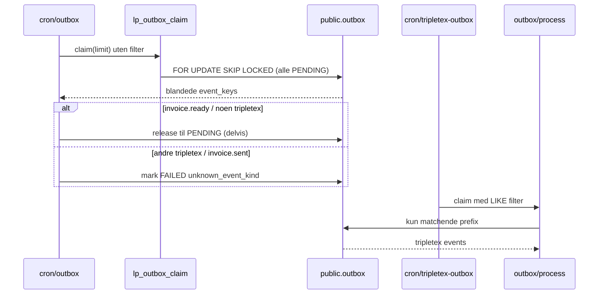
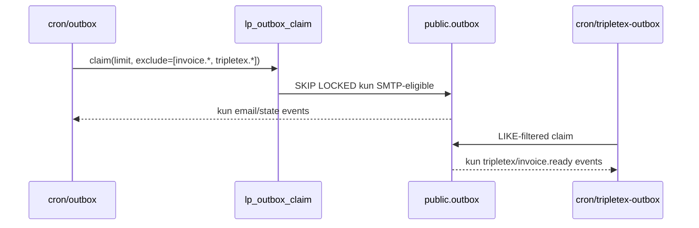

# K1 — Outbox Race Condition Fix

**Dato:** 2026-05-22  
**Status:** Lukket (implementert)  
**Relatert:** `docs/audit/repo-state-2026-05-22.md` §K1

---

## FASE A — Nåværende mekanikk (investigation)

### A1) Claim-mekanisme

| RPC / path | Brukes av | Filtrerer event_key? |
|------------|-----------|----------------------|
| `lp_outbox_claim(p_limit, p_worker)` | SMTP worker (`processOutboxBatch`) | **Nei** (før fix) |
| `lp_outbox_claim(p_limit, p_worker, p_exclude_prefixes)` | SMTP worker (etter fix) | **Ja** — skip excluded prefixes |
| Inline SELECT + UPDATE + `LIKE` | Tripletex worker (`/api/system/outbox/process`) | **Ja** — per batch pass |
| `outbox_claim_next(...)` | **Ubrukt** i app-kode (legacy i schema dump) | — |

Primær claim-RPC for SMTP: `public.lp_outbox_claim` — `FOR UPDATE SKIP LOCKED` på `status = 'PENDING'`, sortert `created_at ASC`.

Tripletex-worker claimer **ikke** via RPC; den leser PENDING-rader med `.like("event_key", pattern)` og oppdaterer atomisk med `.eq("status","PENDING").is("locked_at", null)`.

### A2) Workers

| Worker | Entry | Claim | Håndterer | Ukjent kind |
|--------|-------|-------|-----------|-------------|
| **SMTP** | `POST /api/cron/outbox` → `processOutboxBatch` | `lp_outbox_claim` | State noop (`order.set:`, `rollup.rebuild:`), SMTP email | `markOutboxFailed(..., unknown_event_kind:*)` |
| **Tripletex** | `POST /api/cron/tripletex-outbox` → `/api/system/outbox/process` | Prefix-filtered UPDATE | 7 Tripletex/invoice patterns (se matrise) | `UNSUPPORTED_EVENT` → FAILED_PERMANENT |
| **Superadmin manual** | `/api/superadmin/outbox/run` | SMTP path | Samme som SMTP | Samme |
| **Self-heal / autonomy** | `lib/selfheal`, `lib/autonomy` | SMTP path | Samme som SMTP | Samme |

**Workaround før fix:** SMTP release `invoice.ready:` og `tripletex.provider_customer_create_lp:` tilbake til PENDING uten attempt-burn. **Ikke** alle Tripletex-kinds — f.eks. `tripletex.company_customer_create_provider:` ble markert `unknown_event_kind`.

### A3) Event kinds × worker (matrise)

| event_key prefix | SMTP worker | Tripletex worker |
|------------------|-------------|------------------|
| `order.set:` | noop → SENT | — |
| `rollup.rebuild:` | noop → SENT | — |
| `company.approved:` etc. (email) | SMTP send | — |
| `invoice.ready:` | ~~release~~ → **skip claim** | process |
| `invoice.sent:` | ~~unknown~~ → **skip claim** | (ingen consumer ennå — K2-adjacent) |
| `invoice.reverse:` | ~~unknown~~ → **skip claim** | (K2 — handler mangler) |
| `tripletex.provider_customer_create_lp:` | ~~release~~ → **skip claim** | process |
| `tripletex.company_customer_create_provider:` | ~~unknown~~ → **skip claim** | process |
| `tripletex.saas_invoice_create_lp:` | ~~unknown~~ → **skip claim** | process |
| `tripletex.agreement_invoice_create_provider:` | ~~unknown~~ → **skip claim** | process |
| `tripletex.provider_product_sync:` | ~~unknown~~ → **skip claim** | process |
| `tripletex.onboarding_provisioning_start:` | ~~unknown~~ → **skip claim** | process |
| Ad-hoc med from/to/subject | SMTP send | — |
| Ukjent uten triplet | FAILED unknown_event_kind | — |

### A4) Race-bevis

**Kode-bevis:** `unknown_event_kind` logges i `lib/orderBackup/outbox.ts` når SMTP worker claimer en rad som ikke er state, ikke released Tripletex, og ikke email-routable.

**Design-bevis (ikke designvalg):**

1. Tripletex-worker filtrerer allerede på prefix — asymmetri beviser at delt kø uten filter er feil.
2. Delvis release-workaround (`releaseInvoiceReadyOutboxClaim`) dokumenterer at race var kjent.
3. `tripletex.company_customer_create_provider:` (prod-relevant B-2 flow) var **ikke** i release-listen → SMTP kunne spise events og brenne retry-budget.

**Staging audit-log:** Ingen direkte DB-tilgang til 30-dagers logg i denne sesjonen; risikoen er **deterministisk fra kode** — første prod Tripletex-event som ligger foran SMTP-batch kan feiles.

### A5) Claim-flyt (før fix)



---

## FASE B — Designvalg

### Workers count: 2 primære (+ manual/self-heal på SMTP path)

Under STOP-condition-grensen (5+ dedikerte workers). Claim-mekanisme enkel (én RPC + Tripletex inline).

### Valg: **OPTION 1 — event_kind-filter på claim**

**Implementasjon:** Utvid `lp_outbox_claim` med `p_exclude_prefixes text[]`. SMTP-worker sender:

```ts
["invoice.ready:", "invoice.reverse:", "invoice.sent:", "tripletex."]
```

**Begrunnelse:**

| Option | For | Mot | Valg |
|--------|-----|-----|------|
| 1 — prefix filter på claim | Minimal diff, backward-compatible (null = gammel oppførsel), Tripletex-worker uendret | Må vedlikeholde exclude-liste | **Valgt** |
| 2 — worker-spesifikke RPCs | Tydelig kontrakt | Duplisering av SKIP LOCKED-logikk | Avvist |
| 3 — topic-kolonne | Best langsiktig | Schema-migrering + backfill nå | Avvist (overkill for 2 workers) |

**Backward compatibility:** `rpcWithParamFallbacks` prøver 3-arg RPC først, faller tilbake til 2-arg hvis migrasjon ikke applied. Release-workaround beholdes som safety net.

**Audit-logging:** `claim_requested` / `claim_result` med worker + exclude_prefixes + event_keys (aldri payload).

---

## FASE C — Implementasjon

| Artefakt | Beskrivelse |
|----------|-------------|
| `lib/outbox/eventKinds.ts` | Single source of truth for prefixes |
| `supabase/migrations/20260522150000_k1_outbox_claim_event_kind_filter.sql` | `p_exclude_prefixes` på `lp_outbox_claim` + DOWN-kommentar |
| `lib/orderBackup/outbox.ts` | Sender exclude-prefixes; audit-log på claim |

---

## FASE D — Tester

Se `tests/outbox/k1-claim-race.test.ts` og oppdatert `tests/lib/orderBackup/outbox.test.ts`.

---

## FASE E — Verifikasjon

*(Oppdateres etter deploy med commit SHA og staging-smoke.)*

---

## Etter fix — claim-flyt



**Kontrakt:** `unknown_event_kind` fra SMTP-worker skal kun oppstå for genuinely ukjente keys — aldri for Tripletex/invoice pipeline keys.
