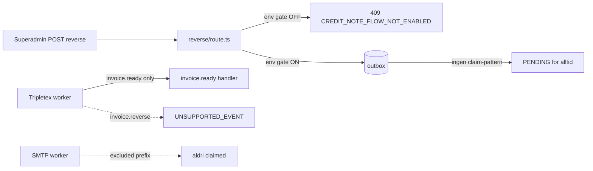

# K2 — invoice.reverse + invoice-route schema drift

**Audit date:** 2026-05-22  
**Status:** Lukket (OPTION B + schema-cleanup)  
**Related:** K4 follow-up (`8522bc52`), schema guard `tests/audit/schema-column-references.test.ts`

---

## A1 — invoice.reverse mekanikk

| Aspekt | Funn |
|--------|------|
| **Produsent** | `app/api/superadmin/invoices/reverse/route.ts` — eneste kilde |
| **Event key** | `invoice.reverse:{reference}` |
| **Outbox payload** | `{ event, reference, requestedAt, requestedBy }` |
| **Trigger** | `POST /api/superadmin/invoices/reverse?reference=…` (superadmin) |
| **Gate** | `TRIPLETEX_ENABLE_CREDIT_NOTE_FLOW=true` — default **av** |
| **Forutsetning** | Leser `invoice_lines.reference/locked/export_status` (kolonner finnes **ikke** på prod) |



---

## A2 — Manglende consumer

| Worker | invoice.reverse håndtert? |
|--------|---------------------------|
| `/api/system/outbox/process` | **Nei** — `handleEvent` default → `UNSUPPORTED_EVENT` |
| `OUTBOX_TRIPLETEX_EVENT_LIKE_PATTERNS` | **Nei** — kun `invoice.ready:%`, ikke `invoice.reverse:%` |
| `OUTBOX_SMTP_CLAIM_EXCLUDE_PREFIXES` | `invoice.reverse:` **ekskludert** fra SMTP (korrekt), men ingen annen worker claimer |
| `lib/workers/` | **Ingen treff** |
| `lib/outbox/handlers/` | **Ingen stub** |

**Konklusjon:** Spike med produsent + SMTP-exclude, uten implementert consumer. Med env gate av produseres **ingen** events i praksis.

---

## A3 — Outbox-historikk (prod MCP 2026-05-22)

```sql
SELECT event_key, status, COUNT(*) FROM outbox WHERE event_key LIKE 'invoice.reverse%';
-- → 0 rader

SELECT event_key, status, COUNT(*) FROM outbox WHERE event_key LIKE 'invoice.%';
-- → 0 rader
```

Ingen stuck `invoice.reverse`-events. Ingen historisk volum.

---

## A4 — Schema-drift per rute

Faktisk `invoice_lines` (prod): `id, run_id, company_id, quantity, tier, unit_price_nok, amount_nok, service_date, …`  
**Mangler:** `reference, month, locked, export_status, unit_price, amount, currency, export_last_error, tripletex_vat_code, product_tier, product_name`

| Rute | Tabeller | Drift-kolonner | Foreslått handling |
|------|----------|----------------|-------------------|
| `generate/route.ts` | `invoice_lines`, `outbox` | reference, month, unit_price, amount, locked, export_status, … | Erstatt med `lp_generate_agreement_invoices_for_period` RPC |
| `reconcile/route.ts` | `invoice_lines` | reference, month, export_status, locked | Run-basert select + `tripletex_invoices.status` |
| `exports/route.ts` | `invoice_lines`, `invoice_exports` | hele legacy select + `invoice_exports` (finnes ikke på prod) | Run/lines/tripletex_invoices for måned |
| `exports/retry/route.ts` | `invoice_lines`, `outbox` | reference, export_status, export_last_error | Line id + tripletex_invoices reset (ikke `invoice.ready`) |
| `reverse/route.ts` | `invoice_lines`, `outbox` | reference, locked, export_status + dead enqueue | OPTION B: fjern enqueue |

---

## A5 — Business-vurdering

| Alternativ | Vurdering |
|------------|-----------|
| **(a) Ferdig planlagt, mangler impl.** | Delvis — env-flag og route finnes, men ingen Tripletex kreditnota-API-kall |
| **(b) Spike forlatt** | **Mest sannsynlig** — 2 git commits, ingen UI, env-gated, feil schema |
| **(c) Juridisk krav nå** | Norsk B2B krever kreditnota ved korreksjon, **men** dette krever planlagt Tripletex-integrasjon — ikke denne halvferdige outbox-nøkkelen |
| **(d) Fyrer for sikkerhets skyld** | Nei — gate blokkerer; 0 events i prod |

**STOP-condition (A7):** **Ikke truffet** — 0 stuck events, ingen bevis for at eksisterende pipeline tilfredsstiller lovkrav, aktiv fakturering går via `lp_generate_agreement_invoices_for_period` / `invoice_runs` / `tripletex.agreement_invoice_create_provider`.

**Anbefaling:** **OPTION B** — stopp produsering permanent. Kreditnota er fremtidig feature med egen plan (Tripletex API + korrekt schema).

---

## B — Beslutninger (2026-05-22)

| Område | Valg | Begrunnelse |
|--------|------|-------------|
| invoice.reverse | **OPTION B** | 0 events, ingen consumer, feil schema, env-gated spike |
| generate | **RPC-align** | `lp_generate_agreement_invoices_for_period` er prod-sannhet |
| reconcile | **STRATEGI A** | Run-basert lines + tripletex_invoices (aktiv UI) |
| exports + retry | **STRATEGI A** | Run-basert listing; retry via tripletex_invoices |
| reverse select | **STRATEGI A** | `id, run_id, company_id, quantity` — enqueue fjernet |

---

## C — Implementasjon (referanse)

Se commits:

- `fix(k2): invoice.reverse — stop dead outbox pipeline (OPTION B)`
- `fix(k2): schema-cleanup generate|reconcile|exports|retry|reverse`
- `fix(k2): lukket — invoice.reverse + schema-cleanup`

Regression-vakt utvidet: `tests/audit/schema-column-references.test.ts` scoped filer inkl. generate/reconcile/exports/reverse.
