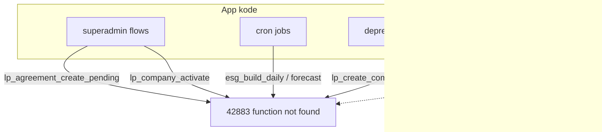

# K4 — Broken RPC References

**Dato:** 2026-05-22  
**Status:** **LUKKET 2026-05-22**  
**Relatert:** `docs/audit/repo-state-2026-05-22.md` §19

---

## Executive summary

| Metrikk | Verdi |
|---------|-------|
| Unike RPC-navn i `app/` + `lib/` | **56** (ekskl. false positive) |
| Finnes på prod | **36** |
| **BROKEN på prod** (i kode, ikke i DB) | **20** |
| Staging vs prod drift (RPC-sett) | **Ingen** — samme 20 mangler på begge |
| STOP-condition | **TREFF** — count > 15 **og** hot-path-treff |

**Konklusjon:** Dette er primært **migrasjons-drift** (RPC finnes i repo-migrasjoner, ikke applied på prod) kombinert med **aldri-implementerte RPC-er** (ESG, forecast, export). K4 kan ikke lukkes med én liten diff — krever prioritert multi-wave plan.

---

## FASE A1 — Enumerering (kode)

Generator: `node scripts/audit/extract-code-rpc-refs.mjs` → `scripts/audit/k4-code-rpc-refs.json`

Scope: `app/` + `lib/` (ekskl. `tests/`, `scripts/`)

---

## FASE A2 — DB-sannhet (2026-05-22)

**Staging:** `uigxsboqeruxflgzqztl`  
**Prod:** `hkpokyapzarefrgqzkos`

Query: `SELECT proname FROM pg_proc WHERE pronamespace = 'public'::regnamespace AND proname LIKE 'lp_%'`

Staging og prod har **identisk** `lp_*`-sett (61 funksjoner). Ingen staging-only/prod-only drift innen `lp_*`.

---

## FASE A3 — Diff-tabell (app/lib RPCs)

| RPC | i kode | staging | prod | status |
|-----|--------|---------|------|--------|
| assert_company_not_on_hold | ja | nei | nei | **BROKEN** — dead helper, ingen imports |
| claim_ai_jobs | ja | nei | nei | **BROKEN** — migrasjon finnes (`20260315000000_ai_jobs_retries.sql`) |
| claim_repair_jobs | ja | ja | ja | OK |
| esg_build_daily | ja | nei | nei | **BROKEN** — ingen migrasjon i repo |
| esg_build_monthly | ja | nei | nei | **BROKEN** |
| esg_build_yearly | ja | nei | nei | **BROKEN** |
| esg_lock_monthly | ja | nei | nei | **BROKEN** |
| esg_lock_yearly | ja | nei | nei | **BROKEN** |
| get_kitchen_orders | ja | nei | nei | **BROKEN** — kun `app/admin/kitchen-test` |
| lp_agreement_approve_active | ja | ja | ja | OK |
| lp_agreement_create_pending | ja | nei | nei | **BROKEN + HOT PATH** |
| lp_agreement_pause_ledger_active | ja | nei | nei | **BROKEN** — migrasjon finnes |
| lp_agreement_reject_pending | ja | ja | ja | OK |
| lp_apply_tripletex_paid_status | ja | ja | ja | OK |
| lp_company_activate | ja | nei | nei | **BROKEN + HOT PATH** |
| lp_company_order_summary | ja | ja | ja | OK |
| lp_company_register | ja | ja | ja | OK |
| lp_company_registration_* | ja | ja | ja | OK |
| lp_create_company_with_location | ja | nei | nei | **BROKEN** — deprecated route |
| lp_generate_forecast_range | ja | nei | nei | **BROKEN** — Vercel cron daglig |
| lp_generate_signals_for_date | ja | nei | nei | **BROKEN** — Vercel cron ukedager |
| lp_generate_saas_invoices_for_period | ja | ja | ja | OK |
| lp_idem_* | ja | ja | ja | OK |
| lp_insert_page_version | ja | nei | nei | **BROKEN** — migrasjon finnes |
| lp_membership_get | ja | nei | nei | **DEGRADED OK** — fallback til `profiles` |
| lp_order_* | ja | ja | ja | OK |
| lp_outbox_* | ja | ja | ja | OK (inkl. 3-arg claim etter K1) |
| lp_pgrst_reload_schema | ja | nei | nei | **DEGRADED OK** — valgfri reload, warn-only |
| lp_provider_* (listed) | ja | ja | ja | OK |
| lp_run_daily_agreement_billing | ja | ja | ja | OK |
| lp_service_area_* | ja | ja | ja | OK |
| superadmin_assign_profile_to_company | ja | nei | nei | **BROKEN** |
| superadmin_set_user_scope | ja | nei | nei | **BROKEN** |
| tripletex_export_by_run | ja | nei | nei | **BROKEN** — superadmin invoice export |

**BROKEN count (prod): 20**  
**Runtime-safe (fallback): 2** (`lp_membership_get`, `lp_pgrst_reload_schema`)

---

## FASE A4 — Kallsteder + prod-sannsynlighet

### HOT PATH (STOP — P0-adjacent)

| RPC | Kallsted | Rute / flow | Auth | Prod-treff |
|-----|----------|-------------|------|------------|
| `lp_agreement_create_pending` | `lib/server/superadmin/createAgreementDraftFromRegistration.ts:506` | `POST …/company-registrations/[id]/create-agreement-draft` | superadmin | **Aktiv** — avtale-utkast fra registrering |
| `lp_company_activate` | `app/api/superadmin/company/[companyId]/activate/route.ts:61` | `POST /api/superadmin/company/:id/activate` | superadmin | **Aktiv** — firmaktivering |

### Cron (prod-scheduled, feiler deterministisk)

| RPC | Cron | Schedule |
|-----|------|----------|
| `lp_generate_forecast_range` | `/api/cron/forecast` | `0 2 * * *` |
| `lp_generate_signals_for_date` | `/api/cron/preprod` | `5 8 * * 1-5` |
| `esg_build_daily` | `/api/cron/esg/daily` | `15 1 * * *` |
| `esg_build_monthly` | `/api/cron/esg/monthly` | `20 1 1 * *` |
| `esg_build_yearly` | `/api/cron/esg/yearly` | `25 1 1 1 *` |
| `esg_lock_monthly` | `/api/cron/esg/lock/monthly` | (ikke i vercel.json — route finnes) |
| `esg_lock_yearly` | `/api/cron/esg/lock/yearly` | (ikke i vercel.json) |

### Superadmin / backoffice (aktiv, feiler ved bruk)

| RPC | Kallsted |
|-----|----------|
| `tripletex_export_by_run` | `app/api/superadmin/invoices/export/route.ts` |
| `superadmin_assign_profile_to_company` | `app/api/superadmin/profiles/assign/route.ts` |
| `superadmin_set_user_scope` | `app/api/superadmin/users/set-scope/route.ts` |
| `lp_agreement_pause_ledger_active` | `lib/server/agreements/ledgerAgreementApproval.ts` |
| `lp_insert_page_version` | `lib/backoffice/content/pageVersionsRepo.ts` |

### Deprecated / low-traffic

| RPC | Kallsted | Notat |
|-----|----------|-------|
| `lp_create_company_with_location` | `app/api/company/create/route.ts` | Route merket DEPRECATED; canonical er `/api/onboarding/complete` |
| `get_kitchen_orders` | `app/admin/kitchen-test/test-client.tsx` | Dev/test-side |
| `assert_company_not_on_hold` | `lib/billing/assertNotOnHold.ts` | **Ingen imports** — dead code |

### Migrasjon finnes, ikke applied (drift)

| RPC | Migrasjon(er) i repo |
|-----|----------------------|
| `lp_agreement_create_pending` | `20260218_*`, `20260220_*`, `20260414220000_*`, `20260512_*` |
| `lp_agreement_pause_ledger_active` | `20260320193000_agreements_approval_reject_pause.sql` |
| `lp_insert_page_version` | `20260430100000_*`, `20260430110000_*` |
| `lp_pgrst_reload_schema` | `20260321181000_lp_pgrst_reload_schema_rpc.sql` |
| `claim_ai_jobs` | `20260315000000_ai_jobs_retries.sql` |

---

## FASE A5 — Foreslått skjebne (OPTION)

| RPC | OPTION | Begrunnelse |
|-----|--------|-------------|
| `lp_agreement_create_pending` | **A — APPLY migrasjon** | Hot path; RPC fullt definert i repo; P0 hvis superadmin registrering brukes |
| `lp_company_activate` | **C/D** | Refaktor til direkte `companies` update + outbox (som route allerede gjør delvis) eller ny minimal RPC |
| `lp_agreement_pause_ledger_active` | **A — APPLY migrasjon** | Finnes i repo |
| `lp_insert_page_version` | **A — APPLY migrasjon** | CMS backoffice |
| `lp_pgrst_reload_schema` | **A — APPLY migrasjon** | Lav risiko ops-fix |
| `claim_ai_jobs` | **A — APPLY migrasjon** | AI job queue |
| `lp_create_company_with_location` | **B — FJERN** | Deprecated route → returner 410, pek til onboarding |
| `lp_generate_forecast_range` | **B** | Ingen migrasjon; fjern cron entry + fail-closed route |
| `lp_generate_signals_for_date` | **B** | Samme |
| `esg_build_*`, `esg_lock_*` | **A eller B** | Krever produktbeslutning: implementer ESG RPC-pakke **eller** disable ESG crons |
| `tripletex_export_by_run` | **D** | Erstatt med SELECT på `invoice_lines`/`invoice_exports` |
| `superadmin_assign_profile_to_company` | **D** | Direkte `profiles` update med service_role + audit |
| `superadmin_set_user_scope` | **D** | Direkte membership/profile update |
| `get_kitchen_orders` | **B** | Dev-only; bruk eksisterende kitchen API |
| `assert_company_not_on_hold` | **B** | Slett ubrukt modul |
| `lp_membership_get` | **Ingen endring** | Fallback OK; evt. fjern RPC-path senere |

---

## FASE A6 — STOP / GO

### STOP-conditions (TREFF)

1. **BROKEN-count = 20 > 15** → prioritering kreves før masseimplementasjon  
2. **Hot path:** `lp_agreement_create_pending`, `lp_company_activate` → **P0 migrasjon/refaktor**, ikke «cleanup» alene

### Anbefalt GO-plan (3 bølger)

**Bølge 0 (P0 ops, ingen kode):** Apply migrasjoner til prod for drift-RPC-er:
- `lp_agreement_create_pending`
- `lp_agreement_pause_ledger_active`
- `lp_insert_page_version`
- `lp_pgrst_reload_schema`
- `claim_ai_jobs`

**Bølge 1 (K4 code — safe dead/deprecated):** OPTION B på deprecated/low-traffic (5 RPC-er)

**Bølge 2 (produktbeslutning):** ESG RPC-pakke (implement) **eller** disable crons; forecast/preprod; tripletex export refactor

**Bølge 3:** Regression-vakt i CI (`scripts/audit/check-rpc-drift.mjs` mot prod manifest)

---

## FASE B–D

**Ikke startet** — venter på GO etter prioritering.

---

## Verktøy lagt til i FASE A

| Fil | Formål |
|-----|--------|
| `scripts/audit/extract-code-rpc-refs.mjs` | Regenerer kode-RPC-liste |
| `scripts/audit/k4-code-rpc-refs.json` | Snapshot 2026-05-22 |

---

## Mermaid — nåværende failure mode

