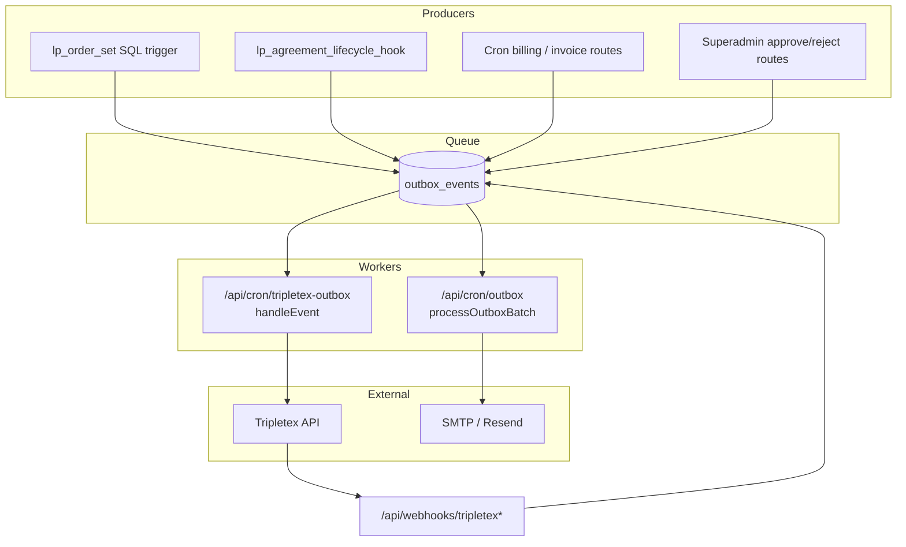
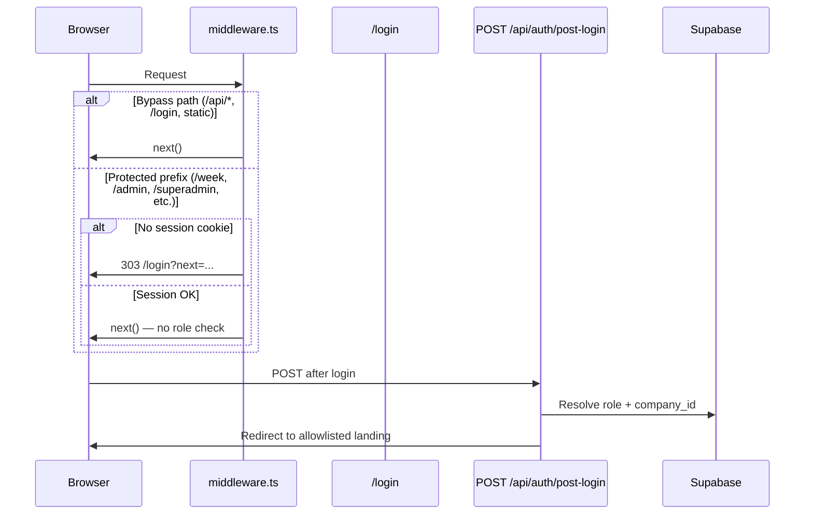
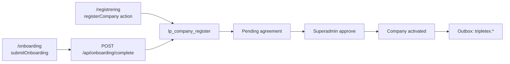

# Lunchportalen — Repo State Audit

**Dato:** 2026-05-22  
**Scope:** Diagnose-only crawl etter TPT-B-7-marathon  
**Formål:** Permanent referanse før neste kapittel (observability, B-4 invoice, public registration)  
**Metode:** `rg`, Supabase MCP (prod + staging), glob, git log — ingen kodeendringer

> **Sikkerhetsflagg (funnet under crawl):** Hardkodet DB-passord i `umbraco17/lunchportalen/appsettings.Production.json` og `appsettings.Development.json` (`Password=Bellotta-1`). Vurder hotfix/rotering før videre deploy. Ikke committet i denne audit.

---

## 1. Executive Summary

**Lunchportalen** er en multi-tenant firmalunsjplattform (Next.js 15 · Supabase · Sanity · Tripletex · Umbraco) i **RC-modus** med to deployflater: autentisert app (`app.lunchportalen.no`) og marketing (`lunchportalen.no`).

### Hva er bygget

Kjerneproduktet — ukebestilling, firmadmin, kjøkken, sjåfør, superadmin livssyklus, Sanity-meny sync, og Tripletex Flow A/B billing — er **implementert og testet** etter to dager med TPT-B-7-arbeid. `lib/ai/` er **redusert** fra ~703 filer / ~81k LOC til **277 filer / ~26k LOC** (2026-05-22 cleanup); archive på `archive/lib-ai-frozen-2026-05`.

### Modenhet per domene

| Domene | Modenhet | Notat |
|--------|----------|-------|
| Auth + post-login | **PROD-READY** | Frozen; middleware + layout guards |
| Employee week/orders | **PROD-READY** | Frozen mobile-kritisk (S1.1) |
| Company admin | **PROD-READY** | Frozen `/admin/companies` |
| Superadmin lifecycle | **PROD-READY** | Agreements, firms, providers |
| Onboarding (NO) | **PROD-READY** | Frozen phone UX |
| Kitchen / driver | **PROD-READY** | Read-only truth / mobile-first |
| Provider portal (`/leverandor`) | **BETA** | Tripletex B-7 ferdig; middleware gate lukket K4 2026-05-22 |
| Tripletex billing (A+B) | **BETA** | Pipeline komplett; outbox race lukket på prod (K1, 2026-05-22) |
| Sanity menu sync | **PROD-READY** | Webhook + reconcile cron |
| CMS backoffice | **BETA** | 81 sider; høy kompleksitet |
| Marketing (Umbraco) | **BETA** | Azure deploy; DB-passord rotert 2026-05-22 (K3 lukket) |
| Public registration | **ALPHA** | `/registrer` + `/onboarding` duplikat |
| AI / growth / social | **IN-PROGRESS** (lib/ai) / **STUB** (social) | lib/ai: ~26k LOC keep-set (CMS AI + demand); archive på branch |
| Observability | **ALPHA** | Health endpoints; ingen APM/alerting |

### Største styrker

1. **Enterprise auth/tenant-isolasjon** — server-side `profiles.company_id`, RLS på kjerne-tabeller, `lp_*` RPC med SECURITY DEFINER
2. **Tripletex integrasjon** — Flow A (SaaS) + Flow B (avtalefaktura) med vault, webhooks, cron, omfattende testdekning
3. **Testkultur** — 525 test-filer, ~2 483 cases, 0 skip/only, CI enterprise gates
4. **Dokumentasjonshistorikk** — 158 audit-filer, AGENTS.md som authoritative law

### Største risikoer mot LIVE

1. ~~**Outbox worker race** — SMTP worker kan feile Tripletex events (`unknown_event_kind`)~~ **Lukket på prod 2026-05-22 (migrasjon `20260522150000`)**
2. ~~**`invoice.reverse` uten handler** — broken pipeline ved fakturareversering~~ **Lukket 2026-05-22 (K2 OPTION B — se `docs/audit/k2-invoice-reverse.md`)**
3. ~~**Umbraco hardcoded DB password** i repo~~ **Lukket 2026-05-22 (K3 — passord rotert i Azure, repo renset)**
4. **Ingen ekstern error/alerting** — cron-feil oppdages manuelt
5. **259 migrasjonsfiler vs 93 prod ledger** — drift/compliance risiko
6. **314 API routes** — stor angrepsflate, ujevn testdekning

### Anbefalt neste kapittel

1. Fix K4–K6 (middleware gate, prod-smoke) — K1–K3 lukket 2026-05-22
2. Observability v1 (Sentry + cron alert)
3. Public registration canonical flow
4. Prod-smoke Tripletex E2E

---

## 2. Architecture Overview

### To-system-modellen

| System | Domene | Rolle | Stack |
|--------|--------|-------|-------|
| **App** | `app.lunchportalen.no` | Autentisert drift: bestilling, admin, leverandør, kjøkken, sjåfør | Next.js 15 App Router · Supabase · Sanity (meny) |
| **Marketing / CMS** | `lunchportalen.no` | Offentlig innhold, SEO, CRO | Umbraco (Azure Web App) + Sanity Delivery API |

Next.js proxier Umbraco backoffice via `/umbraco/*` → `UMBRACO_CMS_ORIGIN` (eller origin av `UMBRACO_DELIVERY_BASE_URL`). Middleware skipper Supabase session refresh på `/umbraco/*`.

### Datakilder per type

| Domene | Primær kilde | Sekundær | Merknad |
|--------|--------------|----------|---------|
| Auth, profiler, roller | Supabase Auth + `profiles` | — | Server-sannhet via `getAuthContext()` |
| Bestillinger, avtaler, faktura | Supabase Postgres | Tripletex (sync via outbox) | RLS + `lp_*` RPC-er |
| Meny / ukeplan | Sanity (`menuDay`) | `menu_service_days` (Supabase) | Webhook `POST /api/webhooks/sanity/menu-day` |
| Marketing-blokker (app-ruter) | Supabase (`content_pages`, `global_content`) | — | Backoffice-editor in-app |
| Offentlig HTML-marketing | Umbraco Delivery API | — | Redirects fra app til `lunchportalen.no` for `/faq`, `/vilkar`, etc. |
| AI/growth/social | Supabase logger + mange `lib/ai/**` moduler | OpenAI | Parallell plattformflate — ikke kjerne-lunsj |

### Deployment-modell

| Miljø | Plattform | Supabase | Merknad |
|-------|-----------|----------|---------|
| **Prod** | Vercel | `hkpokyapzarefrgqzkos` (eu-west-1, PG 17) | 93 migrasjoner applied |
| **Staging** | Vercel (branch preview) | `uigxsboqeruxflgzqztl` (persistent branch) | 56 migrasjoner applied; schema paritet 137 tabeller |
| **Umbraco** | Azure Web App | — | Separat deploy-workflow |
| **Sanity Studio** | `studio/` (egen build) | — | `npm run sanity:live` gate |

**Ledger-drift:** Repo har **259** SQL-filer under `supabase/migrations/`; prod ledger har **93** rader. ~166 filer uten prod-ledger-rad (hygiene, dokumentert i `docs/audit/supabase-state.md`).

### Cron-strategi

- **Vercel Cron** (`vercel.json`): **16** schedulerte jobber — kun kjerne-drift (outbox, Tripletex, ESG, meny, ukeplan).
- **API-ruter uten Vercel-schedule:** **66** `app/api/cron/*` endepunkter totalt — mange AI/growth/autonomy stubs uten prod-schedule.
- **Auth:** `requireCronAuth(req)` — `CRON_SECRET` header; feiler lukket (403/500).
- **Observability:** `cron_runs`-tabell insert ved kjøring (best-effort, blokkerer ikke cron).

### Event-flyt (outbox + webhooks)

### Auth-flyt (forenklet)

**Gap (lukket K4 2026-05-22):** `/leverandor` er middleware-protected; `app/leverandor/layout.tsx` håndterer rolle som defense-in-depth.

### Onboarding-flow

### Invoice-pipeline (TPT-B)

```mermaid
flowchart LR
  CRON["/api/cron/tripletex-agreements-daily"]
  RPC["lp_run_daily_agreement_billing"]
  GEN["lp_generate_agreement_invoices_for_period"]
  OB["outbox: tripletex.agreement_invoice_create_provider:*"]
  WRK["tripletex-outbox worker"]
  TT["Tripletex POST /order"]
  WH["Webhook paid status"]
  PAID["lp_apply_tripletex_paid_status"]
  CRON --> RPC --> GEN --> OB --> WRK --> TT
  TT --> WH --> PAID
```

**Status:** Pipeline implementert (TPT-B-4–B-7); outbox race lukket på prod K1 2026-05-22 (migrasjon `20260522150000`; se `docs/audit/k1-outbox-race-fix.md`).

---

## 3. Domain Modules

### App-route domener

| Path | Beskrivelse | Filer (page.tsx) | Modenhet | Auth | Tester |
|------|-------------|------------------|----------|------|--------|
| `app/(app)/week/` | Ansatt ukevisning + bestilling | 9 | **PROD-READY** | employee + middleware | `tests/employee/`, `tests/api/orders*` |
| `app/admin/` | Firmadmin (company_admin) | 22 | **PROD-READY** | layout guard | `tests/admin/` (8 filer) |
| `app/superadmin/` | Plattformadmin | 50 | **PROD-READY** | layout guard | `tests/superadmin/` (7 filer) |
| `app/leverandor/` | Leverandørportal (provider) | 12 | **IN-PROGRESS** | middleware + layout guard (rolle) | Delvis (`tests/integrations/`) |
| `app/kitchen/` | Kjøkken produksjon (read-only) | 1+ | **PROD-READY** | kitchen role | `tests/kitchen/` (6 filer) |
| `app/driver/` | Sjåfør leveringsliste | 1+ | **PROD-READY** | driver role | `tests/driver-flow-quality.test.ts` |
| `app/onboarding/` | Firmaregistrering Norge | 2+ | **PROD-READY** (FROZEN) | public/authenticated | `tests/auth/`, API tests |
| `app/registrer/` | Alternativ registrering | 1+ | **IN-PROGRESS** | public | Begrenset |
| `app/(auth)/` | Login, reset, invite | 10 | **PROD-READY** | public | `tests/auth/` (21 filer) |
| `app/(public)/` | CMS-sider fra DB | 2 | **PROD-READY** | public | `tests/cms/` (150 filer) |
| `app/(backoffice)/` | Innholdseditor + AI backoffice | 81 | **IN-PROGRESS** | middleware + egne guards | `tests/backoffice/` (8 filer) |
| `app/kunde/` | — | **0** | **N/A** | — | — |

### lib/ — kjerne-domener (PROD-READY / IN-PROGRESS)

| Folder | Beskrivelse | Filer | LOC (ca.) | Modenhet | Avhengigheter | Tester | Svakhet |
|--------|-------------|-------|-----------|----------|---------------|--------|---------|
| `lib/auth/` | Session, roller, post-login, rate limit | 34 | 3 094 | PROD-READY | supabase, profiles | 21 auth tests | K4 lukket 2026-05-22 |
| `lib/orders/` | Bestillingslogikk, guards | 18 | 1 424 | PROD-READY | supabase RPC | api + db tests | — |
| `lib/kitchen/` | Produksjonshierarki, batch | 10 | 2 188 | PROD-READY | orders, supabase | 6 kitchen tests | — |
| `lib/integrations/tripletex/` | Tripletex client + sync | 35 | 5 171 | IN-PROGRESS | outbox, vault | 21 integration tests | client.ts 1778 LOC |
| `lib/providers/` | Provider settings, lifecycle | 17 | 1 245 | IN-PROGRESS | auth, supabase RPC | db tests | — |
| `lib/onboarding/` | Validering av avtalepayload | 7 | ~400 | PROD-READY (FROZEN) | phone/no.ts | API tests | — |
| `lib/orderBackup/` | SMTP outbox worker | 10 | 947 | PROD-READY | supabase | cronOutbox tests | Race med Tripletex worker |
| `lib/outbox/` | Invoice-ready enqueue | 3 | ~200 | IN-PROGRESS | supabase | outbox-policy test | `invoice.reverse` ubehandlet |
| `lib/menu-publish/` | Sanity → menu_service_days | 11 | 1 461 | PROD-READY | sanity, supabase | cms tests | — |
| `lib/agreements/` | Avtaledager, normalisering | 8 | ~600 | PROD-READY | supabase | db tests | — |
| `lib/billing/` | Betalingspolicy | 9 | ~500 | IN-PROGRESS | tripletex | Begrenset | billing_accounts TODO |
| `lib/cms/` | Backoffice content model | 136 | 14 069 | IN-PROGRESS | supabase | 150 cms tests | Høy kompleksitet |
| `lib/http/` | respond, cronAuth, withRole | 30 | 1 564 | PROD-READY | — | cronAuth test | — |
| `lib/supabase/` | Client factories | 9 | ~800 | PROD-READY | — | runtime tests | — |
| `lib/observability/` | SLO, status aggregator | 31 | 1 695 | STUB | — | Begrenset | Ingen ekstern APM |
| `lib/core/` | response, logger | 22 | ~500 | STUB | — | — | `logger.ts` = console.error only |

### lib/ — eksperimentelle / STUB-domener (>10 filer)

| Folder | Filer | Modenhet | Merknad |
|--------|-------|----------|---------|
| `lib/ai/` | **277** | **IN-PROGRESS** | ~26k LOC etter cleanup 2026-05-22; se `docs/audit/lib-ai-decision.md` |
| `lib/social/` | 74 | STUB | Social engine; superadmin growth UI |
| `lib/growth/` | 57 | STUB | GTM, attribution, domination metrics |
| `lib/revenue/` | 45 | STUB | Revenue brain; console.log i prod paths |
| `lib/sales/` | 60 | STUB | Sales autonomy |
| `lib/autonomy/` | 38 | STUB | Autopilot/agents |
| `lib/ads/` | 33 | STUB | Ad campaign engine |
| `lib/ml/` | 30 | STUB | ONNX sequence models |
| `lib/outbound/` | 27 | STUB | Lead outreach |

**Totalt lib/:** 156 top-level mapper · ~2000 filer · estimert **~180k LOC** (ai alene ~81k).

### lib/ — full inventar (fil-count)

Alle 156 lib/ mapper (fil-count)

| Folder | Files | Folder | Files | Folder | Files |
|--------|------:|--------|------:|--------|------:|
| acquire | 3 | admin | 13 | ads | 33 |
| agents | 3 | agreement | 4 | agreements | 8 |
| ai | 703 | alerts | 6 | analytics | 3 |
| api | 6 | approval | 1 | attribution | 1 |
| audit | 12 | auth | 34 | automation | 1 |
| autonomy | 38 | autopilot | 14 | backoffice | 6 |
| billing | 9 | board | 1 | business | 6 |
| cache | 4 | campaign | 1 | ceo | 9 |
| chaos | 3 | cms | 136 | compliance | 2 |
| config | 2 | content | 7 | controlTower | 4 |
| copy | 2 | core | 22 | crm | 3 |
| cro | 6 | cto | 7 | data | 6 |
| date | 7 | db | 6 | demo | 5 |
| design | 7 | distributed | 3 | domain | 1 |
| domination | 6 | driver | 1 | edge | 7 |
| email | 4 | employee | 6 | engine | 4 |
| enterprise | 1 | env | 1 | errors | 1 |
| esg | 18 | eventBus | 3 | evolution | 10 |
| execution | 3 | exit | 9 | experiment | 17 |
| experiments | 15 | finance | 10 | flags | 1 |
| forecast | 8 | global | 20 | golive | 6 |
| growth | 57 | gtm | 18 | guards | 2 |
| hooks | 3 | http | 30 | i18n | 1 |
| idempotency | 2 | infra | 15 | integrations | 35 |
| investor | 3 | invites | 2 | ipo | 2 |
| kitchen | 10 | layout | 5 | leads | 2 |
| learning | 2 | live | 1 | localRuntime | 2 |
| market | 13 | media | 10 | menu | 1 |
| menu-publish | 11 | metrics | 2 | ml | 30 |
| monitoring | 7 | monopoly | 5 | moo | 18 |
| mvo | 20 | network | 1 | neural | 6 |
| observability | 31 | onboarding | 7 | ops | 7 |
| optimization | 1 | orderBackup | 10 | orders | 18 |
| orgnr | 1 | outbound | 27 | outbox | 3 |
| partners | 3 | pdf | 1 | personalization | 2 |
| phone | 1 | pilot | 1 | pipeline | 20 |
| pitch | 1 | platform | 1 | pos | 15 |
| predictive | 7 | pricing | 8 | procurement | 9 |
| product | 8 | production | 1 | providers | 17 |
| public | 23 | queue | 6 | recovery | 3 |
| registration | 1 | repo | 1 | repo-intelligence | 1 |
| revenue | 45 | rl | 1 | runtime | 2 |
| saas | 5 | sales | 60 | salesAutonomy | 9 |
| sanity | 7 | scale | 6 | sdr | 3 |
| security | 12 | self-healing | 3 | selfheal | 10 |
| seo | 11 | server | 22 | settings | 4 |
| simulation | 3 | social | 74 | sre | 2 |
| strategy | 10 | supabase | 9 | superadmin | 10 |
| system | 20 | tenant | 2 | theme | 1 |
| toast | 1 | types | 1 | ui | 16 |
| url | 3 | utils | 1 | validation | 3 |
| video | 14 | week | 3 | workflow | 1 |

---

## 4. Database Layer

**Kilde:** Supabase MCP `execute_sql` på prod (`hkpokyapzarefrgqzkos`) og staging (`uigxsboqeruxflgzqztl`), 2026-05-22.

### Oversikt

| Måling | Prod | Staging |
|--------|------|---------|
| `public` tabeller | **137** | **137** |
| RLS policies (`public`) | **231** | *(ikke re-countet; schema paritet antatt)* |
| `public.lp_*` funksjoner | **66** | Paritet forventet |
| Applied migrasjoner (ledger) | **93** | **56** |
| Repo migrasjonsfiler | **259** | — |

### Tabeller UTEN RLS (prod)

**43 tabeller** uten `relrowsecurity`:

| Kategori | Tabeller | Risiko-vurdering |
|----------|----------|------------------|
| Audit partitions | `audit_log_y2026m05` … `audit_log_y2029m04`, `audit_log_y_default` (37 stk) | **Lav** — partition children; tilgang via service_role/worker |
| Billing config | `billing_products`, `billing_tax_codes`, `invoice_periods` | **Medium** — read-only config; bør ha SELECT-policy for admin |
| Lifecycle | `company_deletions` | **Medium** — superadmin-only forventet |
| Export | `tripletex_exports` | **Medium** — worker/service_role |

**Ingen kjerne tenant-tabeller** (`orders`, `profiles`, `companies`, `providers`) uten RLS.

### Tabeller UTEN service_role GRANTs

Query mot `information_schema.role_table_grants`: **0 tabeller** i `public` uten service_role SELECT/INSERT/UPDATE/DELETE. Worker-skriving er dekket etter TPT-B-7 hotfix-6/8.

### FK uten indeks (prod)

**17** foreign keys uten covering index (inkl. auth/storage interne + 11 i `public`):

| Tabell | FK-kolonne |
|--------|------------|
| `companies` | `suspended_by`, `paused_by` |
| `profiles` | `suspended_by` |
| `providers` | `paused_by`, `suspended_by` |
| `billing_products` | `tax_code_id` |
| `provider_subscriptions` | `tax_code_id`, `created_by` |
| `provider_invoices` | `subscription_id`, `tax_code_id` |
| `agreement_invoice_lines` | `tax_code_id` |

**Perf-risiko:** Lifecycle/billing joins under load; ikke blocker for RC.

### Tabeller referert i kode men mulig broken RPC/DB

| Referanse | I kode | I DB (migrations) | Status |
|-----------|--------|-------------------|--------|
| `lp_company_activate` | `app/api/superadmin/company/[companyId]/activate/route.ts` | **Ikke i migrations** | **BROKEN** — route bruker direkte update + outbox |
| `lp_create_company_with_location` | `app/api/company/create/route.ts` | **Ikke funnet** | **BROKEN/STALE** |
| `lp_generate_forecast_range` | `app/api/cron/forecast/route.ts` | **Ikke funnet** | Cron kan feile silently |
| `lp_membership_get` | `lib/auth/membershipLookup.ts` | **Ikke funnet** | Fallback i TS? |
| `company_billing_accounts` | `app/admin/page.tsx` (TODO) | **Ikke i prod** | UI-tab disabled |

### Dead schema (DB uten kode-referanse)

**ANTAKELSE:** Full dead-schema scan ikke kjørt (krever cross-ref alle 137 tabeller). Kandidater fra tidligere audits:

- Flere `ai_*` / `growth_*` / `experiment_*` tabeller med minimal app-referanse
- `audit_log_y2027*` partitions pre-provisioned (normal)

### Migrasjons-state: prod vs staging

| Aspekt | Status |
|--------|--------|
| Schema paritet | **137/137 tabeller** match |
| Ledger paritet | **NEI** — prod 93 vs staging 56 vs repo 259 filer |
| Siste prod migrasjon | `20260522140728` — `tpt_b7_polish9_webhook_subscriptions` |
| Staging modell | Persistent branch + schema-dump baseline (se `docs/audit/supabase-state.md`) |
| Platform UI | Staging kan vise `MIGRATIONS_FAILED` (ledger replay) uten faktisk schema-brudd |

### Vault-baserte secrets (navnemønster — ingen verdier)

MCP `SELECT name FROM vault.secrets` returnerte **0 rader** (MCP har ikke vault-lesetilgang eller tom prod-vault).

**Forventede secret-navn** (fra `private.lp_tripletex_vault_secret_name`):

| Mønster | Innhold |
|---------|---------|
| `lp_tripletex_{providerId}_{env}_consumer` | Tripletex consumer token |
| `lp_tripletex_{providerId}_{env}_employee` | Tripletex employee token |
| Webhook secrets | Via `provider_tripletex_webhook_secrets.webhook_secret_id` → vault |

**Env-baserte secrets (ikke vault):** `CRON_SECRET`, `SYSTEM_MOTOR_SECRET`, `SANITY_WEBHOOK_SECRET`, `SUPABASE_SERVICE_ROLE_KEY`, Tripletex Flow A webhook secret.

---

## 5. Server Actions Catalog

**18 filer** med `"use server"` · **58** eksporterte async-funksjoner.

| Domene | Fil | Funksjon | Auth | DB-effekt | Tripletex | Tester |
|--------|-----|----------|------|-----------|-----------|--------|
| **Onboarding** | `app/onboarding/actions.ts` | `submitOnboarding` | anon (public form) | via API → RPC | none | API tests |
| **Registrering** | `app/registrer/actions.ts` | `registerCompany` | anon | RPC `lp_company_registration_create` | none | Delvis |
| **Admin invite** | `app/admin/invite/actions.ts` | `createEmployeeInvite` | company_admin | INSERT invites | none | Y |
| **Leverandør kunder** | `app/leverandor/kunder/actions.ts` | `suspendCustomer`, `pauseCustomer`, `deleteCustomer`, `resumeCustomer` | provider_admin | RPC lifecycle | none | Delvis |
| **Leverandør områder** | `app/leverandor/omrader/actions.ts` | `saveServiceArea`, `toggleServiceArea` | provider_admin | RPC `lp_service_area_*` | none | N |
| **Leverandør ordrer** | `app/leverandor/ordrer/actions.ts` | `advanceKitchenOrder` | provider_kitchen | RPC `lp_order_advance_status` | none | N |
| **Leverandør faktura** | `app/leverandor/faktura/actions.ts` | `updateBillingContact` | provider_admin | RPC `lp_provider_update_billing_contact` | none | N |
| **Leverandør registreringer** | `app/leverandor/registreringer/actions.ts` | `approveProviderRegistration`, `rejectProviderRegistration`, `getProviderIdForActions` | provider_admin | RPC approve/reject | none | N |
| **Tripletex koble-til** | `app/leverandor/innstillinger/tripletex/koble-til/actions.ts` | `verifyTokenAction`, `completeConnectionAction`, `rotateWebhookSecretAction`, `finalizeConnectionAction`, `getHealthAction` | provider_admin | RPC + vault | read/write | Y (db) |
| **Tripletex status** | `app/leverandor/innstillinger/tripletex/status/actions.ts` | `getDashboardDataAction`, `testConnectionAction`, `disconnectTripletexAction` | provider_admin | RPC + read | read | Y |
| **Superadmin avtaler** | `app/superadmin/agreements/actions.ts` | `approveAgreement`, `rejectAgreement`, `pauseAgreementLedger` | superadmin | RPC + outbox | write (via outbox) | Y |
| **Superadmin firma** | `app/superadmin/firms/[companyId]/actions.ts` | `setCompanyStatus` | superadmin | RPC suspend/pause/resume | none | Y |
| **Superadmin providers** | `app/superadmin/providers/actions.ts` | `setProviderSubscription`, `generateProviderInvoice` | superadmin | RPC + billing | write | Delvis |
| **Superadmin control-tower** | `app/superadmin/control-tower/actions.ts` | `controlTowerFinanceSimulationLogAction`, `controlTowerInsightAction` | superadmin | INSERT logs | none | N |
| **Superadmin social** | `app/superadmin/growth/social/actions.ts` | 22× `socialEngine*Action` | superadmin | diverse AI/social tables | none | N |
| **Backoffice CMS** | `app/(backoffice)/backoffice/content/_actions/generateAiPageDraft.ts` | `generateAiPageDraftAction` | backoffice auth | read/write content | none | N |
| **Providers settings** | `lib/providers/saveProviderSettings.ts` | `saveProviderSettings` | provider_admin | UPDATE providers | none | N |

**Mønster:** Kjerne-actions bruker `getAuthContext()` + rolle-sjekk + `lp_*` RPC. Onboarding/registrering er public. Social engine actions er STUB-domene uten prod-dekning.

---

## 6. RPC Catalog

**66** `public.lp_*` funksjoner i prod (MCP 2026-05-22). Alle unntatt 3 er `SECURITY DEFINER`.

### Kjerne-RPC-er (med auth-mønster)

| Funksjon | DEFINER | Auth-sjekk | Beskrivelse | Brukt av |
|----------|---------|------------|-------------|----------|
| `lp_order_set` | Y | RLS + profile | Sett/endre bestilling | API `/api/orders`, week UI |
| `lp_agreement_lifecycle_hook` | Y | trigger | Outbox fan-out ved avtaleendring | SQL trigger |
| `lp_company_register` | Y | service/elevated | Firmaregistrering | onboarding API |
| `lp_company_suspend/pause/resume/delete` | Y | `lp_assert_user_lifecycle_access` | Firmalivssyklus | admin + provider actions |
| `lp_provider_create/delete/suspend/...` | Y | `is_platform_admin` | Provider livssyklus | superadmin |
| `lp_provider_set_tripletex_credentials` | Y | `lp_assert_provider_admin_or_superadmin` | Lagre Tripletex tokens i vault | koble-til actions |
| `lp_provider_test_tripletex_token` | Y | provider_admin | Verifiser token | status actions |
| `lp_provider_load_webhook_secret` | Y | service_role | Last webhook secret | webhook routes |
| `lp_run_daily_agreement_billing` | Y | service_role | Daglig fakturering | cron |
| `lp_generate_agreement_invoices_for_period` | Y | elevated | Generer avtalefakturaer | cron + superadmin |
| `lp_apply_tripletex_paid_status` | Y | service_role | Oppdater betalt status | webhook B-6 |
| `lp_outbox_claim/mark_sent/mark_failed` | Y | service_role | Outbox worker | cron workers |
| `lp_service_area_save/toggle_active` | Y | provider_admin | Leverandør områder | omrader actions |
| `lp_order_advance_status` | Y | provider_kitchen | Kjøkken status | ordrer actions |

### INVOKER (3 stk)

| Funksjon | Beskrivelse |
|----------|-------------|
| `lp_advisory_lock` | Postgres advisory lock helper |
| `lp_req_hash` | Request hash for idempotency |
| `lp_touch_invites_updated_at` | Trigger helper |

### Ubrukte / kandidater for review

| Funksjon | Merknad |
|----------|---------|
| `lp_delivery_set_status` | Ingen TS-referanse funnet — **kandidat sletting** |
| `lp_esg_rollup_month` | Kun cron ESG — verifiser prod-bruk |
| `lp_invoice_build_month` | Legacy? — cross-ref billing |
| `lp_production_freeze_day` | Kitchen-adjacent — lav referanse |
| `lp_idem_complete/fail` | Idempotency — delvis brukt |

### RPC i kode men IKKE i prod DB

| RPC | Referert fra | Status |
|-----|--------------|--------|
| `lp_company_activate` | activate route | **Stale** — route bruker direkte SQL |
| `lp_create_company_with_location` | company create API | **Broken** |
| `lp_generate_forecast_range` | forecast cron | **Broken** |
| `lp_membership_get` | membershipLookup | **Broken/fallback** |

---

## 7. Outbox Events Catalog

### Event key prefixes

| Prefix / pattern | Produsent | Konsument | Retry | Audit |
|------------------|-----------|-----------|-------|-------|
| `order.set:*` | `lp_order_set` (SQL) | SMTP worker (noop → SENT) | 10 attempts | — |
| `rollup.rebuild:*` | `lp_order_set` (SQL) | SMTP worker (noop → SENT) | 10 attempts | — |
| `invoice.ready:*` | invoice generate routes | Tripletex worker `processInvoiceReady` | 10 attempts | lifecycle_audit |
| `invoice.sent:*` | Tripletex worker (side-effect) | **Ingen** | — | enqueue only |
| `invoice.reverse:*` | superadmin reverse route | **Ingen** | — | **BROKEN PIPELINE** |
| `tripletex.provider_customer_create_lp:*` | `lp_provider_create` | `handleProviderCustomerCreateLp` | 10 attempts | tripletex audit |
| `tripletex.company_customer_create_provider:*` | lifecycle hook | `handleCompanyCustomerCreateProvider` | 10 attempts | tripletex audit |
| `tripletex.saas_invoice_create_lp:*` | SaaS billing RPC | `handleSaasInvoiceCreateLp` | 10 attempts | tripletex audit |
| `tripletex.agreement_invoice_create_provider:*` | agreement billing RPC | `handleAgreementInvoiceCreateProvider` | 10 attempts | tripletex audit |
| `tripletex.provider_product_sync:*` | lifecycle hook | `handleProviderProductSync` | 10 attempts | tripletex audit |
| `tripletex.onboarding_provisioning_start:*` | B-7 connection RPCs | `handleOnboardingProvisioningStart` | 10 attempts | tripletex audit |
| `company.approved/rejected/activated:*` | superadmin routes | SMTP email | 10 attempts | lifecycle_audit |
| `deviation:unpacked/undelivered:*` | check-deviations cron | SMTP email | 10 attempts | — |
| `batch_packed:*` | kitchen batch | SMTP email | 10 attempts | — |
| `daily_order_summary/kitchen_production:*` | daily-order-summary cron | SMTP email | 10 attempts | — |
| `order.cancel.day_choice:*` | cancel route | SMTP email | 10 attempts | — |

### Retry-policy

- Max attempts: **10** (`OUTBOX_MAX_ATTEMPTS`)
- Stale reclaim: `lp_outbox_reset_stale` (cron konfigurerbar, default 10 min)
- Tripletex worker: releases `invoice.ready` + `provider_customer_create_lp` back to PENDING if SMTP worker claims first
- Permanent fail: status `FAILED_PERMANENT` after max attempts

### Dead handlers

| Handler | Fil | Publisert? |
|---------|-----|------------|
| `order_created` | `lib/eventBus/handlers.ts` | **Aldri** — console.log stub |
| `ai_run` | `lib/eventBus/handlers.ts` | **Aldri** — bruker `ai_activity_log` i stedet |

### Broken / gap pipelines

| Issue | Alvorlighet | Detalj |
|-------|------------|--------|
| `invoice.reverse:*` produsert, ingen handler | **HØY** | Superadmin reverse enqueuer uten consumer |
| SMTP/Tripletex worker race | **HØY** | `lp_outbox_claim` henter alle PENDING — SMTP kan markere Tripletex-events som `unknown_event_kind` |
| `order.set:` vs `order:set:` mismatch | **LAV** | `loadProductionReadiness.ts` bruker feil prefix |
| Ad-hoc outbox keys uten email fields | **MEDIUM** | → FAILED permanent |

---

## 8. Cron Jobs Catalog

### Vercel-scheduled (vercel.json → prod + staging når deployet)

| Path | Schedule | Target | Beskrivelse | Sist endret | Tester |
|------|----------|--------|-------------|-------------|--------|
| `/api/cron/week-scheduler` | `*/10 * * * *` | prod/staging | Materialiser ukeplan-slots | 2026-05 | N |
| `/api/cron/forecast` | `0 2 * * *` | prod/staging | Forecast range (RPC **broken**) | eldre | N |
| `/api/cron/daily-order-summary` | `5 6,7 * * 1-5` | prod/staging | Daglig ordresammendrag e-post | 2026-05 | N |
| `/api/cron/check-deviations` | `0 8,9,12,13 * * 1-5` | prod/staging | Avvik kjøkken/levering | 2026-05 | N |
| `/api/cron/preprod` | `5 8 * * 1-5` | prod/staging | Pre-produksjon snapshot | eldre | N |
| `/api/cron/outbox` | `*/2 * * * *` | prod/staging | SMTP outbox worker | 2026-05-15 | **Y** |
| `/api/cron/tripletex-outbox` | `*/3 * * * *` | prod/staging | Tripletex outbox worker | 2026-05 | Delvis |
| `/api/cron/tripletex-saas-monthly` | `0 6 1 * *` | prod/staging | Månedlig SaaS-faktura | 2026-05 | **Y** |
| `/api/cron/tripletex-agreements-daily` | `0 6 * * *` | prod/staging | Daglig avtalefakturering | 2026-05-21 | **Y** |
| `/api/cron/tripletex-connection-health-daily` | `0 5 * * *` | prod/staging | Tripletex tilkoblingshelse | 2026-05 | **Y** |
| `/api/cron/cleanup-invites` | `30 3 * * *` | prod/staging | Rydd utløpte invitasjoner | eldre | N |
| `/api/cron/esg/daily` | `15 1 * * *` | prod/staging | ESG daglig rollup | eldre | N |
| `/api/cron/esg/monthly` | `20 1 1 * *` | prod/staging | ESG månedlig lock | eldre | N |
| `/api/cron/esg/yearly` | `25 1 1 1 *` | prod/staging | ESG årlig lock | eldre | N |
| `/api/cron/menu-service-day-reconcile` | `0 */6 * * *` | prod/staging | Sanity↔DB meny reconcile | 2026-05 | N |
| `/api/cron/menu-week-rollout` | `0 12 * * 4` | prod/staging | Ukesmeny rollout torsdag | 2026-05 | N |

**Auth (alle):** `requireCronAuth` — `Authorization: Bearer ${CRON_SECRET}` eller `x-cron-secret` header.

### API cron-ruter UTEN Vercel-schedule (66 totalt)

**50+ ruter** under `app/api/cron/` er **STUB/AI/growth** — eksempler: `ai-ceo`, `autonomous`, `god-mode`, `singularity`, `monopoly`. Disse kjører **ikke** automatisk i prod med mindre manuelt trigget.

**Cron-failure alerting:** `cron_runs`-tabell (best-effort insert). **Ingen** ekstern alerting (Sentry/PagerDuty). Feil oppdages via superadmin system health eller manuell sjekk.

---

## 9. Webhook Endpoints Catalog

| Endpoint | Verifikasjon | Idempotency | Replay-protect | Rate-limit | Tester |
|----------|--------------|-------------|----------------|------------|--------|
| `POST /api/webhooks/tripletex` | HMAC + auth header (`verifyTripletexWebhookSignature`) | `tripletex_webhook_events` dedup via `event_id` hash | Y (duplicate → 200) | 120/min/IP in-memory | Y |
| `POST /api/webhooks/tripletex-provider/[providerId]` | Per-provider secret via `lp_provider_load_webhook_secret` + HMAC | Same dedup table | Y | In-memory bucket | Y |
| `POST /api/webhooks/sanity/menu-day` | `SANITY_WEBHOOK_SECRET` HMAC | Upsert idempotent på date+tier | Y (signature) | **Nei** | Delvis |

**Handler-logikk:**

- **Tripletex Flow A:** `dispatchTripletexWebhookEvent` — customer/product/order callbacks
- **Tripletex Flow B:** `dispatchProviderTripletexWebhookEvent` → `lp_apply_tripletex_paid_status`
- **Sanity:** `syncMenuServiceDaysForPublishedMenuDay` / delete on unpublish

**Audit:** Alle Tripletex webhooks logger til `lifecycle_audit_log` (best-effort).

---

## 10. Third-party Integrations

| Tjeneste | Env | Auth | Error-handling | Fail-mode | Idempotency | Endpoints | Webhooks | Docs |
|----------|-----|------|----------------|-----------|-------------|-----------|----------|------|
| **Supabase** | prod + staging | JWT + service_role | jsonErr envelope | fail-closed | RPC idempotency keys | All DB | — | `docs/audit/supabase-state.md` |
| **Tripletex** | test + prod per provider | Session token (consumer+employee) | Retry + outbox | fail-hard (outbox retry) | Outbox event_key | `/v2/customer`, `/product`, `/order`, `/country`, `/currency` | `/api/webhooks/tripletex*` | `docs/audit/tpt-b-7b-polish-6.md` (inkl. polish-8 DTO-audit) |
| **Sanity** | prod dataset | API token + webhook secret | jsonErr | fail-soft (skip non-menuDay) | Upsert on date | GROQ + mutations | `/api/webhooks/sanity/menu-day` | `docs/audit/sanity-live-state.md` |
| **Umbraco** | Azure prod | Cookie (backoffice) | Proxy rewrite | fail-soft (404 uten env) | — | Delivery API | — | `docs/audit/full-system/UMBRACO_GAP_REPORT.md` |
| **Resend/SMTP** | prod env | API key | outbox retry | fail-soft (10 attempts) | outbox event_key | sendMail | — | — |
| **OpenAI** | prod env | API key | governance check | fail-soft | — | chat/completions | — | `scripts/ci/ai-governance-check.mjs` |
| **Stripe** | dependency only | — | — | — | — | **Ingen aktiv bruk funnet** | — | — |
| **Redis** | optional | — | — | — | — | rate/cache (lib) | — | — |

### Tripletex (referanse — ikke re-auditert)

Se **`docs/audit/tpt-b-7b-polish-6.md`** for full DTO-audit (polish-6 country, polish-8 currency/order). Hotfix-historikk: `tpt-b-7b-hotfix-*.md` (GRANTs, outbox, webhook subscriptions).

**Flow A vs B:**
- **Flow A:** Lp som Tripletex-kunde (SaaS-faktura til leverandører)
- **Flow B:** Provider som Tripletex-kunde (avtalefaktura til firma)

---

## 11. Test Coverage by Area

| Domene | Test-filer | ~Test cases | Dekning | Kritisk gap |
|--------|-----------|-------------|---------|-------------|
| **cms** | 150 | ~600 | **Høy** | `@ts-nocheck` i noen parity-tester |
| **api** | 61 | ~400 | **Medium-Høy** | 314 API routes — mange uten dedikert test |
| **auth** | 21 | ~120 | **Høy** | — |
| **db** | 23 | ~150 | **Medium** | RLS kun 7 filer i `tests/rls/` |
| **integrations** | 21 | ~100 | **Medium** | Tripletex E2E krever DB env |
| **kitchen** | 6 | ~200 | **Høy** | — |
| **admin** | 8 | ~50 | **Medium** | — |
| **superadmin** | 7 | ~40 | **Lav-Medium** | 50 superadmin pages |
| **employee/week** | 5 | ~30 | **Medium** | Mobil UX ikke e2e |
| **leverandor/provider** | ~5 | ~30 | **Lav** | Tripletex wizard delvis |
| **ai/growth/social** | 39+ | ~200 | **Medium** | STUB-domene — tester validerer ikke prod-verdi |
| **e2e (playwright)** | config finnes | — | **Lav** | Ikke i CI critical path |

**Totalt:** 525 test-filer · ~2 483 `test()`/`it()` invocations · **0** `.skip`/`.only`/`xit` (PASS).

**Kritisk forretningslogikk uten unit-tester:**
- Outbox SMTP/Tripletex race condition
- `invoice.reverse` pipeline
- Provider registrering full flow
- Public `/registrer` vs `/onboarding` paritet

---

## 12. Code Health

### TODO / FIXME / HACK / @deprecated

| Marker | Count |
|--------|------:|
| `@deprecated` | 30 |
| `TODO` | 1 |
| `FIXME` | 0 |
| `HACK` | 0 |

Eneste TODO: `app/admin/page.tsx` — `company_billing_accounts`-tabell mangler i prod.

### console.log/debug utenfor tests/

| Område | Matches |
|--------|--------:|
| `scripts/` | 201 |
| `lib/` | 112 |
| `app/` | 30 |

**Prod-risiko:** 112 i `lib/` — mange i logging helpers (`lib/ops/log.ts`, `lib/audit/log.ts`) men også i revenue/growth paths.

### debugger

**0** utenfor tests.

### Hardkodede secrets

| Funn | Severity |
|------|----------|
| `sk_live` / `sk_test` / `bearer eyJ` | **0** |
| Umbraco `appsettings.*.json` DB password | ~~**HIGH**~~ **Lukket 2026-05-22 (K3)** |
| `lib/auth/canonicalDevCredentials.ts` dev password | **LOW** (dev only) |

### Hardkodede URL-er (burde være env)

| URL | Fil |
|-----|-----|
| `https://lunchportalen.no/*` | `next.config.ts` redirects (OK for prod) |
| `https://lunchportalen.no/ai-motor-demo` | redirect target |

### Filer >1000 LOC (top 10 hotspots)

| LOC | Fil |
|----:|-----|
| 3230 | `app/superadmin/growth/social/SocialEngineClient.tsx` |
| 2624 | `app/(backoffice)/backoffice/content/_components/useContentWorkspaceShellModel.ts` |
| 2169 | `lib/localRuntime/cmsProvider.ts` |
| 2141 | `app/(app)/week/EmployeeWeekClient.tsx` |
| 1778 | `lib/integrations/tripletex/client.ts` |
| 1639 | `app/superadmin/sales/SalesCockpitClient.tsx` |
| 1525 | `app/superadmin/control-tower/ControlTowerClient.tsx` |
| 1399 | `app/(backoffice)/backoffice/content/_components/ContentAiTools.tsx` |
| 1224 | `app/(backoffice)/backoffice/content/_components/useContentWorkspaceAi.ts` |
| 1206 | `app/superadmin/companies/companies-client.tsx` |

**25 filer totalt** over 1000 LOC.

### Sirkulære avhengigheter

**Ikke kjørt** (madge ikke i CI). `graphlib` er dependency men ikke auditert. **ANTAKELSE:** Risiko i `lib/ai/` og `lib/cms/` basert på filstørrelse.

### Stub-funksjoner (eksempler)

| Fil | Mønster |
|-----|---------|
| `lib/eventBus/handlers.ts` | `console.log` only |
| `lib/core/logger.ts` | `console.error` wrapper |
| Mange `app/api/cron/ai-*` | Returnerer `{ ok: true }` uten side-effekt |

---

## 13. Operational Readiness

| Kapabilitet | Status | Detalj |
|-------------|--------|--------|
| **Logging** | Delvis | `lib/ops/log.ts`, `lib/audit/log.ts` — strukturert console; `lib/core/logger.ts` er stub |
| **Error tracking** | **Mangler** | Ingen Sentry/Datadog/LogDrain |
| **Feiloppdagelse prod** | Manuell | Superadmin `/superadmin/system`, `cron_runs`, Vercel logs |
| **Health endpoints** | Finnes | `/api/health`, `/api/health/live`, `/api/health/ready`, `/api/superadmin/system/health` |
| **Metrics** | Delvis | `cron_runs`, `lifecycle_audit_log`, `ai_activity_log` — ingen Prometheus |
| **Cron failure alert** | **Mangler** | Billing-cron feiler silently i `cron_runs` uten push-alert |
| **Rate limiting** | Delvis | Auth rate limit (`lib/auth/rateLimit.ts`); webhooks in-memory; public API varierer |

**SYSTEM_MOTOR_SECRET:** Påkrevd for system motor health (AGENTS.md N14). Mangler → DEGRADED i system health.

---

## 14. UI/UX Consistency

| Sjekk | Status | Detalj |
|-------|--------|--------|
| Design system (`ds-*`/`lp-*`) | Delvis | Backoffice/superadmin har ad-hoc Tailwind; week/admin bruker tokens |
| Empty states | Delvis | Week, onboarding har; mange superadmin-lister mangler |
| Error boundaries | **Lav** | Kun `app/admin/error.tsx`, `app/superadmin/firms/error.tsx`, root `app/error.tsx` |
| Loading states | **Lav** | Kun `app/superadmin/firms/loading.tsx` + Suspense sporadisk |
| Mobile 380px | Delvis testet | Week + forside er S1.1-kritiske; superadmin/backoffice ikke |
| aria-label | Sporadisk | ~15 filer med explicit aria-label; ikke systematisk |
| focus-visible | Delvis | Hot-pink focus ring i header law; inkonsistent ellers |
| Emoji i UI | **Brudd funnet** | `app/kitchen/page.tsx`, `app/driver/page.tsx`, `EmployeeWeekClient.tsx`, superadmin overview |

**Header law:** `HeaderShell.tsx` + `RoleTabs.tsx` — canonical implementasjon OK for admin/employee.

---

## 15. Documentation State

| Område | Status |
|--------|--------|
| **README.md** | **STALE/BROKEN** — inneholder bare "test" + redeploy-kommentar |
| **AGENTS.md** | **Authoritative** — enterprise law, frozen flows |
| **docs/audit/** | **158 filer** — rik TPT-B historikk, full-system audits |
| **docs/runbooks/** | **1 fil** — `flaky-tests.md` kun |
| **Inline JSDoc** | Sporadisk — `@deprecated` brukt, ellers lav dekning |
| **Domener uten docs** | leverandor portal, driver mobile, public registration flow |

### docs/audit/ — nøkkelfiler (sist oppdatert ca.)

| Fil | Emne |
|-----|------|
| `repo-state-2026-05-22.md` | **Dette dokumentet** |
| `supabase-state.md` | 2026-05-20 — branch/RLS state |
| `tpt-b-7b-polish-6.md` | 2026-05-22 — Tripletex DTO |
| `tpt-b-7b-final.md` | TPT-B-7 foundation |
| `GO_LIVE_RISK_REGISTER_V2.md` | Risiko-register |
| `full-system/SYSTEM_ARCHITECTURE_MAP.md` | Arkitektur |

---

## 16. Security Audit

| Område | Status | Detalj |
|--------|--------|--------|
| **RLS coverage** | **93%** | 43/137 tabeller uten RLS (partitions + billing config) — se seksjon 4 |
| **Secrets** | Delvis | Vault for Tripletex per-provider; env for cron/webhook; ~~Umbraco password i repo~~ **K3 lukket 2026-05-22** |
| **Token i logs** | Delvis verifisert | `opsLog` brukes; ingen systematisk secret-scrubbing audit |
| **Input validation (Zod)** | Delvis | Onboarding, orders, API routes — ikke alle 314 routes |
| **CSRF** | Next.js default | Server actions + POST API; ingen custom CSRF tokens |
| **CORS** | Default Next | Ingen eksplisitt CORS-config i `next.config.ts` |
| **GDPR** | Delvis dokumentert | Persondata: profiles (email, phone, name), orders, audit logs — retention policy **mangler** |
| **Audit log** | Finnes | `lifecycle_audit_log`, `audit_log` partitions — superadmin actions delvis dekket |
| **Webhook signatures** | **OK** | Tripletex HMAC + Sanity HMAC — se seksjon 9 |

**Auth gaps:**
- ~~`/leverandor` ikke middleware-protected (layout-only)~~ **Lukket 2026-05-22 (K4)**
- `/api/*` bypass middleware (cron secret / route-level auth)
- 50+ unscheduled cron endpoints callable hvis cron secret lekker

---

## 17. Routes + Auth Matrix

### Middleware-protected prefixes

| Prefix | Middleware | Layout guard | Tillatte roller |
|--------|------------|--------------|-----------------|
| `/week`, `/orders` | session required | `(app)` layout | employee |
| `/admin` | session required | company_admin (+ agreement active) | company_admin |
| `/superadmin` | session required | superadmin | superadmin |
| `/backoffice` | session required | backoffice role | superadmin/editor |
| `/kitchen` | session required | kitchen | kitchen, provider_kitchen |
| `/driver` | session required | driver | driver |
| `/leverandor` | session required | `app/leverandor/layout.tsx` (rolle) | provider_admin, provider_kitchen, provider_viewer, superadmin |
| `/saas` | session required | saas layout | saas roles |

### Layout-only protected (ikke middleware)

| Prefix | Guard | Tillatte roller |
|--------|-------|-----------------|
| — | — | Ingen — K4 lukket 2026-05-22 (`/leverandor` middleware-gated) |

### Public (anon OK)

| Prefix | Merknad |
|--------|---------|
| `/`, `/(public)/`, `/(auth)/*` | Login, register, CMS public pages |
| `/onboarding`, `/registrer`, `/registrering` | Registration flows |
| `/status` | System status page |
| `/api/auth/login`, `/api/auth/post-login` | Auth endpoints |

### Worker-only

| Prefix | Auth |
|--------|------|
| `/api/cron/*` | `CRON_SECRET` |
| `/api/webhooks/*` | Signature/HMAC |
| `/api/system/outbox/process` | service/internal |

### Auth gap-register

| Gap | Risiko |
|-----|--------|
| `/leverandor` uten middleware | ~~Session refresh skjer, men unauth når layout før redirect flash~~ **Lukket K4 2026-05-22** |
| `/api/*` bypass | Korrekt for webhooks; krever per-route auth (314 routes) |
| Backoffice 81 pages | Kompleks auth — enkelte API-ruter under `/api/backoffice/` |
| 66 cron routes | Alle bruker samme CRON_SECRET — blast radius |

---

## 18. Outstanding Work / Next Priorities

### KRITISK — før første prod-kunde

| # | Item | Scope | Avhengigheter | Neste steg |
|---|------|-------|---------------|------------|
| K1 | ~~Outbox SMTP/Tripletex race~~ | — | outbox RPC | **Lukket på prod 2026-05-22 i migrasjon `20260522150000`** (kode `92c0c447`); se `docs/audit/k1-outbox-race-fix.md` |
| K2 | ~~`invoice.reverse` handler~~ | — | — | **Lukket 2026-05-22 (OPTION B)** — dead enqueue fjernet; schema-cleanup generate/reconcile/exports/reverse |
| K3 | ~~Roter/fjern Umbraco hardcoded password~~ | — | — | **Lukket 2026-05-22** — SQL-passord rotert i Azure, repo renset, legacy Umbraco/-mappe slettet (commit 601381c5 + d96cefc4). Den originale credentialen er nå dead i live-systemet (eksisterer bare i git-historikk som lukket referanse). |
| K4 | ~~`/leverandor` middleware gate~~ | — | middleware.ts | **Lukket 2026-05-22, commit d6124a8c** — `/leverandor` i `isProtectedPath`; layout-auth beholdt som defense-in-depth |
| K5 | ~~Broken RPC cleanup~~ | — | migrations | **Lukket 2026-05-22** — se §19 og commits der |
| K6 | Prod-smoke: Tripletex B-7 E2E | 2 dager | staging creds | Kjør polish-6 verify checklist |

**K7 — Kreditnota-feature for norsk MVA-compliance**

- Påkrevd av norsk merverdiavgifts-lov for fakturarettelser
- Halvferdig spike fjernet i K2 (commit bc65c4d2), erstattet med 501 CREDIT_NOTE_NOT_IMPLEMENTED
- Trenger: planlagt Tripletex-credit-note-flow + UI + handler + tester
- Forventet scope: 1-2 dager (etter K4-lukking)
- Avhengighet: ingen, men bør gjøres FØR første prod-kunde som trenger å rette en faktura

### HØY — før public launch

| # | Item | Scope | Avhengigheter | Neste steg |
|---|------|-------|---------------|------------|
| H1 | Observability v1 (Sentry + cron alert) | 3–5 dager | Vercel integration | Error boundary + cron failure webhook |
| H2 | README + onboarding docs | 1 dag | — | Erstatt stale README |
| H3 | Public registration unified flow | 3 dager | `/registrer` vs `/onboarding` | Én canonical path |
| H4 | Migration ledger reconcile | 2–3 dager | supabase CLI | P3.M5 hygiene |
| H5 | FK indexes (billing/lifecycle) | 1 dag | migration | 11 public FK indexes |
| H6 | Mobile audit week + forside | 2 dager | Playwright | S1.1 test matrix |
| H7 | Emoji-fjerning i prod UI | 4 timer | — | kitchen, driver, week |

### MEDIUM — teknisk gjeld

| # | Item | Scope | Avhengigheter | Neste steg |
|---|------|-------|---------------|------------|
| M1 | `lib/ai/` isolation (703 filer) | 1–2 uker | arkitekturbeslutning | Flytt til optional package eller feature flag |
| M2 | Mega-file split (tripletex client, week client) | 1 uke | — | Incremental extract |
| M3 | API route consolidation (314→?) | 2 uker | — | Audit `scripts/audit-api-routes.mjs` output |
| M4 | Dead RPC removal | 2 dager | — | `lp_delivery_set_status` etc. |
| M5 | GDPR retention policy | 3 dager | legal | Document + cron purge |
| M6 | eventBus stub cleanup | 4 timer | — | Fjern eller wire `order_created` |
| M7 | Error/loading boundaries | 3 dager | — | Per layout segment |
| M8 | company_billing_accounts table | 2 dager | B-4 scope | Resolve admin TODO |

**Totalt Outstanding Work items:** 15 (2 KRITISK · 7 HØY · 6 MEDIUM)

---

## 19. K4 — Broken RPC cleanup (lukket 2026-05-22)

**Status:** Lukket  
**Audit:** `docs/audit/k4-broken-rpcs.md` · `scripts/audit/k4-code-rpc-refs.json`  
**Regression-vakt:** `tests/audit/no-broken-rpc-references.test.ts`

| Bølge | Innhold | Resultat |
|-------|---------|----------|
| 0 | Drift-migrasjoner (ledger) | `lp_idem_complete` / `lp_idem_fail` lagt i repo (`20260522161000`) |
| 1 | Deprecated/dead RPC-kall | `assertNotOnHold` slettet; `/api/company/create` → 410; forecast/preprod crons deaktivert; kitchen-test → `/api/kitchen/day` |
| 2A | ESG kill | 54 filer slettet; 3 Vercel crons fjernet; `esg_daily`/`esg_monthly` droppet (tom backup i `docs/archive/esg-data-2026-05-22.json`) |
| 2B/C | Superadmin/export trio | `superadmin_assign_profile_to_company` + `superadmin_set_user_scope` → direkte `profiles` update; `tripletex_export_by_run` → `loadTripletexExportByRun` |
| 2D | Lukk + vakt | RPC diff app/lib vs migrasjoner = **0** (ekskl. runtime-safe: `lp_membership_get`, `lp_pgrst_reload_schema`) |

**Commits (K4):** `16d44457` `c915b54c` `b556d8d3` `59d9a614` `7e0ab915` `d8fffba2`

---

## 20. K2 — invoice.reverse + schema-cleanup (lukket 2026-05-22)

**Status:** Lukket  
**Audit:** `docs/audit/k2-invoice-reverse.md`  
**Beslutning:** **OPTION B** — stopp `invoice.reverse:*` outbox-produsering (ingen consumer, 0 events i prod, env-gated spike). Kreditnota/Tripletex-reversal er fremtidig feature.

**Schema-cleanup (STRATEGI A):**

| Rute | Endring |
|------|---------|
| `generate` | Delegert til `lp_generate_agreement_invoices_for_period` RPC |
| `reconcile` | Run-basert `invoice_lines` + `tripletex_invoices` via `invoiceMonthlyDb` |
| `exports` / `retry` | Run-basert listing; retry nullstiller `tripletex_invoices` |
| `reverse` | Schema-aligned read; **ingen** outbox enqueue (501 deferred) |

**Regression-vakt:** `tests/audit/schema-column-references.test.ts` utvidet med K2 scoped filer + legacy forbidden columns.

**Outstanding KRITISK etter K3+K4:** 2 — **K6** (prod-smoke Tripletex B-7 E2E) + **K7** (kreditnota-feature)

*Audit oppdatert 2026-05-22 · K2 · K3 · K4 lukket · 20 seksjoner*

