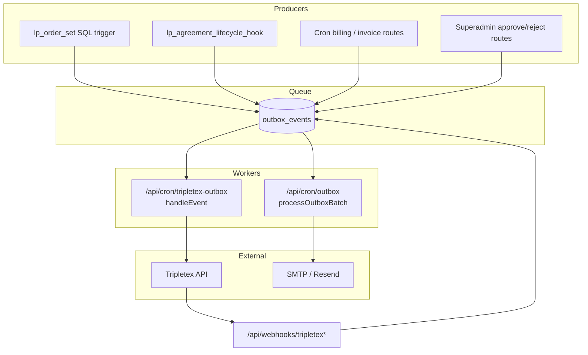
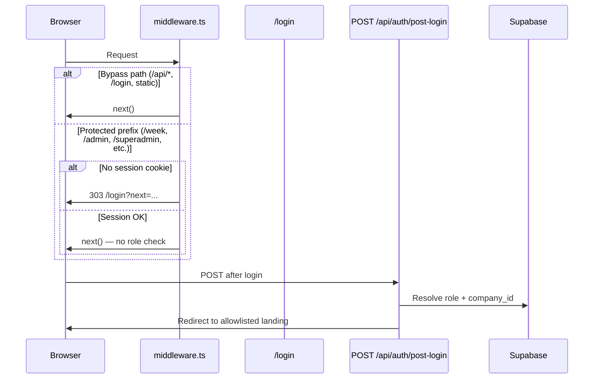
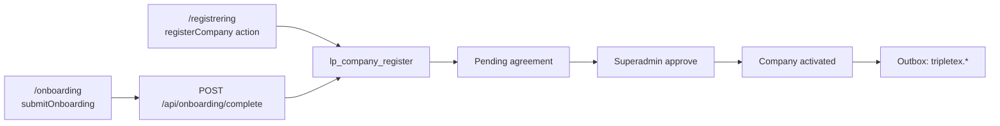

# Lunchportalen — Repo State Audit

**Dato:** 2026-05-22  
**Scope:** Diagnose-only crawl etter TPT-B-7-marathon  
**Formål:** Permanent referanse før neste kapittel (observability, B-4 invoice, public registration)  
**Metode:** `rg`, Supabase MCP (prod + staging), glob, git log — ingen kodeendringer

> **Sikkerhetsflagg (funnet under crawl):** Hardkodet DB-passord i `umbraco17/lunchportalen/appsettings.Production.json` og `appsettings.Development.json` (`Password=Bellotta-1`). Vurder hotfix/rotering før videre deploy. Ikke committet i denne audit.

---

## 2. Architecture Overview

### To-system-modellen

| System | Domene | Rolle | Stack |
|--------|--------|-------|-------|
| **App** | `app.lunchportalen.no` | Autentisert drift: bestilling, admin, leverandør, kjøkken, sjåfør | Next.js 15 App Router · Supabase · Sanity (meny) |
| **Marketing / CMS** | `lunchportalen.no` | Offentlig innhold, SEO, CRO | Umbraco (Azure Web App) + Sanity Delivery API |

Next.js proxier Umbraco backoffice via `/umbraco/*` → `UMBRACO_CMS_ORIGIN` (eller origin av `UMBRACO_DELIVERY_BASE_URL`). Middleware skipper Supabase session refresh på `/umbraco/*`.

### Datakilder per type

| Domene | Primær kilde | Sekundær | Merknad |
|--------|--------------|----------|---------|
| Auth, profiler, roller | Supabase Auth + `profiles` | — | Server-sannhet via `getAuthContext()` |
| Bestillinger, avtaler, faktura | Supabase Postgres | Tripletex (sync via outbox) | RLS + `lp_*` RPC-er |
| Meny / ukeplan | Sanity (`menuDay`) | `menu_service_days` (Supabase) | Webhook `POST /api/webhooks/sanity/menu-day` |
| Marketing-blokker (app-ruter) | Supabase (`content_pages`, `global_content`) | — | Backoffice-editor in-app |
| Offentlig HTML-marketing | Umbraco Delivery API | — | Redirects fra app til `lunchportalen.no` for `/faq`, `/vilkar`, etc. |
| AI/growth/social | Supabase logger + mange `lib/ai/**` moduler | OpenAI | Parallell plattformflate — ikke kjerne-lunsj |

### Deployment-modell

| Miljø | Plattform | Supabase | Merknad |
|-------|-----------|----------|---------|
| **Prod** | Vercel | `hkpokyapzarefrgqzkos` (eu-west-1, PG 17) | 93 migrasjoner applied |
| **Staging** | Vercel (branch preview) | `uigxsboqeruxflgzqztl` (persistent branch) | 56 migrasjoner applied; schema paritet 137 tabeller |
| **Umbraco** | Azure Web App | — | Separat deploy-workflow |
| **Sanity Studio** | `studio/` (egen build) | — | `npm run sanity:live` gate |

**Ledger-drift:** Repo har **259** SQL-filer under `supabase/migrations/`; prod ledger har **93** rader. ~166 filer uten prod-ledger-rad (hygiene, dokumentert i `docs/audit/supabase-state.md`).

### Cron-strategi

- **Vercel Cron** (`vercel.json`): **16** schedulerte jobber — kun kjerne-drift (outbox, Tripletex, ESG, meny, ukeplan).
- **API-ruter uten Vercel-schedule:** **66** `app/api/cron/*` endepunkter totalt — mange AI/growth/autonomy stubs uten prod-schedule.
- **Auth:** `requireCronAuth(req)` — `CRON_SECRET` header; feiler lukket (403/500).
- **Observability:** `cron_runs`-tabell insert ved kjøring (best-effort, blokkerer ikke cron).

### Event-flyt (outbox + webhooks)

### Auth-flyt (forenklet)

**Gap:** `/leverandor` er **ikke** middleware-protected — auth håndteres i `app/leverandor/layout.tsx`.

### Onboarding-flow

### Invoice-pipeline (TPT-B)

```mermaid
flowchart LR
  CRON["/api/cron/tripletex-agreements-daily"]
  RPC["lp_run_daily_agreement_billing"]
  GEN["lp_generate_agreement_invoices_for_period"]
  OB["outbox: tripletex.agreement_invoice_create_provider:*"]
  WRK["tripletex-outbox worker"]
  TT["Tripletex POST /order"]
  WH["Webhook paid status"]
  PAID["lp_apply_tripletex_paid_status"]
  CRON --> RPC --> GEN --> OB --> WRK --> TT
  TT --> WH --> PAID
```

**Status:** Pipeline implementert (TPT-B-4–B-7); outbox race mellom SMTP- og Tripletex-worker er kjent gap (se seksjon 7).

---

## 3. Domain Modules

### App-route domener

| Path | Beskrivelse | Filer (page.tsx) | Modenhet | Auth | Tester |
|------|-------------|------------------|----------|------|--------|
| `app/(app)/week/` | Ansatt ukevisning + bestilling | 9 | **PROD-READY** | employee + middleware | `tests/employee/`, `tests/api/orders*` |
| `app/admin/` | Firmadmin (company_admin) | 22 | **PROD-READY** | layout guard | `tests/admin/` (8 filer) |
| `app/superadmin/` | Plattformadmin | 50 | **PROD-READY** | layout guard | `tests/superadmin/` (7 filer) |
| `app/leverandor/` | Leverandørportal (provider) | 12 | **IN-PROGRESS** | layout guard (ikke middleware) | Delvis (`tests/integrations/`) |
| `app/kitchen/` | Kjøkken produksjon (read-only) | 1+ | **PROD-READY** | kitchen role | `tests/kitchen/` (6 filer) |
| `app/driver/` | Sjåfør leveringsliste | 1+ | **PROD-READY** | driver role | `tests/driver-flow-quality.test.ts` |
| `app/onboarding/` | Firmaregistrering Norge | 2+ | **PROD-READY** (FROZEN) | public/authenticated | `tests/auth/`, API tests |
| `app/registrer/` | Alternativ registrering | 1+ | **IN-PROGRESS** | public | Begrenset |
| `app/(auth)/` | Login, reset, invite | 10 | **PROD-READY** | public | `tests/auth/` (21 filer) |
| `app/(public)/` | CMS-sider fra DB | 2 | **PROD-READY** | public | `tests/cms/` (150 filer) |
| `app/(backoffice)/` | Innholdseditor + AI backoffice | 81 | **IN-PROGRESS** | middleware + egne guards | `tests/backoffice/` (8 filer) |
| `app/kunde/` | — | **0** | **N/A** | — | — |

### lib/ — kjerne-domener (PROD-READY / IN-PROGRESS)

| Folder | Beskrivelse | Filer | LOC (ca.) | Modenhet | Avhengigheter | Tester | Svakhet |
|--------|-------------|-------|-----------|----------|---------------|--------|---------|
| `lib/auth/` | Session, roller, post-login, rate limit | 34 | 3 094 | PROD-READY | supabase, profiles | 21 auth tests | `/leverandor` uten middleware |
| `lib/orders/` | Bestillingslogikk, guards | 18 | 1 424 | PROD-READY | supabase RPC | api + db tests | — |
| `lib/kitchen/` | Produksjonshierarki, batch | 10 | 2 188 | PROD-READY | orders, supabase | 6 kitchen tests | — |
| `lib/integrations/tripletex/` | Tripletex client + sync | 35 | 5 171 | IN-PROGRESS | outbox, vault | 21 integration tests | client.ts 1778 LOC |
| `lib/providers/` | Provider settings, lifecycle | 17 | 1 245 | IN-PROGRESS | auth, supabase RPC | db tests | — |
| `lib/onboarding/` | Validering av avtalepayload | 7 | ~400 | PROD-READY (FROZEN) | phone/no.ts | API tests | — |
| `lib/orderBackup/` | SMTP outbox worker | 10 | 947 | PROD-READY | supabase | cronOutbox tests | Race med Tripletex worker |
| `lib/outbox/` | Invoice-ready enqueue | 3 | ~200 | IN-PROGRESS | supabase | outbox-policy test | `invoice.reverse` ubehandlet |
| `lib/menu-publish/` | Sanity → menu_service_days | 11 | 1 461 | PROD-READY | sanity, supabase | cms tests | — |
| `lib/agreements/` | Avtaledager, normalisering | 8 | ~600 | PROD-READY | supabase | db tests | — |
| `lib/billing/` | Betalingspolicy | 9 | ~500 | IN-PROGRESS | tripletex | Begrenset | billing_accounts TODO |
| `lib/cms/` | Backoffice content model | 136 | 14 069 | IN-PROGRESS | supabase | 150 cms tests | Høy kompleksitet |
| `lib/http/` | respond, cronAuth, withRole | 30 | 1 564 | PROD-READY | — | cronAuth test | — |
| `lib/supabase/` | Client factories | 9 | ~800 | PROD-READY | — | runtime tests | — |
| `lib/observability/` | SLO, status aggregator | 31 | 1 695 | STUB | — | Begrenset | Ingen ekstern APM |
| `lib/core/` | response, logger | 22 | ~500 | STUB | — | — | `logger.ts` = console.error only |

### lib/ — eksperimentelle / STUB-domener (>10 filer)

| Folder | Filer | Modenhet | Merknad |
|--------|-------|----------|---------|
| `lib/ai/` | **703** | **STUB** | ~81k LOC; parallell "produktflate"; mange `@deprecated` |
| `lib/social/` | 74 | STUB | Social engine; superadmin growth UI |
| `lib/growth/` | 57 | STUB | GTM, attribution, domination metrics |
| `lib/revenue/` | 45 | STUB | Revenue brain; console.log i prod paths |
| `lib/sales/` | 60 | STUB | Sales autonomy |
| `lib/autonomy/` | 38 | STUB | Autopilot/agents |
| `lib/ads/` | 33 | STUB | Ad campaign engine |
| `lib/ml/` | 30 | STUB | ONNX sequence models |
| `lib/outbound/` | 27 | STUB | Lead outreach |

**Totalt lib/:** 156 top-level mapper · ~2000 filer · estimert **~180k LOC** (ai alene ~81k).

### lib/ — full inventar (fil-count)

Alle 156 lib/ mapper (fil-count)

| Folder | Files | Folder | Files | Folder | Files |
|--------|------:|--------|------:|--------|------:|
| acquire | 3 | admin | 13 | ads | 33 |
| agents | 3 | agreement | 4 | agreements | 8 |
| ai | 703 | alerts | 6 | analytics | 3 |
| api | 6 | approval | 1 | attribution | 1 |
| audit | 12 | auth | 34 | automation | 1 |
| autonomy | 38 | autopilot | 14 | backoffice | 6 |
| billing | 9 | board | 1 | business | 6 |
| cache | 4 | campaign | 1 | ceo | 9 |
| chaos | 3 | cms | 136 | compliance | 2 |
| config | 2 | content | 7 | controlTower | 4 |
| copy | 2 | core | 22 | crm | 3 |
| cro | 6 | cto | 7 | data | 6 |
| date | 7 | db | 6 | demo | 5 |
| design | 7 | distributed | 3 | domain | 1 |
| domination | 6 | driver | 1 | edge | 7 |
| email | 4 | employee | 6 | engine | 4 |
| enterprise | 1 | env | 1 | errors | 1 |
| esg | 18 | eventBus | 3 | evolution | 10 |
| execution | 3 | exit | 9 | experiment | 17 |
| experiments | 15 | finance | 10 | flags | 1 |
| forecast | 8 | global | 20 | golive | 6 |
| growth | 57 | gtm | 18 | guards | 2 |
| hooks | 3 | http | 30 | i18n | 1 |
| idempotency | 2 | infra | 15 | integrations | 35 |
| investor | 3 | invites | 2 | ipo | 2 |
| kitchen | 10 | layout | 5 | leads | 2 |
| learning | 2 | live | 1 | localRuntime | 2 |
| market | 13 | media | 10 | menu | 1 |
| menu-publish | 11 | metrics | 2 | ml | 30 |
| monitoring | 7 | monopoly | 5 | moo | 18 |
| mvo | 20 | network | 1 | neural | 6 |
| observability | 31 | onboarding | 7 | ops | 7 |
| optimization | 1 | orderBackup | 10 | orders | 18 |
| orgnr | 1 | outbound | 27 | outbox | 3 |
| partners | 3 | pdf | 1 | personalization | 2 |
| phone | 1 | pilot | 1 | pipeline | 20 |
| pitch | 1 | platform | 1 | pos | 15 |
| predictive | 7 | pricing | 8 | procurement | 9 |
| product | 8 | production | 1 | providers | 17 |
| public | 23 | queue | 6 | recovery | 3 |
| registration | 1 | repo | 1 | repo-intelligence | 1 |
| revenue | 45 | rl | 1 | runtime | 2 |
| saas | 5 | sales | 60 | salesAutonomy | 9 |
| sanity | 7 | scale | 6 | sdr | 3 |
| security | 12 | self-healing | 3 | selfheal | 10 |
| seo | 11 | server | 22 | settings | 4 |
| simulation | 3 | social | 74 | sre | 2 |
| strategy | 10 | supabase | 9 | superadmin | 10 |
| system | 20 | tenant | 2 | theme | 1 |
| toast | 1 | types | 1 | ui | 16 |
| url | 3 | utils | 1 | validation | 3 |
| video | 14 | week | 3 | workflow | 1 |

---

## 4. Database Layer

**Kilde:** Supabase MCP `execute_sql` på prod (`hkpokyapzarefrgqzkos`) og staging (`uigxsboqeruxflgzqztl`), 2026-05-22.

### Oversikt

| Måling | Prod | Staging |
|--------|------|---------|
| `public` tabeller | **137** | **137** |
| RLS policies (`public`) | **231** | *(ikke re-countet; schema paritet antatt)* |
| `public.lp_*` funksjoner | **66** | Paritet forventet |
| Applied migrasjoner (ledger) | **93** | **56** |
| Repo migrasjonsfiler | **259** | — |

### Tabeller UTEN RLS (prod)

**43 tabeller** uten `relrowsecurity`:

| Kategori | Tabeller | Risiko-vurdering |
|----------|----------|------------------|
| Audit partitions | `audit_log_y2026m05` … `audit_log_y2029m04`, `audit_log_y_default` (37 stk) | **Lav** — partition children; tilgang via service_role/worker |
| Billing config | `billing_products`, `billing_tax_codes`, `invoice_periods` | **Medium** — read-only config; bør ha SELECT-policy for admin |
| Lifecycle | `company_deletions` | **Medium** — superadmin-only forventet |
| Export | `tripletex_exports` | **Medium** — worker/service_role |

**Ingen kjerne tenant-tabeller** (`orders`, `profiles`, `companies`, `providers`) uten RLS.

### Tabeller UTEN service_role GRANTs

Query mot `information_schema.role_table_grants`: **0 tabeller** i `public` uten service_role SELECT/INSERT/UPDATE/DELETE. Worker-skriving er dekket etter TPT-B-7 hotfix-6/8.

### FK uten indeks (prod)

**17** foreign keys uten covering index (inkl. auth/storage interne + 11 i `public`):

| Tabell | FK-kolonne |
|--------|------------|
| `companies` | `suspended_by`, `paused_by` |
| `profiles` | `suspended_by` |
| `providers` | `paused_by`, `suspended_by` |
| `billing_products` | `tax_code_id` |
| `provider_subscriptions` | `tax_code_id`, `created_by` |
| `provider_invoices` | `subscription_id`, `tax_code_id` |
| `agreement_invoice_lines` | `tax_code_id` |

**Perf-risiko:** Lifecycle/billing joins under load; ikke blocker for RC.

### Tabeller referert i kode men mulig broken RPC/DB

| Referanse | I kode | I DB (migrations) | Status |
|-----------|--------|-------------------|--------|
| `lp_company_activate` | `app/api/superadmin/company/[companyId]/activate/route.ts` | **Ikke i migrations** | **BROKEN** — route bruker direkte update + outbox |
| `lp_create_company_with_location` | `app/api/company/create/route.ts` | **Ikke funnet** | **BROKEN/STALE** |
| `lp_generate_forecast_range` | `app/api/cron/forecast/route.ts` | **Ikke funnet** | Cron kan feile silently |
| `lp_membership_get` | `lib/auth/membershipLookup.ts` | **Ikke funnet** | Fallback i TS? |
| `company_billing_accounts` | `app/admin/page.tsx` (TODO) | **Ikke i prod** | UI-tab disabled |

### Dead schema (DB uten kode-referanse)

**ANTAKELSE:** Full dead-schema scan ikke kjørt (krever cross-ref alle 137 tabeller). Kandidater fra tidligere audits:

- Flere `ai_*` / `growth_*` / `experiment_*` tabeller med minimal app-referanse
- `audit_log_y2027*` partitions pre-provisioned (normal)

### Migrasjons-state: prod vs staging

| Aspekt | Status |
|--------|--------|
| Schema paritet | **137/137 tabeller** match |
| Ledger paritet | **NEI** — prod 93 vs staging 56 vs repo 259 filer |
| Siste prod migrasjon | `20260522140728` — `tpt_b7_polish9_webhook_subscriptions` |
| Staging modell | Persistent branch + schema-dump baseline (se `docs/audit/supabase-state.md`) |
| Platform UI | Staging kan vise `MIGRATIONS_FAILED` (ledger replay) uten faktisk schema-brudd |

### Vault-baserte secrets (navnemønster — ingen verdier)

MCP `SELECT name FROM vault.secrets` returnerte **0 rader** (MCP har ikke vault-lesetilgang eller tom prod-vault).

**Forventede secret-navn** (fra `private.lp_tripletex_vault_secret_name`):

| Mønster | Innhold |
|---------|---------|
| `lp_tripletex_{providerId}_{env}_consumer` | Tripletex consumer token |
| `lp_tripletex_{providerId}_{env}_employee` | Tripletex employee token |
| Webhook secrets | Via `provider_tripletex_webhook_secrets.webhook_secret_id` → vault |

**Env-baserte secrets (ikke vault):** `CRON_SECRET`, `SYSTEM_MOTOR_SECRET`, `SANITY_WEBHOOK_SECRET`, `SUPABASE_SERVICE_ROLE_KEY`, Tripletex Flow A webhook secret.
