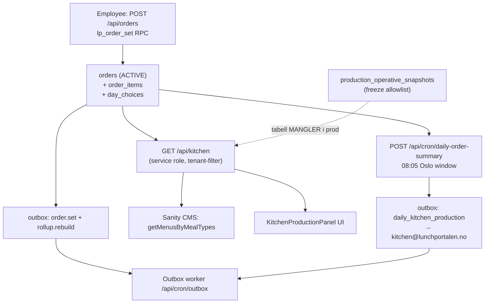

# Kitchen-ordremottak — forensisk discovery

**Dato:** 2026-06-05  
**Prod-prosjekt:** `hkpokyapzarefrgqzkos` (eu-west-1)  
**Scope:** Read-only kartlegging av `kitchen@lunchportalen.no` → ordremottak

---

## Read-only-attestasjon

Ingen skriv til DB, ingen migrasjon, ingen commit, ingen PR, ingen credential satt/skrevet/autofylt.  
All prod-data hentet via Supabase MCP `execute_sql` (counts/struktur, ingen PII-dump).  
Ingen live-innlogging utført av agenten.

---

## 1. Executive summary

### (a) Kan `kitchen@lunchportalen.no` logge inn?

| Spørsmål | Deterministisk svar | Bevis |
|----------|---------------------|-------|
| Finnes brukeren i `auth.users`? | **JA** | MCP: `id=fd98b40b-b58e-48ec-b266-bdb907cca04e`, `email=kitchen@lunchportalen.no` |
| Har brukeren passord (kan bruke e-post/passord-skjema)? | **JA** (`has_password=true`) | MCP `auth.users` |
| Er e-post bekreftet? | **JA** (`email_confirmed=true`) | MCP `auth.users` |
| Har brukeren noen gang logget inn? | **NEI** (`last_sign_in_at=null`) | MCP `auth.users` |
| Fungerer passordet faktisk ved innlogging? | **UVERIFISERT** | Krever operatør-handling (agent autentiserer aldri) |
| Hvilken rolle etter innlogging? | **`kitchen`** (fra `profiles.role`; ikke e-post-hardmap) | MCP `profiles.role=kitchen`; `lib/system/emailAddresses.ts:7` definerer `kjokken@` — ikke `kitchen@` |
| Hvor lander rollen etter post-login? | **`/kitchen`** (ikke `/week`) | `lib/auth/roleHome.ts:82`, `lib/auth/role.ts:46`, `lib/auth/role.ts:93` |
| Kan brukeren åpne kjøkkenflaten etter innlogging? | **NEI — blokkert på serverside** | `app/kitchen/page.tsx:151-172` krever aktiv avtale; MCP: **0 rader** i `agreements` for `company_id=79aea3bc-276e-4cc6-8e6b-dd175328b6ed` |

**Konklusjon (a):** Brukeren *kan sannsynligvis autentisere* (konto + passord + bekreftet e-post finnes), men **operativ kjøkkenflate er ikke tilgjengelig** uten aktiv avtale for tilknyttet firma. `last_sign_in_at=null` indikerer at dette aldri er verifisert i prod.

### (b) Kommer en ordre frem — komplett og korrekt?

| Spørsmål | Deterministisk svar | Bevis |
|----------|---------------------|-------|
| Finnes ACTIVE ordre i prod? | **JA — 5 stk** (alle for annet firma) | MCP: `orders` GROUP BY `company_id` → `d60b2b4c…` (Melhus Catering AS) = 5 |
| Finnes ACTIVE ordre for kitchen-brukerens firma? | **NEI — 0 stk** | MCP: `orders` WHERE `company_id=79aea3bc…` AND `status=ACTIVE` → `cnt=0` |
| Vil live-visning (`/kitchen`) vise Melhus-ordrer? | **NEI** | `app/api/kitchen/route.ts:120-121` tenant = `{companyId, locationId}` fra scope; `loadOperativeKitchenOrders.ts:83-87` filtrerer på `company_id`/`location_id` |
| Vil e-postkanal nå kitchen@? | **Designet JA — prod-bevis NEI** | `app/api/cron/daily-order-summary/route.ts:15,287`; MCP: **0** outbox-rader med `event_key LIKE 'daily_%'` |
| Er prod-listen komplett (tier, varmrett, allergener, adresse)? | **NEI — kjente hull** | `app/api/kitchen/route.ts:327` `tier: null`; leveringsadresse/vindu ikke i produksjonsliste-API |

**Konklusjon (b):** For `kitchen@lunchportalen.no` som den er konfigurert i prod, **kommer ingen ordre frem** verken komplett eller ufullstendig i live-visning. Systemet har ordre for *et annet firma* (Melhus Catering AS), men kitchen-brukeren er tenant-scope't til Lunchportalen AS uten avtale og uten ordre. E-posteksport er kodet, men har **ingen spor i prod-outbox**.

### Samlet risikonivå: **BLOCKER**

Primære blokkerere:
1. Ingen aktiv avtale for kitchen-brukerens firma → sidevisning stoppes (`MISSING_CONTRACT`).
2. Tenant-scope mismatch: alle 5 ACTIVE ordre tilhører annet `company_id`.
3. E-post-cron (`daily-order-summary`) har aldri materialisert outbox-events i prod.
4. `production_operative_snapshots` finnes ikke i live DB — freeze/eksport-sti er død kode mot prod.

---

## 2. Mottaks-mekanisme

| Kanal | Status i kode | Status i prod (bevis) | Scope |
|-------|---------------|----------------------|-------|
| **Live-visning** `/kitchen` | Aktiv | **Blokkert** (ingen avtale) + **tomt datasett** (0 ordre) | Tenant: `profiles.company_id` + `location_id` |
| **API** `GET /api/kitchen` | Aktiv | Returnerer `NO_ORDERS` for kitchen-scope | Samme tenant-filter |
| **Aggregert rapport** `GET /api/kitchen/report` | Aktiv | Samme tenant-filter | `lib/kitchen/report.ts:185-189` |
| **CSV** `/api/kitchen/orders.csv`, `/api/kitchen/report.csv` | Aktiv | Samme tenant-filter | `app/api/kitchen/orders.csv/route.ts:40-48` |
| **Print** `/kitchen/print` | Aktiv | UVERIFISERT (krever operatør-login) | Client → API |
| **E-post** `POST /api/cron/daily-order-summary` | Aktiv i `vercel.json:6` | **Ingen outbox-bevis** | **Alle** ACTIVE ordre (service role) → `kitchen@lunchportalen.no` |
| **Cron print** `/api/cron/kitchen-print` | Eksisterer | **Ikke schedulert** i `vercel.json` | Batch-basert, superadmin/cron |
| **Preprod-cron** `/api/cron/preprod` | Deaktivert | Returnerer `disabled: true` | `app/api/cron/preprod/route.ts:27-35` |

**Deterministisk kanal-konklusjon:** Systemet er designet for **live-visning + eksport + e-post**, men for `kitchen@` i prod er **ingen kanal verifisert som fungerende ende-til-ende**. Live er blokkert/tenant-tom; e-post har ingen outbox-historikk.

### Observert `next=%2Fweek` (operatør-skjermbilde)

- `next=/week` er **employee-landing**, ikke kitchen (`lib/auth/role.ts:96-97`).
- Kitchen-rollen tillater kun `next` som starter med `/kitchen` (`lib/auth/role.ts:93`).
- Kitchen post-login base: `/kitchen` (`lib/auth/roleHome.ts:82`).
- **Konklusjon:** Observert `next=%2Fweek` matcher **ikke** kitchen-rollens faktiske resolver; det indikerer employee-flow eller manuell URL, ikke kitchen.

---

## 3. Ende-til-ende data-sti



### Hopp-for-hopp (med `fil:linje`)

| # | Hopp | Kilde | Silent-failure-risiko |
|---|------|-------|----------------------|
| 1 | Employee bestiller | `app/api/orders/route.ts:358-365` → RPC `lp_order_set` | Cutoff `CUTOFF_PASSED` etter 08:00 Oslo i RPC (live `pg_get_functiondef`) |
| 2 | Ordre skrives | RPC: `INSERT/UPDATE orders`, `day_choices`, `order_items` | `NO_ACTIVE_AGREEMENT` stopper ORDER; CANCEL tillates uten avtale |
| 3 | Outbox events | RPC: `insert into outbox` (order.set, rollup.rebuild) | Async — feil i worker synlig først i outbox-status |
| 4 | Kjøkken lesing (API) | `loadOperativeKitchenOrders.ts:77-87` | Filtrerer `company_id`/`location_id` — **0 rader uten feil** for feil tenant |
| 5 | day_choices filter | `loadOperativeKitchenOrders.ts:141-147` | `CANCELLED` day_choice ekskluderes stille |
| 6 | Freeze allowlist | `fetchProductionOperativeSnapshotAllowlist.ts:28-47` | Tabell mangler → `found: false` → live uten freeze (ingen feil) |
| 7 | Menyberikelse | `app/api/kitchen/route.ts:276-287` | CMS-feil → tom meny, `opsLog` — **ikke HTTP-feil** |
| 8 | Tier | `app/api/kitchen/route.ts:327` | **Alltid `null`** — tier vises aldri i produksjonsliste |
| 9 | UI render | `KitchenProductionPanel.tsx:620-658` | Viser det API returnerer |
| 10 | E-post mottak | `daily-order-summary/route.ts:118-122,282-292` | Henter **alle** ordre (ikke tenant); outbox insert idempotent |

### Prod-ordre vs kitchen-scope (bevis)

| Entitet | Verdi |
|---------|-------|
| kitchen `profiles.company_id` | `79aea3bc-276e-4cc6-8e6b-dd175328b6ed` (Lunchportalen AS) |
| kitchen `profiles.location_id` | `f5fc806b-a6c9-4eb6-9302-5942f352f434` (Hovedkontor) |
| ACTIVE ordre `company_id` | `d60b2b4c-ac90-44a4-bbbe-45d3dfd89ea7` (Melhus Catering AS) |
| Begge `provider_id` | `11111111-1111-1111-1111-111111111111` (samme provider, **ulikt company-scope**) |

---

## 4. 08:00 Oslo-cutoff & tidssone

| Regel | Implementasjon | Bevis |
|-------|----------------|-------|
| Employee cutoff 08:00 Europe/Oslo | `lib/kitchen/cutoff.ts:67-82` (`OSLO_TZ = "Europe/Oslo"`) | Eksplisitt `Intl` + `zonedTimeToUtcDate` |
| Kitchen batch-buffer 08:05 | `lib/kitchen/cutoff.ts:85-100`, `CUTOFF_BUFFER_MINUTES = 5` | |
| DB-håndhevelse (ordre/cancel) | `lp_order_set` live: `timezone('Europe/Oslo', now())`, `>= time '08:00'` → `CUTOFF_PASSED` | MCP `pg_get_functiondef` |
| Batch start gate | `app/api/kitchen/batch/start/route.ts:32-38` | `cutoffStatusForDate0805` |
| Cron e-post vindu | `daily-order-summary/route.ts:107-109` | Oslo `hour===8 && minute>=5 && minute<20` |

**«Cancel after kitchen export = NO»:**  
- Ingen separat «etter eksport»-sperre funnet utover **08:00 cutoff** i `lp_order_set` (gjelder både ORDER og CANCEL før action-split).  
- `production_operative_snapshots` (freeze) finnes **ikke** i prod → eksport-freeze-sti er inaktiv.  
- Batch `PACKED`/`DELIVERED` blokkerer ikke employee-cancel i RPC — kun tids-cutoff.

**Grense-case (08:00):** RPC kaster `CUTOFF_PASSED` når `p_date = v_oslo_today AND v_oslo_time >= 08:00` — deterministisk, DST via `timezone('Europe/Oslo', …)`.

---

## 5. Eksport/cron-helse & observability

| Jobb | Schedulert | Feilhåndtering | Prod-bevis |
|------|------------|----------------|------------|
| `daily-order-summary` | `vercel.json:6` (`5 6,7 * * 1-5` UTC) | `captureCronHandlerError` → Sentry (`lib/http/cronObservability.ts:7-14`); returnerer `jsonErr` ved throw | **0** `daily_*` outbox-rader |
| `outbox` worker | `vercel.json:9` (`*/2 * * * *`) | — | 18 `SENT`, 1 `FAILED_PERMANENT` (andre event-typer) |
| `kitchen-print` | **Ikke** i `vercel.json` | `opsLog("cron.kitchen.print")` | Manuell/cron-secret only |
| `preprod` | `vercel.json:8` | Returnerer 200 med `disabled: true` | Ikke produksjonsmottak |

**Silent 200-risiko:** `daily-order-summary` returnerer `200` med `{ skipped: true }` utenfor ukedag/vindu (`route.ts:104-109`) — **ikke feil, men ingen e-post**.  
**Alarm ved 0 ordre:** Ingen — cron sender «Ingen bestillinger i dag»-tekst (`route.ts:234-243`).  
**Idempotens:** `enqueueOutboxOnce` bruker `event_key` + `23505` conflict (`route.ts:67-83`).  
**Sentry:** Kun i `catch` via `captureCronHandlerError` — suksess med 0 ordre logges ikke til Sentry.

---

## 6. Hva rendres/mottas faktisk — innhold & korrekthet

### Produksjonsliste (kode-sti, uavhengig av login)

| Felt | Rendres i UI | API-kilde | Komplett? |
|------|--------------|-----------|-----------|
| `orderId` | Indirekte (key) | `orders.id` | JA |
| `slot` / leveringsvindu | JA (`slotHeading`) | `orders.slot` | JA |
| `company` / `location` | JA | `companies`, `company_locations` | JA |
| `employeeName`, `department` | JA | `profiles` | JA |
| `note` (måltid/variant) | JA | `day_choices` + Sanity (`buildKitchenMealNote`) | Delvis — avhenger av CMS |
| `menu_title`, `menu_description`, `menu_allergens` | JA | Sanity `getMenusByMealTypes` | Delvis |
| `tier` (BASIS/LUXUS/ENTERPRISE) | UI klar, **alltid tom** | Hardkodet `null` (`route.ts:327`) | **NEI** |
| Employee-allergener | JA | `lp_user_allergens` | JA (hvis profil finnes) |
| Leveringsadresse | **NEI** i produksjonsliste | Kun i e-post-cron (`delivery_window_from/to`) | **NEI** |
| Varmrett/tier-prislogikk | I RPC (`varmmat`→`varmrett` slug) | Ikke eksponert i kitchen API | **NEI** i mottak |

### Edge/blind-states

| State | Oppførsel | Bevis |
|-------|-----------|-------|
| `NO_ORDERS` | `EmptyState` «Ingen bestillinger» | `KitchenProductionPanel.tsx:88-100,589-590` |
| `NOT_DELIVERY_DAY` | Helg → tom liste | `app/api/kitchen/route.ts:98-105` |
| `MISSING_CONTRACT` | `BlockedState` — **ikke** kitchen UI | `app/kitchen/page.tsx:160-171` |
| `NO_TIER` / tom tier | Tier-badge skjules | `KitchenProductionPanel.tsx:633-637` + `tier: null` |
| CMS-feil | Tom meny, ingen HTTP-feil | `app/api/kitchen/route.ts:281-287` |

### Visuell verifikasjon

**UVERIFISERT — krever operatør-login.** Agent autentiserte ikke. Forventet ved vellykket login: `BlockedState` «Aktiv avtale mangler» (ingen avtale i DB).

### E-post-artefakt (design)

Mal i `daily-order-summary/route.ts:244-265`: firma, lokasjon, leveringsvindu, antall, ansattnavn (PII). **Ingen allergener/tier/varmrett-detalj.**

---

## 7. Presentasjon & a11y (live-visning — funn only)

| Sjekk | Resultat | Bevis |
|-------|----------|-------|
| Design tokens (`--lp-*`) | **JA** — dominerende | `KitchenRuntimeClient.tsx:13`, `KitchenProductionPanel.tsx` |
| Inline styles | **Ingen funnet** i kitchen-komponenter | Grep i `app/kitchen/` |
| Touch target ≥44px | **JA** på primærknapper | `min-h-[44px]` (`KitchenRuntimeClient.tsx:13`, `KitchenProductionPanel.tsx:367`) |
| `:focus-visible` | **Delvis** — faner har det (`KitchenRuntimeClient.tsx:13`); mange dato-knapper mangler | `KitchenProductionPanel.tsx:367-383` |
| `prefers-reduced-motion` | **NEI** | Grep: 0 treff i `app/kitchen/` |
| Mobile-first | **Delvis** — `flex-wrap`, `grid-cols-1`; tabs `justify-center` på mobil | `KitchenRuntimeClient.tsx:43` |

---

## 8. Skjema-drift-kryss-sjekk (mottaks-sti)

| Objekt | Repo | Live prod | Divergens |
|--------|------|-----------|-----------|
| `production_operative_snapshots` | `supabase/migrations/_archive/20260415130000_production_operative_snapshots.sql` | `to_regclass` → **NULL** | **BLOCKER: tabell finnes ikke** |
| `lp_order_set` | `supabase/migrations/20260611120000_lp_order_set_variant_itemkey.sql` (baseline) | MCP `pg_get_functiondef` — matcher struktur (Oslo cutoff, varmmat→varmrett, tier-priser) | Ingen avvik observert i denne discovery |
| `can_kitchen_location` | Implisitt i RLS-policies | MCP `pg_get_functiondef` — krever `profiles.role=kitchen` + `location_memberships.active` | Kitchen-bruker **har** aktiv membership (`location_memberships` MCP) |
| `kitchen_can_read_lp_user_allergen` | — | Live def via MCP | Avhenger av `can_kitchen_location` |
| `lib/types/database.ts` | Lister `production_operative_snapshots` | Tabell mangler | Typekontrakt forskjøvet fra prod |

---

## 9. Identitet, autorisasjon & RLS (pkt. 1)

### Bruker `kitchen@lunchportalen.no`

```
auth.users:     exists, email_confirmed, has_password, last_sign_in_at=null
profiles:       role=kitchen, company_id=79aea3bc…, location_id=f5fc806b…, is_active=true
location_memberships: active, company_id=79aea3bc…, location_id=f5fc806b…
provider_memberships: 0 rader
agreements (firma): 0 rader
```

### Rolle-sett

| Mekanisme | Verdi for kitchen@ |
|-----------|-------------------|
| `systemRoleByEmail` | **null** — canonical e-post er `kjokken@lunchportalen.no` (`lib/system/emailAddresses.ts:7`) |
| `profiles.role` | `kitchen` (brukes) |
| `raw_user_meta_data.role` | `kitchen` (user_metadata — **ikke** brukt i `getAuthContext`) |
| `raw_app_meta_data` | Kun `provider: email` — ingen rolle-claim |

### RLS — ordre-relaterte tabeller (live `pg_policies`)

| Tabell | Kitchen-relevant policy | Logikk |
|--------|------------------------|--------|
| `orders` | `orders_select_bridge_scoped` | `can_kitchen_location(location_id)` OR admin OR own order OR driver-delivery join |
| `day_choices` | `day_choices_select_employee_kitchen_superadmin` | `profiles.role=kitchen` AND `p.company_id=day_choices.company_id` AND `p.location_id=day_choices.location_id` |
| `agreements` | `agreements_select_scoped` | `can_kitchen_location(location_id)` OR `can_access_company(company_id)` |
| `lp_user_allergens` | `lp_user_allergens_kitchen_select` | `kitchen_can_read_lp_user_allergen(user_id)` |
| `kitchen_batches` | `kitchen_batches_select_kitchen_superadmin` | `profiles.role=kitchen` AND `p.location_id=kitchen_batches.company_location_id` |

**Silent-failure (RLS):** For gyldig kitchen-bruker med riktig `company_id`/`location_id` kan RLS returnere **0 rader uten feil** for ordre utenfor scope. Bekreftet ved policy-uttrykk.  
**API-mitigering:** `GET /api/kitchen` bruker `supabaseAdmin()` (service role) — **omgår RLS**, men tenant-filter i applikasjonskode (`loadOperativeKitchenOrders.ts:83-87`) gir samme effekt.

### `code=`-parameter på login-URL (sikkerhet)

- `code` er **applikasjonsfeilkode** (f.eks. `NO_SESSION`, `MISSING_CONTRACT`), **ikke** Supabase OTP/auth-code (`app/(auth)/login/page.tsx:32-37`, `app/kitchen/page.tsx:44-45`).
- Eksponeres i query-string → kan lekke til browser history/referrer.
- **FUNN (MEDIUM):** Feilkoder i URL er ikke auth-tokens, men utleverer tilstand (rolle-gate-resultat).

---

## 10. Funn-tabell

| ID | Alvorlighet | Bevis | Forklaring |
|----|-------------|-------|------------|
| F-01 | **BLOCKER** | MCP: 0 `agreements` for kitchen `company_id`; `app/kitchen/page.tsx:151-172` | Kjøkkenflate blokkert med `MISSING_CONTRACT` |
| F-02 | **BLOCKER** | MCP: 0 ACTIVE ordre for `79aea3bc…`; 5 ACTIVE for `d60b2b4c…`; `loadOperativeKitchenOrders.ts:83-87` | Tenant-scope ekskluderer alle faktiske prod-ordre |
| F-03 | **BLOCKER** | MCP: 0 outbox `daily_*`; `vercel.json:6`, `daily-order-summary/route.ts` | E-postmottak til `kitchen@` aldri materialisert i prod-outbox |
| F-04 | **HØY** | MCP: `to_regclass('production_operative_snapshots')=null`; `materializeProductionOperativeSnapshot.ts:55` | Freeze/eksport-sti refererer tabell som ikke finnes i prod |
| F-05 | **HØY** | `lib/system/emailAddresses.ts:7` vs MCP `auth.users.email=kitchen@…` | Canonical system-e-post `kjokken@` ≠ prod-bruker `kitchen@` — hard e-post-rollematcher feiler |
| F-06 | **HØY** | `app/api/kitchen/route.ts:327` | `tier` alltid `null` — BASIS/LUXUS/ENTERPRISE vises aldri i produksjonsliste |
| F-07 | **HØY** | MCP: `last_sign_in_at=null` | Kitchen-bruker aldri logget inn i prod — hele login→mottak-kjeden uverifisert operativt |
| F-08 | **MEDIUM** | `daily-order-summary` scope vs `/api/kitchen` scope | E-post sender **alle** ordre; live-visning er **tenant-scope't** — inkonsistent mottak |
| F-09 | **MEDIUM** | `vercel.json` mangler `kitchen-print`; route finnes | Batch-print-cron ikke schedulert |
| F-10 | **MEDIUM** | `login?code=…` mønster (`app/kitchen/page.tsx:45`) | Feilkoder i URL (history/referrer) |
| F-11 | **MEDIUM** | `supabase/migrations/_archive/…` vs live null | Schema-drift: `production_operative_snapshots` kun i archive-migrasjon |
| F-12 | **LAV** | `app/kitchen/`: ingen `prefers-reduced-motion` | a11y-gap |
| F-13 | **LAV** | Dato-knapper uten `focus-visible` (`KitchenProductionPanel.tsx:367-383`) | a11y-gap |
| F-14 | **LAV** | `location_memberships.role=employee` for kitchen-bruker | Membership-rolle avviker fra `profiles.role=kitchen` (fungerer via profile for RLS) |

---

## 11. UVERIFISERT-liste

| # | Hva | Hvorfor |
|---|-----|---------|
| U-01 | Passord fungerer ved faktisk innlogging | Agent autentiserer aldri; `last_sign_in_at=null` |
| U-02 | Visuell rendering av kjøkkenflate | Krever operatør-login; forventet `BlockedState` (F-01) |
| U-03 | E-post levert til `kitchen@` innboks | Outbox mangler `daily_*` events; Resend-leveranse ikke inspisert |
| U-04 | Sanity-menyberikelse for konkrete ordredatoer | CMS ikke queryet i denne discovery |
| U-05 | `daily-order-summary` cron faktisk trigget på Vercel | Ingen Vercel cron-logg tilgjengelig; inferert fra manglende outbox |
| U-06 | Cancel eksakt på 08:00-grensen (live) | Kun RPC-definisjon verifisert, ikke runtime-test |
| U-07 | `/leverandor/ordrer` (provider_kitchen) som alternativ mottak | `kitchen@` har 0 `provider_memberships` |

---

## 12. Anbefalt neste STOP-PUNKT (kun anbefaling — IKKE utført)

1. **Operatør:** Logg inn manuelt som `kitchen@lunchportalen.no` → bekreft om `BlockedState` «Aktiv avtale mangler» vises (forventet per F-01).
2. **Data-integrity:** Avklar forretningsintensjon: Skal kitchen se **alle provider-ordre** eller kun **Lunchportalen AS**? Dagens kode er split (e-post=all, UI=tenant).
3. **Prod-data:** Opprett/aktiver avtale for `79aea3bc…` **eller** re-scope kitchen-bruker til firma med faktiske ordre (`d60b2b4c…`) — **kun etter eksplisitt eierbeslutning**.
4. **Cron-verifikasjon:** Inspiser Vercel cron-logg for `/api/cron/daily-order-summary` + bekreft `CRON_SECRET` og Oslo-vindu 08:05–08:20.
5. **Schema:** Vurder å promotere `production_operative_snapshots` fra `_archive` til prod **eller** fjerne død kode — etter eierbeslutning.
6. **E-post-alignment:** Avklar `kitchen@` vs `kjokken@` i `lib/system/emailAddresses.ts`.

---

## STOPP

Rapport levert. Ingen remediering utført. Venter på eksplisitt beslutning.
