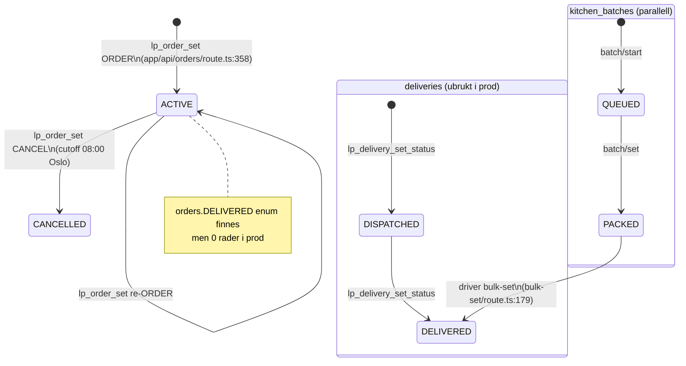

# Ordre-reise ende-til-ende — forensisk discovery

**Dato:** 2026-06-05  
**Prod-prosjekt:** `hkpokyapzarefrgqzkos` (eu-west-1)  
**Scope:** Forside (Umbraco) → ferdig levert ordre kvittert av `driver@lunchportalen.no`

---

## Read-only-attestasjon

Ingen skriv til DB, ingen migrasjon, ingen commit, ingen PR, ingen credential satt/skrevet/autofylt.  
All prod-data hentet via Supabase MCP `execute_sql` (counts/struktur/enum; PII maskert).  
Ingen live-innlogging utført av agenten. Visuell verifikasjon merket `UVERIFISERT` der operatør-login kreves.

**Gjenbruk:** Stadium 7 (kjøkken) bygger på [kitchen-order-receipt-2026-06-05.md](./kitchen-order-receipt-2026-06-05.md) uten full re-derivering.

---

## 1. Executive summary

### Deterministisk svar: Kan kjeden følges UBRUTT?

**NEI.** Kjeden brytes på **minst seks uavhengige punkter** i prod. Ingen ordre har nådd terminal «ferdig levert»-tilstand.

### Representativ ordre (ryggrad)

| Felt | Verdi (maskert der relevant) |
|------|------------------------------|
| `orders.id` | `eb6d453c-2578-4031-b12a-ec6df8d973bc` |
| `date` | `2026-06-05` |
| `status` | `ACTIVE` (uendret siden innlegging) |
| `company_id` | `d60b2b4c-ac90-44a4-bbbe-45d3dfd89ea7` (Melhus Catering AS) |
| `location_id` | `803419da-6346-4868-9c9d-01b1f6342e7d` |
| `provider_id` | `11111111-1111-1111-1111-111111111111` |
| Bestiller | `profiles.role=employee`, e-post `sof***` |
| `day_choices.choice_key` | `sushi` |
| `order_status_history` | Én rad: `null → ACTIVE` (`2026-06-03 10:16:26Z`) |

### Nøyaktig hvor kjeden brytes (sortert i reise-rekkefølge)

| # | Stadium | Brudd | Bevis |
|---|---------|-------|-------|
| B1 | 1 — Umbraco forside | «Book demo»-skjema persisterer **ingenting** (kun client-side `hidden`) | `umbraco17/.../_KomIGangFormBlock.cshtml:138-147` |
| B2 | 1→2 — Cross-domain | Umbraco lenker til **relative** `/login` og `/kom-i-gang/` — ikke `https://app.lunchportalen.no/...` | `umbraco17/.../_Header.cshtml:15-16,74` |
| B3 | 2 — Registrering | `lp_company_register` oppretter `agreements.status=PENDING` — **ikke** ACTIVE; bestilling krever ACTIVE | MCP `pg_get_functiondef(lp_company_register)` |
| B4 | 2 — Leverandør-kobling | Ingen `provider_id` settes ved registrering; marketplace-modell uavklart i kode | MCP `lp_company_register` INSERT `companies` (ingen `provider_id`-kolonne i INSERT) |
| B5 | 7 — Kjøkken | `kitchen@` tenant-scope + ingen avtale → ordre når ikke kjøkkenflate | [kitchen-rapport F-01, F-02](./kitchen-order-receipt-2026-06-05.md) |
| B6 | 8 — Driver | `driver@` scope't til **Lunchportalen AS** (`79aea3bc…`); representativ ordre er **Melhus** (`d60b2b4c…`) → 0 stops | MCP `profiles` driver; `stops/route.ts:156-167` |
| B7 | 8 — Driver | `kitchen_batches` = **0 rader** i prod → stops filtreres bort (`batchMap` gate) | MCP `kitchen_batches` count; `stops/route.ts:310-311` |
| B8 | 8 — Terminal | `orders.status=DELIVERED` finnes i enum, men **0 ordre**; driver skriver kun `kitchen_batches.DELIVERED` | MCP `orders` count; `bulk-set/route.ts:177-184` |
| B9 | 8 — Legacy | `POST /api/driver/confirm` returnerer **410 DEPRECATED** | `app/api/driver/confirm/route.ts:16` |
| B10 | 8 — Legacy | `deliveries`-tabell **0 rader**; `lp_delivery_set_status` ikke kalt fra app | MCP `deliveries` count=0; grep app: ingen treff |

**For representativ ordre `eb6d453c…`:** Stadium 5 (innlegging) **lyktes**. Første operative brudd **etter** innlegging er **B5+B6+B7** (kjøkken/driver/batch). Kjeden stopper i **`ACTIVE`** uten leveringskvittering.

### Samlet risiko: **BLOCKER**

---

## 2. Journey-map (stadie-for-stadie)

```mermaid
flowchart LR
  subgraph UMBRACO["Umbraco — lunchportalen.no"]
    A1[Forside /] --> A2[CTA /kom-i-gang/]
    A1 --> A3[Til lunsjbestilling /login]
    A2 --> A4[Book demo skjema]
  end

  subgraph APP["Next.js — app.lunchportalen.no"]
    B1[/registrering] --> B2[POST /api/public/register-company]
    B3[/login] --> B4[/week employee]
    B4 --> B5[POST /api/orders]
    B5 --> B6[/kitchen]
    B6 --> B7[kitchen_batches PACKED]
    B7 --> B8[/driver stops]
    B8 --> B9[POST /api/driver/bulk-set]
  end

  subgraph SUPA["Supabase prod"]
    C1[(companies/agreements)]
    C2[(orders ACTIVE)]
    C3[(kitchen_batches)]
    C4[(driver_runs / deliveries)]
  end

  subgraph SANITY["Sanity CMS"]
    D1[menuDay] --> D2[(menu_service_days)]
  end

  A3 -.->|B2: relativ URL| B3
  B2 --> C1
  D1 --> D2
  B5 --> C2
  B7 --> C3
  B9 --> C3
  C4 -.->|0 rader| X[Død sti]
```

### Stadium 1 — Forside & konvertering (Umbraco)

| Hopp | System | `fil:linje` / bevis |
|------|--------|---------------------|
| Forside CTA primær | Umbraco | `ctaUrl` default `/kom-i-gang/` — `_Header.cshtml:14-15,76` |
| «Til lunsjbestilling» | Umbraco | `orderUrl = "/login"` — `_Header.cshtml:16,74` |
| Hero CTA | Umbraco | `href="@ctaUrl"` + `href="/login/"` — `blockgrid/default.cshtml:315-316` |
| Footer login | Umbraco | `href="/login"` — `_Footer.cshtml:19,34` |
| Book demo-skjema | Umbraco | `e.preventDefault()` + viser success — **ingen HTTP POST** — `_KomIGangFormBlock.cshtml:138-147` |
| `app.lunchportalen.no` i UI | Umbraco | Kun **mockup-tekst**, ikke lenke — `_LandingPageHeroBlock.cshtml:115` |

**Cross-domain:** Ingen absolutte lenker til `app.lunchportalen.no` funnet i Umbraco-header/footer/CTA. Relative `/login` på `lunchportalen.no` når Next.js-appen **kun hvis** infra (reverse proxy/DNS) mapper det — **UVERIFISERT** (krever operatør/DNS-sjekk).

**Forretningslogikk i Umbraco:** Book demo-skriv er **kun client-side** → ikke Supabase/Sanity. **FUNN (MEDIUM):** lead-data tapes; ingen CRM-pipeline fra Umbraco-skjema.

### Stadium 2 — Registrering & leverandør-kobling (Next.js + Supabase)

| Hopp | System | `fil:linje` / bevis |
|------|--------|---------------------|
| App-registrering UI | Next.js | `app/(auth)/registrering/page.tsx:1` → `PublicRegistrationFlow` |
| Canonical commit | Next.js | `POST /api/public/register-company` — `register-company/route.ts:229-239` |
| Alt. onboarding | Next.js | `POST /api/onboarding/complete` — `onboarding/complete/route.ts:466+` (company `status: pending`, **ingen** `agreements` ACTIVE-insert) |
| RPC registrering | Supabase | `lp_company_register` (live MCP `pg_get_functiondef`) |
| Rader opprettet | Supabase | `companies` (PENDING), `company_locations`, `agreements` (PENDING), `company_registrations`, `audit_events` |
| Auth-bruker | Supabase | **Ikke** i `lp_company_register` — kun i `onboarding/complete` (`createUser`) |
| Leverandør-kobling | Supabase | `provider_id` settes **ikke** ved register; Melhus har `provider_id` via senere data (`MCP companies`) |
| Avtale ACTIVE | Supabase | Krever superadmin-aktivering utenfor self-serve; Melhus har `agreements.status=ACTIVE` (`MCP`) |

**Marketplace-FUNN:** Registrering knytter firma til **ingen** leverandør eksplisitt. `provider_id` hydreres senere på ordre via `tg_orders_hydrate_core_fields` fra `agreements.provider_id` eller `companies.provider_id` (`MCP pg_get_functiondef`). Modell er implisitt default-provider, ikke markedsplass-valg.

### Stadium 3 — Roller & auth

| Bruker | Eksisterer | Passord | Bekreftet | `last_sign_in_at` | Landing | Bevis |
|--------|------------|---------|-----------|-------------------|---------|-------|
| `driver@lunchportalen.no` | JA | JA | JA | **null** | `/driver` | MCP `auth.users`; `lib/auth/roleHome.ts:81` |
| `kitchen@lunchportalen.no` | JA | JA | JA | **null** | `/kitchen` | [kitchen-rapport](./kitchen-order-receipt-2026-06-05.md) |
| Melhus employee `sof***` | JA | UVERIFISERT | UVERIFISERT | UVERIFISERT | `/week` | MCP `profiles` |
| Melhus `company_admin` `ing***` | JA | UVERIFISERT | — | — | `/admin` | MCP `profiles` |

**Driver profil:** `role=driver`, `company_id=79aea3bc…` (Lunchportalen AS), `location_id=f5fc806b…` — MCP `profiles`.

**RLS (ordre-relaterte, live `pg_policies`):** Se [kitchen-rapport §9](./kitchen-order-receipt-2026-06-05.md). Driver leser via **service role** i API (`stops/route.ts:130-137`) — RLS omgås, men **applikasjons-filter** på `profiles.company_id` gir samme tenant-effekt som silent 0 rader.

### Stadium 4 — Meny-tilgjengelighet (Sanity + Supabase)

| Hopp | System | `fil:linje` / bevis |
|------|--------|---------------------|
| Employee ser meny | Sanity | `lib/cms/menuDay.ts:154-160` `getPublishedMenuForDate` |
| Bestillings-gate (API) | Next.js | `getPublishedMenuForDate` før ORDER — `app/api/orders/set/route.ts:137-144` |
| Operativ sannhet ved RPC | Supabase | `lp_order_set` krever `menu_service_days.state IN ('published','locked')` — MCP `pg_get_functiondef` |
| Sanity → Supabase sync | Next.js | `lib/menu-publish/syncMenuServiceDaysFromMenuDay.ts:28,136` |
| Tier-gating | Supabase RPC | `v_expect_cents` 9000/13000/17000 for BASIS/LUXUS/ENTERPRISE — MCP `lp_order_set` |
| Duplisering | — | Meny **primært** Sanity `menuDay`; **speilet** til `menu_service_days` + `menu_service_day_items` for bestilling (FUNN: to kilder, sync-kjede må være grønn) |

**Prod-bevis Melhus-lokasjon:** `menu_service_days` count=20 for `location_id=803419da…` siden `2026-06-01` — MCP.

### Stadium 5 — Ordre-innlegging (Next.js + Supabase)

| Hopp | System | `fil:linje` / bevis |
|------|--------|---------------------|
| HTTP entry | Next.js | `POST /api/orders` — `app/api/orders/route.ts:358-365` |
| RPC | Supabase | `lp_order_set(p_date, p_action, p_note, p_slot, p_choice_key, p_item_key)` |
| Tabeller skrevet | Supabase | `orders`, `order_items`, `day_choices`, `outbox` — MCP `pg_get_functiondef` |
| `provider_id` | Supabase trigger | `tg_orders_hydrate_core_fields` BEFORE INSERT — `coalesce(agreement.provider_id, companies.provider_id)` — MCP |
| 08:00 cutoff | Supabase RPC + trigger | RPC: `timezone('Europe/Oslo', now()) >= 08:00`; trigger `orders_cutoff_0800` — MCP triggers-liste |
| 08:00 cutoff (app) | Next.js | `lib/kitchen/cutoff.ts:67-82` (`Europe/Oslo`) |
| Idempotens | Next.js + Supabase | `lp_idem_begin/complete` — `app/api/orders/route.ts:320-460` |
| Feilkartlegging | Next.js | `mapOrderWriteError` — `lib/orders/mapOrderWriteError.ts:28+`; brukt `orders/route.ts:386` |

**Representativ ordre:** `eb6d453c…` opprettet `2026-06-03 10:16:26Z`, status `ACTIVE`, `choice_key=sushi` — MCP.

### Stadium 6 — Ordre-tilstandsmaskin (kjerne)

Se §3 nedenfor.

### Stadium 7 — Kjøkken-mottak

| Punkt | Status for representativ ordre |
|-------|-------------------------------|
| Når kjøkken? | Etter cutoff; live via `GET /api/kitchen` |
| Når eksport? | Cron `daily-order-summary` (ingen prod-outbox-bevis) |
| Status-overgang? | **Ingen** på `orders` — kun lesing + valgfri `kitchen_batches` |
| Brudd | `kitchen@` ser ikke Melhus-ordrer; se [kitchen-rapport F-01–F-06](./kitchen-order-receipt-2026-06-05.md) |

**Deterministisk:** Representativ ordre **når ikke** kjøkkenoperatør (`kitchen@`) i prod.

### Stadium 8 — Levering & driver@

| Hopp | System | `fil:linje` / bevis |
|------|--------|---------------------|
| Driver landing | Next.js | `app/driver/page.tsx` + layout `roleHome` → `/driver` |
| Stoppliste | Next.js | `GET /api/driver/stops` — `stops/route.ts:97+` |
| Tenant-filter | Next.js | `loadOperativeKitchenOrders` med `profiles.company_id` — `stops/route.ts:163-167` |
| Batch-gate | Next.js | Stopp ekskluderes uten `kitchen_batches` PACKED/DELIVERED — `stops/route.ts:310-311` |
| Adresse-PII | Next.js | Hentes fra `company_locations` med mange kolonne-aliaser — `stops/route.ts:318-377`; prod har kun `address` (MCP kolonneliste) |
| Kvittering | Next.js | `DriverClient.tsx:434-455` → `POST /api/driver/bulk-set` |
| Persistens | Supabase | `kitchen_batches` UPDATE `status=DELIVERED` — `bulk-set/route.ts:177-184` |
| `orders.status` | — | **Ikke oppdatert** ved driver-kvittering |
| Deprecated | Next.js | `confirm/route.ts:16` → 410 |
| `deliveries` | Supabase | 0 rader; `driver_runs` 0 rader — MCP |

**Tildeling:** Ingen auto-tildeling funnet. Driver ser aggregerte stops fra egne tenant-ordre; ingen `driver_runs`-kobling i aktiv app-sti.

**Silent-failure:** `bulk-set` kan returnere `updated: 0` uten å oppdatere `orders` — ordre forblir `ACTIVE`; batch mangler → stops tomme uten feilmelding i liste-API (`stops: []`).

### Stadium 9 — Cross-cutting

| Tema | Bevis |
|------|-------|
| Audit ved registrering | `lp_company_register` → `audit_events` `company_registration_submitted` — MCP |
| Audit ved ordre | Trigger `audit_row` på `orders` — MCP triggers |
| Audit ved levering (design) | `lp_delivery_set_status` skriver `audit_events` — baseline schema; **ikke wired** til driver-app |
| Sentry cron | `captureCronHandlerError` — `lib/http/cronObservability.ts:7-14` |
| `daily-order-summary` | Ingen `daily_*` outbox i prod — [kitchen-rapport F-03](./kitchen-order-receipt-2026-06-05.md) |
| Skjema-drift | `company_locations` prod: 8 kolonner vs onboarding forventer 15+ felt; `delivery_confirmations` mangler; `production_operative_snapshots` mangler; `kitchen_batch` **og** `kitchen_batches` begge finnes |

---

## 3. Ordre-tilstandsmaskin

### Live enum `order_status` (MCP `pg_enum`)

`DRAFT`, `SUBMITTED`, `LOCKED`, `PREPARED`, `DISPATCHED`, `DELIVERED`, `ACTIVE`, `CANCELLED`, `PAUSED`

### Prod-fordeling (MCP)

| status | count |
|--------|-------|
| ACTIVE | 5 |
| CANCELLED | 6 |
| **DELIVERED** | **0** |

### Aktiv kode-sti vs døde tilstander



| Overgang | Trigger | Autz | Gate | Prod-bevis |
|----------|---------|------|------|------------|
| → ACTIVE | `lp_order_set` ORDER | employee + ACTIVE agreement + MSD | 08:00 Oslo, meny publisert | `eb6d453c…` history |
| → CANCELLED | `lp_order_set` CANCEL | employee | 08:00 Oslo | 6 CANCELLED orders |
| ACTIVE → DELIVERED (`orders`) | — | — | **Ingen implementert sti** | 0 DELIVERED |
| → PACKED (`kitchen_batches`) | `POST /api/kitchen/batch/start` | kitchen | 08:05 Oslo, ACTIVE agreement | 0 batches prod |
| PACKED → DELIVERED (`kitchen_batches`) | `POST /api/driver/bulk-set` | driver | batch=PACKED, tenant match | 0 batches prod |
| `deliveries` → DELIVERED | `lp_delivery_set_status` (DB) | driver/superadmin | run assignment | 0 deliveries; app ikke koblet |

**Terminal «ferdig levert» i design:** `kitchen_batches.status=DELIVERED` (+ `delivered_at`). **Ikke** `orders.status=DELIVERED`. Firma/kjøkken ser ikke synkron «levert» på ordre-raden.

**Manglende overganger:** `ACTIVE` → `PREPARED` → `DISPATCHED` → `DELIVERED` på `orders` er definert i enum men **ikke koblet** til driver-UI.

---

## 4. Funn-tabell

| ID | Alvorlighet | System | Bevis | Forklaring |
|----|-------------|--------|-------|------------|
| J-01 | **BLOCKER** | E2E | MCP: 0 `orders.status=DELIVERED`; `bulk-set/route.ts:177-184` | Ingen ordre når terminal levert-tilstand |
| J-02 | **BLOCKER** | Driver | MCP driver `company_id=79aea3bc…` vs ordre `d60b2b4c…`; `stops/route.ts:156-167` | Driver ser 0 stops for faktiske ordre |
| J-03 | **BLOCKER** | Driver | MCP `kitchen_batches` count=0; `stops/route.ts:310-311` | Stops skjules uten PACKED batch — silent tom liste |
| J-04 | **BLOCKER** | Registrering | MCP `lp_company_register`; `agreements.status=PENDING` | Self-serve registrering blokkerer bestilling til superadmin aktiverer |
| J-05 | **BLOCKER** | Umbraco→App | `_Header.cshtml:16` relative `/login` | Førstegangsbesøk på lunchportalen.no når ikke deterministisk app uten infra-mapping (**UVERIFISERT DNS**) |
| J-06 | **HØY** | Kjøkken | [kitchen F-01–F-06](./kitchen-order-receipt-2026-06-05.md) | Kjøkken-mottak brutt for system-bruker og tenant |
| J-07 | **HØY** | Driver | `confirm/route.ts:16` (410); `docs/phase2c/DRIVER_SOURCE_OF_TRUTH.md` | Dokumentasjon refererer `delivery_confirmations`; tabell finnes ikke i prod |
| J-08 | **HØY** | Driver | `bulk-set/route.ts:174` `kitchen_batches` vs `batch/start/route.ts:139` `kitchen_batch` | To batch-tabeller i prod — risiko for skrev til feil tabell |
| J-09 | **HØY** | Marketplace | MCP `lp_company_register`; `tg_orders_hydrate_core_fields` | Ingen eksplisitt leverandør-valg ved registrering; implisitt default `provider_id` |
| J-10 | **HØY** | Schema | MCP `company_locations` 8 kolonner; onboarding insert 15+ felt | Drift: leverings-PII-felt mangler i prod-skjema |
| J-11 | **MEDIUM** | Umbraco | `_KomIGangFormBlock.cshtml:138-147` | Book demo lagrer ikke leads — konvertering tapes |
| J-12 | **MEDIUM** | Umbraco | Ingen `href="https://app.lunchportalen.no/..."` i CTA | Kun mockup-tekst `app.lunchportalen.no` |
| J-13 | **MEDIUM** | Audit | MCP `audit_events` for ordre `eb6d453c…` = 0 rader | Ingen audit-spor på representativ ordre (trigger kan mangle data) |
| J-14 | **MEDIUM** | Meny | `syncMenuServiceDaysFromMenuDay.ts` + `menuDay.ts` | Meny duplisert Sanity→Supabase; sync-feil = stille bestillingsblokk |
| J-15 | **MEDIUM** | Cron | [kitchen F-03](./kitchen-order-receipt-2026-06-05.md) | E-postmottak aldri materialisert i outbox |
| J-16 | **LAV** | Auth | MCP `last_sign_in_at=null` for driver@ og kitchen@ | Systembrukere aldri verifisert innlogget i prod |
| J-17 | **LAV** | a11y | Ingen `prefers-reduced-motion` i `app/driver/` (grep 0) | a11y-gap på driverflate |

---

## 5. UVERIFISERT-liste

| # | Hva | Hvorfor |
|---|-----|---------|
| U-01 | DNS/routing `lunchportalen.no/login` → `app.lunchportalen.no` | Krever infra/operatør-sjekk; Umbraco bruker relative URL |
| U-02 | Passord-login for driver@, kitchen@, Melhus-brukere | Agent autentiserer aldri |
| U-03 | Visuell driver-/kitchen-/week-flate | Krever operatør-login + skjermbilde |
| U-04 | Sanity-menyinnhold for `2026-06-05` (tittel/allergener) | CMS ikke queryet i denne discovery |
| U-05 | Om `kitchen_batch` vs `kitchen_batches` faktisk divergerer i runtime | Begge tabeller finnes; 0 rader i begge |
| U-06 | Superadmin manuell aktivering av Melhus (hvem/når) | Kun resultat-state observert i MCP |
| U-07 | Employee/firma ser «levert» i UI etter driver bulk-set | Krever fullført batch-sti som ikke finnes i prod |

---

## 6. Anbefalt neste STOP-PUNKT (kun anbefaling — IKKE utført)

1. **Operatør:** Verifiser DNS — åpne `https://lunchportalen.no/login` og dokumenter faktisk destinasjon (app vs Umbraco 404).
2. **Operatør:** Logg inn som Melhus-employee → bekreft `/week` viser ordre `2026-06-05`.
3. **Operatør:** Logg inn som `driver@` → bekreft tom stoppliste (forventet per J-02/J-03).
4. **Eierbeslutning:** Avklar canonical leverings-terminal: `orders.DELIVERED` vs `kitchen_batches.DELIVERED` vs `deliveries`.
5. **Eierbeslutning:** Avklar systembruker-scope: skal `driver@`/`kitchen@` se **provider-wide** ordre eller **én** `company_id`?
6. **Data-integrity:** Verifiser hvorfor `kitchen_batches` aldri materialiseres for Melhus-ordre (kjøkken må pakke før driver).

---

## STOPP

Rapport levert. Ingen remediering utført. Vent på eksplisitt beslutning.
