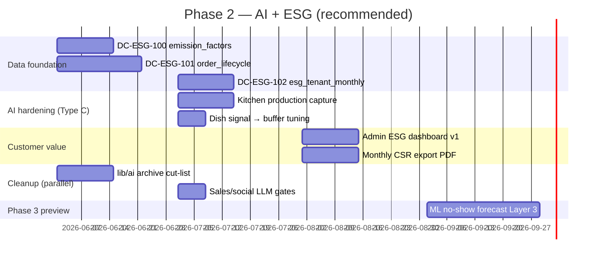

# Phase 2 — AI × ESG Synergy Roadmap (3–6 months)

**Date:** 2026-05-26  
**Mode:** READ-ONLY strategic recommendation  
**Inputs:** [phase2-ai-inventory-2026-05-26.md](./phase2-ai-inventory-2026-05-26.md) · [phase2-esg-data-gap-2026-05-26.md](./phase2-esg-data-gap-2026-05-26.md) · [ESG Engine Design Phase 1](./esg-engine-design-2026-05-26.md)

---

## C.1 Top 3 AI × ESG synergies

### Synergy 1 — Demand forecast → avoided overproduction (matsvinn)

| | |
|---|---|
| **AI module** | P2-A01 `demandEngine` + P2-A03 `operationsFeedback` |
| **ESG metric** | kg mat unngått · CO₂e unngått · cut-off compliance |
| **Current state** | Forecast **live** in kitchen; waste rollup **blocked** (no `produced`) |
| **Build effort** | **3–4 uker** (data + UI, no new LLM) |
| **ESG improvement** | Enable credible **5–15% overproduction reduction** narrative once lifecycle + portion weights exist |
| **Sales impact** | **Enterprise 250+ FTE** — CFO/ESG officer; primary CSRD E5 hook |
| **MVP scope** | (1) Seed `emission_factors` + default portion weight (2) Emit `CANCELLED_IN_TIME` lifecycle events from existing order RPC (3) Nightly rollup to `esg_tenant_monthly` (4) Admin read-only dashboard card — reuse `demand-insights` patterns |

---

### Synergy 2 — Cancellation analytics → avoided CO₂e reporting

| | |
|---|---|
| **AI module** | P2-A01 `demandData.isCancelledBeforeOsloCutoff` + P2-A02 waste math |
| **ESG metric** | CO₂e per lunsj · meals_cancelled_in_time · ESRS E1-6 supplement |
| **Current state** | Logic exists; **no persisted CO₂e**; Sanity category mappable |
| **Build effort** | **2–3 uker** after Synergy 1 foundation |
| **ESG improvement** | First **exportable kg CO₂e avoided / month** per tenant |
| **Sales impact** | **Enterprise 500+ FTE** + public sector tenders requiring Scope 3 documentation |
| **MVP scope** | Map `day_choices.choice_key` + Sanity category → `emission_factors.category_code` · snapshot factor on cancel event · PDF/CSV export v0 |

---

### Synergy 3 — Dish mix signals → smarter production planning

| | |
|---|---|
| **AI module** | P2-A04 `demandInsights` (`signalsFromChoiceCounts`, weekday ranking) |
| **ESG metric** | Overproduksjonsvarians · capacity utilization |
| **Current state** | **Live** dish signals in admin; not fed back to kitchen buffer |
| **Build effort** | **2 uker** (wiring only) |
| **ESG improvement** | Lower buffer % on low-variance days → indirect waste cut **2–5%** |
| **Sales impact** | **Mid-market 50–250 FTE** — ops/HR buyer («mindre svinn, enklere planlegging») |
| **MVP scope** | Pass dish signals into `forecastDemandV1` buffer tuning · show «planlagt vs faktisk» in kitchen (read-only)

---

## C.2 Use-cases explicitly **not** synergistic (defer)

| Use case | Why defer |
|----------|-----------|
| Editor AI / image gen | Zero ESG metric impact |
| Sales/outbound LLM | PII risk; no ESG |
| CEO/control-tower meta | DD liability; archive candidate |
| Support AI | No ESG data path |
| Local-sourced % KPI | Requires Sanity + supplier schema — **Phase 3+** |

---

## C.3 Recommended Phase 2 sequence (months 1–6)

### Month-by-month

| Month | Focus | Exit criteria |
|-------|-------|---------------|
| **M1** | ESG data foundation (Synergy 1 backend) | `order_lifecycle_events` + `emission_factors` in staging |
| **M2** | Rollup + admin dashboard (Synergy 2) | Company admin sees kg + CO₂e avoided MTD |
| **M3** | Kitchen production + dish buffer (Synergy 3) | `wasteTracker` gets real `produced` on pilot tenant |
| **M4** | Customer export + Umbraco impact stub | PDF + public aggregate KPI page |
| **M5** | AI cleanup + governance | cut-list archived; sales LLM gated |
| **M6** | ML Layer 3 spike (optional) | No-show forecast A/B on 1 provider |

---

## C.4 Pillar balance recommendation

| Pillar | Phase 2 allocation | Rationale |
|--------|-------------------|-----------|
| **Pillar 2 (hjelpemiddel)** | **~80%** engineering | Demand/waste/ESG is differentiated prod value |
| **Pillar 1 (vekst)** | **~20%** | Keep sales LLM off; deterministic CRO only until ESG v1 live |

**Enterprise sizing for sales narrative:**

| Segment | Lead synergy | Proof required |
|---------|--------------|----------------|
| **50–250 FTE** | Synergy 3 (ops efficiency) | Kitchen forecast + cut-off rate |
| **250–1000 FTE** | Synergy 1 + 2 | Monthly kg/CO₂e dashboard |
| **1000+ / CSRD** | Synergy 2 + export | Methodology doc + auditor-ready rollup |

---

## C.5 Dependencies & risks

| Risk | Mitigation |
|------|------------|
| `esg_*` tables killed in K4 | New names (`esg_tenant_monthly`) + idempotent migration |
| No `produced` data | Kitchen production table (DC-ESG-104) before claiming waste % |
| `deliveries` schema not in git | Prod DDL audit before km KPI |
| 279-file `lib/ai` noise | Execute cut-list — separate from ESG critical path |
| LLM cost/PII | Keep ESG path **Type C only** through M4 |

---

## C.6 Success metrics (Phase 2 exit)

| Metric | Target |
|--------|--------|
| Tenants with monthly ESG rollup | ≥ 1 pilot prod tenant |
| Admin dashboard live | `/admin` or demand-insights extension |
| CO₂e methodology doc published | Versioned + linked from export |
| Kitchen forecast + ESG on same order truth | Single `orders` + lifecycle pipeline |
| Zero new LLM spend for ESG v1 | Type C only |

---

## STOP — Phase 2 synergy roadmap complete

**Deliverables (this crawl):**

1. [phase2-ai-inventory-2026-05-26.md](./phase2-ai-inventory-2026-05-26.md)
2. [phase2-esg-data-gap-2026-05-26.md](./phase2-esg-data-gap-2026-05-26.md)
3. This document

*Generated READ-ONLY 2026-05-26*
