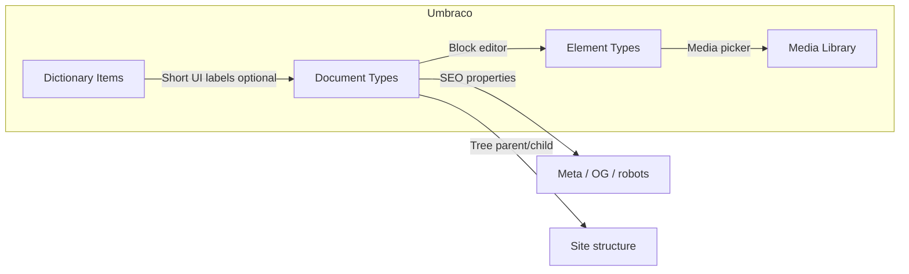

# Phase 2 master — content model (public website CMS only)

## 1. Scope statement

**In Umbraco:** all **public website editorial content** that today is authored for presentation on `lunchportalen.no` (and equivalent hosts) as **marketing / composable pages**: page identity, composed blocks, page-level SEO/meta, editorial media references, and the **content tree structure** that drives public IA (within product rules).

**Explicitly excluded from Umbraco** (no Document Types, no editorial Workflow for these domains):

- Operational **menu**, **menuContent**, **weekPlan**, **orders**, **tenants**, **billing**, **immutable logs**, and other operational domain data named in program lock.
- **Application user** identities and **portal/admin** RBAC (unchanged plane).
- **Sanity** as a parallel authority after cutover (legacy only until decommissioned for any overlapping type).

## 2. Source systems used for semantic mapping

| Source | Role in mapping |
|--------|------------------|
| **Postgres `content_pages` + `content_page_variants`** | **Primary** current truth for public CMS pages, tree placement, slug/title/status, variant locale/env, body composition. |
| **Body envelope** (`documentType`, `fields`, `blocksBody` / `blocks` + `meta`) | Maps to Umbraco Document Type properties + Block editor root + nested Element Types — **not** preserved as opaque JSON in Umbraco. |
| **`lib/cms/blocks/registry.ts` (core blocks)** | Canonical **marketing block** semantics for public render. |
| **Plugin block catalog** (`lib/cms/backofficeBlockCatalog.ts`) | **Extension surface** — each distinct persisted block type needs an Element Type (or explicit merge/kill decision). |
| **`lib/cms/model/pageAiContract.ts` + `buildCmsPageMetadata`** | Page-level **SEO / social** semantics. |
| **`lib/cms/contentTreeRoots.ts`** | Virtual roots (`home`, `overlays`, `global`, `design`) → Umbraco tree **folders** or **container** Document Types. |
| **Sanity `page`, `announcement`, etc.** | **Legacy / parallel** — map only where product still depends on them for public site; otherwise **DROP** from target model or **MOVE OUT OF CMS SCOPE**. |

## 3. Canonical modeling principles

1. **One model per concept** — e.g. a “web page” is one Document Type family; do not duplicate “Page” and “Landing” unless composition or Workflow rules **provably differ**.
2. **Umbraco-native structures** — blocks become **Element Types** in a **Block Grid** or **Block List** (product choice during implementation); fields become **Properties** backed by **Data Types**.
3. **No JSON blob authority** — do not store the legacy `body` JSON as the Umbraco source of truth. **Exception:** none by default; any exception needs ADR + migration path to structured properties.
4. **Language variants** — use Umbraco **culture variants** for per-locale page title, slug (if policy allows), block content where translated, SEO where translated. Invariant properties only where product mandates (e.g. internal keys).
5. **Media is Umbraco Media Library** — references use **Media Picker** (or typed picker), not free-form `cms:*` strings in target state.
6. **Workflow is mandatory** — publish/governance uses **Umbraco Workflow**; application `content_pages.status` and legacy workflow flags are **not** parallel authorities after cutover.

## 4. Relationship: pages, blocks, navigation, SEO, settings, media

- **Pages (Document Types)** own: route segment / slug policy, Workflow, primary SEO properties (or composition), and the **root block editor** for main content.
- **Reusable blocks (Element Types)** own: repeatable composition units; **reusability** = same Element Type referenced from block editors (not copy-paste JSON).
- **Navigation (public site)** is derived from **tree order + Document Type** (+ optional explicit “nav title” properties). **Not** the operational week menu.
- **SEO** lives on the **page variant** (properties or nested composition), aligned with today’s `body.meta.seo` / `body.meta.social` semantics.
- **Settings** live in dedicated **settings** Document Types (singletons or folder-held), not mixed into every page.
- **Media** holds assets; alt/caption policy in §24; page properties reference media.

## 5. What must not be modeled inside Umbraco

| Item | Rationale |
|------|-----------|
| Day menus, allergens, publish-to-order flags | Operational **menuContent** domain. |
| Week plans, templates, product plans as live ops | Operational; **pricing block** may **read** live data from Next/API — data source stays app. |
| Orders, companies, locations as CMS nodes | Tenant/ops domain. |
| Application audit for ops | Stays app; Umbraco **audit/history** covers **editorial** actions. |

## 6. Modeling anti-patterns (reject)

- **Dual write** Postgres CMS + Umbraco for the same page type after cutover.
- **Storing `body` jsonb** in a single Textarea “for speed.”
- **Conflating** “Global” marketing snippets with **tenant** data.
- **Editorial navigation** built from operational menu tables.
- **Custom Section** for tasks solvable with **Content** tree + **Workspace** default.
- **Per-block custom Property Editors** when **Block Grid + Element Type** + default labels suffice.

## 7. Confidence

| Area | Confidence |
|------|------------|
| Core marketing blocks → Element Types | **High** (registry is explicit). |
| Page SEO meta → Document Type properties | **High** (`pageAiContract` + `cmsPageMetadata`). |
| Plugin-extended blocks → full parity | **Medium** — requires inventory pass before ETL sign-off. |
| `overlays` subtree (app chrome) vs public site | **Medium** — product/sign-off required (see `37-open-questions-and-blockers.md`). |
